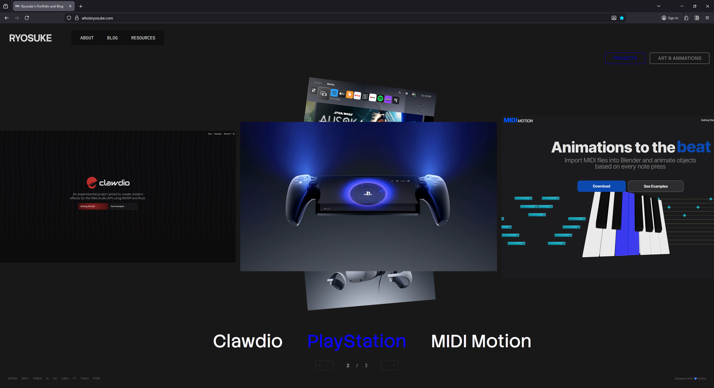
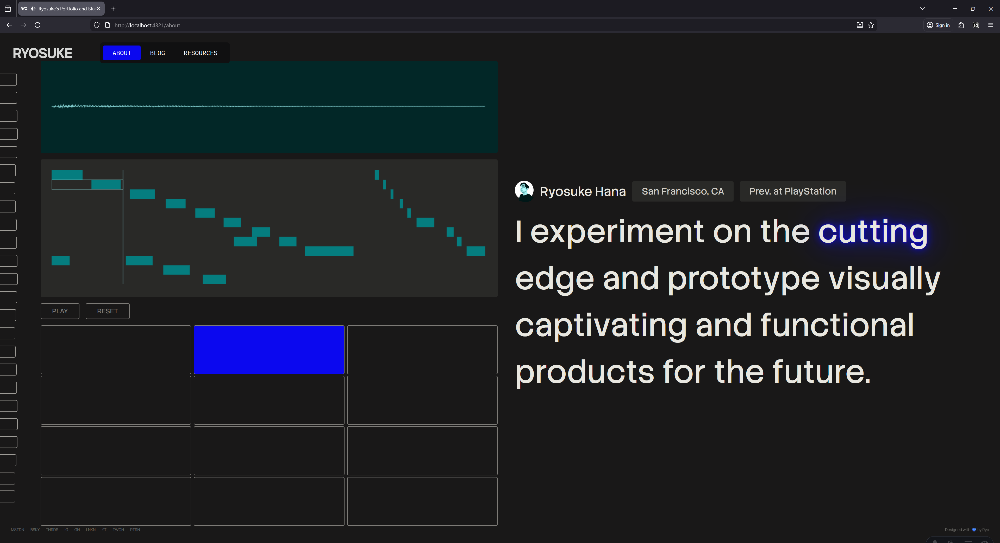
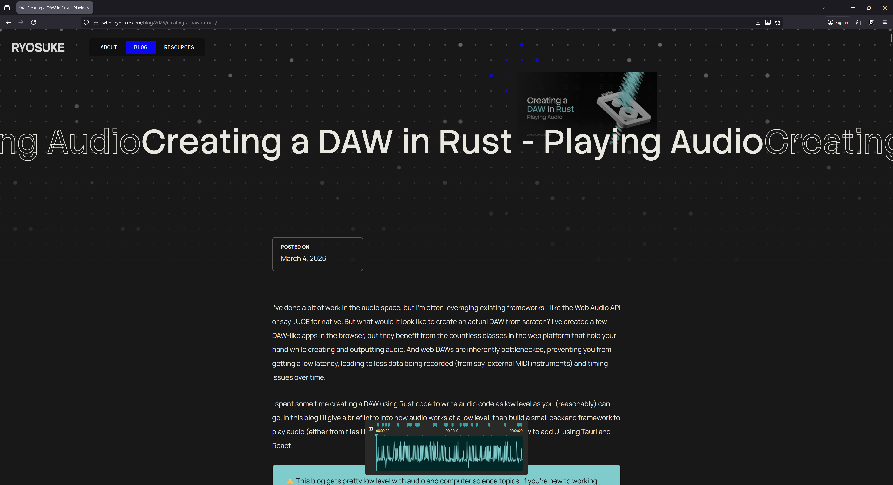
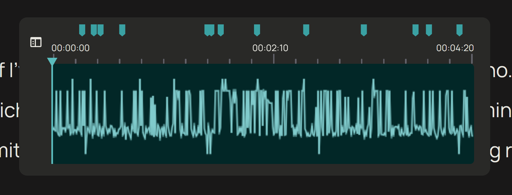

# Ryosuke's Portfolio and Blog

Yet another home for my art and thoughts about design and development. Designed in 2025-2026.

## Features

- ⚛️ ReactJS
- 🧑‍🚀 AstroJS
- ✏️ MDX
- 🪟 Focus management
- 🌈 CSS Variables
- 🌊 Blog Waveform TOC
- 🧑‍🎨 Visualizations using `<canvas>`
- 🐇 Animation using framer-motion + CSS

## Getting started

1. Clone repo.
1. `npm i`
1. `npm run dev`

> To preview on mobile, use `npm run dev --host`.

## Notes

### Content

Blogs and projects written as MDX files and are stored in the [content folder](./src/content). Blogs are separated by the year of publication as folders. You can find all this, and the data structure defined in the [Astro content configuration file](./src/content.config.ts).

For other types of static content, like resources, they're stored in `src/data/`.

## Licensing

The code is open source and unlicensed. You are not permitted to use any of the art or writing, or the styling of the website _(basically don't copy my site)_.
