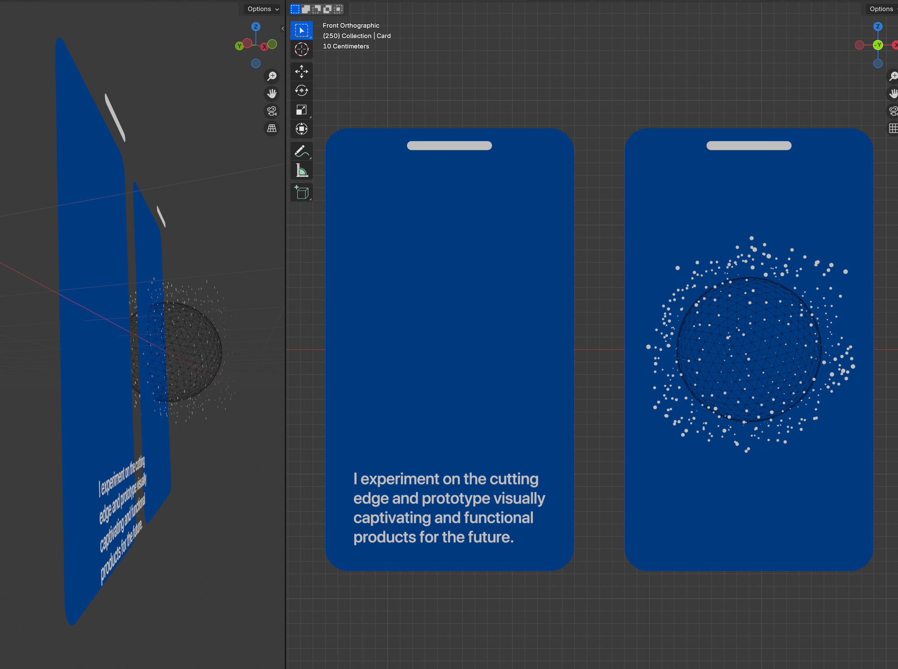
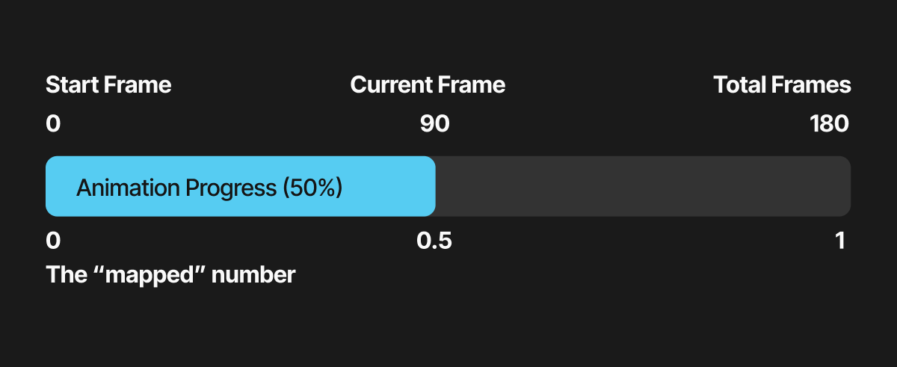

I’ve been really building up assets for my personal branding - getting ready for things like streaming or just making more long and short-form videos. And one of the key things that really step up video are motion graphics. They can be subtle, or eye catching, and they can often help bolster the content’s meaning with illustration or typography.

But how do you make motion graphics in 2025? There are a few apps and services out there - some that have been around for ages (After Effects) - and others that are new kids on the block (Rive). But most of these apps and services come at a cost, so I was curious what I could accomplish using a free app like Blender.


I spent a couple weeks exploring motion graphics in Blender using geometry nodes and I thought I’d share my findings. Can Blender handle motion graphics? What are the limitations? I’ll answer these questions and share some tips and tricks to get you started.

> 📁 More of a hands-on learner? Make sure to [download the free Blender source file](https://github.com/whoisryosuke/ryos-blender-examples/blob/main/examples/Motion%20Graphics%20Geometry%20Nodes%202025/Motion%20Graphics%20Geometry%20Nodes%202025.blend) that has examples we cover here.

# What are motion graphics?

Motion graphics refers to the type of digital art where graphic design elements are animated (like moving, rotating, or changing color).

We encounter motion graphics in our daily lives. Whether it’s animated elements on a website, or watching the Duolingo bird scold us — we’re surrounded by shapes and colors in motion.

# Motion Graphics in Blender? The 3D app?

Blender has been quickly becoming more popular to achieve 2D styles, like the anime cel shading or outline techniques that bring graphic elements to the 3D scene.

But even before that, Blender has been capable of motion graphics. It has a robust suite of tools that can be used for animating - like typography rendering, keyframes, video sequencing, even compositing.

This article won’t be a comprehensive exploration of all these techniques. It’ll be a more realistic workflow where I use other apps in the flow as well, like a 2D vector app for creating quick textures, or a video editing app for compiling and color correcting animations. But many of these process can be accomplished inside Blender itself, it’s just a bit cumbersome to be honest.

# The Anatomy of a “Motion Graphic”



Motion graphics are just that — graphics in motion. The “graphics” could be shapes of color or typography. Sometimes these graphics could even represent common patterns we recognize in our day to day lives (like user interfaces from web or phone applications).

In this case, I have a “card” made of a blue rounded rectangle shape, with a “notch” on top like a phone (also rounded rectangle). And on the left card we have typography in the form of a long sentence, while on the right we have a 3D wireframe sphere with particles surrounding it.

Using Blender to render each element slightly offset, we can see how they “stack” to create a single composition.


To bring motion to this design we could animate any of these elements - either individually or together. For example, I fade in all the elements at the same time from fully transparent to opaque.

# How to make motion graphics in Blender?

Like I mentioned above, motion graphics are just shapes and text, which Blender has plenty of primitives for! I recommend starting with something simple, like creating text and animating it using keyframes.

## Shapes

For shapes, try using a Plane for squares and rectangles. Need a circle? Use a Circle Mesh (since it’s filled in).


Need something more complex? You can always draw it in a vector based app, export an SVG, and import that as the basis. Or manually draw it using Blender’s internal Bezier Curve tool (which isn’t too bad, especially when working in the 3rd dimension).


### Stroked elements

Need a stroke or outline for your shape? This is a bit tricky in Blender (and starts to show it’s limitations in a way). There’s a few ways to handle this.

The first way is the **Wireframe modifier**. Duplicate your object and add a Wireframe modifier to your shape. This works great if it’s an “N-gon” (meaning no “polygons” or triangles breaking up your mesh). This works best with a Plane for example.


The second way is [the Solidify modifier](https://youtu.be/cnQu1kMs49s?t=175). It basically duplicates your mesh, makes it slightly larger, and gives you an impression of an outline. This technique is better if you’re trying to make a more complex 3D shape look 2D and cartoony.

Another approach would be to use Blender’s materials combined with an SDF algorithm to create your shape…

And obviously the simplest approach would be to export the UV texture map and add the stroke in a third party app like Figma or Photoshop.

As you can see, stroked elements are a little tricker to handle and definitely aren’t as easy as other apps.

> 🌐 My preferred method is to use geometry nodes and convert the mesh to a curve, then use a Curve Profile to basically create my own “Wireframe modifier”. This also makes it easy to “duplicate” the object since you can just use a Join Geometry node with the original object and the new wireframe stroke object.

## Typography

Blender supports adding 2D text to a scene, and you can even easily extrude the text to make it 3D.

Find a 3D Viewport window in your app, find the toolbar on the top, and go to Add > Text. Then you can go to the Text properties tab in the Properties window (usually bottom right of your screen, looks like a cursive lowercase `a` icon).


You can control the font family here, as well as the size, and even alignment. It’s pretty versatile.

> 🅰️ I will note that some fonts work better than others. Anything too complex, like calligraphy or fonts with “texture” may not render correctly. It’s recommended that you always fill font’s as n-gon’s - this ensures that the font retain’s it’s shape the most like an SVG.

## The “Artboard”

Blender is probably similar to After Effects, where your viewport what the camera is seeing. In Blender, you can have multiple cameras, but only one is enabled at one time.

The size of the camera’s viewport is defined by the “resolution” you set in the Output Settings.


So if you set it the X to 1920 and Y to 1080 it’d look like a classic widescreen size. And if you change it to 3840 x 2160, nothing would visually happen — but when you “render” your image later it’ll be larger.

> 📁 I recommend checking out [my Blender plugin **“Render Buddy”**](https://github.com/whoisryosuke/blender-render-buddy). It helps you quickly set your camera to standard social media dimensions like 1080p widescreen or IG Story format.

But if you change your resolution to say, 1080 by 1920, the viewport isn’t going to change how you’d expect in an app like Photoshop and crop evenly from both sides. You’ll often have to move the camera to get the right composition again.

> 🎥 This is probably the most frustrating part of working within Blender. I’ll often have a camera for each resolution I’m working with (e.g. `Camera.Square` or `Camera.Widescreen`)

This isn’t the case for camera’s set to an Orthographic view (instead of the default Perspective).

## Animation

Animation happens in Blender using keyframes. You define the length of your animation by setting the start and end frame of the “timeline” (similar to most animation apps).


You can set keyframes on various properties of objects, like it’s position, rotation, or scale. You set these keyframes by right clicking on the property you want (like the Z position) and selecting “Insert Keyframe”. Or you can activate the Auto Keying (the “record” looking icon in the Timeline left of the play button) and do anything to the object to record it as a keyframe.


Then Blender can interpolate between these keyframes to animate - even using easing methods like Quadratic. Which are all editable using the Graph Editor, giving your granular control over each keyframe.

For animations that include characters, you can also attach bones to your objects and animate those bones.

And there’s plenty of other small tools in the toolbox - like generating keyframes with noise algorithms (like an “earthquake” effect), or actions which bundle keyframes into reusable groups (think like a video game character’s “jump” or “run” animation - these would be actions).

Primarily in this article I’ll be covering animation using geometry nodes, but if that ever gets intimidating know that there’s plenty of alternatives that are more visual and less math.

## “Saving” your animation

This is where Blender differs from a lot of applications. Blender has a process of “rendering” individual frames. For an animation that’s set to 24 frames per second, it’ll render exactly that many…per second.

You can have Blender save these frames as images, or compile them into a video for you (like After Effects would).

I personally render to images - either JPG/PNG for smaller projects, and EXR for professional projects that need color correction in post.


Then I import the image sequence into Premiere Pro or Da Vinci which generates a video.


The key thing to note here is the “**rendering**” part. Blender has multiple renderers available. The default, **Eevee**, is the **best for animation** since it renders the fastest. But you can also use the **Cycles** renderer, which is a bit slower, but gives you more **photo realistic** renders and unlocks different advanced techniques (like refractive glass, or custom shadow mapping).

# Motion Graphics with Geometry Nodes

Now that we understand the elements of a motion graphic and how to make them in Blender, let’s do all of that process — but inside of geometry nodes.

Geometry nodes are “nodes” on a “node graph” that generate “geometry”. Basically it’s a visual scripting language that lets you chain commands like you would writing a script in a programming language. There are nodes that represent various bits of data, like the actual geometry itself - or it’s position in 3D space as a “vector”.

It’s a lot to take in, so I’d definitely recommend watching a few tutorials - but I’ll try to take it slow so hopefully you’ll be able to pick up a few things here.

## Making shapes

Like I mentioned before, if you want a box or rectangle you’re probably looking for a Plane object.

In geometry nodes, you’ll find this under the Grid node. It’s basically the same concept, and you can control the number of subdivisions (or cuts) the plane has.


If you want a Circle, you can use the Circle Mesh and set the fill type to N-Gon. You can use the Curve Circle too - but it’ll require you to attach a “Fill Curve” node afterwards or it won’t render anything.


### Rounded Rectangles

To make a rounded rectangle, you can apply a **Bevel modifier** to a Plane. If you change the Bevel mode to **Vertices**, it’ll target the corners of the Plane and round them. From there you can decide how smooth you want the corner by changing the **Segments**.


You can also use the Bevel tool in edit mode to achieve a similar effect, but this lets you edit the bevel later or animate it if you want.

For Geometry Nodes, I created a custom node group for creating a rounded rectangle. It takes a width and height, as well as the radius of the corners (and their “detail” using the count property).


This node group is made up of a Quadrilateral node that makes a plane as a curve. Then that gets rounded using a Fillet Curve using the radius and detail count we provide. Then we fill the curve to make it visible during rendering.


This is a really handy node in the toolbox, you can easily extend it to create components like the cards above.

## Animation

There are a multitude of ways you can handle animation in geometry nodes. Let’s start with the basics.

### Creating an animation

Most animations are powered by the current frame number. This is accessible from the “Scene Time” node, which has the time in seconds and frames.


We can use the current frame number to drive our animations. In this case, we use a Set Position node to offset our geometry on the Z axis by the current frame number. So it basically rises the longer the animation plays.

### Animation Interpolation

So now that we understand how to drive our animations, let’s see how we can control some animations.

Normally when working with animations, it’s easier to make the animated number go from `0` to `1`. The `0` represents the beginning of the animation, and the `1` represents the end. This makes it easier than say working with frame numbers, like `0` to `180` when you need to do math operations.

I like to make an Integer node that holds the “total frames” of my animation. The frame count gets divided by these total frames, and it gives us that `0` to `1` number we’re looking for (e.g. we have `180` total frames, if we’re at frame `180` it’s `180/180` — making it `1`).


> ♻️ Protip: You can make your Total Frames node into a “node group” so you can reuse it in different places (but edit it in one place).

If you’re not into math, or not vibing with the node graphs, you might not understand how this equation works. Luckily we can use another node to illustrate this concept better -and it works functionally the exact same way (and it’s useful in a different way — you’ll see).


Using the Map Range node, we can do the same process of “mapping” our start frame (`0`) and end frame (`180`) to `0` and `1`. This takes the current frame number and checks where it falls along the “From” min and max. Think of it like finding the progress we’ve made in that number range as a percentage — then using that percent to figure out where we are in a different number range. So if we’re at frame `90` of `180` we’re 50% done — which means we’re at `0.5` (50% of 1).



Cool, so why do we want our animation to go from `0` to `1` again? Why was this so important?

It lets us do cool stuff like this:


We add another Map Range node and take our number range from `0-1` to `0 - 2pi`. This lets us animate a number through the circumference of a circle - which is handy for the Wave Texture node which has a Phase Offset property repeats the wave animation every `2pi`. So this way you get 1 exact wave animation.

But ultimately you get the idea. You want an the animation to be an easy number to do math with.

### Looping animations

There are lots of techniques to get something to “loop” or seamlessly repeat when played back to back.

<BlueskyEmbed id="3lmcux5cabv2i" />

**Ping Pong**

The biggest tool you can use is the Math node with the Ping Pong setting. This takes a number and limits it by another number. Say you limit by 5, your frame would increment like `1,2,3,4,5,4,3,2,1` and keep repeating. This lets you have an animation “ping pong” or start and finish - then go back to start.

Here’s how that’d look as nodes:


We take our total frames and cut them in half, so our animation will go from `0-1` to the halfway point, then reverse, and go from `1-0`. This will give us a number that perfectly loops - every time.

**Wave Texture**

Another great way to achieve a loop is the wave texture. If you animate the Phase Offset property from `0` to `2*pi` you’ll get 1 full “wave” animation. So if you multiply `2*pi` by the number of loops you want, you can get the animation to repeat.


### Mixing

This technique involves taking 2 animations and “tweening” or interpolating between them using the Mix node. The Mix node allows you to take 2 values and interpolate between them based on the factor your provide (see where the `0` to `1` kinda math comes in?).

This one is great if you want to loop but you don’t want it to look as obvious, and you need to work with non-repeating techniques (like Noise instead of Wave texture nodes). I picked this technique up from Ducky3D on YouTube.


Here we have 2 Noise texture nodes offsetting our object. We’ll animate from one another smoothly — then backwards with the ping pong effect shown above.

### Easing

The last bit of basics I’ll share is easing in geometry nodes. You can apply easing to any animation by using the Float Curve node. This lets you draw the easing curve.

> ⤴️ If you don’t know what an easing curve is, it’s basically a graphical representation of a formula (like `x = y` which is linear interpolation). The curved line essentially tells our animation to slow down, speed up, or even reverse. There’s plenty of websites out there that illustrate various popular easing curves (like “ease in” or “ease out”).


Here the Float Curve node will speed up the animation a bit then slow it down.

<BlueskyEmbed id="3llc6voeept26" />

The most important part to note here is that the Float Curve works using a value from `0` to `1`. So if you make the number bigger than that - it’ll “clamp” it (meaning stop at highest value - in this case always `1`). This is another reason why it’s important to map animation time to `0-1` range.

> ♻️ I usually make node groups with my favorite Float Curve nodes so they’re more easily reusable across different geo nodes or within the same graph (or for adding to your asset library!).

### Animating opacity

Getting an object to fade in and out is kinda simple, albeit tedious depending on what you need to do.

<BlueskyEmbed id="3lnilybrinx2b" />

Everything in Blender works using the concept of Materials. 3D objects have “materials” applied to them, and that’s what tells the renderer how to interpret the object. Whether that’s making the object a different color - like red or blue, or adding an image as a “texture”. So when we want to change something about an object’s appearance, we need to change it’s material.

Materials in Blender are conveyed as node graphs, similar to geometry nodes. If you go to the Shading tab and create a new material, you can see a new graph popup - usually with a Principled BSDF node.


When we talk about opacity in Blender, we’re usually talking about the Alpha property of the Principled BSDF node (inside of our material). By default you might not see the alpha property changing, you might need to go into the Viewport Shading mode (the 4 circle icons in top right of 3D viewport, click the 3rd or 4th one).

But how do we animate this?

We’ll use Blender’s Store Named Attribute node. This node lets us store data on our mesh (or instances). Like any data. In our case we want to pass the animation value we’ve been deriving from the frame number. We’ll name the attribute `opacity` so it’s clear what’s it’s for.


Now the important part, we need to get the attribute we stored in the geometry nodes and use inside our object’s material. Using an Attribute node, if we set the name to `opacity` like we did before, we can access the value we saved.


Since our value maps from `0` to `1` it works perfectly for the Alpha property. `0` means fully transparent and `1` means it’s visible.

> ⚠️ This technique works great, but if you have multiple objects with their own materials (like 5 different images), you’ll probably need to do this setup in **every material** to get the opacity animation. You can get clever and create a single material and offset the texture - but that requires a bit of setup too.

## Advanced Animations

That’s the basics, where do we go from here? Let’s get into more advanced techniques.

### Animating Instances 101

This is where things get interesting. In Blender you can take points on a mesh and replace them with “instances” of another object. So if you had a sphere with a bunch of vertices, you could convert those into instances of say…a water droplet.


For motion graphics, this is a cool technique in general. I like to just take 3D shapes and place primitives on them. You can achieve some old school graphic type aesthetics pretty easily.

So how does this work with animation?

We can use the Index node to access the each instance’s unique number (incrementing from 0 to however many instances we have). The index allows us to alter the animation per each object, giving us access to a unique number that isn’t random on each instance.

Here’s a simple example you can try. Create some instances, then add a Wave Text node and connect it to a Combine XYZ node that goes to a Set Position node.

This will animate all the instances at different rates in a wave like pattern.

Now create a Vector node and connect it to the Wave Texture Vector input.


Notice how this animates all the instances at the same time? That’s because normally the default value for the Wave texture Vector is the object’s position. You can test this by adding a Position node and connecting it to the Vector input of the Wave Texture. Nothing should happen, because it’s the same number. The position provides a different “starting point” for each instance, providing a new wave animation value. When we provide a `0,0,0` point for every instance, they all animate the same without their unique position.


Now try adding an Index node and linking it to the Vector input (left side) of the Wave texture node.

Now you should have a wave animation that’s unique to each instance.


This is a great way to create a “faux” sine wave using a Line curve.


<BlueskyEmbed id="3llwcmukgia2c" />

### Animating Each Instance

What if we want to animate each instance with it’s own animation — like a “fade in” animation. We know we can access each instances index, so how can we use this to determine it’s animation time?

If we know that our animation is a certain length - say `180` frames, and we know how many instances we have, then we can figure out how long 1 “time segment” is for each instance. For example, **10 instances** would have **18 frames of animation time each**.

```jsx
// This is what we're doing with the nodes
const instanceCount = 10;
const totalFrames = 180;
const timeSegment = totalFrames / instanceCount;
```

And since we have the index of each instance, we can multiply the index by the animation time to figure out what time segment we’re “inside” of. For example, if we’re on the 3rd instance, our animation would start at frame `54` or `18 frames * 3`.

```jsx
// This is what Blender is basically doing with Instance on Points
for (var index = 0; index < instanceCount; index++) {
  const currentTimeSegment = timeSegment * index;
}
```

And we know that each time length (in this case) is `18` frames, so if we know the start frame for each instance, and the length, we can determine the start and end times basically. And with that - we can use a Map Range node to go “From” the start/end time to `0-1`.

```jsx
const start = currentTimeSegment;
const end = currentTimeSegment + timeSegment;

// This `map()` function works like the Map Range node, converting one number range to another
// It's very common in shader code (like GLSL) or graphics libraries
const animation = map(frameNumber, start, end, 0, 1);
```

For this example, let’s use a line because it’s the easiest to visualize. In this example I’m also going to use a Collection for my instances, so I can use premade graphics I have saved.


Here we have a Mesh Line that has the same number of points as the number of instances in our collection (handy). Next we place instances on that line’s points, and each instance is an object from a collection (in this case different “UI cards”).

Then the magic happens (mostly) in a Set Position node. I get the time segment using the instance count and the total frames (like I described above), then we multiply that by the index. Here you can see that I also offset the index by `1` because it starts at `0` usually and that throws the math off a bit.

### Enter and Exit Animations

In animation, you often have a classic “enter” and “exit” animation that act as transitions for an object in a scene. You might be familiar with this in a lot of websites and apps, where objects “fade in” when they load and then “fade out” when they leave.

With our current setup, animate things using a value from `0-1` that’s based on the current frame number in relation to the total frames. If we want to have an enter and exit animation, they just need to happen in the first and second halves (`0-0.5` and `0.5-1`).

```jsx
const enterAnimation = map(animation, 0, 0.5, 0, 1);
const exitAnimation = map(animation, 0.6, 1, 0, 1);
```

This is similar to the ping pong technique I showed earlier, but you have control over the reverse and it’s not just a mirror of the first animation.

We can imitate this effect in Blender pretty easily using a combination of the Map Range nodes and a Switch node.


The Switch node does the magic here. We check if the animation number (`0-1`) is greater than `0.5` — if it is, we return the Exit animation. If not, we do the Enter animation. So ideally it starts with the enter animation, the clicks on the exit animation.

> 🧊 In this setup I go from `0-0.4` for the enter animation to give the object a slice of time to just stay around before it leaves.

I animate the object’s Z position here from `0` to `1` and `1` to `0` back again. This moves it up then down again.

But I also use a Store Attribute node to save an `opacity` attribute I can use in my material to “fade in” and “fade out” the object while it moves at the same time.

# Tips and tricks

## Stacking elements

Another caveat of using Blender is that it’s not simple to layer elements. Normally when you work in Photoshop and Figma you’d drop down a rectangle, maybe some text, and each element would stack in layers.

For Blender, you’ll find that if 2 items occupy the same space there’ll be visual aberrations due to an effect commonly referred to as [**“z-fighting”**](https://en.wikipedia.org/wiki/Z-fighting). Try making a Plane, then make another Plane right on top of it. You should see that they “fight” each other for visibility, tearing between one and the other.

The way to avoid this is to simply offset each element on the Z axis (or whichever axis your elements are stacking on). I recommend using tiny increments like `0.0001`.

## Skip the lighting (and BSDF)

When you’re rendering 2D animations that are flat and don’t require shadows or 3D-style shading, I recommend making a material where you connect your color or texture directly into the Output (instead of going through the Principled BSDF node first).


This setup allows you to **skip the lighting phase** and go directly into rendering. Since you’re not using any shaders that use light data, you don’t need any in your scene. No more having to throw down some lights because everything looks black - all the colors will look accurate all the time.

This works great in combination with making the background transparent.

> ⚠️ Be aware however that you won’t be able to use **opacity** (or “Alpha” in Blenders terms) with this setup. Only flat colors work - no fading in and out. If you need opacity, you’ll have to use Principled BSDF (and light your scene 🥲).

## Get that Dribbble look

Use the Orthographic camera setting for that classic “perfectly flat” look. Perspective camera has it’s uses for creating more dynamic shapes and compositions, but most motion graphics are done in an orthographic view to keep things uniform across the canvas.


## Transparency

Use Transparency to your advantage. Eevee and Cycles both support rendering transparent backgrounds.

Go to the Render Properties tab in the Properties panel (usually right sidebar). Under Film there should be a checkbox for Transparency for both Eevee and Cycles.


Save to a PNG and then stack the animation however you need. This is great for layering animations - as well as just changing up the background color.

## Parents = Groups

Parent objects to an empty object if you need to animate multiple elements at once. Great for creating “components” like combining a plane, a few text layers, and even an SVG icon as a curve.

1. Create an Empty object (any type works, I usually use Arrows or Cube)
2. Select all the objects you want to group together.

   You can select multiple objects by holding CTRL/CMD on your keyboard and clicking another object in the 3D Viewport or Outliner (the panel with the list of all objects).

3. Now also select the Empty object we just made. It should be the last thing you select.
4. Right click inside a 3D viewport and go to Parent > Object.

   

5. All your objects should be placed “underneath” the Empty object in the Outliner window.

Now when you want to move all the objects together, just select the Empty object and move it instead. Everything inside will move (or rotate, scale, etc) too.

I usually name the Empty object whatever the group represents (like `PianoKeys` when I have multiple piano keys objects).

# The Blender source file

I’ve uploaded a Blender file where I put together these examples I made for screenshots. You can [download it here](https://github.com/whoisryosuke/ryos-blender-examples/raw/refs/heads/main/examples/Motion%20Graphics%20Geometry%20Nodes%202025/Motion%20Graphics%20Geometry%20Nodes%202025.blend) or [find it on GitHub](https://github.com/whoisryosuke/ryos-blender-examples/blob/main/examples/Motion%20Graphics%20Geometry%20Nodes%202025/Motion%20Graphics%20Geometry%20Nodes%202025.blend) if that link breaks for some reason.

To use it - go to the Geometry Nodes tab, select the Cube, and swap between the various examples in the file by clicking the icon on the left side of the node selector dropdown.


And if you want to see how I use some of these geometry nodes, check out [my Patreon](https://www.patreon.com/c/whoisryosuke) where I release source files for my art and animations.

# “Show me the trick you did for that one animation!”

I’ve done quite a few animations now in Blender that are accomplished with techniques I haven’t shown here. There’s just a lot to show and never enough article space. If there’s a specific animation you’re interested in seeing a breakdown for - let me know and I can try putting together either a blog post or video tutorial.

<BlueskyEmbed id="3ll55xfdsbx2n" />

I’d also recommend [checking out my **Patreon**](https://www.patreon.com/whoisryosuke) where I post source files for my art and animations, you might find what you’re looking for.

<BlueskyEmbed id="3lm6erqel2j2f" />

# Animation made easy?

I hope this article helps you get started with motion graphics in Blender.

These are definitely some difficult concepts to distill into a blog article, particularly elements like animation (without blowing up my CDN bill). I’m hoping I can put together [a video tutorial](https://www.youtube.com/@whoisryosuke) soon that goes a bit more in depth.

<BlueskyEmbed id="3lkdzc7wwkv2l" />

As always, I love to see and hear about anything you’re working on inspired by this - so [tag me](https://www.threads.net/@whoisryosuke) [on](https://mastodon.gamedev.place/@whoisryosuke) [socials](https://bsky.app/profile/whoisryosuke.bsky.social) and let me know.

Stay creative,<br />
Ryo
