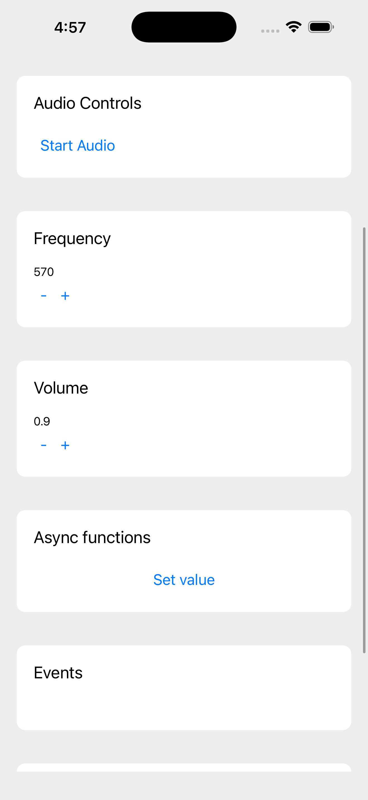
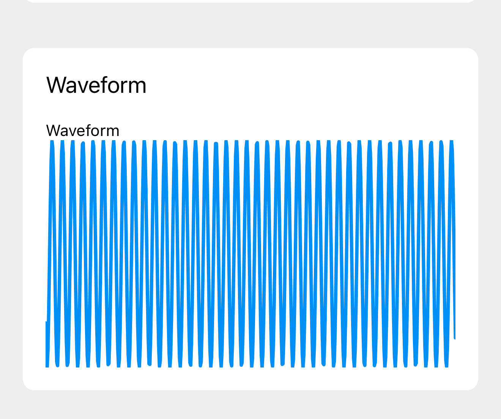

If you’ve been following me recently you might have noticed I finally picked up a MacBook for native development. And with that door opened, of course one of the first things I’ve been exploring is audio programming on iOS and React Native. It’s cool to see how far a lot of libraries have come, from expo-av to the newer react-native-audio-api. It’s a whole new world for native audio. But it’s still pretty tricky. So I decided to dive in and wrap my head around the basics.

While learning about Expo Native Modules, I created a little DSP module in Swift that creates a simple oscillator and outputs the PCM data to the user’s speakers. I figured I’d break down the process a bit to enlighten myself further, and share a process I feel like people don’t talk about in detail very often. This is a great intro to audio programming with Swift and iOS.

> 📁 TLDR? You can find the [source code on Github](https://github.com/whoisryosuke/expo-dsp) and spin it up on most modern iOS simulators or devices.

# What are we building?

Let’s break this down a bit. Here’s the app we’ll be building.



It’s a React Native app written using the Expo framework, and if you’ve ever used the Expo CLI it might look familiar cause it’s the default template they provide.

It uses a custom “**native module**”. A [native module](https://docs.expo.dev/modules/overview/) is a library that lets the JavaScript side of the React Native app talk with the native side (iOS, Android, or other platforms). It allows you to run native processes not normally accessible to JavaScript, like accessing the device camera or running shaders using graphics APIs.

I wrote a native module called `ExpoDsp` that handles synthesizing audio signals and playing them on iOS. DSP stands for “digital signal processing”, which is field of research that encompasses things like audio programming or electrical engineering. If you’ve ever produced music using a few oscillators, or added effects to a sample in a DAW, you’ve probably practiced DSP.

This DSP module lets the JavaScript app talk to the native backend (iOS in our case). The module exposes functions written in Swift that run native iOS code, like the audio playback using Apple’s `AVAudioEngine`.

If you want to follow along for the audio programming / Swift stuff, you can ignore the Expo stuff mostly unless you’re genuinely interested in React Native development too. Otherwise this assumes you have a basic knowledge of the Expo framework and basic commands like running the iOS app (aka running `expo start` and `expo run:ios` — or building from XCode).

> 📁 This blog will go into advanced audio programming concepts, like the “rules of the realtime thread” (no locks, memory allocation, or heavy computation). I recommend reading “[**Creating a DAW in Rust - Playing Audio**](https://whoisryosuke.com/blog/2026/creating-a-daw-in-rust/)” where I explain the low level concepts in greater detail.

# Getting Started

The first step is to create a new Expo native module. They offer a CLI that makes this effortless:

```bash
npx create-expo-module your-module-name
```

> 📁 I chose to include examples of various things like constants, functions, and events. These were great to just copy/paste and edit as needed.

This creates a new folder called `your-module-name` that contains your native module’s source code in the form of iOS + Android and TypeScript to bridge them. There’s also an example Expo app to run it (inside the `/example` folder).

In our case, we’ll only be focusing on iOS code which is located in the `/ios` folder and written in Swift. But you can also write Android specific code in the `/android` folder in Kotlin files, or web code using the `.web.ts` file for the module.

And that’s it for now. Let’s start working on our audio code. You can also follow along with [my code here](https://github.com/whoisryosuke/expo-dsp).

# Creating your first oscillator

We need to do 2 things:

- Make audio to play (an “oscillator”)
- Send audio to the speakers

The first thing is actually rather simple. An oscillator is just a sine wave we generate using a function, and “sample” different points of the sine wave (like grabbing a point in the middle, or near the end). We’ll save that for later.

The second thing is more interesting: how do we send audio to the speakers? If you’ve read any of my other low level audio posts, you’ll know the drill. We need to tap into a low level audio API that connects to a speaker (obviously right?), then we pass it a function that loops infinitely which sends audio (aka “PCM”) data to the speakers.

For Apple, this means we need to tap into their [AVFAudio framework](https://developer.apple.com/documentation/avfaudio) aka `AVFoundation`. This is a collection of classes that handle a lot of heavy lifting for us, like sending data to the speakers — or even handling [“mixing”](<https://en.wikipedia.org/wiki/Audio_mixing_(recorded_music)>) of audio. We need to use the `AVAudioEngine` class to create an audio backend and connect it to a speaker. Then we can create an `AVAudioSourceNode` that contains our audio buffer (aka oscillator data), and send it over to our audio engine we created to play.

To wrap all this logic, we’ll use a `AudioEngineManager` class. It will contain our engine, the audio node, and some parameters for our oscillator. Phase is our position in the sine wave, it “oscillates” or goes back and forth between `-2pi` and `2pi` (or -6.28 to 6.28). Our frequency is the “pitch” of the oscillator, so higher numbers equate to going right on a piano.

```swift
class AudioEngineManager {
    private let engine = AVAudioEngine()
    // Need to store a reference to the audio node to persist it
    private var sourceNode: AVAudioSourceNode?
    private var phase: Float = 0
    private var frequency: Float = 440.0
    // Ideally should use Atomics here or a ring buffer setup - but this works for debug
    private let lock = NSLock()
    private var debugFrameCount: Int = 0
  }
```

> 🔒 You’ll notice we use a lock here in the form of `NSLock`. We do this because our audio thread is constantly running and reading + writing to these properties, but we also want to access the data outside the audio loop (like letting our React Native app set the frequency). To circumvent this, we “lock” temporarily in our functions to ensure no other function is using the data, then we can safely operate on it. This is technically a big no-no in audio programming. You don’t want to lock up your audio thread at any point or you’ll hear clicks, gaps in audio, etc. But to keep things simple, we’ll use it for now. Later we’ll replace this with a performant alternative called “atomics”.

Our first task is to create the audio engine and connect to the speakers. We’ll create a `setupEngine` method that handles this. Inside we’ll use the `AVAudioSession` API to create a new instance of an audio session. This lets us set the “category” (playback in our case, but we could do recording later), and use the `setActive` method to grab the default output device. This ensures that even if our user changes their audio device on their iOS device to something else (like from their phone to their AirPods), the OS will automatically handle switching our session to that device.

> 🎧 Speaking of AirPods, we also have to pass a special option parameter to our `setCategory` method called `allowBluetoothA2DP` which enables us to connect to Bluetooth devices. Without it, you won’t hear any audio output if you’re on a Bluetooth device.

```swift
func setupEngine() {
    // Pick an output device
    let session = AVAudioSession.sharedInstance()
    do {
        try session.setCategory(.playback, mode: .default, options: [
            // Enable bluetooth audio devices
            .allowBluetoothA2DP    // ← High-quality stereo (AirPods use this)
        ])
        try session.setActive(true)
        print("Audio route: \(session.currentRoute.outputs.map { $0.portType.rawValue })")

        // Give the system a moment to negotiate Bluetooth, then log
        DispatchQueue.main.asyncAfter(deadline: .now() + 0.5) {
            let route = session.currentRoute.outputs.map { "\($0.portName) [\($0.portType.rawValue)]" }
            print("Active route after delay: \(route)")
        }

    } catch {
        print("Session error: \(error)"); return
    }

    // ...more to come...
  }
```

> ⚠️ Need help debugging here? Try logging out `print(engine.description)` to see the audio device graph. It can be tricky knowing what device is selected without checking this. Ideally later we’d build systems to allow the user to select devices themselves, instead of defaulting to the system.

Next, let’s setup our audio engine for the device we just detected. When dealing with audio devices, they have different configurations depending on their quality level. For example, most speakers have 2 channels (stereo) - but some only have 1 (mono). Or a speaker might have a higher or lower bit rate, meaning it can handle more or less streaming audio data. The higher the bit rate, the higher the “quality” of the sound (since we get more data per second to listen to - it’s similar to comparing a tape to a CD in quality).

In our case, we’ll just grab the number of channels and bit rate from the device. To encompass this configuration, we’ll put the channels and sample rate inside an `AVAudioFormat` class. We’ll handle this off to our audio node soon.

```swift
// Get sample rate from device
let outputFormat = engine.outputNode.outputFormat(forBus: 0)
let sampleRate = Float(outputFormat.sampleRate)

// Create audio format using sample rate (2 channel audio)
guard let stereoFormat = AVAudioFormat(
    standardFormatWithSampleRate: outputFormat.sampleRate,
    channels: 2
) else { print("Bad format"); return }
```

At this point, we could start our engine using `engine.start()` — but we wouldn’t hear anything, because we haven’t added any sound yet. Let’s create an audio node, add our oscillator inside, and send that that to the engine.

```swift
// Create audio source node for oscillator
// This holds an infinite loop for a sine wave function
let node = AVAudioSourceNode(format: stereoFormat) { [weak self] _, _, frameCount, audioBufferList -> OSStatus in
    guard let self = self else { return noErr }

    let abl = UnsafeMutableAudioBufferListPointer(audioBufferList)

    // Grab latest data
    self.lock.lock()
    let currentFreq = self.frequency
    var localPhase = self.phase
    self.lock.unlock()

    // Animate sine wave forward
    let phaseIncrement = (2.0 * Float.pi * currentFreq) / sampleRate

    for frame in 0..<Int(frameCount) {
        let sample = sin(localPhase)
        for buffer in abl {
            UnsafeMutableBufferPointer<Float>(buffer)[frame] = sample
        }
        localPhase += phaseIncrement
        if localPhase >= 2.0 * .pi { localPhase -= 2.0 * .pi }
    }

    self.lock.lock()
    self.phase = localPhase
    self.debugFrameCount += Int(frameCount)
    self.lock.unlock()

    return noErr
}

// Store node locally to persist it
sourceNode = node

// Attach our node to the engine
engine.attach(node)

// Then we can actually connect our node to the "output"
// in this case the `mainMixerNode` of the engine
engine.connect(node, to: engine.mainMixerNode, format: stereoFormat)
```

And with that, we have some audio playing…if we could trigger it somehow. In a Swift app we’d just initialize this class and run the methods. But since we’re communicating between React Native and Swift, we need to build a Swift module to bridge the two. We’ll keep it simple here and create a property to store our audio engine, and expose a function to start the engine (and subsequently playback).

`ExpoDspModule.swift`

```swift
import ExpoModulesCore

public class ExpoDspModule: Module {
  private let audioManager = AudioEngineManager()

  public func definition() -> ModuleDefinition {
    Name("ExpoDsp")

    // Audio Engine integration
    Function("startEngine") {
      print("Starting engine...")
      self.audioManager.setupEngine()
    }
  }
}
```

And on the TypeScript side, we need to build a similar module to bridge the Swift code. We need to make a function called `startEngine` that matches the same name we pass to the `Function()` helper in our Swift module.

`ExpoDspModule.ts`

```swift
import { NativeModule, requireNativeModule } from 'expo';

import { ExpoDspModuleEvents } from './ExpoDsp.types';
import type { ExpoDspModuleSharedObject } from './ExpoDspModuleSharedObject';

declare class ExpoDspModule extends NativeModule<ExpoDspModuleEvents> {
  startEngine(): void;
}

export default requireNativeModule<ExpoDspModule>('ExpoDsp');

```

Cool, now we can access this from our React Native app. In our case, we’ll be using the example app inside the native module. We just import the module `ExpoDsp` from our package and use the method `startEngine()` we exposed:

`example/App.tsx`

```tsx
import ExpoDsp, { useExpoDspModuleSharedObject } from "expo-dsp";
import { useEvent } from "expo";
import { useState } from "react";
import { Button, SafeAreaView, ScrollView, Text, View } from "react-native";

export default function App() {
  const [engineStarted, setEngineStarted] = useState(false);
  return (
    <SafeAreaView style={styles.container}>
      <ScrollView style={styles.container}>
        <Text style={styles.header}>Module API Example</Text>
        <Group name="Audio Controls">
          {!engineStarted && (
            <Button
              title="Start Engine"
              onPress={async () => {
                await ExpoDsp.startEngine();
                setEngineStarted(true);
              }}
            />
          )}
        </Group>
      </ScrollView>
    </SafeAreaView>
  );
}
```

And finally, we have audio playing from our Swift backend controlled through the JavaScript frontend. It’s very crude and simple - it only plays a simple sine wave at a set frequency, and once it starts and it doesn’t stop until we restart or close the app. Let’s add a couple of these features to make it a little more usable.

## Changing frequency

Earlier we created a property on our audio engine class called `frequency` that represents well, the frequency of our oscillator (how “frequent” it loops, aka how deep or high pitched it’ll sound).

To control this, since we added a lock mechanism earlier, we could just update the property directly. Ideally if we don’t do it too often, it shouldn’t interrupt the audio playback loop.

```swift
class AudioEngineManager {
	/// Update oscillator frequency
	func updateFrequency(_ newFreq: Float) {
	    lock.lock(); defer { lock.unlock() }
	    frequency = newFreq
	}
}
```

And to control this on the frontend, we need to create a function in our module that exposes this new engine function:

```tsx

public class ExpoDspModule: Module {
  private let audioManager = AudioEngineManager()

  public func definition() -> ModuleDefinition {
	  // The other functions from earlier

		Function("setFrequency") { (frequency: Float) in
		  print("Setting frequency...")
		  self.audioManager.updateFrequency(frequency)
		}
	}
}
```

And in the example app we can access this new `setFrequency` function we exposed. You could wire it up to a slider, but that requires an install (and possibly messing up your build) - so the faster way is to just add two buttons to increase and decrease the frequency.

```tsx
<Group name="Frequency">
  <Text>{frequency}</Text>
  <View style={{ flexDirection: "row" }}>
    <Button
      title="-"
      onPress={async () => {
        await ExpoDsp.setFrequency(frequency - 50);
        setFrequency(frequency - 50);
      }}
    />
    <Button
      title="+"
      onPress={async () => {
        await ExpoDsp.setFrequency(frequency + 50);
        setFrequency(frequency + 50);
      }}
    />
  </View>
</Group>
```

Now you should be able to start the audio engine to hear the squeal of the oscillator, and now tune it to a more soothing bass or sharp treble.

## Crank it up to 11

The next thing we’ll probably want to add to our oscillator is a volume control. The oscillator is probably pretty loud right now and it’d be nice to control it. And it’ll be especially useful later if we want to layer oscillator nodes and have some less intense than others.

There’s 2 ways to handle this. We could create a new property in our engine class for our `masterGain` and store it that way. Then use that gain in our oscillator loop to scale our final sample buffer down.

```swift

class AudioEngineManager {
    private var masterGain = 1.0

    // in our audio node
    let volume = self.masterGain

    for frame in 0..<Int(frameCount) {
		    // Scale the sample by our master gain (aka volume)
        let sample = sin(localPhase) * volume
    }
```

It’d work, but it relies on us either locking (which is bad) or creating an “atomic” (which is better, but not the perfect answer).

Instead, we can use the `AVAudioMixerNode` that [Apple provides](https://developer.apple.com/documentation/avfaudio/avaudiomixernode). This is an audio node that we can connect along the chain and control the volume of any previous nodes in the chain by reducing it’s own output to the next node (similar to the `GainNode` in the [Web Audio API](https://developer.mozilla.org/en-US/docs/Web/API/GainNode)).

And if you noticed earlier, when we connected our oscillator’s audio node to the audio engine, we technically connected to the `engine.mainMixerNode`. If we take a look at [that property in the docs](https://developer.apple.com/documentation/avfaudio/avaudioengine/mainmixernode), we can see that it’s literally a mixer node that we can use to control the “master volume” of our audio output. Instead of making our own and managing it, we can just leverage this one for now.

Using the engine’s mixer node, it’s as simple as updating it’s `outputVolume` property:

```swift
class AudioEngineManager {
	/// Control's volume of all audio nodes
	func setMasterVolume(level: Float) {
	    engine.mainMixerNode.outputVolume = level
	    print("Master volume set to \(level)")
	}
}
```

> ⚠️ If you change the audio levels too quickly with this setup, you might hear some clicks or pops. This effect is called “[discontinuity](https://en.wikipedia.org/wiki/Illusory_discontinuity)”. It happens when you have gaps or changes that occur in 50ms or less. So to mitigate this, you should technically linearly ramp the volume from it’s previous position to the new one (kinda like the crossfade in your favorite music player), and interpolate using 50ms or greater “timer” (but not an actual timer because those run on the main thread and might hiccup causing pops too).

## Starting / stopping playback

Cool we have an oscillator and we can control it’s frequency and volume - but how do we stop it? Our first instinct might be to use the `AVAudioEngine` instance and it’s `stop()` method.

We can pull our `engine.start()` out of our `setupEngine` function and create a new function called `startEngine()`. Then we could create a function called `stopEngine()` and put our `stop()` method in there.

```swift

class AudioEngineManager {
  /// Call this to start audio playback
  func startEngine() {
      guard !engine.isRunning else { return }
      do {
          try engine.start()
          print("Engine started")

          // DEBUG: Heartbeat for PCM frames
          Timer.scheduledTimer(withTimeInterval: 2.0, repeats: true) { [weak self] _ in
              print("Frames rendered: \(self?.debugFrameCount.load(ordering: .relaxed) ?? 0)")
          }
      } catch {
          print("Could not start engine: \(error)")
      }
  }
  /// Call this to pause audio playback
  func stopEngine() {
      if engine.isRunning {
          engine.stop()
          print("Engine stopped")
      }
  }
}
```

This does work, but in most audio applications, you don’t want to destroy the engine and recreate it every time you want to stop and start playback.

Instead, we should do 2 things:

1. **Fade out our gain**. This ensures we don’t immediately stop audio which can cause clicking sounds.
2. **Stop our audio node.** In our case, we need to “pause” our oscillator from looping and incrementing, so when the user replays it’s at the same “phase”. Later we’ll want to just `stop()` an audio node with a sample (like a `.wav` sound).

We learned about fading out audio earlier, so we can do that now pretty easily with our new `setMasterVolume` function.

For stopping our oscillator though, we’ll need a new property that’ll hold our play/paused `Bool` state. Then we can check for that in our oscillator loop and pause our oscillators phase progression:

```swift
class AudioEngineManager {
	private let paused = false

		// Later in our audio node
	  for frame in 0..<Int(frameCount) {
        let sample = sin(localPhase)
        for buffer in abl {
            UnsafeMutableBufferPointer<Float>(buffer)[frame] = sample
        }

        // Check if we're paused and prevent phase from incrementing
        if(paused) return;
        localPhase += phaseIncrement
        if localPhase >= 2.0 * .pi { localPhase -= 2.0 * .pi }
    }
}
```

Now we can combine it all together:

```swift
class AudioEngineManager {
	func pauseAudio() {
		setMasterVolume(0.0)
		paused = true
	}
}
```

## Lock free since ‘93

When you’re working with real-time audio on a low level, there’s a certain set of rules you have to follow. One of the rules is not locking. If you’re not familiar with what [locking](<https://en.wikipedia.org/wiki/Lock_(computer_science)>) is, it allows us to read and write from data in memory from only one thread at a time - ensuring other threads have to wait their turn to access it. This prevents issues like writing to an array slot while another thing is trying to read it.

In audio apps, you’ll often have to share data between the real-time audio thread (where we loop and write the oscillator buffer) and other parts of the app (like the frontend changing the frequency that’s used in the oscillator buffer code).

Before we were using `NSLock` to “_lock_” our class when one thread is using it. This works for debugging, but in production, we want to avoid doing this since it can lead to weird sounds or gaps in the audio (or feedback - like a waveform).

### The answer is not physics

Instead of using a lock, we need to take advantage of a concept called “[**atomics**](https://doc.rust-lang.org/nomicon/atomics.html)”. This is a paradigm in many programming languages where you can create a primitive type - like an `Int` - and ensure it can be read and written by anyone anytime (with caveats). With the atomic we can `store()` new data and `load()` existing data when we need it. The big thing to understand is how the updates work. Since we can have multiple things reading the same item at the same time, the atomic has a system of scheduling the events. So we can store data using a “relaxed” configuration, and that means it’ll update the atomic value whenever other threads are done.

> ⚠️ But wait, doesn’t this mean we’re still technically locking our real-time audio thread if another thread is using the data? Yep, but it’s faster than a traditional lock, and it’s more efficient because of memory sorting that can happen in the background (ensuring reads get combined and whatnot).

Swift doesn’t have atomics built in, though they released it later as a separate official package you can install in your app. It’s called [**swift-atomics**](https://github.com/apple/swift-atomics).

To install it in an Expo native module, you’ll want to edit the `.podspec` file in your iOS folder and add it as a dependency. You should have one for `ExpoModulesCore` already:

```tsx
  s.dependency 'ExpoModulesCore'
  s.dependency 'SwiftAtomics'
```

Then recreate your XCode workspace by running the `expo prebuild --clean` process. This’ll handle installing the pod for us.

Now we can use it in our Swift code. Using the library is pretty straightforward, you use the `ManagedAtomic` class and pass in your primitive type (like an `Int`). You can see [a list of supported types](https://github.com/apple/swift-atomics#features) in their README.

```tsx
// Create the atomic value
var value = ManagedAtomic(1);

// Update it
value.store(2, ordering: .relaxed)

// Get the value anytime
let currentValue = value.load(ordering: .relaxed)
```

A keen eye will notice that it doesn’t support `Float` types. This is because floats are a bit more complex on the backend to store. Instead, we can convert the float to it’s “bit pattern” and store that as a `UInt32` value. Then when we need the float, we can convert the bit pattern back to a float using the `Float` class.

I created a quick module that wraps the atomic logic to simplify getting and setting a float parameter - like our frequency or phase:

```swift
import Foundation
import Atomics

/// A thread-safe controller for float-based DSP parameters
public class DSPParameterController {

    // We store the value as an atomic
    // Note that we store float as uint32 using bit pattern
    private let _value: ManagedAtomic<UInt32>

    public init(initialValue: Float = 1.0) {
        self._value = ManagedAtomic(initialValue.bitPattern)
    }

    /// Update parameter (thread-safe)
    public func setValue(_ newValue: Float) {
        // Note that we store float as bit pattern here
        self._value.store(newValue.bitPattern, ordering: .relaxed)
    }

    /// Get parameter value
    public func getValue() -> Float {
        let bits = self._value.load(ordering: .relaxed)
        return Float(bitPattern: bits)
    }
}

```

Cool, now with this we can just drop in and replace our `frequency` and `phase` parameters on our audio engine class, and remove the lock now:

```swift
class AudioEngineManager {
    private var phase = DSPParameterController(initialValue: 0.0)
    private var frequency = DSPParameterController(initialValue: 440.0)

    func setupEngine() {
	    // Setup engine...

      // Create audio source node for oscillator
      // This holds an infinite loop for a sine wave function
      let node = AVAudioSourceNode(format: stereoFormat) { [weak self] _, _, frameCount, audioBufferList -> OSStatus in
        guard let self = self else { return noErr }

        let abl = UnsafeMutableAudioBufferListPointer(audioBufferList)

        // Grab latest data
        // 👉 No lock required now!
        let currentFreq = self.frequency.getValue()
        var localPhase = self.phase.getValue()

        // The rest of the audio code...
      }
    }

    /// Update oscillator frequency
    func updateFrequency(_ newFreq: Float) {
	    // 👉 And we can just update now without locking
      frequency.setValue(newFreq)
    }
}
```

# Visualizing the wave

What if we wanted to see the audio instead of just hearing it? In the Web Audio API, you’d just add an `AnalyserNode` to the audio graph and create an infinite loop that requests waveform data from it (usually around 60 times per second). How do we replicate this in our Swift audio engine?

> ⚠️ If you’ve read my blog on creating a low level audio engine in Rust, this process might look familiar, because we also created a waveform from scratch there and sent the data to the frontend.

Well, we have to do it manually. Let’s create a ring buffer (fancy word for a fixed array with a rolling start index) that’ll store our waveform data as our audio plays. The ring buffer will hold the latest 4096 samples. Then in our oscillator loop, we can update the ring buffer with the latest samples as we write them.

```swift
class AudioEngineManager {
		// Create a ring buffer (aka fixed array)
    private var ringBuffer: [Float] = Array(repeating: 0, count: 4096)
    // This is the ring buffer magic - the "current" array index
    private var writeIndex = 0

		// Later in our audio node
	  for frame in 0..<Int(frameCount) {
        let sample = sin(localPhase)
        for buffer in abl {
            UnsafeMutableBufferPointer<Float>(buffer)[frame] = sample
        }

		    // Update ring buffer with sample data
		    self.ringBuffer[self.writeIndex] = sample
		    self.writeIndex = (self.writeIndex + 1) % self.bufferSize
    }
}
```

Now that we have some waveform data, we can create a function that sends it to our frontend. We’ll need a function that takes our ring buffer and converts it into an array in correct order (as our user probably expects to graph it chronologically from start/left to finish/right). Since we’re sending data to the frontend via the React Native bridge, the less data we send, the more stuff we can do on the bridge (like running other logic). So instead of just returning the entire ring buffer, we’ll “decimate” it by chopping it down from 4096 data points to something smaller like 512.

```swift
func getWaveformData(_ numberOfPoints: Int) -> [Float] {
    var waveform: [Float] = Array(repeating: 0, count: numberOfPoints)
    let step = self.bufferSize / numberOfPoints

    // We read backwards from the current writeIndex to get the "most recent" data
    let prevWriteIndex = getWriteIndex()
    var readIdx = (prevWriteIndex - 1 + self.bufferSize) % self.bufferSize

    for i in 0..<numberOfPoints {
        // Decimation: Pick every 'step' samples to represent the wave
        let sample = self.ringBuffer[readIdx]

        // Add to waveform array
        waveform[i] = sample

        // Jump back 'step' amount
        readIdx = (readIdx - step + self.bufferSize) % self.bufferSize
    }

    return waveform.reversed() // Return in chronological order
}
```

This worked…but the app would occasionally crash with an error about the audio thread literally crashing (likely accessing memory that was being written or something).

### Running the wave back

To remedy this, I had to change my ring buffer from an `Array` to a `UnsafeMutablePointer` type. The `UnsafeMutablePointer` is basically an array, but it doesn’t have “ARC” built in (not to be confused with `Arc` in Rust), which can cause concurrency issues.

Ended up creating a separate waveform class to encapsulate all this logic:

```swift
import Atomics

class WaveformData {
    // Create a ring buffer (aka fixed array)
    private var ringBuffer: UnsafeMutablePointer<Float>
    private let writeIndex: ManagedAtomic<Int>
    private let bufferSize = 4096

    public init() {
        // We use an UnsafeMutablePointer instead of Array here
        // It's more performant for low level and avoids ARC (Automatic Reference Counting)
        self.ringBuffer = UnsafeMutablePointer<Float>.allocate(capacity: self.bufferSize)
        self.ringBuffer.initialize(repeating: 0, count: self.bufferSize)

        self.writeIndex = ManagedAtomic(0)
    }

    deinit {
        ringBuffer.deallocate()
    }

    private func getWriteIndex() -> Int {
        return self.writeIndex.load(ordering: .relaxed)
    }

    public func update(sample: Float) {
        let prevWriteIndex = getWriteIndex()

        // Update ring buffer with sample data
        self.ringBuffer[prevWriteIndex] = sample
        let newWriteIndex = (prevWriteIndex + 1) % self.bufferSize
        self.writeIndex.store(newWriteIndex, ordering: .releasing)
    }

    func getWaveformData(_ numberOfPoints: Int) -> [Float] {
        var waveform: [Float] = Array(repeating: 0, count: numberOfPoints)
        let step = self.bufferSize / numberOfPoints

        // We read backwards from the current writeIndex to get the "most recent" data
        let prevWriteIndex = getWriteIndex()
        var readIdx = (prevWriteIndex - 1 + self.bufferSize) % self.bufferSize

        for i in 0..<numberOfPoints {
            // Decimation: Pick every 'step' samples to represent the wave
            let sample = self.ringBuffer[readIdx]

            // Add to waveform array
            waveform[i] = sample

            // Jump back 'step' amount
            readIdx = (readIdx - step + self.bufferSize) % self.bufferSize
        }

        return waveform.reversed() // Return in chronological order
    }

}

```

Now we can just store this as a property on our audio engine and hook it into the audio callback:

```swift

class AudioEngineManager {
  private var waveform = WaveformData()

  // Inside the audio callback
  func setupEngine() {
	  waveform.update(sample: sample)
  }

  /// Get waveform data
  func getWaveformData(_ numberOfPoints: Int) -> [Float] {
      return waveform.getWaveformData(numberOfPoints)
  }
}
```

Finally we expose it using our native module the same way as before, and ultimately, use the `ExpoDsp.getWaveformData(512)` method to get the waveform. Here’s a `<Waveform>` component that runs an 60fps animation loop to grab the latest waveform data from our backend.

```tsx
import React, { useEffect, useRef, useState } from "react";
import WaveformLineGraph from "./WaveformLineGraph";
import ExpoDsp, { useExpoDspModuleSharedObject } from "expo-dsp";

type Props = {
  reduceMotion?: boolean;
};

const Waveform = ({ reduceMotion }: Props) => {
  const [data, setData] = useState<number[]>([]);
  const animationRef = useRef<ReturnType<typeof requestAnimationFrame>>(0);

  const animate = () => {
    const newData = ExpoDsp.getWaveformData(512);
    // console.log('got waveform data', newData.length);
    if (newData && Array.isArray(newData)) setData(newData);

    if (!reduceMotion) animationRef.current = requestAnimationFrame(animate);
  };

  useEffect(() => {
    if (!reduceMotion) animationRef.current = requestAnimationFrame(animate);

    return () => {
      if (animationRef.current) cancelAnimationFrame(animationRef.current);
    };
  }, [reduceMotion]);

  return <WaveformLineGraph data={data} height={200} color="#008ff5" />;
};

export default Waveform;
```

And with Skia we can render this data to a canvas on mobile. This specifically renders a dynamic width canvas, but if you make it static, you can remove the Reanimated dependency.

```tsx
import React, { useMemo } from "react";
import { Dimensions } from "react-native";
import { Canvas, Path, Skia, useFont } from "@shopify/react-native-skia";
import { useSharedValue } from "react-native-reanimated";

interface WaveformProps {
  // Array of values between 0 and 1
  data: number[];
  height?: number;
  color?: string;
  strokeWidth?: number;
}

const WaveformLineGraph = ({
  data,
  height = 200,
  color = "#4ade80", // Tailwind green-400
  strokeWidth = 3,
}: WaveformProps) => {
  // size will be updated as the canvas size changes
  const size = useSharedValue({ width: 0, height: 0 });

  // We use useMemo so the path is only recalculated when data or dimensions change
  const path = useMemo(() => {
    const skPath = Skia.Path.Make();
    if (data.length === 0) return skPath;

    const stepX = size.get().width / (data.length - 1);
    const midY = height / 2;

    // 1. Move to the starting point (first data point)
    // We calculate Y by offsetting from the middle based on amplitude
    const startY = midY - data[0] * midY;
    skPath.moveTo(0, startY);

    // 2. Iterate through the rest of the points and draw lines
    for (let i = 1; i < data.length; i++) {
      const x = i * stepX;
      const y = midY - data[i] * midY;
      skPath.lineTo(x, y);
    }

    return skPath;
  }, [data, height, size]);

  return (
    <Canvas style={{ flex: 1, height }} onSize={size}>
      <Path
        path={path}
        color={color}
        style="stroke"
        strokeWidth={strokeWidth}
        strokeCap="round"
        strokeJoin="round"
      />
    </Canvas>
  );
};

export default WaveformLineGraph;
```

And now we have a waveform that can we see with our eyes and not just hear with the ears. It reveals the sine wave nature of our oscillator, with the sine wave increasing and decreasing in frequency when we well, change it’s frequency.



Pretty cool right? Seeing is believing or something.

# What’s next?

Now that we have an oscillator setup, you could run multiple oscillators and stack them together to synthesize a more unique sound. Or you could load an audio file as a “sample” and play that instead — and ideally play it using the low level buffer and the audio engine so you can manually manipulate the audio stream (instead of using the audio player API). Or you could experiment with adding effects, like a LFO or bitcrusher.

If you’re interested in learning more about audio in React Native, I recommend checking out legacy libraries like [expo-av](https://www.npmjs.com/package/expo-av) or [expo-audio](https://github.com/expo/expo/tree/main/packages/expo-audio), and more modern libraries like [react-native-audio-api](https://github.com/software-mansion/react-native-audio-api). These are more feature filled and bug-proof.

As always, if you enjoyed this blog make sure to share it on [socials](https://bsky.app/profile/whoisryosuke.bsky.social) and tag me up. And if you find this kind of content valuable to your education consider supporting me on [Patreon](https://www.patreon.com/c/whoisryosuke).

Stay curious
Ryo
