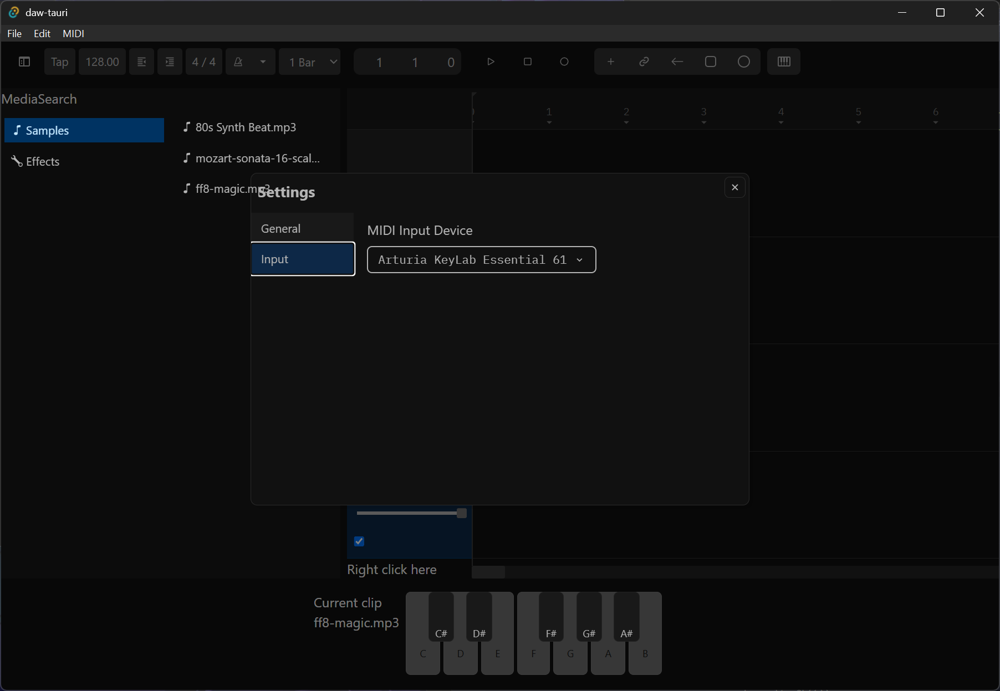

I’ve been developing a DAW in Rust as a little fun side project to learn more about low level audio programming and experiment with the UX of the music production process. If you’ve been following along with this series, we’ve gotten pretty far. We have a Tauri app that can play audio from the Rust backend using a custom “audio engine” (instead of, say, the Web Audio API). And in the previous blog I covered adding a multi-track timeline with drag and drop audio clips and a linear FX chain.

Now that we have audio playback sorted, and wrangled to the point where we can do complex processing of multiple tracks, clips, and effects — it’s time to explore MIDI input. It’s an essential feature in any DAW that lets musicians tap into their digital instruments for creative exploration. This also isn’t my first rodeo with MIDI in Rust, you can [check out my previous blog](https://whoisryosuke.com/blog/2025/using-rust-to-play-midi/) that covers it in a more introductory state.

In this blog I’ll cover how I added MIDI input to my Rust and ReactJS based DAW. We’ll start with establishing a low level MIDI connection, syncing playback to the frontend, and triggering audio playback (along with re-pitching the sample to sound higher/lower based on MIDI note). There’s a lot to cover, but a lot of it works off concepts explored in [previous](https://whoisryosuke.com/blog/2026/creating-a-daw-in-rust) [blogs](https://whoisryosuke.com/blog/2026/creating-a-daw-in-rust-multi-track-timeline), so make sure to check those out if you’re feeling lost in my weird Rust audio world.

# What we’re making


We’re adding MIDI input and sample playback to the DAW. This actually required quite a few things.

For the **frontend**, this meant:

- Selecting and connecting to a MIDI device from a list (ideally in “user settings”)
- Creating new “MIDI” tracks in the timeline that can have a sample associated with them.
- Creating a system for MIDI tracks to be “playable” (aka “armed” in Ableton)
- A little piano component to visualize MIDI input + allow for click/touch-based to send MIDI events to backend

For the backend, like I mentioned before, it was fairly straightforward (and copy/paste in some cases) - but required some big changes to existing systems:

- Creating a MIDI input store to manage the connection to the selected device
- Creating Tauri commands (like a “backend API”) - like getting a list of devices
- Creating a messaging system to sync MIDI input data to our frontend
- Tap into the existing audio messaging system to play audio
- Update audio engine to support “immediate playback” (like MIDI input — or maybe even previewing a sample later)

I’ll dive into the deets of these as we delve deeper into each of their waters.

> 📁 Highly recommend browsing [**the source code**](https://github.com/whoisryosuke/daw-tauri/tree/38ee75ff941147fbd8d5ff41d527c9904713fcad) for better context. I’ll include code examples here, but they’ll often be stripped down and minimized to fit cleaner (and not repeat logic 20 times). And with this kind of app, there’s a lot of classes and moving pieces, so feel free to take time understanding their purpose and relationships. Or you can just, you know, check out [my previous blogs](https://whoisryosuke.com/blog/2026/creating-a-daw-in-rust/) on this topic.

# The high level overview

Lets start from the **backend.**

We’ll need a `MIDIStore` to contain our MIDI connection and any of it’s internal services (like the sync to frontend feature). We’ll use the [**midir**](https://crates.io/crates/midir) crate to handle MIDI input and output - so it’ll do the heavy lifting of discovering MIDI devices, intercepting their signals, and formatting them in a more human friendly format.

We’ll also need to upgrade our existing `AudioEngine` to support playing audio nodes outside of the “composition”/timeline we created last time. It’s basically like just creating another track on our Mixer, but we keep it separate, because it doesn’t need all the bells and whistles (like effects/plugins applied to it).

For the **frontend**, we’ll need an `inputStore` atom to store our MIDI state for UI rendering, like displaying a piano for the user that can light up on MIDI key press. We’ll use a `<MIDISync />` component to sync to that store, where any component (like the piano) can quickly access the latest input state.

Basically 3 parts - the MIDI connection and store, playing immediate audio, and syncing the MIDI input with frontend. Lets dive into the first one.

# Connecting to a MIDI device

Since we’re using the `midir` crate, my first step is to always check the docs or examples to find something that matches my use case. The repo has a [test_read_input example](https://github.com/Boddlnagg/midir/blob/8d00b6f68b4b76922a3e7d5a518adff846092c8c/examples/test_read_input.rs) that works as a perfect “hello world” starter for us.

In the example, they connect to the default device, or let you pick if there’s more than one. This displays how to quickly connect to 1 device, or get a device list when we need to show the user.

```rust
// Initialize the MIDI library
let mut midi_in = MidiInput::new("midir reading input")?;
// Grab the devices
let in_ports = midi_in.ports();
let in_port = match in_ports.len() {
  0 => return Err("no input port found".into()),
  1 => {
      println!(
          "Choosing the only available input port: {}",
          midi_in.port_name(&in_ports[0]).unwrap()
      );
      &in_ports[0]
  }
  // For multiple, user picks an port (aka index in `in_ports`)
}
let _conn_in = midi_in.connect(
        in_port,
        "midir-read-input",
        move |stamp, message, _| {
            println!("{}: {:?} (len = {})", stamp, message, message.len());
        },
        (),
    )?;
```

And most importantly, it shows how to get MIDI data from the device — using a lambda callback that receives a `message` from the selected MIDI device. If you preview the example (or import the code into Tauri like me), you’ll notice the logs look like this:

```rust
6516000: [144, 69, 104] (len = 3)
6595000: [128, 69, 91] (len = 3)
6613000: [144, 62, 110] (len = 3)
6703000: [128, 62, 92] (len = 3)
6736000: [144, 71, 104] (len = 3)
6815000: [128, 71, 92] (len = 3)
9134000: [128, 83, 107] (len = 3)
```

After pressing a few keys I can just visualize what the data is.

- `stamp` = Timestamp
- `message` = Array of 3 things
  - Note state (pressed or released)
  - MIDI note index (0-128)
  - Velocity

Which are all standard MIDI data signals to receive. Cool, now we can cook.

## Persisting the connection

So how does this work in Tauri? We could create the connection during the app startup, or in a command or something, but it’ll disappear once the function finishes (aka “drops” in Rust terms, getting freed from memory). We need to create a place for it to live.

This is where `MIDIStore` comes into play. We’ll create this `struct` and add a `connection` property that will hold the `midir` connection we establish. That way we can control it later like stopping if needed - or recreating later. We’ll store it is an `Option` so we can initialize without one, and recreate it when the user requests.

We’ll also store the name of the currently selected device as a source of truth. This lets us send the frontend a list of devices — and which one is selected, perfect for a `Dropdown` element. And we can run checks to see if user is trying to connect to same device - lots of reasons to keep this around.

```rust

pub struct MIDIStore {
    input_connection: Option<MidiInputConnection<()>>,
    selected_input_device: String,
}

impl MIDIStore {
    pub fn new() -> Self {
        Self {
            input_connection: None,
            selected_input_device: "".into(),
        }
    }
}
```

This `MIDIStore` will live inside the Tauri app state using `AppHandle` and it’s `manage()` method, just like we’ve done with other modules (like our `AudioEngine`).

```rust

#[cfg_attr(mobile, tauri::mobile_entry_point)]
pub fn run() {
    tauri::Builder::default()
        .setup(|app| {
            let midi_store = Mutex::new(MIDIStore::new(app.handle().clone()));
            app.manage(midi_store);
          }
}
```

Now we can establish the connection. It’s not very different to the example code from earlier. The only key difference is that we store the connection in the `MIDIStore` struct to persist it.

```rust
impl MIDIStore {
    /// Initialize the MIDI input library. Used for getting devices or connecting and receiving input.
    fn init_input_connection(&mut self) -> Result<MidiInput, String> {
        let mut midi_in =
            MidiInput::new("midir reading input").map_err(|op| "Couldn't init MIDI input")?;
        midi_in.ignore(Ignore::None);

        Ok(midi_in)
    }

    /// Create an input connection using default device, or designated "port" (aka input device)
    pub fn create_input_connection(&mut self) -> Result<(), String> {
        // Stop previous connections
        if let Some(old_connection) = self.input_connection.take() {
            old_connection.close();
        }

        // Initialize the MIDI input library
        let midi_in = self.init_input_connection()?;

        // Get default port
        let in_ports = midi_in.ports();
        let in_port = match in_ports.len() {
            0 => return Err("no input port found".into()),
            _ => {
                println!(
                    "Choosing the only available input port: {}",
                    midi_in.port_name(&in_ports[0]).unwrap()
                );
                &in_ports[0]
            }
        };

        // Store the selected device for reference later
        self.selected_input_device = in_port.id();

        println!("\nOpening connection");
        let in_port_name = midi_in
            .port_name(&in_port)
            .map_err(|op| "Couldn't get port name")?;

        // Establish MIDI input connection
        // This is where input actually comes in and gets stored
        let _conn_in = midi_in
            .connect(
                &in_port,
                "midir-read-input",
                move |stamp, message, _| {
                    println!("{}: {:?} (len = {})", stamp, message, message.len());
                },
                (),
            )
            .map_err(|op| "MIDI connection error")?;

        // Store the connection for use later + persistence
        self.input_connection = Some(_conn_in);

        println!(
            "Connection open, reading input from '{}' (press enter to exit) ...",
            in_port_name
        );

        Ok(())
    }
}
```

This connects to a default device, which is nice, but for me isn’t very useful because it always defaults to a virtual MIDI driver I have installed and never my actual MIDI USB device.

Let’s make a way for us to let the user select a device, and then connect to that one specifically

## Connecting to a specific device

We need a few things for this:

- Backend API to fetch list of devices
- Frontend UI to display devices
- Backend API to switch devices when user selects new device from dropdown

The first one is pretty easy, we saw how to do this in the example, we just need to fit it into our Tauri framework. The user will `invoke` a command called `get_midi_input_devices` in the frontend that’ll eventually return the device list - which we use to render a simple dropdown.

```tsx
import React, { useEffect, useState } from "react";
import { Stack } from "../../../../../styled-system/jsx";
import { SelectRootProps } from "@base-ui/react";
import Dropdown, {
  DropdownItem,
  DropdownItems,
} from "../../../ui/Dropdown/Dropdown";
import { invoke } from "@tauri-apps/api/core";
import Text from "../../../ui/Typography/Text";

type MIDIInputDeviceResponse = { name: string; id: string };
type OutputDeviceResponse = {
  devices: MIDIInputDeviceResponse[];
  selected: string;
};

type Props = {};

const SettingsInput = (props: Props) => {
  const [midiInputDevices, setMidiInputDevices] = useState<DropdownItems>([]);
  const [selectedMidiInputDevice, setSelectedMidiInputDevice] = useState("");

  useEffect(() => {
    const getOutputDevices = async () => {
      const response = (await invoke(
        "get_midi_input_devices",
      )) as OutputDeviceResponse;
      console.log("get_midi_input_devices", response);

      if (Array.isArray(response.devices)) {
        const newOutputDevices = response.devices.map(
          (device) =>
            ({
              label: device.name,
              value: device.id,
            }) as DropdownItem,
        );

        setMidiInputDevices(newOutputDevices);
      }

      setSelectedMidiInputDevice(response.selected);
    };

    getOutputDevices();
  }, []);

  return (
    <Stack p={2}>
      <Text>MIDI Input Device</Text>
      <Dropdown
        name="c"
        value={selectedMidiInputDevice}
        // onChange={onCategoryChange}
        placeholder="MIDI Input Devices"
        items={midiInputDevices}
      />
    </Stack>
  );
};

export default SettingsInput;
```

This will run a command that grabs the `MIDIStore` from the Tauri app state and runs the `get_input_devices` function on it. When it gets the devices back, it puts them into a “payload” struct that just gives the user a nice structured object with the results.



```rust
#[derive(Clone, Serialize, Deserialize)]
pub struct GetInputDevicesPayload {
    devices: InputDeviceSelectionResult,
    selected: String,
}

/// Starts the MIDI connection using the default device
#[tauri::command()]
pub async fn get_midi_input_devices(
    midi_store: State<'_, Mutex<MIDIStore>>,
) -> Result<GetInputDevicesPayload, String> {
    let mut store = midi_store.lock().map_err(|_| "Couldn't lock MIDI store")?;

    let devices = store.get_input_devices()?;

    Ok(GetInputDevicesPayload {
        devices,
        selected: store.selected_input_device.clone(),
    })
}
```

Like I mentioned, the function to get devices is pretty simple (thanks to the example code from the docs). We grab all the ports, then loop over them and fetch their ID and name to store together as a `InputDeviceSelection` struct. If you check the docs (or hover over the `id()` method in a good IDE), it’ll mention it’s a unique ID that won’t change — making it perfect to find devices (just in case their name changes for some odd reason). We’ll use this as the primary way for the frontend to keep track of what device is selected, as well as which they’d like to switch to.

```rust

#[derive(Clone, Serialize, Deserialize)]
pub struct InputDeviceSelection {
    name: String,
    id: String,
}
pub type InputDeviceSelectionResult = Vec<InputDeviceSelection>;

impl MIDIStore {
	/// Get a list of input devices
	pub fn get_input_devices(&mut self) -> Result<InputDeviceSelectionResult, String> {
	    let connection = self.init_input_connection()?;

	    let in_ports = connection.ports();

	    let mut input_devices: InputDeviceSelectionResult = Vec::new();
	    for port in in_ports {
	        let id = port.id();
	        let name = connection
	            .port_name(&port)
	            .unwrap_or("Unnamed Device".to_string());

	        let input_device = InputDeviceSelection { name, id };

	        input_devices.push(input_device);
	    }

	    return Ok(input_devices);
	}
}
```

> 💡 We just query for the devices on each request to ensure the user is getting the latest devices. If we stored the device list in the backend, we can’t guarantee one or more haven’t been added or removed. And it’s such a quick and cheap operation it’s better than wasting memory on storage.

But that’s just a list of devices. How do we actually switch? When our dropdown changes, we’ll send the new ID to the backend using a `connect_to_midi_input_device` command.

```rust

  const onCategoryChange: SelectRootProps<
    string,
    false
  >["onValueChange"] = async (newValue) => {
    if (newValue) {
      setSelectedMidiInputDevice(newValue as string);

      await invoke("connect_to_midi_input_device", { device: newValue });
    }
  };
```

With that port ID from the frontend, our command needs to do 2 things: grab the actual `MidiInputPort` using the provided ID, then create a new input connection using that port.

```rust
/// Connects to a specific input device based on the port ID (from the MidiInputPort `id()` method)
#[tauri::command()]
pub async fn connect_to_midi_input_device(
    midi_store: State<'_, Mutex<MIDIStore>>,
    device: String,
) -> Result<(), String> {
    let mut store = midi_store.lock().map_err(|_| "Couldn't lock MIDI store")?;

    let device_port = store.get_input_device_port(device)?;
    store.create_input_connection(Some(device_port))?;

    Ok(())
}
```

We’ll make a method on `MIDIStore` called `get_input_device_port` that’ll handle grabbing the latest ports and filtering them by the ID:

```rust
impl MIDIStore {
    /// Get input device by ID
    pub fn get_input_device_port(&mut self, id: String) -> Result<MidiInputPort, String> {
        let connection = self.init_input_connection()?;

        let in_ports = connection.ports();

        let input_device_port = in_ports.iter().find(|port| port.id() == id).ok_or(format!(
            "Couldn't find the port for that input device: {}",
            id
        ))?;

        return Ok(input_device_port.clone());
    }
}
```

And then we can finally recreate our connection each time. Nothing fancy here ultimately, we just want to create the connection like the example and store that connection we create as `self.input_connection`. Before we do any of that though, we can run `close()` on the previous connection to stop it. I even made the port optional, so it can just try connecting to the default device (kinda like the example).

```rust
impl MIDIStore {
    /// Create an input connection using default device, or designated "port" (aka input device)
    pub fn create_input_connection(&mut self, port: Option<MidiInputPort>) -> Result<(), String> {
        // Stop previous connections
        if let Some(old_connection) = self.input_connection.take() {
            old_connection.close();
        }

        // Initialize the MIDI input library
        let midi_in = self.init_input_connection()?;

        // Determine port: user selected or default + error handling
        let in_port = match port {
            Some(user_port) => user_port,
            None => {
                // Get a default input port
                let in_ports = midi_in.ports();
                let in_port = match in_ports.len() {
                    0 => return Err("no input port found".into()),
                    _ => {
                        println!(
                            "Choosing the only available input port: {}",
                            midi_in.port_name(&in_ports[0]).unwrap()
                        );
                        &in_ports[0]
                    }
                };
                in_port.clone()
            }
        };

        // Store the selected device for reference later
        self.selected_input_device = in_port.id();

        println!("\nOpening connection");
        let in_port_name = midi_in
            .port_name(&in_port)
            .map_err(|op| "Couldn't get port name")?;

        // Establish MIDI input connection
        // This is where input actually comes in and gets stored
        let _conn_in = midi_in
            .connect(
                &in_port,
                "midir-read-input",
                move |stamp, message, _| {
                    println!("{}: {:?} (len = {})", stamp, message, message.len());
                },
                (),
            )
            .map_err(|op| "MIDI connection error")?;

        // Store the connection for use later + persistence
        self.input_connection = Some(_conn_in);

        println!(
            "Connection open, reading input from '{}' (press enter to exit) ...",
            in_port_name
        );

        Ok(())
    }
}
```

Nice. If you select a different device from the dropdown now it should switch to it and listen for events on the selected one.

With this in place, you can have a lot of fun in the Tauri backend with MIDI input. But first, let’s visualize it so we can verify it beyond Rust logs.

# Syncing MIDI data with frontend

We’ve got a device connected and MIDI data logged out using `println!` - now how do we get the frontend to react to it? We’ll need to create a new messaging system, very similar to the one we use to send waveform data and playback time to the frontend.

> 💡 You might be asking yourself, why not just use the Web MIDI API if we’re already have access to a WebView in Tauri? We want to be reacting to the same input our backend is reacting to. If we use Web MIDI, there’s a chance input might not sync up for whatever reason (Rust or JS miss something). We’d also have to sync up the behavior (when backend connects, frontend has to connect to same device guaranteed). It’s just easier (and ideally faster) to connect in one place.

We’ll update our `MIDIStore` struct to include 2 important things: a “producer” (that can send data to a “receiver”), and the Tauri `AppHandle` (so we can `emit()` events to the frontend!).

```rust
pub struct MIDIStore {
    input_connection: Option<MidiInputConnection<()>>,
    selected_input_device: String,
    input_producer: Sender<MIDIInputEvent>,
    app: AppHandle,
}

impl MIDIStore {
    pub fn new(app: AppHandle) -> Self {
        let (input_producer, input_receiver) = crossbeam::channel::bounded::<MIDIInputEvent>(128);
        Self::spawn_sync_thread(app.clone(), input_receiver);

        let store = Self {
            input_connection: None,
            selected_input_device: "".into(),
            input_producer,
        };

        store
    }
}
```

We create the MPSC channel using the `crossbeam` library (just like we did for waveform before…) and then save that “producer” in the object. The “receiver” gets sent over to a function called `spawn_sync_thread` that does exactly that - spawns a new thread to receive events from the “producer”.

The events are just a small struct that formats the MIDI data in an even more accessible way than the `u8` based `message` array we had before.

```rust
#[derive(Clone, Serialize, Deserialize)]
pub struct MIDIInputEvent {
    pub command: MidiCommand,
    pub channel: u8,
    pub note: u8,
    pub velocity: u8,
}
// To simplify creating this object from the `message` we make a `from_bytes` method
impl MIDIInputEvent {
    /// Parse a raw MIDI byte slice into a MIDIInputEvent
    /// midir returns array of 3 nums: note on/off, MIDI note index, and velocity
    pub fn from_bytes(bytes: &[u8]) -> Option<Self> {
        // Note On and Note Off messages are 3 bytes long
        if bytes.len() < 3 {
            return None;
        }

        let status_byte = bytes[0];

        // The high nibble (top 4 bits) is the command type
        // 0x90 is Note On, 0x80 is Note Off
        // @see: midir test_play example for reference
        let command = match status_byte & 0xF0 {
            0x90 => MidiCommand::NoteOn,
            0x80 => MidiCommand::NoteOff,
            _ => MidiCommand::Unknown,
        };

        // The low nibble (bottom 4 bits) is the MIDI channel (0-15)
        let channel = status_byte & 0x0F;

        // The note and velocity are just numbers in array slots 2 and 3
        let note = bytes[1];
        let velocity = bytes[2];

        Some(MIDIInputEvent {
            command,
            channel,
            note,
            velocity,
        })
    }
}
```

We pass the `input_producer` we created into the connection callback (with a quick clone because it has to `move` into the callback). Then we can use it to convert our `message` we get to a `MIDIInputEvent` , and finally send that to our “receiver” using the producer.

```rust
// Establish MIDI input connection
// This is where input actually comes in and gets stored
let input_producer = self.input_producer.clone();
let _conn_in = midi_in
    .connect(
        &in_port,
        "midir-read-input",
        move |stamp, message, _| {
            println!("{}: {:?} (len = {})", stamp, message, message.len());
            if let Some(event) = MIDIInputEvent::from_bytes(message) {
                input_producer.send(event);
            }
        },
        (),
    )
    .map_err(|op| "MIDI connection error")?;
```

And in that thread we spawn, we listen to the events and then `emit` them to the frontend using the `midi-input` name.

```rust

impl MIDIStore {
    fn spawn_sync_thread(app: AppHandle, receiver: Receiver<MIDIInputEvent>) {
        thread::spawn(move || {
            loop {
                // Handle commands
                while let Ok(input_data) = receiver.try_recv() {
                    let _ = app.emit("midi-input", input_data.clone());
                }
            }
        });
    }
}
```

And in our frontend, we can create a component or service that listens to this and saves it to an input store. We create a `MIDIInputPayload` object that matches the struct we pass from Rust (I gotta really check out `ts-rs` to transfer these types automatically…).

```tsx
import { listen, UnlistenFn } from "@tauri-apps/api/event";
import { useSetAtom } from "jotai";
import React, { useEffect, useRef } from "react";
import { inputStore } from "../../../store/input";

type MIDIInputPayload = {
  command: string;
  channel: number;
  note: number;
  velocity: number;
};

const MIDISync = () => {
  const updateStore = useSetAtom(inputStore);
  const listenerRef = useRef<UnlistenFn>(null);

  useEffect(() => {
    const attachEvents = async () => {
      listenerRef.current = await listen<MIDIInputPayload>(
        "midi-input",
        (event) => {
          console.log("got MIDI data", event.payload);
          const input = event.payload;
          updateStore((prev) => ({
            ...prev,
            [input.note]: {
              pressed: input.command == "NoteOn" ? true : false,
              velocity: input.velocity,
            },
          }));
        },
      );
    };

    attachEvents();

    return () => {
      if (listenerRef.current) listenerRef.current();
    };
  }, []);
  return <></>;
};

export default MIDISync;
```

The input store isn’t anything wild. We basically keep an object where each key represents a MIDI index (from 0 to 88 standard piano keys). This makes updating notes really easy, since we can just spread the object and then update one key. The value is an object called `NoteState` that contains the `pressed` state and `velocity`. If you’ve ever looked at the source code for any of my modern audio web apps, this is my go-to data structure.

```tsx
import { atom } from "jotai";

type NoteState = {
  pressed: boolean;
  velocity: number;
};

// This is technically a number that corresponds to MIDI index
// but Object keys are always string, so we explicitly define to help the confusion
type MIDINoteIndex = string;

export type UserInputMap = Record<MIDINoteIndex, NoteState>;
// Object.entries() version that's commonly used to iterate over it easily
export type UserInputMapEntries = [MIDINoteIndex, boolean][];

export const generateDefaultUserMap = () =>
  new Array(88).fill(0).reduce((merge, _, index) => {
    // MIDI keys go from 0 to 127
    // But pianos go up to 88 keys max, so we only care about those keys
    // Those 88 keys start at MIDI key 21, so we offset to that.
    const realIndex = index + 21;
    const newState = {
      pressed: false,
      velocity: 0,
    } as NoteState;
    merge[realIndex] = newState;
    return merge;
  }, {} as UserInputMap);

export type UserInputKeys = keyof UserInputMap;

export const inputStore = atom<UserInputMap>(
  generateDefaultUserMap() as UserInputMap,
);
```

Now if we wanted to render say - a piano - we could do that using the input state from this store. Here I’m using Jotai’s `useAtomValue` to access the `inputStore` and get the object we setup with all the MIDI keys and their current input. It’s easy to check if a specific key is selected, we just access the input store using the MIDI key as a well, object key.

```tsx
type Props = {
  note: WhiteNotes;
  play: (midi: number) => void;
};

const PianoKeyWhite = ({ note, play }: Props) => {
  // Get the latest input state
  const input = useAtomValue(inputStore);
  const midi = noteToMidi(note, 4);
  const blackMidi = midi + 1;

  // Check if key is pressed using input state
  const isSelected = input[midi].pressed;
  const isBlackSelected = input[blackMidi].pressed;

  // Panda CSS styling - we pass pressed state to change "variant" style
  const styles = pianoWhiteKeyRecipe({ pressed: isSelected });
  // We also render a black key if needed
  const showBlackKey = NOTES_BLACK.find((blackNote) =>
    blackNote.includes(note),
  );

  const handlePlay = () => {
    play(midi);
  };

  return (
    <div className={styles.container}>
      <div className={styles.whiteKey} onClick={handlePlay}>
        {note}
      </div>
      {showBlackKey && (
        <PianoKeyBlack note={note} play={play} selected={isBlackSelected} />
      )}
    </div>
  );
};

export default PianoKeyWhite;
```

# Make some noise

Now that we have the MIDI input working and even displaying on the frontend - we gotta make some noise! How do you hook up MIDI input and not have it wired up to some audio? This was probably the most complex portion, but not that complex ultimately because like I mentioned, it was kinda copy paste of pre-existing structure. You’ll see, trust me.

How does the MIDI input trigger playback? Well that’s answered in 2 phases:

- Use the existing audio messaging system to trigger playback from inside the MIDI input callback (like when we send messages to the frontend)
- Figure out how to play the audio in the engine

The first part we’ll get to, since it’s fairly straightforward dependency injection (pass the props down am I right?). But the second part is a bit more interesting. It evokes a few questions:

- **How does the engine play audio?** The `Mixer` currently loops over “tracks” and “clips” inside, ultimately using `AudioNode` that we pass it (like a `SampleNode` for audio). But we can’t just add an audio clip into a track an play it. That’d throw off composition and adding the effects from the track on it (since all track effects get applied to track clips…makes sense right?). And it’d also mean our playhead and playback time would advance whenever MIDI needed to play. Lots of logic tied up to that system.
- **What audio gets played?** When the user presses MIDI keys, what audio comes out? In a DAW, usually it’s in a specific context. You don’t just open the app and have the keys playing audio. Normally you create some sort of “sampler” module somewhere that has one or multiple audio clips assigned to it. In Ableton you’d usually make a dedicated MIDI track that has a dedicated audio clip. Then the DAW handles pitching the audio up and down based on the MIDI key pressed (e .g. C4 sounds normal, but C2 sounds deeper/lower).

As you can see, we have a few systems to create in the frontend and backend to support this.

### MIDI Tracks

When we created the timeline composition, I was already planning for the concept of MIDI. We have a `Track` type that can contain `TrackClip`, and these can be associated with audio clips (like samples) or MIDI sequences (performance saved a MIDI notes in a “piano roll” style layout). But I was missing 2 key things: the `Track` didn’t have a “type”, and we need a way to add new tracks.

Originally I had tried to keep things as open ended as possible since I wasn’t sure exactly what type of DAW I was interested in creating. But as I’ve been building the backend, I can see why things are structured the way they are in some apps. For example, I thought about mixing samples and MIDI clips in the same track. But in the backend, this is a bit of a logistical nightmare. It’s much easier to have tracks dedicated to a set purpose.

This led me to create a new property on `Track` called `trackType` that could be an `Sample` or `Midi` track.

```rust
 #[derive(Clone, Serialize, Deserialize)]
pub enum TrackType {
    Sample,
    Midi(MidiTrackData),
}

/// A track that can be associated with `TrackClip` and `TrackEffect`
#[derive(Clone, Serialize, Deserialize)]
pub struct Track {
    pub name: TrackId,
    /// Index for corrresponding MixerTrack on RT thread
    pub pool_index: usize,
    pub muted: bool,
    pub gain: f32,
    pub track_type: TrackType,
}
```

You’ll also notice something important about the `enum` — the `Midi` option has a `struct` hidden inside. This lets us add additional metadata to our track for specific types, like a `clip` in this case so we can keep track of what audio clip is selected. It’ll be an ID to an audio asset in the existing asset store we currently use for timeline playback.

We also need to do a quick update to our `CompositionStore` and add a property to keep track of which MIDI track is marked as “playable”:

```rust

pub struct CompositionStore {
		// The MIDI track ID
    pub play_midi_track: Option<String>,
}
```

Now that we have a way to define a “MIDI” track, we need a way to dynamically add tracks to the composition. Most apps do this by letting you right click the timeline, producing a contextual menu that has all the different track options. Since we use Base UI for complex primitives, I copied over the `ContextMenu` component from there and used that as the basis for my menu.

```tsx
const TrackControls = (props: Props) => {
  const handleAddMIDITrack = () => {
    addTrack("MIDI", "Midi");
  };

  const contextMenuItems: ContextMenuItem[] = [
    { title: "Add Audio Track", onClick: handleAddAudioTrack },
    { title: "Add MIDI Track", onClick: handleAddMIDITrack },
  ];

  return (
    <Stack gap={0}>
      {renderTrackControls}
      <ContextMenu items={contextMenuItems} />
    </Stack>
  );
};
```

The `addTrack` function just adds the track to the frontend, and send a backend command to update the `CompositionStore` there.

```tsx
export function addTrack(name: string, trackTypeKey: TrackType) {
  const newTrack: TrackData = {
    id: generateSimpleHash(),
    name,
    muted: false,
    trackType: trackTypeKey,
  };

  // The backend uses an `enum` with the associated MIDI clip inside
  // so we setup that struct here
  const backendTrackType =
    trackTypeKey == "Midi"
      ? {
          Midi: {
            clip: null,
          },
        }
      : trackTypeKey;

  // Update backend with new track
  invoke<AddTrackPayload>("add_track", {
    trackId: newTrack.id,
    name,
    trackType: backendTrackType,
  });

  // Update client-side
  console.log("adding track to store", newTrack);
  store.set(tracksAtom, (prev) => [...prev, newTrack]);
}
```

We already had a command called `add_track` to add tracks to the `CompositionStore`, I just updated it to include the new track type property.

Once the MIDI track is created, we need a way to assign an audio sample to it. I made it so when you select the MIDI track it displays a module in the bottom stack with a “dropzone” for the audio (since we had a selection system + effects modules setup in the last blog…). Since we had a new drop area, I had to update our growing drag and drop callback with a new case for it:

```tsx
if (overId.startsWith("MIDI_MODULE")) {
  console.log("dropped on MIDI module!");
  let moduleData = event.over.data.current as MidiModuleDragEvent;
  let dragData = event.active.data.current as MediaBrowserDragData;

  // Add to MIDI to clip
  addClipToMidiTrack(moduleData.trackId, dragData);
}
```

The `addClipToMidiTrack` does just exactly that - we update the frontend store and then the backend store with the new audio sample’s ID in the asset store:

```tsx
export async function addClipToMidiTrack(
  trackId: string,
  item: MediaBrowserDragData,
) {
  // Create a clip if necessary
  const clip = await getOrCreateClip(item);

  if (!clip) return;

  // Update client-side
  store.set(tracksAtom, (prev) =>
    prev.map((item) => {
      // Same track? Update clip ID
      if (item.id == trackId) {
        return {
          ...item,
          clip: clip.id,
        };
      }
      return item;
    }),
  );

  // Update backend
  invoke("update_midi_track_clip", { trackId, clipId: clip.id });
}
```

The command `update_midi_track_clip` loops through the tracks inside the composition, finds the right one, and updates the MIDI clip on it.

```rust

#[tauri::command()]
pub async fn update_midi_track_clip(
    composition_store: State<'_, Mutex<CompositionStore>>,
    track_id: String,
    clip_id: String,
) -> Result<bool, String> {
    let mut store = composition_store
        .lock()
        .map_err(|_| "Couldn't lock composition store")?;

    if let Some(track) = store.tracks.get_mut(&track_id) {
        // Update value in Composition store ("Track")
        if let TrackType::Midi(midi_data) = &mut track.track_type {
            midi_data.clip = Some(clip_id);
        }

        return Ok(true);
    } else {
        Err("Couldn't find that track".to_string())
    }
}
```

Wow so much work right? We’re almost there. There’s one last puzzle piece in this setup. We have a MIDI track, we have a sample assigned to it, but how do we know which MIDI track to play? What if the user has multiple ones? In Ableton, you can pick which MIDI track gets played by “arming” the track and clicking a button on the bottom to enable or disable it. Enabling one track disables all others (ensuring only 1 track is selected at once).

Since we have a `<TrackControl>` component for each track with stuff like a volume slider, we can make a new checkbox there for the user to select the MIDI track:

```rust

const TrackControl = ({ id, name, selected, trackType, playMidi }: Props) => {
  const setPlayMidiTrack = useSetAtom(playMidiTrackAtom);

  const handleChange: React.ChangeEventHandler<HTMLInputElement> = (e) => {
    setPlayMidiTrack(e.currentTarget.checked ? id : "");

    // Sync with backend
    invoke("set_midi_track_as_playable", {
      // Rust uses `Option` so pass `null` for `None`
      trackId: e.currentTarget.checked ? id : null,
    });
  };
  return (
      {trackType == "Midi" && (
        <Box>
          <input
            type="checkbox"
            title="Enable Playback"
            checked={playMidi}
            onChange={handleChange}
          />
        </Box>
      )}
  )
}
```

And that command is pretty simple, we update the composition store with the MIDI track ID we pass it.

```rust

#[tauri::command()]
pub async fn set_midi_track_as_playable(
    composition_store: State<'_, Mutex<CompositionStore>>,
    track_id: Option<String>,
) -> Result<(), String> {
    let mut store = composition_store
        .lock()
        .map_err(|_| "Couldn't lock composition store")?;

    store.play_midi_track = track_id;

    Ok(())
}
```

And with that — we finally have a way of answering question #2 we had earlier, we have audio to play.

### Immediate playback buffer

Audio playback happens inside the audio engine, and that’s hardwired to loop through the composition data. We need a way to be able to play one-off audio — like on MIDI input, or when the user wants to preview an audio clip in the media browser.

What do we need? We want to play audio. That’s it. We don’t need effects applied (maybe a master volume at most), it doesn’t need to play on a delay or loop or anything — it just needs to play once when the user requests it.

We can basically take a chunk of our architecture from the `MixerTrack` and lift it up to our `Mixer`. We need audio nodes, a scratch buffer, and a separate scratch array for storing IDs for removing once they finish.

```rust
pub struct Mixer {
    playback_nodes: Slab<AudioNodeTypes>,
    /// Maps MIDI keys to slab handles containing nodes
    playback_map: HashMap<u8, usize>,
    playback_process_buffer: Vec<f32>,
    /// Small collection to keep track of removed node IDs when they finish playing
    remove_node_handles: Vec<Option<usize>>,
    tracks: [MixerTrack; 20],
    playing: bool,
}
```

> 💡 Keen eyes will notice I use a `Slab` container for my audio nodes instead of a `Vec`. This is basically just a pre-allocated pool of memory that lets me quickly insert nodes and remove them by ID. Check out [the docs](https://crates.io/crates/slab) for more deets.

Cool so how do we play audio - but not when the timeline is playing? The one thing to remember is that the audio thread is always running. As long as we’re connected to an output device, we’re tapped into the audio signal to overwrite it. In our audio thread, we have a line where we stop the callback if the `Mixer` state isn’t set to `playing`.

```rust
// Not playing? Don't update samples
if self.playing == false {
    return;
}
```

This is what lets us start playback by clicking the “play” button. It sends an event that updates the mixer state, and then lets it keep running past that (which loops over composition tracks and plays them — but also handles things like incrementing playback timer).

So what if we just shove our immediate playback logic above that? Since the audio thread is always running, if we just shove a new node into the “playback” array, it should play it. No matter what. That’s why we queued it.

```rust
impl Mixer {
    pub fn process(
        &mut self,
        output: &mut [f32],
        channels: usize,
        sample_rate: u32,
        consumer: &mut Receiver<AudioCommand>,
        waveform_producer: &mut Sender<f32>,
        playback_time: Arc<AtomicU64>,
    ) {

        // Zero out output
        // TODO: I'm skeptical of this, here for testing to avoid accumulation
        output.fill(0.0);

        let buffer_size = output.len();

        // If needed, resize scratch buffer. Minimal allocation, only happens once per device.
        if buffer_size > self.playback_process_buffer.len() {
            self.playback_process_buffer.resize(buffer_size, 0.0);
        }

        // Grab a slice of our track's process buffer that matches current output length
        // This lets us have a larger buffer to accomodate varying output/block size
        let playback_scratch_buffer = &mut self.playback_process_buffer[..buffer_size];

        // Reset buffer to prevent accumulation
        playback_scratch_buffer.fill(0.0);

        // Handle any immediate playback
        for (_, playback_node) in self.playback_nodes.iter_mut() {
            playback_node.process(playback_scratch_buffer, 0);
        }

        for (i, sample) in playback_scratch_buffer.iter().enumerate() {
            output[i] += *sample;
        }

        // Remove any finished nodes
        for (node_id, node) in self.playback_nodes.iter_mut() {
            // The only nodes that currently finish are audio buffers
            if let AudioNodeTypes::StaticBuffer(sample_node) = node {
                if sample_node.finished {
                    // Find an empty handle to use
                    let handle_id_result = self
                        .remove_node_handles
                        .iter()
                        .enumerate()
                        .find(|(id, handle)| **handle != None);

                    // Got one? Add this node ID to it
                    if let Some((handle_id, _)) = handle_id_result {
                        self.remove_node_handles[handle_id] = Some(node_id);
                    }
                }
            }
        }

        // Loop over finished nodes we need to remove from track
        for handle in self.remove_node_handles.iter_mut() {
            if let Some(handle_id) = handle {
                self.playback_nodes.remove(*handle_id);

                *handle = None;
            }
        }
    }
}
```

Like I mentioned, a lot of the logic is just copy pasted from the `MixerTrack` and just made specific to this one playback use case.

Cool with this now we can trigger audio immediately. But we need a way to do that, and that’s where the audio messaging system comes into play. We update our `AudioCommand` struct to include a new action to queue “playback” nodes. Here I also assign a `u8` - that’s the MIDI input key (or a random integer for regular playback). It’s for caching purposes later.

```rust
pub enum AudioCommand {
    /// Queue an audio node for immediate playback. Requires an index
    AddPlaybackSample(u8, AudioNodeTypes),
    StopPlaybackNode(u8),
}
```

With the command updated, we can update the `Mixer` to handle them. It just adds the node to the pre-allocated array we created earlier (same as we do for `MixerTrack` nodes).

```rust
impl Mixer {
    pub fn process(
        &mut self,
        output: &mut [f32],
        channels: usize,
        sample_rate: u32,
        consumer: &mut Receiver<AudioCommand>,
        waveform_producer: &mut Sender<f32>,
        playback_time: Arc<AtomicU64>,
    ) {
        // Handle commands
        while let Ok(command) = consumer.try_recv() {
            match command {
                AudioCommand::AddPlaybackSample(id, node) => {
                    let handle = self.playback_nodes.insert(node);
                    self.playback_map.insert(id, handle);
                }
            }
        }
		}
}
```

Then the final piece of the puzzle. We have the a new way in the audio engine’s `Mixer` to play audio, we have a new “action” we can send to the audio messaging service to queue it up — but where do set that up for MIDI playback? To keep the playback logic centralized, we just add a new method to the `AudioEngineMessaging` service called `play_midi_input()`. This takes a MIDI key (`u8` from `midir` earlier), and it does the heavy lifting of checking the `CompositionStore` for a MIDI `Track` and finding the audio clip associated with it (all the way to the `AudioCache` where it finds the buffer).

```rust
impl AudioEngineMessaging {
    pub fn play_midi_input(&self, midi_key: u8) {
        // Get composition state and selected MIDI track
        let composition_handle = self.app.state::<Mutex<CompositionStore>>();

        let Ok(composition) = composition_handle.lock() else {
            println!("Couldn't lock composition");
            return;
        };

        let Some(midi_track_id) = &composition.play_midi_track else {
            println!("No MIDI track set");
            return;
        };

        let midi_track_id_key = midi_track_id.clone();

        // Get selected the MIDI track for the `clip`
        let Some(track) = composition.tracks.get(&midi_track_id_key) else {
            println!("Can't find MIDI track");
            // TODO: Handle error
            return;
        };
        let TrackType::Midi(midi_data) = &track.track_type else {
            println!("Can't get MIDI data from track");
            return;
        };

        // Get Clip by ID
        let Some(clip_id) = &midi_data.clip else {
            return;
        };

        let Some(clip) = composition.clips.get(&clip_id.clone()) else {
            println!("Can't get clip for MIDI");
            return;
        };

        // Get audio buffer from cache
        let audio_cache = self.app.state::<AudioCache>();

        let Some(clip_data) = audio_cache.get_buffer_by_id(&clip.clip_id) else {
            // TODO: Handle error "Couldn't find that asset"
            println!("Can't find audio cache for MIDI");
            return;
        };

        // Create and queue node
        let node = AudioNodeTypes::StaticBuffer(SampleNode::new(buffer, 0));

        self.send_command(AudioCommand::AddPlaybackSample(midi_key, node));
    }
```

> 💡 It’s a lot of `else` statements, but we have to dig through a few layers of data to find what we need. It seems inefficient, but this data structure makes more atomic updates easier (at the cost of making looping over things a bit cumbersome). It’s very similar to a relational DB, where data types are associated by a unique ID. This way we don’t have a `Track` struct with a giant array of `TrackClips` that has more nested things inside. This keeps memory allocation a bit more flat. And with `HashMap` powering the relations, the lookups are very cheap.

The last last piece of the puzzle — let’s trigger this function from our MIDI callback. How do we access the messaging service from there though? The secret sauce: the Tauri `AppHandle`. We can use it to access the Tauri state, which contains our messaging service. And since it’s not behind a `Mutex`, we don’t have to lock it every input press (ensuring every press is captured with no hiccups from write-based locks).

```rust
let app = self.app.clone();
let _conn_in = midi_in
    .connect(
        &in_port,
        "midir-read-input",
        move |stamp, message, _| {
            println!("{}: {:?} (len = {})", stamp, message, message.len());
            if let Some(event) = MIDIInputEvent::from_bytes(message) {
                // We clone these since we need to send the event to UI
                let command = event.command.clone();
                let note = event.note.clone();

                // Send event to UI
                input_producer.send(event);

                // Get messaging service from Tauri state
                let messaging = app.state::<AudioEngineMessaging>();

                // Send the message based on the command (press vs release)
                match command {
                    MidiCommand::NoteOn => messaging.play_midi_input(note),
                    MidiCommand::NoteOff => messaging.stop_midi_input(note),
                    MidiCommand::Unknown => {}
                };
            }
        },
        (),
    )
    .map_err(|op| "MIDI connection error")?;
```

And with that, we finally have MIDI playback.

We a can even simulate it if we wanted. Like if the user presses a piano key in the UI and we want to trigger a MIDI playback, we can just use the messaging service and the `play_midi_input` method.

```rust

/// Simulates MIDI playback from frontend
#[tauri::command()]
pub async fn play_midi_key(
    messaging: State<'_, AudioEngineMessaging>,
    midi: u8,
) -> Result<(), String> {
    messaging.play_midi_input(midi);

    Ok(())
}

```

> 💡 This is also useful for triggering keyboard playback. Getting keyboard input in Rust is a little tricky and would require spinning up and managing another thread. Instead, you can leverage the WebView and the keyboard event handler there. It lets you exchange latency/input speed for ease of setup (as well as mixing logic like “hotkeys” easier - ensuring they only live in the frontend).

Sweet right? Though the audio sounds the same from every MIDI key. In a normal sampler or DAW, the audio would get pitched up or down depending on the key pressed. Let’s set that up next.

# Pitch perfect

When we think about resampling the pitch of a sample we can use 2 methods: speed or vocoding.

If you just speed up or slow down an audio, that simulates a pitch shift. The slower, the deeper the sound gets. But as you can imagine, this also makes the audio clip longer or short depending on how much you raise/lower the pitch. This happens because we change the speed of audio by adding or removing audio samples. So if we have 2 second audio file and make it slower, it’d become 3 seconds maybe, that means we need 1 whole second of extra data. This data doesn’t exist in the file - we use the limited data set, expand it, and fill in the gaps with mathematical guesses. The simplest form of this is linear interpolation (just like an animation transition in UI or game dev).

Vocoding solves the problem of the audio changing length by using a different algorithm for resampling, at the cost of being quite more computationally expensive (aka not gonna work for dynamic audio that isn’t pre-generated).

Speed is the most common way to handle pitch resampling, particularly when doing instantaneous input.

I created a `Sampler` struct to handle the logic of resampling and metadata (like the sample rate, which we use to do resampling math). The simple way to pitch shift would be a linear interpolation like I mentioned. This `pitch_shift_simple()` does just that — loops over a input buffer of numbers, makes the array bigger, spreads out the original values and fills in the gaps.

```rust

pub struct Sampler {
    base_midi_note: u8, // The MIDI note the original sample was recorded at (e.g., 60 for C4)
    sample_rate: f32,
}

impl Sampler {

    fn pitch_shift_simple(&self, input_buffer: &[f32], target_midi_note: u8) -> Vec<f32> {
        // Based on current MIDI key, what's pitch multiplier (e.g. 1 octave up = 2x faster)
        let pitch_ratio = self.midi_to_ratio(target_midi_note);
        let input_len = input_buffer.len();

        // Calculate new length based on ratio
        let output_len = (input_len as f32 / pitch_ratio) as usize;
        let mut output = Vec::with_capacity(output_len);

        for i in 0..output_len {
            let pos = i as f32 * pitch_ratio;
            let index = pos.floor() as usize;
            // The "animation" variable that powers the interpolation
            let frac = pos - index as f32;

            if index + 1 < input_len {
                // Linear interpolation formula: (1 - f)*a + f*b
                let sample = (1.0 - frac) * input_buffer[index] + frac * input_buffer[index + 1];
                output.push(sample);
            } else if index < input_len {
                output.push(input_buffer[index]);
            }
        }
        output
    }
}
```

The most notable logic here is how we determine the pitch shift. This is a classic formula. It derives from the fact that each octave is twice the pitch of the last. In math this is expressed through a “logarithmic” function.

We take the “target” MIDI note (the one pressed) and compare is against a baseline MIDI note (in our case and usually, C4), and then figure out how many “semitones” (aka notes) they are from each other. So if my target was C5, it’d be 12 notes higher, or `+12` semitones. Then we use the logarithmic function with our ratio of `2.0` (2x the shift for every 12 notes), and divide the semitones by 12 so we get a “percentage” or ratio (aka 0-1) that we can scale up/down as needed.

```rust
/// Converts a MIDI note index to a resampling ratio.
/// Ratio 1.0 = original pitch
/// Ratio 2.0 = one octave up (double speed)
/// Ratio 0.5 = one octave down (half speed)
fn midi_to_ratio(&self, target_midi_note: u8) -> f32 {
    let semitones = target_midi_note as f32 - self.base_midi_note as f32;

    // Calculate the frequency ratio
    // Logarithmic Formula: ratio = 2^(n/12)
    // If n=12 (one octave up), ratio = 2.0
    2.0f32.powf(semitones / 12.0)
}
```

Now we know how faster or slower our audio should be in the form of an integer (0.1 = super slow, 1 = normal speed, 2.0 = twice as fast).

And when we want to resample our audio, we can hook it into the audio messaging engine. We add a `sampler` property that stores our `Sampler` struct and then we can use it when we create our audio nodes:

```rust
// Resample audio for playback
let buffer = clip_data.samples.clone();
let Ok(pitched_buffer) = self.sampler.pitch_shift(&buffer, midi_key) else {
    return;
};

// Create and queue node
let node = AudioNodeTypes::StaticBuffer(SampleNode::new(Arc::new(pitched_buffer), 0));

self.send_command(AudioCommand::AddPlaybackSample(midi_key, node));
```

This works great. But there’s other resampling algorithms available that aren’t linear, like quadratic, which changes the quality of the results (at the cost of more CPU crunching time).

## Serious resampling

For professional audio resampling the [rubato](https://github.com/HEnquist/rubato/) crate seems to work well from my experience.

For this one, I popped over to the examples but I couldn’t find one that quite fit my use case, so I pumped some docs and examples into an LLM and got some assistance writing this function. There were some quirks to figure out between v4 and v5 of the library, where the API shifted towards “generics” requiring you to wrap buffers in a special `InterleavedSlice` struct.

```rust
impl Sampler {
    /// Resamples the input buffer to the new pitch
    pub fn pitch_shift(
        &self,
        input_buffer: &[f32],
        target_midi_note: u8,
    ) -> Result<Vec<f32>, Box<dyn std::error::Error>> {
        // Based on current MIDI key, what's pitch multiplier (e.g. 1 octave up = 2x faster)
        let pitch_ratio = self.midi_to_ratio(target_midi_note);

        // Resample ratio = output_rate / input_rate.
        // Since we start with a C4 sample, output_rate is 1.0.
        let resample_ratio = 1.0 / pitch_ratio;

        // Initialize the Resampler with new pitch
        // @TODO: Cache if note doesn't change
        let channels = 2;
        let chunk_size = 1024; // Smaller = lower latency, but worse quality/aliasing

        let params = SincInterpolationParameters {
            sinc_len: 128, // quality vs. speed; 64-256 is typical
            f_cutoff: Some(0.95),
            interpolation: SincInterpolationType::Linear, // cheaper than Cubic
            oversampling_factor: 128, // lower = faster, more interpolation error
            window: WindowFunction::BlackmanHarris2,
        };

        let mut resampler = Async::<f32>::new_sinc(
            resample_ratio.into(),
            2.0,
            &params,
            chunk_size,
            channels,
            FixedAsync::Input,
        )?;

        // Perform the resampling
        let input_frames = input_buffer.len() / channels;

        // rubato allows for generic types (like f64 vs f32) - but requires this wrapper "adapter"
        let input_adapter = InterleavedSlice::new(&input_buffer, channels, input_frames)?;

        // Resample audio using rubato resampler
        let resampled_buffer = resampler.process_all(&input_adapter, input_frames, None)?;

        // Pull our samples out of the adapter
        let output: Vec<f32> = resampled_buffer.take_data();

        Ok(output)
    }
```

> 💡 Initially I tried using the `Fft` module (since it was in the WAV example) - but it was too intense for my use case. I needed something more real-time focused, and that was quality/save-to-file focused. This led me to using the `Async` module, which worked much faster. Although I would still recommend caching the `Async` module and the resampled buffers per key, since calculating them on demand (particularly when user is pressing lots of keys at once) can be expensive and will lead to latency in playback.

This method works the same way, you can just plug and play it in the same spot in the messaging service and see what works best.

# What’s missing

As always with any system there’s so much you could add. Error handling is a big one. There’s a few places where errors don’t get floated back up to the frontend and it’d be useful to have a service that handles that (aka yet another messaging service to `emit` things to UI).

We could also make notes sustain when you hold them, or end early if you release. If you look at the logic we have in place, I setup a lot of stuff for this so you can easily just remove a node based on the MIDI input key (you just can’t remove it though, ideally you need to fade it out over a tiny imperceptible amount of time to prevent any weird clicks).

There’s lot of places to go with this kind of setup. You could even extend the playback chain to include effects, so you can preview the exact effects from a particular MIDI track.

# See you next time audio cowboy

For the brave adventurers that make it this far each time, I commend you for your commitment to knowledge. I hope I was able to enlighten you on some of the more intricate processes behind the professional audio apps and inspire you to make your own.

As always, if you enjoyed this article, share it with your fellow audio nerds! And tell them to follow me on socials - that’s the best currency I could ask for. And if you want to support more blogs and open source work like this, consider [subscribing on Patreon](https://www.patreon.com/whoisryosuke).

Stay curious,
Ryo
