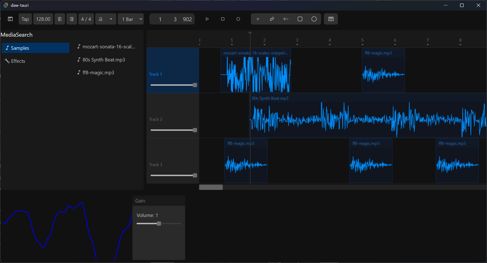
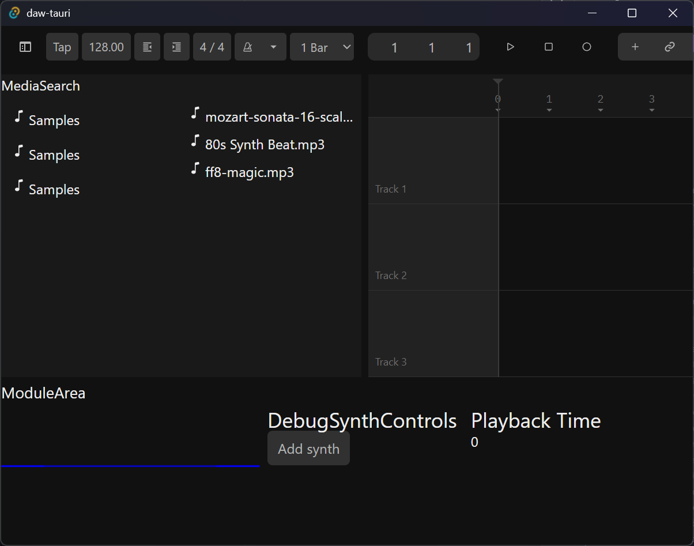
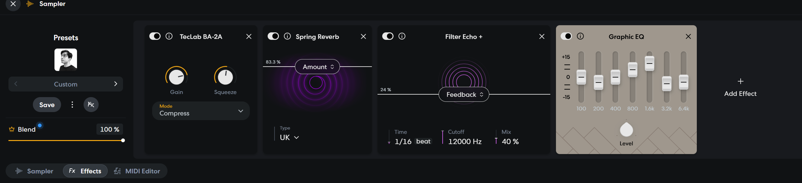

I decided to treat myself recently by giving myself time to work on an old side project - the Rust DAW. When we last left off, I had created a low level audio engine that could play samples or a synthesizer. The UI was pretty simple, it just rendered samples as waveforms, displayed the current playback time, and shows a debug waveform for the output signal. A solid start, yet so much missing to make it a true DAW.

In this round I decided to focus on making it functional more practically like a real DAW. Multi-track composition with clips and effects. Sample accurate playback. The basic bread and butter of audio production.

In this blog I’ll break down how you’d add a “timeline” to a DAW and how it works on the frontend and backend. From dragging and dropping clips onto tracks, to storing and syncing data with audio thread, I’ll cover every step of the way.

> Interested in checking out the source code? You can [find it on GitHub](https://github.com/whoisryosuke/daw-tauri/).

# Overview

Let’s take a look at the app first and see what I made to understand how we’ll get there.

Here’s where we were last update - most of the UI was “mocked” (not functional) and you could press the play button to start a single, hardcoded sample or add a virtual synth that never stopped:


The initial version of the DAW with a lot of placeholder UI and debug widgets. It has a top navigation bar with lots of buttons like playback controls or an arrangement timer. Underneath is a split view with media library on left and a timeline on right. Below is a module area with different debug modules like a playback time.

And here’s what the app looks like now - multi-track composition with drag an drop clips, FX chain for each track, and plenty of bells and whistles for UX purposes:



The second version of the DAW with a more developed timeline area. The module area now has a Gain module attached to the first track, which appears selected with a blue background in it’s control area.

The main changes should be pretty visually clear. The timeline got a complete design overhaul. There’s time markers now to understand placement, along with a “playhead” line to keep track of current position. Each track has a control area with a volume slider. And the audio clips got a little face lift.

> 💡 I also switched from using Radix to Panda CSS. I didn’t like some the Radix defaults, and I found it hard to customize to a place where I like it. Using Panda CSS feels so much faster, despite doing a bit of up-front work creating UI primitives. Though combined with Base UI and using an LLM to convert the Tailwind examples to Panda CSS as a basis - it wasn’t too bad.

# Architecture

If you followed along with the previous blog, you’ll know that we’re working with, but to recap a bit — this app is built with Tauri and ReactJS on the frontend. The Rust backend connects directly to the user’s speakers and outputs audio (like music samples). The React frontend acts as a DAW, or “digital audio workstation”, where the user can drag and drop audio clips into various tracks on a timeline and playback the results.

I know what you’re thinking, why not just use the **Web Audio API** if I’m already using a **WebView**? Well the point of this app is to try and build a low level DAW which isn’t completely possible using the web API. I could build a lot of the features of a DAW on the web, but when it comes to using **VSTs** or plugins that user has installed on their PC, I wouldn’t be able to leverage them. Not to mention the inherent latency that comes with using JavaScript and the browser to handle audio playback.

Using Rust, I’m able to build a DAW on the level of apps like Fruity Loops or Ableton, with all the same features if I’m feeling adventurous enough.

> 💡 If you’re interested in understanding how audio playback works on a low level, check out the previous blog where I break down the architecture of the audio playback system, from the engine to the nodes to the thread-safe messaging system to send data from Tauri to the RT audio thread.

So let’s break down some big changes to the existing architecture that make way for our multi-track composition.

## Audio Graph vs Linear FX Chain

Initially I had sketched out an architecture using an audio graph. It felt natural, since I had been working a lot with the Web Audio API and that works as a giant graph.

```rust
pub struct AudioGraph {
    nodes: Vec<AudioNodeTypes>,
    // Source Node -> Target Node
    connections: Vec<(usize, usize)>,
}

impl AudioGraph {
    pub fn new() -> Self {
        Self {
            nodes: Vec::new(),
            connections: Vec::new(),
        }
    }

    pub fn add_node(&mut self, new_node: AudioNodeTypes) -> usize {
        self.nodes.push(new_node);
        self.nodes.len() - 1
    }

    pub fn connect(&mut self, from: usize, to: usize) {
        self.connections.push((from, to));
    }

    fn get_evaluation_order(&self) {
        let graph: HashMap<usize, Vec<usize>> = HashMap::with_capacity(self.nodes.len());
        let incoming_connections: HashMap<usize, usize> = HashMap::with_capacity(self.nodes.len());

    }

    pub fn process(&mut self, input: &[f32], output: &mut [f32], params: f32) {
        // Get node order
        let nodes = self.get_evaluation_order();
    }
}
```

Although in this particular case, I didn’t really need it. A graph becomes useful when a node needs to “connect” to more than 1 other node — like creating an oscillator that can power multiple LFOs. If we were building something like [Max for Live](https://www.ableton.com/en/live/max-for-live/) (where you have actual nodes that connect to/from each other), it’s make more sense.

In my case, I’m looking to build something more like the composition mode in Ableton or timeline-based DAWs like [GarageBand](https://www.apple.com/mac/garageband/), [Soundtrap](https://www.soundtrap.com/musicmakers), or [BandLab](https://www.bandlab.com). Users will be able to lay down audio clips in a track inside the timeline, then apply effects to each track.


Example of multi-track composition in GarageBand with a list of tracks representing various devices like a virtual instrument or microphone input. Each track has audio clips with waveforms or MIDI sequences, colored to correspond with each track’s set color.

With this kind of setup, it’s actually rather simple in implementation. Each track is an array of clips with different “start times”, and effects are just a stack that we apply one by one sequentially (usually left to right).

Instead of having a complex graph and needing to evaluate it in the callback, we can just loop over things linearly (loop over the tracks, then loop over the track clips, then loop over FX — just mapping over the arrays in memory).

```rust
pub struct MixerTrack {
    current_node: usize,

    nodes: Slab<AudioNodeTypes>,
    fx: Slab<EffectNodeTypes>,

    /// Scratch buffer to do track-specific operations on signal
    process_buffer: Vec<f32>,
    gain: f32,
}

impl MixerTrack {
    pub fn new(buffer_size: usize) -> Self {
        let nodes = Slab::with_capacity(MAX_NODES);
        let fx = Slab::with_capacity(MAX_NODES);
        let process_buffer = Vec::with_capacity(buffer_size);

        Self {
            current_node: 0usize,
            nodes,
            fx,
            process_buffer,
            gain: 1.0,
        }
    }
}

/**
 * Queue of audio to play in the form of `AudioNode`s.
 * Plays each audio node sample by sample until they're finished, then removes them.
 * The queue is controlled by `AudioCommand`s
 */
pub struct Mixer {
    tracks: [MixerTrack; 20],
    playing: bool,
}
```

Because this lives on the audio backend, we also need to be strict about memory allocation. That’s why the `tracks` are a limited array of 20 `MixerTrack` that are pre-allocated.

Later I end up using a memory pooling library called [slab](https://docs.rs/slab/latest/slab/) to handle pre-allocation, and for the process buffer we pre-allocate based on the user’s buffer preferences (ranging from 256, 512, and higher ranges) — although later you’ll see this array will get sliced down to the “block” size of the audio callback (aka the length of the `output` which can vary each iteration).

## Backend vs Frontend

Since we’re using Tauri and doing work in Rust and TypeScript, we’ll need 2 sets of types, one for each language. So there will be a `Composition` struct in the Rust backend that will store very similar data to the frontend’s `CompositionData` type. The app keeps most data synced between the frontend and backend when either makes changes.

However, there’s a difference between the two. They each have their own specific needs. The backend only needs to be concerned with things that involve the audio backend. The frontend might store data the backend never needs to see (since it’s visual). For example, if the user sets the app to dark or light mode the backend doesn’t ever need to know. This means there will be a difference between the two types, despite them being the same “name”.

## Composition, Tracks, and Clips

If we want to have a timeline in the app, we’ll need a few new data types. From a `Composition` that stores overall timeline data (like it’s zoom), to a `Track` that will own `Clip` data. Let’s dive into those.

The first type we’ll need is a `Composition`. This will contain generic data about the timeline area, like how much the user want’s the zoom in or out of the timeline.

```tsx
export type CompositionData = {
  // Start and end range for the composition area (and all tracks inside)
  range: [number, number];
  zoom: number;
};
```

Then we need some tracks inside our timeline, so let’s make a `Track`. Nothing fancy here, we just need each track to have a unique ID (I’ll cover that later). And the track can have a custom name, so the user can rename it as needed to help them organize their composition.

```tsx
export type TrackData = {
  id: string;
  name: string;
  muted: boolean;
};
```

Here’s a good example of the Rust difference, here’s what the Track looks like in the backend:

```rust
#[derive(Clone, Serialize, Deserialize)]
pub struct Track {
    pub name: TrackId,
    /// Index for corresponding MixerTrack on RT thread
    pub pool_index: usize,
    pub muted: bool,
    pub gain: f32,
}
```

You can see it’s basically 1:1, but we have a `pool_index` in the backend we need for the Track. We use this to store the tracks position in the mixer “pool” (an array of pre-allocated slots). And we also store a `gain` in the backend which is stored locally on each track in the app (since we don’t need to access a track’s volume outside of it).

Inside each track we’ll want to have “clips” that represent our sound data, whether it’s a MP3 sample or a MIDI sequence. This will be covered by a `TrackClip` type. This lets us know where the clip is placed on a track (`start_time`) or if it’s muted (`enabled`).

```tsx
export type TrackClipType = "Sample" | "Synthesizer";

export type TrackClipData = {
  id: string;
  track_id: string;
  track_clip_type: TrackClipType;
  clip_id: string;
  start_time: number;
  enabled: boolean;
};
```

But what if the user adds the same sample multiple times to the timeline? We don’t want our `TrackClip` to duplicate the sound data each time. So we’ll need a place to store the audio data, separate from it’s association to the track, and we can just call them `Clip`.

```tsx
export type ClipType = "Sample" | "Midi";

export type Clip = {
  id: string;
  name: string;
  duration: number;
  type: ClipType;

  /**
   * The ID of the associated clip type (e.g. id of sample in cache)
   */
  clip_id: string;
};
```

You’ll notice that we don’t store any audio buffers here. This is because the frontend doesn’t ever need the buffer information (kinda). The backend is responsible for playing the audio, so it manages the audio buffers. And like I mentioned before, it’s also different types of clips (audio file vs MIDI), so we wouldn’t store data here.

For audio files, I have a `AssetStore` in the backend that contains a `HashMap` of `MediaAsset` that we can access using the `clip_id` from the Clip.

```rust
#[derive(Clone, Serialize)]
pub struct MediaAsset {
    name: String,
    path: String,
    duration: f64,
}

pub struct AssetStore {
    assets: Mutex<HashMap<String, Arc<MediaAsset>>>,
}
```

But this only an “asset”, which could be a music file or MIDI sequence. We need a way to store audio specific data, so we’ll create one more data store in the backend called the `AudioCache` that holds our `AudioBuffer` with the audio data and essential metadata.

```rust
pub struct AudioBuffer {
    pub samples: Arc<Vec<f32>>,
    pub sample_rate: u32,
    pub channel_count: usize,
}

impl AudioBuffer {
    pub fn new(samples: Vec<f32>, sample_rate: u32, channel_count: usize) -> Self {
        Self {
            samples: Arc::new(samples),
            sample_rate,
            channel_count,
        }
    }
}

/// The filename of the audio sample
type AssetId = String;

/// Cache for audio buffers that are loaded to disk and associated with an audio file (aka `MediaAsset`).
pub struct AudioCache {
    buffers: Mutex<HashMap<AssetId, Arc<AudioBuffer>>>,
}
```

> 💡 Keen readers will notice that I’m structuring the data model like I would a relational database, where a certain data type might relate to another one (like a `TrackClip` having a `track_id` to associate it with a particular `Track`). It allows me to update things quickly and keep data in it’s own place. Tracks don’t need to know about the clips inside them, just vital data like their own name - or their specific gain. This also keeps updates smaller across the app, so something that uses track data doesn’t update every time a track clip updates.

And for all these types in the frontend, I have a data store using Jotai:

```tsx
// All the "tracks" in the app. We can loop over this in our timeline.
export const tracksAtom = atom<TrackData[]>([]);
```

I think I covered most if not all the types. As you can see, there’s a lot of structure to this setup.

# The frontend

Now that we’ve gotten sufficiently lost in writing types, like do some actual UI work to see something. We’re building a timeline, so we need a couple things: a media browser with assets to drag into our timeline, and the timeline itself.

## Structure

### Media Browser

I had this mostly roughed out in the app already, so there wasn’t much to do there. I have a `<MediaBrowser>` component that’s similar to the media library in Ableton. There’s 2 columns, the left are “categories” / folders and the right are items from the selected category/folder. I only have 2 categories at the moment: **Samples** and **Effects**.

```tsx
/**
 * This is the list of buttons in the media browser that
 * act as the "categories" for other items.
 */
export const MEDIA_BROWSER_CATEGORIES_LIST: Record<string, ListItemData> = {
  samples: {
    title: "Samples",
    icon: "samples",
  },
  effects: {
    title: "Effects",
    icon: "effects",
  },
};
```

When samples are selected that lists the assets from the `AssetStore` (the Rust backend). Assets are preloaded in the backend when the app initially loads, then the frontend requests a list of all the assets using a Tauri handler (kinda like a backend API endpoint).

```tsx
const MediaSampleList = (props: Props) => {
  const [assets, setAssets] = useState<MediaListItemDraggableProps[]>([]);

  // Get assets from Rust backend
  const fetchAssets = async () => {
    const newAssets = (await invoke("get_assets")) as Omit<MediaBase, "id">[];
    console.log("new assets", newAssets);

    const newMediaList = newAssets.map(
      (newAsset) =>
        ({
          title: newAsset.name,
          id: newAsset.path,
          icon: "samples",
          data: {
            type: "Sample",
            duration: newAsset.duration,
          },
          dragType: "CLIP",
        }) as MediaListItemDraggableProps,
    );

    setAssets(newMediaList);
  };

  useEffect(() => {
    fetchAssets();
  }, []);

  return (
    <Stack>
      {assets.map((listItem) => (
        <MediaListItemDraggable key={listItem.id} {...listItem} />
      ))}
    </Stack>
  );
};
```

Nothing too wild here. For effects they’re all pre-baked constants instead of fetching data. I use a shared Media type `MediaBase` that’s shared between all of the union types, this way I can guarantee certain props between them all - like a `name` or `id`.

### Timeline

The timeline was a bit more of a beast to tackle.

It all starts with the `<Composition>` component. This handles rendering all the tracks, and any other bits and bobs (like the time markers and playhead that shows user current time).

The big thing with this component was having to measure a width for the timeline. Most timelines in audio and video apps scroll horizontally a bit, allowing the user to place clips in a large region (and even “zoom” in and out if needed). In the composition store we have a `zoom` and `range` that we use to calculate the width of the timeline. The more the user zooms, the bigger the width. Or the less range in the timeline, the less width required.

```tsx

const Composition = (props: Props) => {
  const { zoom, range } = useAtomValue(compositionAtom);
  const timelineDistance = range[1] - range[0];
  const width = zoom * TIMELINE_DEFAULT_SPACING * timelineDistance;
```

We need to loop over the `Track` store and render each track as a row. Inside that, we need to find all the `TrackClip` associated with that `Track` and render those.

```tsx
const Tracks = ({ containerWidth }: Props) => {
  const tracks = useAtomValue(tracksAtom);

  return (
    <Stack width="100%" gap={0}>
      {tracks.map((track) => (
        <TrackComponent key={track.id} {...track} width={containerWidth} />
      ))}
    </Stack>
  );
};
```

And inside each of those, we need to figure out what type of clip to render (like a waveform for audio or a piano roll for MIDI). The finally we need to grab that “asset” from the correct store - usually audio in our case.

```tsx
const TrackClip = ({
  id,
  clip_id: clipId,
  start_time: startTime,
  enabled,
  width,
}: Props) => {
  const { range } = useAtomValue(compositionAtom);
  const clips = useAtomValue(clipsAtom);
  const currentClip = clips.find((clip) => clip.id == clipId);

  if (currentClip) {
    let ClipComponent: TrackClipComponent = DefaultClip;
    switch (currentClip?.type) {
      case "Midi":
        ClipComponent = MIDISequenceClip;
        break;
      case "Sample":
        ClipComponent = SampleClip;
        break;
    }
    const x = mapRange(startTime, range[0], range[1], 0, width);
    const clipWidth = mapRange(
      currentClip.duration,
      range[0],
      range[1],
      0,
      width,
    );

    return (
      <ClipContainer trackId={id} {...currentClip} x={x} width={clipWidth}>
        <ClipComponent {...currentClip} width={clipWidth} />
      </ClipContainer>
    );
  }
  return <div>Clip error</div>;
};
```

Each track also needs to have controls associated with it so the user can do tasks like muting or lowering the volume of a specific track. We also need a place to be able to add new tracks - so if they right click on the area beneath the last track control they’ll open a popup menu with different track types to add.

```tsx
const TrackControls = (props: Props) => {
  const [tracks, setTracks] = useAtom(tracksAtom);
  const selectedTrackId = useAtomValue(selectedTrackAtom);
  const currentMidiTrack = useAtomValue(playMidiTrackAtom);

  const handleAddAudioTrack = () => {
    addTrack("Audio", "Sample");
  };

  const handleAddMIDITrack = () => {
    addTrack("MIDI", "Midi");
  };

  const renderItems = tracks.map((track) => (
    <TrackControl
      key={track.id}
      selected={selectedTrackId == track.id}
      playMidi={currentMidiTrack == track.id}
      {...track}
    />
  ));

  // A right click menu to add tracks
  const contextMenuItems: ContextMenuItem[] = [
    {
      icon: <FaFileAudio />,
      title: "Add Audio Track",
      onClick: handleAddAudioTrack,
    },
    {
      icon: <PiPianoKeys />,
      title: "Add MIDI Track",
      onClick: handleAddMIDITrack,
    },
  ];

  return (
    <Stack gap={0}>
      {renderItems}
      <ContextMenu
        items={contextMenuItems}
        triggerClass={css({ bg: "gray.2" })}
      />
    </Stack>
  );
};
```

### Playback Time

And that doesn’t even cover the “playhead”, the line that marks the current playback time. We need a way for the user to keep track of their position on the timeline. I tried a couple implementations using no animation, CSS transitions, and then finally settled on MotionJS for the performance (since the component updates so frequently).

```tsx
const PlaybackHead = ({ containerWidth }: Props) => {
  const animationRef = useRef<ReturnType<typeof requestAnimationFrame>>(null);
  // The current time synced from DAW backend
  const { getTime } = usePlaybackTime();
  const { range } = useAtomValue(compositionAtom);
  const classes = styles();
  const x = useMotionValue(0);
  // TODO: Create global state of play/pause
  const isPlaying = true;

  // Map the time (in seconds) to a horizontal position on timeline
  const translateX = useTransform(x, [range[0], range[1]], [0, containerWidth]);

  const animate = () => {
    const time = getTime();

    x.set(time);

    animationRef.current = requestAnimationFrame(animate);
  };

  useEffect(() => {
    if (isPlaying) {
      animationRef.current = requestAnimationFrame(animate);
    } else {
      if (animationRef.current) cancelAnimationFrame(animationRef.current);
    }
    return () => {
      if (animationRef.current) cancelAnimationFrame(animationRef.current);
    };
  }, [isPlaying]);

  return (
    <motion.div className={classes.container} style={{ x: translateX }}>
      <div className={classes.line} />
      <div className={classes.marker}>
        <VscTriangleDown />
      </div>
    </motion.div>
  );
};
```

> 💡 This uses a `usePlaybackTime()` hook that gets the latest time from the Rust backend. I covered this process [in the previous article](https://whoisryosuke.com/blog/2026/creating-a-daw-in-rust/) if you’re interested how time is tracked in this system.

Along with the playhead, we’ll also need to have a section on top with time markers incrementing from left to right. Our `Composition` store will contain a “range” that lets us know the start/end of the composition (it defaults to 0 to 100 seconds). The `precision` determines how many points we’ll create along the timeline. Since our range is 100 seconds, we do 100 to have 100 “ticks” on our “time ruler”.

```tsx
const TimeMarkers = ({ containerWidth, precision = 100 }: Props) => {
  const { range } = useAtomValue(compositionAtom);

  const markers = new Array(precision)
    .fill(0)
    .map((_, index) => (
      <TimeMarker>
        {Math.round(mapRange(index + 1, 0, precision + 1, range[0], range[1]))}
      </TimeMarker>
    ));
  return (
    <div className={containerStyle} style={{ width: containerWidth }}>
      <TimeMarker>{range[0]}</TimeMarker>
      {markers}
      <TimeMarker>{range[1]}</TimeMarker>
    </div>
  );
};
```

> 💡 To really step this up, you could also visualize a musical grid behind the composition that helps the user align their clips to bars and beats (instead of just time). We’ll calculate some musical time soon which measures not in seconds, but in bars + beats + ticks. Using that data you could a lot - like render this grid - or add a “snap to grid” mode where clips align to beats or bars.

With this, we have a media browser with a list of clips, and a multi-track timeline alongside it where our audio clips will eventually live.



> 💡 There’s a few minor components and styling things I didn’t cover, feel free to check out the source code to see everything in greater detail. As you can imagine, I had at minimum a component for every data type so it was a lot.

## Drag drop clips

With all of our blocks in place, lets make them interact with each other now. The first interaction we’ll tackle is adding a clip to the timeline. The user will grab a sample from the media browser and drag it onto the track they want to add it to. And ideally, wherever the user drags it - they’ll want it to drop in that exact spot.

For drag and drop, I usually go with [React DnD](https://react-dnd.github.io/react-dnd/about), but I’ve been using [dnd kit](https://dndkit.com/) more in my newer projects. It’s a bit simpler to setup, albeit at the exchange of an almost too simplistic API.

Let’s start with the draggable object: the media browser clip. This uses the `useDraggable` hook and applies all the necessary properties to the underlying element. In my case, this is a “wrapper” component around the `<MediaListItem>` ”presentational” component (separating the drag and drop logic from all the DOM and styling logic).

```tsx
const MediaListItemDraggable = ({
  dragType = "CLIP",
  data,
  style,
  ...props
}: MediaListItemDraggableProps) => {
  const { attributes, listeners, setNodeRef, transform } = useDraggable({
    id: `${dragType}_${props.id}`,
    data: {
      data,
      id: props.id,
      name: props.title,
      action: dragType,
    } as MediaBrowserDragData,
  });
  const transformStyle = {
    transform: CSS.Translate.toString(transform),
  };
  const combinedStyled = {
    ...transformStyle,
    ...style,
  };

  return (
    <MediaListItem
      ref={setNodeRef}
      style={combinedStyled}
      {...listeners}
      {...attributes}
      {...props}
    />
  );
};
```

The most important thing to note here is the `id` we pass. This needs to be a unique ID for each object. But as we’ll see later, it’s also essential for distinguishing what is being dropped where. To make our lives easier, we prefix the ID with the type of object we’re dragging (a `CLIP` in this case - but maybe we’ll have an `EFFECT` later).

These “types” were defined as a constant to keep track across the app:

```tsx
export const DRAG_TYPES = {
  // This could be a sample, MIDI notes, etc. Represents something that goes into Track.
  CLIP: "CLIP",
  // Something applied to a clip in a track
  EFFECT: "EFFECT",
  // An existing track clip inside a track, likely being moved
  TRACK_CLIP: "TRACK_CLIP",
} as const;

export type DragTypes = keyof typeof DRAG_TYPES;
export type MediaBrowserDragTypes = Exclude<DragTypes, "TRACK_CLIP">;
```

And we also need to pass `data` when the user drags the clip, that way when we drop it, we can know what clip it was (using the `id`) and get any other quick data for processing (so we don’t have to fetch it from the store).

Now we can setup a place for the clips to drop — the `<Track>`. We’ll just take out existing component and slap a `useDroppable` hook on it, and make sure it’s ID is prefixed with `TRACK` so we know where the clip is dropping.

```tsx
const Track = ({ id, name, trackType, width }: Props) => {
  const [trackClips, setTrackClips] = useAtom(trackClipsAtom);
  const localClips = trackClips.filter((trackClip) => trackClip.track_id == id);

  const { isOver, setNodeRef } = useDroppable({
    id: `TRACK_${id}`,
    data: {
      id,
      trackType,
    },
  });

  return (
    <Stack
      width="100%"
      position="relative"
      flexDirection="row"
      className={containerStyle}
    >
      <Stack
        ref={setNodeRef}
        flex={1}
        position="relative"
        bg={isOver ? "gray.2" : "transparent"}
      >
        {localClips.map((trackClip) => (
          <TrackClip key={trackClip.id} {...trackClip} width={width} />
        ))}
      </Stack>
    </Stack>
  );
};
```

Now if the user drags a clip to the track, we can see it light up…but nothing happens. This is because we need to setup a `<Provider>` to wrap our drag and drop area, as well as provide a callback when the drop happens.

```tsx
const Providers = ({ children }: PropsWithChildren<Props>) => {
  const handleDragEnd = (event: DragEndEvent) => {
    console.log("item dragged!!", event);

    if (!event.over) {
      console.log("Error dragging, no target specified");
      return;
    }

    // Get the ID of the "drop" element (aka our Track in this case)
    let overId = event.over.id.toString();

    if (overId.startsWith("TRACK_")) {
      let trackData = event.over.data.current as TrackDragEvent;

      // The draggable element's "initial" position
      const activeRect = event.active.rect.current.initial;
      if (!activeRect) return;
      const containerRect = event.over.rect;

      // Get the final position of drag element after dragging
      const finalRect = event.active.rect.current.translated;
      if (!finalRect) return;
      let item = event.active.data.current as BaseDragData;
      switch (item.action) {
        // Handle creating a new track clip and adding to track
        case "CLIP": {
          // Clips only allowed on audio tracks
          if (trackData.trackType != "Sample") return;

          // Drop point should match the cursor position exactly
          const mediaBrowserDragData = event.active.data
            .current as MediaBrowserDragData;
          const activeRect = event.active.rect.current.initial;
          if (!activeRect) return;

          // The mouse click position
          const pointerEvent = event.activatorEvent as
            | PointerEvent
            | MouseEvent;
          const grabOffsetX = pointerEvent.clientX - activeRect.left;
          const grabOffsetY = pointerEvent.clientY - activeRect.top;

          const pointerX = finalRect.left + grabOffsetX;
          const pointerY = finalRect.top + grabOffsetY;

          const relativeX = pointerX - containerRect.left;
          const relativeY = pointerY - containerRect.top;

          const dragPosition: DragPositionData = {
            x: relativeX,
            y: relativeY,
            width: containerRect.width,
          };
          addClipToTrack(trackData.id, mediaBrowserDragData, dragPosition);
          break;
        }
      }
    }
  };

  return <DndContext onDragEnd={handleDragEnd}>{children}</DndContext>;
};
```

There’s a bit of math there, but it essentially determines where we start and end when we drag based on the mouse position (since we expect the clip to be exactly where we drop — not based on the edge of the draggable clip).

With our media and drag data, we can use that to add the clip to the track:

```tsx
export const addClipToTrack = async (
  id: string,
  item: MediaBrowserDragData,
  dragPosition: DragPositionData,
) => {
  // Create a clip if necessary
  const clip = await getOrCreateClip(item);
  if (!clip) return;

  // Calculate the start time based on drag placement
  const startTime = calculateStartTimeFromDrag(dragPosition);

  // Create a track clip using the ID of cache
  const newId = generateSimpleHash();
  const newTrackClip: TrackClipData = {
    id: newId,
    track_id: id,
    track_clip_type: "Sample",
    clip_id: clip.id,
    start_time: startTime,
    enabled: true,
  };
  console.log("created new clip", newTrackClip);

  // Send to Rust backend
  const { track_id: trackId, ...track_data } = newTrackClip;
  invoke("add_track_clip", { trackId: id, trackData: track_data });

  // Mark track as selected
  setSelectedTrack(trackId);

  // Add to store
  store.set(trackClipsAtom, (prev) => [...prev, newTrackClip]);
};
```

Of course, it requires a bit more music time math. We convert dimensions (aka the drop position horizontally on the timeline) to a time in seconds on the timeline.

```tsx
function calculateStartTimeFromDrag(dragPosition: DragPositionData) {
  // Get composition range
  const [start, end] = store.get(compositionAtom).range;

  const startTime = mapRange(dragPosition.x, 0, dragPosition.width, start, end);

  return startTime;
}
```

And with that, we have some clips dropping on the timeline.

If we wanted to move them around, we just need to create another check in our drag and drop callback for “track clips” on a “track”, and update it based on the clips drop position:

```tsx
// Handle moving an existing clip
case "TRACK_CLIP": {
  // We want the clip's own top left edge, not the cursor position.
  // So we just check distance between the two corners (final drag position + container).
  const trackClipData = event.active.data.current as TrackClipDragData;

  const relativeX = finalRect.left - containerRect.left;
  const relativeY = finalRect.top - containerRect.top;

  const dragPosition: DragPositionData = {
    x: relativeX,
    y: relativeY,
    width: containerRect.width,
  };
  moveTrackClip(trackData.id, trackClipData, dragPosition);
  break;
}
```

The math here is a bit simpler, since we don’t need to care about where the user’s mouse is, we only care about where the clip dropped and lined up according to it’s left side.

And if we want to update data in the backend, we need to create an API endpoint for it called `update_track_clip_time`. I won’t share the code cause this article’s pretty verbose as it is, but hopefully you get the idea. We’ll cover backend APIs later.

# The backend

Now that the frontend is scaffolded out, let’s work on the backend systems, like where the composition data is stored and how it actually gets played.

## Backend data store

This one was probably one of the simpler parts thanks to Tauri. I mentioned earlier all the data types in the frontend are reflected in the backend (technically, the other way around). So the `Composition` data is stored in a `CompositionStore` in the backend, along with all the `Track` and `TrackClip` data.

When the Tauri app initializes we create our store- just like we do with our audio cache and asset store:

```rust
#[cfg_attr(mobile, tauri::mobile_entry_point)]
pub fn run() {
    tauri::Builder::default()
        .plugin(tauri_plugin_prevent_default::init())
        .setup(|app| {
            // Setup additional global state
            // Create the asset store to contain any samples cached in memory
            let mut audio_cache = AudioCache::new(Mutex::new(HashMap::new()));
            let mut asset_store = AssetStore::new(Mutex::new(HashMap::new()));
            let composition_store = Mutex::new(CompositionStore::new());
```

The big thing to note here is the required use of `Mutex` for data we need to update. This ensures we can access the data in our Tauri commands and inside other services (like the audio messaging service that handles queuing up audio nodes).

## Syncing data

Since the backend has all the data, and the frontend reads it and manipulates it — we need to create a REST-like API so we can do CRUD operations (like creating a new clip, updating clips, etc).

```rust
#[tauri::command()]
pub async fn add_clip(
    composition_store: State<'_, Mutex<CompositionStore>>,
    clip_id: String,
    clip_data: Clip,
) -> Result<bool, String> {
    let store_result = composition_store.lock();

    if let Ok(mut store) = store_result {
        store.clips.insert(clip_id, clip_data);
        return Ok(true);
    }

    Err("Couldn't lock composition store".to_string())
}
```

As you can imagine, there are quite a few commands for handling all the operations for all the data types:

```rust
.invoke_handler(tauri::generate_handler![
    get_output_devices,
    change_audio_device,
    play_audio,
    stop_audio,
    add_synth,
    get_sample_rate,
    get_assets,
    get_sample_waveform,
    // Composition
    reset_composition,
    set_midi_track_as_playable,
    add_track,
    update_track_gain,
    add_track_effect,
    update_track_effect,
    add_track_clip,
    update_track_clip_time,
    update_track_clip_range,
    update_midi_track_clip,
    add_clip,
])
```

It takes a bit of time to setup, but since we have a such a bespoke system with strict requirements, it works better than using an out of the box solution. And writing the API in Rust creates a strict contract that could easily be translated later to TypeScript to save time.

## Mixer tracks

The mixer is getting an upgrade, it’s going to look like one of those parking lots filled with busses - cause we’re going to add different tracks to our mixer (aka “audio bus”).

> 💡 In apps like Ableton, each track gets it’s own “bus” so it’s processed separately, but they use the term “bus” to represent [virtual buses](https://help.ableton.com/hc/en-us/articles/209774225-Setting-up-a-virtual-MIDI-bus) you can create to merge tracks together. It’s a similar concept, but not exactly what we’re doing here. That’d be like a v2 of this.

With our new `MixerTrack` I described above, we can update our `Mixer` to use this instead of our `AudioNodeTypes` directly. We loop over each track in our `process()` method:

```rust

pub struct Mixer {
    tracks: [MixerTrack; 20],
    // Other props omitted for clarity
}

impl Mixer {
    pub fn process(
        &mut self,
        output: &mut [f32],
        channels: usize,
        sample_rate: u32,
        consumer: &mut Receiver<AudioCommand>,
        waveform_producer: &mut Sender<f32>,
        playback_time: Arc<AtomicU64>,
    ) {
        let buffer_size = output.len();

        // Process all nodes (aka play audio, apply effects like gain, etc)
        // First we loop through each "track" and run processing locally
        for track in self.tracks.iter_mut() {
```

Then a lot of the logic looks similar to before, we loop over audio nodes and “play” them by running their `process()` method. But we do something a bit different this time:

```rust
// If needed, resize scratch buffer. Minimal allocation, only happens once per device.
if buffer_size > track.process_buffer.len() {
    track.process_buffer.resize(buffer_size, 0.0);
}

// Grab a slice of our track's process buffer that matches current output length
// This lets us have a larger buffer to accomodate varying output/block size
let mut scratch_buffer = &mut track.process_buffer[..buffer_size];

// Reset buffer to prevent accumulation
scratch_buffer.fill(0.0);
```

We create a **scratch buffer** for each mixer track. This allows us to “play” only the track’s clips inside, then run the track’s effects on it. If we didn’t have this and we tried to use the audio output buffer, we’d apply our effects on every previous track too. We need a separate space to work on them before merging them in.

And like I mentioned earlier, the “block” size (aka the current output buffer length) may differ from each callback, so we take a slice of our scratch buffer. And if it’s not big enough, we expand it — but ideally, we pre-allocate it with enough space that this never happens (or at least only once).

We also need to fill it with `0.0` every loop, because we don’t want to have any audio from the previous “block” there (or it’d sound like a “delay” node or something).

Now we can run our effects on the scratch buffer. I’ll cover how these work later, though for now, you can safely assume they work just like an audio node (take a buffer and maybe write to it).

```rust
// Then I need to loop over fx and provide result from above
for (fx_id, fx) in track.fx.iter_mut() {
    fx.process(&mut scratch_buffer, current_time);
}
```

And handle if the user changes the track volume:

```rust
// Any final track operations (e.g. track-based gain)
if track.gain < 1.0 {
    for sample in scratch_buffer.iter_mut() {
        *sample *= track.gain;
    }
}
```

Then we combine the scratch buffer into the output finally:

```rust
// Then we combine (or "mix") all the signals together
for (i, sample) in scratch_buffer.iter().enumerate() {
    output[i] += *sample;
}
```

And with that, we can have multiple clips playing at once from different tracks we can separately control (instead of one giant array for audio nodes that play sequentially).

## Press play

What happens when the user presses play? How do we take the timeline data (tracks, clips, etc) and convert that to audio node that actually “play”? We can tap into the existing systems we have built - like the audio messaging service.

We already have a Tauri command called `play_audio()` that handles playing audio. We’ll update the existing `play()` method on the `AudioEngineMessaging` service to take the `CompositionStore` and `AudioCache` as parameters.

```rust
/// Play the composition.
/// Loops through all tracks and queues track clips as audio nodes.
pub fn play(
    &self,
    composition: &CompositionStore,
    asset_store: &AudioCache,
    sample_rate: u32,
    channel_count: usize,
) {
    println!("Playing timeline audio");

    // Queue up clips to play
    // Loop through each track in the composition
    for (track_id, track) in composition.tracks.iter() {
        // TODO: Check if track is muted - don't add if so
        println!("Playing timeline track {}", track.name);

        // Grab clips inside that track (tecnically clip "references" by ID)
        let Some(track_clips) = composition.track_clips.get(track_id) else {
            println!("Couldn't load the track clips {}", track.name);
            continue;
        };

        println!("Got track clips {}", track.name);
        // Loop over each "track clip" then find actual audio clip
        for track_clip in track_clips {
            match track_clip.track_clip_type {
                TrackClipType::Sample => {
                    self.queue_sample(track, track_clip, composition, asset_store, sample_rate)
                }
                TrackClipType::Synthesizer => self.add_synth(track.pool_index),
            }
        }

        // Handle any effects
        let effects = composition
            .track_effects
            .iter()
            .filter(|(_, item)| &item.track_id == track_id);
        effects.for_each(|(_, item)| {
            println!("Creating effect node");

            self.send_command(AudioCommand::AddEffect(
                track.pool_index,
                item.effect.clone(),
            ));
        });
    }

    // Tell audio thread to start playing now that it has audio nodes
    self.send_command(AudioCommand::Play);
}
```

Just like the frontend, we loop over the composition store’s tracks, then each track’s clip. Then we pass that track clip data to another method called `queue_sample()` that handles creating the audio node and sending to the audio thread:

```rust
/// Create audio node from track clip using asset store data,
/// then add node to appropriate mixer track via audio command.
fn queue_sample(
    &self,
    track: &Track,
    track_clip: &TrackClip,
    composition: &CompositionStore,
    asset_store: &AudioCache,
    sample_rate: u32,
) {
    let Some(clip) = composition.clips.get(&track_clip.clip_id) else {
        println!("Couldn't get the clip {}", track.name);
        return;
    };
    let Some(clip_data) = asset_store.get_buffer_by_id(&clip.clip_id) else {
        println!("Couldn't get clip's asset from cache {}", track.name);
        return;
    };

    let start_time = seconds_to_frames(track_clip.start_time, sample_rate).unwrap_or(0);

    println!("Creating audio node {}", clip.name);

    self.create_sample_node(
        clip_data.samples.clone(),
        start_time,
        track.pool_index,
    );
}
```

This basically gets the “clip” associated with the “track clip”, then finds the audio buffer for that clip from the `AudioCache`. There’s also a little math here, because we store the clip’s `start_time` in seconds, we need to convert that to “frames” based on the current audio device’s `sample_rate`.

The rest works like before - the audio engine has a `playing` flag we change to `true` when the user presses play. Then when it loops, it’ll check for the audio nodes - except now they’re stored inside `MixerTrack`.

The most interesting bit is the `pool_index` on the `Track`. Because we have a pre-allocated array for our `MixerTrack`, and because each are kind of a reflection of each `Track`, and because our user can create or delete a `Track` dynamically — we need to keep track of which `MixerTrack` is the `Track` assigned to. We use a property called `pool_index` on the `Track` which stores the array index in the `Mixer` of the `MixerTrack`. When we “play” the composition and queue up audio nodes from the tracks, they get put in their appropriate `MixerTrack` using the `pool_index`. I think I currently just use an array, but later I’ll be swapping it out with the slab crate which handles creating a pre-allocated “pool” that I can add/remove from as needed (and get index back).

And with that, we have a `play()` method we can call from our frontend that queues up all the clips and effects across all our tracks and plays them.

> 💡 As you can imagine, queuing up the entire timeline and all the audio buffers into memory won’t scale for larger timelines and audio files. In the future, we’ll need to implement a “streaming” node to handle larger files, as well as an infinite loop that’ll run alongside our audio thread and handle queuing additional clips on-demand (as well as only queuing clips within a short “preloaded” window).

# Adding effects

## Audio vs Effect Nodes

Initially I had planned a different architecture that a bit more complex, and I rolled in audio and effect nodes together. To make things a bit simpler, I split the types up. Since effect nodes would only ever live in an “FX chain” alongside other effects, it makes more sense to just group them together (same with audio nodes in their own dedicated tracks).

The effect node trait looks very similar to an `AudioNode` (I might just merge these types over time if I don’t think of an effect-specific param):

```rust
/// Effect node that takes input data, processes it, and overrides the output
pub trait EffectNode {
    fn process(&mut self, output: &mut [f32], current_frame: u64);
}
```

Then when we want to create an effect node like a “gain” node, we create a struct for it called `GainNode` and then implement (`impl`) our `EffectNode` trait.

```rust
ive(Debug, Clone)]
pub struct GainNode {
    gain: f32,
    // pub disabled: bool,
}

impl GainNode {
    pub fn new(gain: f32) -> Self {
        Self { gain }
    }
    pub fn set_gain(&mut self, gain: f32) {
        self.gain = gain;
    }
}

impl EffectNode for GainNode {
    fn process(&mut self, output: &mut [f32], current_frame: u64) {
        for (i, sample) in output.iter_mut().enumerate() {
            *sample = *sample * self.gain;
        }
    }
}
```

And similar to the audio nodes, to avoid using a dynamically sized `Box<EffectNode>`, we leverage an `enum` to define all of our possible audio nodes (better for memory allocation):

```rust
#[derive(Clone)]
pub enum EffectNodeTypes {
    Gain(GainNode),
}

impl EffectNodeTypes {
    pub fn process(&mut self, output: &mut [f32], current_frame: u64) {
        match self {
            EffectNodeTypes::Gain(node) => node.process(output, current_frame),
        }
    }
}
```

And as we saw earlier when we made the `MixerTrack` and updated the `Mixer.process()` method - we just loop over these nodes and run `process()` like we do audio nodes. Nothing wild.

In our frontend, we also need to represent this data. I use Typescripts discriminated union technique to create a shared “base” type and then a specific type for each effect node:

```tsx
// Effects for tracks
export type GainData = {
  gain: number;
};
export type GainEffect = {
  effect: "gain";
  data: GainData;
};

export type PanData = {
  balance: number;
};
export type PanEffect = {
  effect: "pan";
  data: PanData;
};

export type BaseTrackEffect = {
  id: string;
  trackId: string;
};

export type TrackEffect = BaseTrackEffect & (GainEffect | PanEffect);
```

I also created a new separate store for the effects, this stores all effects across all tracks — with a `trackId` we can filter them by.

```tsx
export const trackEffectsAtom = atom<TrackEffect[]>([]);
```

## More systems

Before we can add effects to a track, we need a way to mark a track as selected. That way we can have an area that renders the effect modules for the selected track.

I created a Jotai store for storing the “selected” track’s ID.

```tsx
export const selectedTrackAtom = atom<string>("");
```

Then each `<Track>` component will get updated to add an `onClick` that updates this store with the clicked track’s ID.

```tsx

const Track = ({ id, name, trackType, width }: Props) => {
  const setSelectedTrackClip = useSetAtom(selectedTrackClipAtom);

  const handleClick = () => {
    console.log("track clicked");
    setSelectedTrackClip("");
  };
```

Then in our `<TrackControls>` when we loop over all the tracks, we can grab the selected ID, and check which one is selected:

```tsx

const TrackControls = (props: Props) => {
  const [tracks, setTracks] = useAtom(tracksAtom);
  const selectedTrackId = useAtomValue(selectedTrackAtom);

  const renderItems = tracks.map((track) => (
    <TrackControl
      key={track.id}
      selected={selectedTrackId == track.id}
      playMidi={currentMidiTrack == track.id}
      {...track}
    />
  ));

```

And of course, if it’s selected, we style it differently. This is pretty easy using Panda CSS. I create a class with variants (aka `cva`) along with a `selected` variant:

```tsx
const trackControlContainer = cva({
  base: {
    backgroundColor: "gray.3",
    minHeight: 125 + 4,
    display: "flex",
    justifyContent: "end",
    p: 2,
    borderBottomWidth: "1px",
    borderColor: "gray.5",
    color: "gray.9",
    borderStyle: "solid",

    _motionSafe: {
      transitionProperty: "background-color, color, border-color",
      transitionTimingFunction: "ease-in-out",
      transitionDuration: "slow",
    },
  },
  variants: {
    selected: {
      true: {
        backgroundColor: "blue.3",
        borderColor: "blue.5",
        color: "blue.9",
      },
    },
  },
});
```

Now when the user clicks a track, they can visualize it’s selected. And more importantly, we know which one they’re working on.

## Module Area

We know which track is selected, next we need a place to render the effects associated with it. In most DAWs, this is an area below the timeline where the effects stack horizontally in a “linear chain”.



The effects module area in BandLab with several effects stacked horizontally like a Filter Echo or Spring Reverb.

In my mockup, I had already created a slot for this area and populated it with debug modules (like a waveform). I tossed in an `<EffectModule>` that handles displaying the current track’s effects:

```tsx
import { useAtomValue } from "jotai";
import React, { JSX } from "react";
import {
  selectedTrackAtom,
  TrackEffect,
  trackEffectsAtom,
} from "../../../store/composition";
import GainModule from "./modules/GainModule/GainModule";
import { Stack } from "../../../../styled-system/jsx";

const EFFECT_MODULE_MAP: Record<
  TrackEffect["effect"],
  (props: TrackEffect) => JSX.Element
> = {
  gain: GainModule,
  pan: GainModule,
};

type Props = {};

const EffectModules = (props: Props) => {
  const selectedTrackId = useAtomValue(selectedTrackAtom);
  const allEffectTracks = useAtomValue(trackEffectsAtom);

  const effects = allEffectTracks.filter(
    (item) => item.trackId == selectedTrackId,
  );

  const render = effects.map((effect) => {
    const EffectComponent = EFFECT_MODULE_MAP[effect.effect];

    return <EffectComponent {...effect} />;
  });

  return (
    <Stack gap={2} flexDir="row">
      {render}
    </Stack>
  );
};

export default EffectModules;
```

I create a “map” of effect names as keys and it’s React component as the value, then when we loop over each effect, we check if it’s in the DB.

## Drag and effect

In order to drag and drop our effects on our timeline, it takes a few steps:

- Adding effects to the media browser
- Updating the drag and drop callback to handle our new effect use case

The media browser was fairly simple, I hardcoded a list of the effects into a constant file and then looped over those to create the menu items:

```tsx
export const EFFECT_LIST: Record<TrackEffect["effect"], EffectData> = {
  gain: {
    name: "Gain",
    data: {
      gain: 1.0,
    },
  },
  pan: {
    name: "Pan",
    data: {
      balance: 1.0,
    },
  },
};

// Massage the data into props for our drag and drop component
const EFFECT_LIST_ITEMS = Object.entries(EFFECT_LIST).map(
  ([id, newAsset]) =>
    ({
      title: newAsset.name,
      id,
      icon: "effects",
      data: {},
      dragType: "EFFECT",
    }) as MediaListItemDraggableProps,
);

type Props = {};

const MediaEffectList = (props: Props) => {
  return (
    <Stack>
      {EFFECT_LIST_ITEMS.map((listItem) => (
        <MediaListItemDraggable key={listItem.id} {...listItem} />
      ))}
    </Stack>
  );
};

export default MediaEffectList;
```

With that in place, I just needed to update the callback to accept the effects when the user dropped them onto a track. Luckily from the audio clip system we created earlier, we have all the data we need from the “drop target” (in this case, the track’s ID).

```tsx
// Handle dropping an new effect on a track
case "EFFECT": {
  console.log("[DND] User dropped an effect", item, trackData);
  const effectItem = event.active.data.current as MediaBrowserDragData;

  addEffectToTrack(
    trackData.id,
    effectItem.id as TrackEffect["effect"],
  );
}
```

The `addEffectToTrack` creates the effect data object, stores it in the frontend store, then syncs it to the Tauri backend.

# It’s that simple

Once you step away from an audio graph architecture and into a “linear FX chain”, it’s a much easier system to reason about. We’re just throwing things in arrays and looping over them. The only way it gets more complex is possibly ordering (like effects — ensuring they flow in a correct order instead of deterministically based on array index).

But as “simple” as it is, it’s also clear it requires a lot of setup, particularly to make it scale (from the precautions I did take — to the ones I didn’t). These articles are a bit difficult to write because of just how much code and logic has to go into them, but I hope they were enlightening in some way, and as always the source code is available for greater context.

There’s so much you could add to this system, like allowing the user to “crop” clips start and end time by dragging their edges, or even simpler features like making clips selectable and delete-able through hotkeys.

In the next blog I’ll be covering how to add MIDI input to the DAW so you can connect to any MIDI device and have it control audio playback in the app. It’s an essential feature for any DAW - and genuinely one of the more fun ones to put together.

If you enjoyed this blog, share it with your fellow audio nerds, particularly the ones looking to level up their knowledge. And if you want to support work like this consider contributing to my [Patreon](https://www.patreon.com/whoisryosuke), or just give me a [follow](https://bsky.app/profile/whoisryosuke.bsky.social) and [some likes](https://mastodon.gamedev.place/@whoisryosuke) using your social currency.

Stay curious,
Ryo
