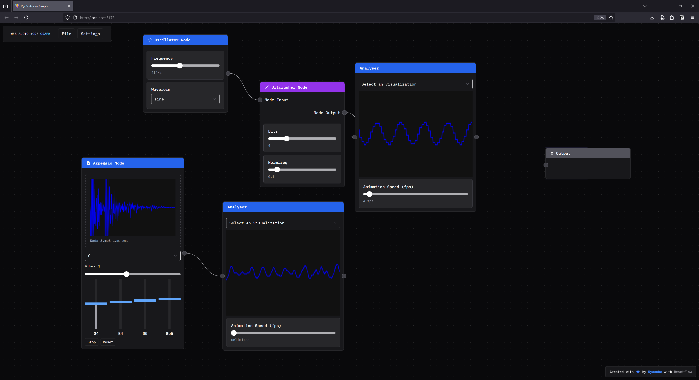
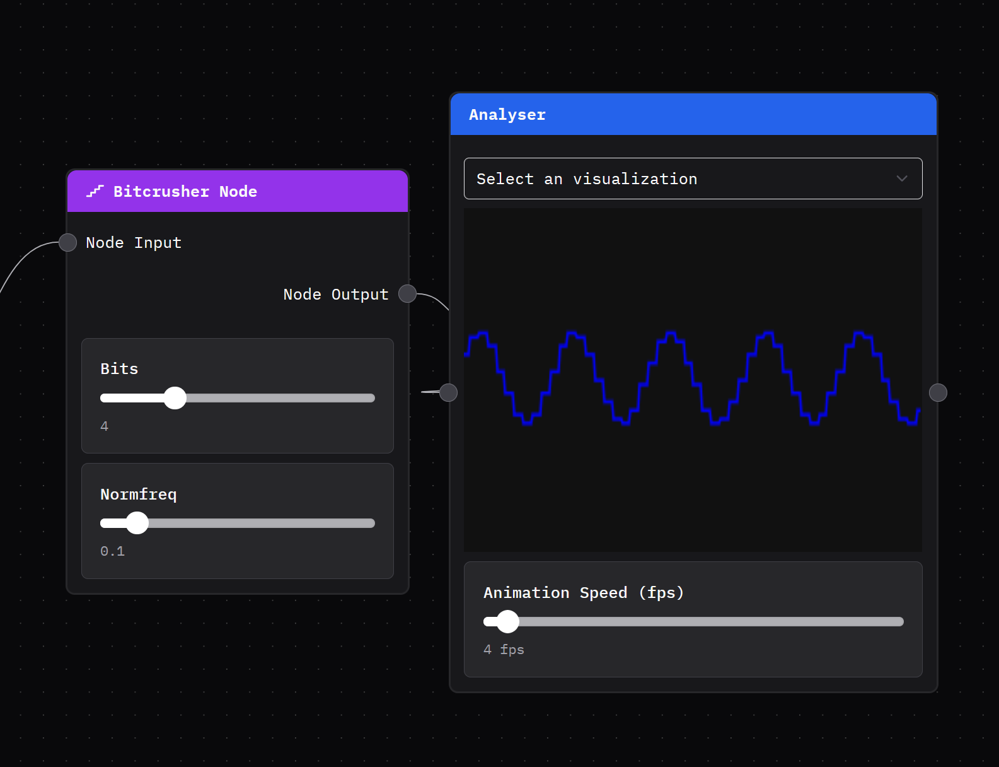

I’ve done a bit of work in the audio space, but I’m often leveraging existing frameworks - like the Web Audio API or say JUCE for native. But what would it look like to create an actual DAW from scratch? I’ve created a few DAW-like apps in the browser, but they benefit from the countless classes in the web platform that hold your hand while creating and outputting audio. And web DAWs are inherently bottlenecked, preventing you from getting a low latency, leading to less data being recorded (from say, external MIDI instruments) and timing issues over time.

I spent some time creating a DAW using Rust code to write audio code as low level as you (reasonably) can go. In this blog I’ll give a brief intro into how audio works at a low level, then build a small backend framework to play audio (either from files like MP3, or virtual synthesizers). Then we’ll learn how to add UI using Tauri and React.

> ⚠️ This blog gets pretty low level with audio and computer science topics. If you’re new to working with audio, I’d recommend checking out my previous blogs like [drawing sound](https://whoisryosuke.com/blog/2025/painting-sound-with-javascript) or [my](https://whoisryosuke.com/blog/2025/processing-web-audio-with-rust-and-wasm) [series](https://whoisryosuke.com/blog/2025/web-audio-effect-library-with-rust-and-wasm) on [creating Clawdio](https://whoisryosuke.com/blog/2025/generating-pink-noise-for-audio-worklets) — these cover audio programming from a web perspective, which is much easier to understand in most cases. And some code examples are easier to run, since they’re JavaScript based and not Rust.

# Why not use Web Audio API?

Like I mentioned in the intro, I’ve written quite a few web-based audio apps that utilize the Web Audio API built into all web browsers. It’s incredibly convenient to write a quick application in HTML, CSS, and JavaScript and have it work on most (if not all) devices. Especially when combined with a framework like Electron or Tauri, you can spin up a “native-like” desktop application using mostly web technology.



But this isn’t the best solution for audio, particularly at a professional level. Let’s explore why.

The Web Audio API has inherent limitations because of the context it’s running in (a browser application where audio is one of many things it’s doing).

- Requires user interaction before it can even spin up an audio context.
- Difficult to achieve playback without glitches in timing since scheduling isn’t as reliable.
- Features differ across browsers, requiring polyfills and compatibility layers.
- Latency is limited compared to native, you won’t get as high sample rates recording for example.
- Only stereo support, no built-in support for spatial audio (like 3D or Dolby 5.1 -style setups)
- Runs on the main thread, where all JS runs. You can multi-thread with workers, but they’re fragile and can’t access a lot of basic browser APIs (like the actual audio context, or simple things like crypto)

This is why most professional audio applications prefer native-first solutions for their applications, often writing them in C++, Rust, or other low level languages.

- Gives you access to multi-threading to offset load from audio thread (and just spawn audio on it’s own dedicated thread)
- Allows you to control a “real time” audio stream.
- Memory can be allocated as needed, allowing for easy loading and offloading of audio buffers.
- The latency from audio is inherently lower because there’s less overhead in terms of code running (no browser code, no DOM, etc — just raw C++ and whatever you mix in to slow it down)
- Better data access with native databases (instead of doing wild stuff like porting SQLite to WASM)

And this is why we’ll be building our DAW using Rust. It’ll give us access to low level audio and OS APIs, instead of leveraging the Web Audio API, allowing us to achieve a lower latency experience for professional producers.

> ℹ️ Not to mention the real reason to build a native DAW — access to VSTs (virtual studio technology — aka virtual instruments that many companies and even individuals create). VSTs are made using a proprietary framework that’s written in C++, and heavily licensed, so it makes it hard to port to other technologies (let alone the web). And most audio plugins are written in C++ using JUCE, so it’s just beneficial to be able to support that ecosystem.

# What is a DAW?

A DAW is a digital audio workstation, essentially an app that you can use to make music. You might have come across one of these apps before, especially if you’re on Mac, with apps like [Garageband](https://www.apple.com/mac/garageband/), [FL Studio](https://www.image-line.com/), [Adobe Audition](https://www.adobe.com/products/audition.html), or [Ableton](https://www.ableton.com/en/). Or maybe you’ve downloaded the open source app [Audacity](https://www.audacityteam.org/) to edit some sound files. These are all applications that allow you to either create sounds (like recording audio from a microphone or instrument, or playing “virtual” instruments) or edit and export them into common formats like MP3, WAV, etc.


Each DAW will range in features, but ultimately it’s an “audio workstation”, meaning it has to load and play audio minimally. If we drop an MP3 file onto the app, it should import it and allow the user to play it. Usually this will happen on a “timeline”, where the sound can be arranged alongside other audio “clips” that all get combined into a single audio file. And ideally it should export this composition into a new, single audio file.

There’s plenty of other interesting features that come packed in as you can imagine, like tools for removing background noise, or specialized UI for composing music from classic notation (like picking a C#4 note specifically).

We’ll primarily be focused with audio playback. That’s really the core of any DAW. Everything else is just sauce on top.

# Intro to Audio Programming

What is “audio”? When you play a song from one of your favorite musical artists (like say, [bbno$ - 1-800](https://www.youtube.com/watch?v=6Ro7NubzE9A)), what is actually happening? The file is loaded, parsed, and then…”played”? Let’s start from the beginning: `your-music.mp3`

Audio files are a binary format. This means if you open the `.mp3` file in a text editor, you’ll just see gibberish, and you won’t be able to edit and save it like that. But once you parse them (using say `decodeAudioData()` from the Web Audio API), you’ll reveal the underlying audio data. Inside this audio data is a “buffer”, which contains our actual music. This buffer is just an array fills with numbers that range from 0 to 1 (like `[0.548393, 0.193339, etc]`).

This buffer is what we send to our speaker, which takes these numbers and generates sound. But how do numbers translate to sound?

When we play music we’re asking a speaker to vibrate and push air which creates pressure, and ultimately generates the “sound wave” our ears perceive. So imagine that the speaker is constantly vibrating at different rates to achieve the sound we’re hearing (like the difference between pitches). When we play audio, we “stream” our audio data to the speaker, which takes our number and adjusts the vibration based on that. Each number is “held” for a little bit of time (like 20 microseconds for a 44hz file) until the next number is requested.

> ⚠️ 44hz refers to the sample rate of a file. A sample rate is how many times per second a sound’s wave amplitude is measured and recorded digitally. So a higher sample rate means more music data is being recorded, and subsequently needs to be played at a faster rate. 44hz is the standard for most music and CDs, while 96 and above are used in professional audio (like a musicians “source code”).

So basically, music is just a stream of numbers, at least digitally. Which means in the simplest terms, our DAW is just an app that slings sample data (aka numbers) to our speakers.

# Low Level Audio in Rust

Before we dive into the UI portion, let’s figure out how audio works in Rust. We need to figure out how to load an audio file and play it to a speaker. Ideally it’ll just be an executable that we run and directly plays sound — no UI window (maybe a shell/console popup at most with debug messages).

Let’s make a new project in Rust using Cargo:

```bash
cargo new rust-audio-test
```

> ℹ️ Here’s a link to the [project’s source code](https://github.com/whoisryosuke/daw-tauri) for reference. You could clone this and follow along using [my branches](https://github.com/whoisryosuke/daw-tauri/branches) if you prefer that route.

In order to play audio, we need to communicate with the user’s speakers on their computer. This involves connecting and sending messages to the audio drivers. That’s it’s own process that we could spend a whole other blog article on. So for sake of simplicity, we’ll be taking advantage of the `cpal` [crate](https://github.com/RustAudio/cpal). This will handle connecting to the user’s audio drivers, finding the output speaker (cause there could be multiple), and

```bash
cargo add cpal
```

> ℹ️ I popped over to the [cpal examples](https://github.com/RustAudio/cpal/blob/master/examples/) and found the [beep example](https://github.com/RustAudio/cpal/blob/master/examples/beep.rs) which was the “simplest” one to reverse engineer. I also referenced this [fundsp-example](https://github.com/mochreach/fundsp-example/blob/main/src/main.rs) project which uses cpal under the hood for audio playback, and was another great “simple” example that included sending data to the audio stream.

After checking out a few examples, I put together a basic example that connects to the default speaker and sends a sine wave signal (aka a synth!).

```rust
use std::f32::consts::PI;
use std::sync::{Arc, Mutex};

use dasp::Sample; // Optional for from_sample() type conversion
use cpal::traits::{DeviceTrait, HostTrait, StreamTrait};

fn main() -> anyhow::Result<()> {
    // Set up CPAL.
    let host = cpal::default_host();
    // Grab the user's default speaker
    let device = host
        .default_output_device()
        .expect("no output device available");

    // Grab the speaker's config data - like the sample rate it plays at
    let config = device.default_output_config()?;
    let sample_rate = config.sample_rate().0 as f32;

    // Create a simple sine wave oscillator.
    let freq = 440.0;
    let mut phase = 0.0f32;
    // This is a lambda callback that we'll move into our audio stream.
    // Each time we run this, it returns a point in time on the sine wave.
    let signal = move || {
        let value = (2.0 * PI * phase).sin();
        phase = (phase + freq / sample_rate) % 1.0;
        value
    };

    // We wrap our oscillator callback in an Arc/Mutex so
    // we can access it across threads.
    // This is also optional, since we don't use oscillator outside stream.
    let sine_wave_shared = Arc::new(Mutex::new(signal));

    // Create the audio stream that constantly sends data to our speaker
    // Also have to adjust based on speaker's sample format
    // (could be f16 or lower possibly)
    let stream = match config.sample_format() {
        cpal::SampleFormat::F32 => build_stream(&device, &config.into(), sine_wave_shared, bitcrusher),
        _ => todo!(),
    }?;

    stream.play()?;

    // Keep the thread alive while streaming audio.
    // If you don't do this, audio will stop playing immediately
    std::thread::park();

    Ok(())
}

fn build_stream(
    device: &cpal::Device,
    config: &cpal::StreamConfig,
    signal: Arc<Mutex<impl FnMut() -> f32 + Send + 'static>>,
) -> Result<cpal::Stream, cpal::BuildStreamError>
{
    let channels = config.channels as usize;

    device.build_output_stream(
        config,
        move |data: &mut [f32], _| {
            let mut osc = signal.lock().unwrap();

            for frame in data.chunks_mut(channels) {
                // We get latest oscillator value (which increments each call)
                let raw_sample = osc();

                // It's not recommended to println from this callback
                // but you can if you want, nothing stops you
                // println!("raw_sample: {}", raw_sample);

                // Process signal as needed...

                // Convert to CPAL output sample type.
                // Optional: This is great if you need to support multiple data types
                let sample: f32 = f32::from_sample(processed_sample);

                // Overwrite the output signal with our sample data (aka sine wave)
                for out in frame {
                    *out = sample;
                }
            }
        },
        move |err| eprintln!("stream error: {err}"),
        None,
    )
}
```

And with that, we have a Rust app that when we run it, plays a really annoying and piercing tone. Definitely turn down your speakers for this one, and definitely don’t debug this in front of your partner for 20 minutes unless you want to get yelled at to turn it off.

The comments in the code really tell more of the story in context, but basically the `cpal` crate creates a “stream” that constantly sends audio data to our speaker. To play music we override the output data with our own data (using a [raw pointer](https://doc.rust-lang.org/std/primitive.pointer.html) - basically replacing the data in memory with our new data).

The output is an `Array` of `f32` numbers - our audio signal. By default it’ll be a series of `0.0` which translates to no noise (aka silence). We loop over each number in this output array and override it with our sine wave data.

> ℹ️ This example is mono, meaning it plays the same sound across all “channels”. Most speakers are stereo, meaning they have a left and right channel. Later you’ll notice we handle that, but to keep it simple, this example is mono.

## Bonus Bitcrusher ft. Clawdio

Recently I released an audio library called [Clawdio](https://whoisryosuke.github.io/clawdio/) that uses Rust and WASM to process audio and create effects - like a [bitcrusher](https://whoisryosuke.github.io/clawdio/docs/effects/bitcrusher). I thought this would be a perfect chance to re-use some code from that library here since they’re both Rust projects.


The way the Bitcrusher works in Clawdio is it’s a “module”, which is basically just a Rust `struct` with a few stateful properties, and a method called `process()` that takes an array of samples and returns the processed samples. Since Clawdio is a WASM library, it returns WASM-friendly types — but to make debugging easier, I decoupled the core logic into it’s own `process_vec()` method. We’ll use that as the basis for our code, since our sample data is basically `f32` stored in `Vec`.



I copy and pasted [the Bitcrusher module](https://github.com/whoisryosuke/clawdio/tree/main/modules/bitcrusher)’s core code from the Clawdio project into the `main.rs` file and made a few alterations so that it basically processed 1 sample at a time (instead of the entire array).

```rust
pub struct BitcrusherModule {
    bits: usize,
    phaser: f32,
    last: f32,
    step: f32,
}

impl BitcrusherModule {
    pub fn new(bits: usize) -> BitcrusherModule {
        BitcrusherModule { bits, phaser: 0.0, last: 0.0, step: 0.5_f32.powf(bits as f32) }
    }

    pub fn process_sample(&mut self, sample: f32, normfreq: f32) -> f32 {
        self.phaser += normfreq;
        if self.phaser >= 1.0 {
            self.phaser -= 1.0;
            self.last = self.step * (sample / self.step + 0.5).floor();
        }
        return self.last.clone()
    }
}
```

Then to use: we just need to initialize the module, send it to the stream, then run our samples through it inside the stream.

```rust
fn main() -> anyhow::Result<()> {
		// Cpal setup code...

		// Sine wave code...

    // We create Bitcrusher effect here since it needs to save state
    // and the audio function below will recreate it every frame
    let bitcrusher = BitcrusherModule::new(4);

		// Build stream using sine wave + bitcrusher
    let stream = match config.sample_format() {
        cpal::SampleFormat::F32 => build_stream(&device, &config.into(), sine_wave_shared, bitcrusher),
        _ => todo!(),
    }?;

    stream.play()?;

    // Keep the thread alive while streaming audio.
    std::thread::park();

    Ok(())
}

fn build_stream(
    device: &cpal::Device,
    config: &cpal::StreamConfig,
    signal: Arc<Mutex<impl FnMut() -> f32 + Send + 'static>>,
    mut bitcrusher: BitcrusherModule,
) -> Result<cpal::Stream, cpal::BuildStreamError>
{
    let channels = config.channels as usize;

    device.build_output_stream(
        config,
        move |data: &mut [f32], _| {
            let mut osc = signal.lock().unwrap();

            for frame in data.chunks_mut(channels) {
                // We get latest oscillator value (which increments each call)
                let raw_sample = osc();
                // println!("raw_sample: {}", raw_sample);

                // Process signal
                // We run a Bitcrusher effect on the signal
                let normfreq = 0.1;
                let processed_sample = bitcrusher.process_sample(raw_sample, normfreq);
                // println!("processed sample: {}", processed_sample);

                // Convert to CPAL output sample type.
                let sample: f32 = f32::from_sample(processed_sample);

                // Overwrite the output signal with our sample
                for out in frame {
                    *out = sample;
                }
            }
        },
        move |err| eprintln!("stream error: {err}"),
        None,
    )
}

```

And with a few extra lines of code, we have processed our audio signal! It should sound slightly crunchier like an 8-bit console, depending on how low the bits are set. It definitely works better using an audio file with music or sound like a voice recording.

> Here's [the source code](https://github.com/whoisryosuke/rust-dsp-test/blob/bitcrusher/src/main.rs) for these experiments if you're interested in seeing it in full context or running it.

# Real-time audio

Now that we’ve built a small example of a low level audio stream, you get an idea of how it works. It’s basically 1 callback constantly running in a separate thread that’s managed by the audio library (`cpal` in our case). The callback runs as an infinite loop with a slight delay before each iteration (to “hold” a sound as long as the sample rate requires — smaller sample = longer hold).

This 1 callback is critical. Anything we do in this function slows down our ability to output the audio. It’s already “delayed” by the sample rate holding the loop each time, which gives you a runway of however many nanoseconds that is. But if we exceed that, the audio will start to get messed up, sounding like it’s skipping or clicking.

There’s a few rules we can follow to ensure our audio stream stays real-time.

- No memory allocation (like `Box::new()` or `Vec::push()`). All memory should be pre-allocated.
- No `Mutex` values. We can’t `lock()` inside the stream or risk blocking it (and audio would be silent until it’s finished)
- No loading or parsing of files. This should happen on a separate thread and the results should be sent to the audio stream if needed.

As we go you’ll see we break some of these rules, and it’s not the end of the world, but when we start to scale the application to a larger state (like 30+ audio sources) things will fall apart quickly. If you’re ever looking for places to optimize the DAW, these are some key spots to focus on.

Now let’s combine this low level audio with some UI — and inevitably talk more memory optimization.

# Playing Audio with UI

Most people who use a DAW are looking to edit the audio in a visual experience. They want to see their audio waveforms visualized, and they need a timeline they can add the audio to and control it’s playback time. This requires UI. Though this is where things get a bit complicated if you want to build something that retains a “real-time” audio thread.

Before we pick a UI framework, let’s get low level with it.

## Retained vs Immediate Mode UI

We want to keep the latency of our audio as low as possible, which means keeping our real-time audio thread as clear as possible. This also means keeping the overhead of other parts of the application as low as possible. But how do you ensure UI is “efficient”?

We need to use a “retained mode” UI instead of an “immediate mode” UI. You might be familiar with an immediate mode UI if you’ve ever encountered libraries like imgui for C++ or egui for Rust. It’s a UI library that renders all the UI, every single frame, every single time. It’s useful for things like debugging because it keeps the library lightweight and memory overhead low. But this comes at the cost of rendering each frame, even when UI hasn’t changed. Meaning if a user lets the app sit idle, it’ll burn more battery over time than a retained mode style UI.


In contrast, retained mode UI renders the UI only when it changes. It does this by keeping a state of the UI in memory, tracking changes, then scheduling re-renders of any portions of the UI (usually even rendering only the portion of the screen that the UI inhabits). If you’ve worked with the DOM or React’s VDOM, they operate on a similar model. While the memory footprint is higher, we get the benefit only rendering when things change — so in a DAW this is probably just a few key pieces (like a playhead marker in the timeline, or an animated waveform in a small window).

Ideally we want to use a retained mode UI for our DAW. This would make it easier to achieve that “real-time” audio target (aka low latency).

The problem? Rust is a fairly new programming language. So there aren’t a lot of solutions out there for UI in general. There are 3 libraries we could use that are fairly supported:

- [**Tauri**](https://v2.tauri.app/) — This is less of a UI library and more of an entire framework for making apps. The UI is powered by a WebView using the user’s native OS browser (so Edge for Windows, Safari for Mac). This allows us to author UI using HTML, CSS, and JS — meaning React — which is pretty nice. This has some overhead because it’s a framework, and a small inherent latency communicating between Rust and JS layers.
- [**Iced**](https://iced.rs/) — This is a UI library that lets you write Elm-style components. I’ve personally used it a couple times and I found it a bit difficult to use and poorly documented. Even checking in a year or so later with it, they haven’t improved the docs much.
- [**Slint**](https://slint.dev/) — A newer UI library in the Rust ecosystem. It allows for QML-style components (like the Qt C++ library). This one looks nice, but the licensing is a little dissuading. It’s similar to Qt where it’s free for developers, but has pricing tiers for businesses. If I needed a cross-platform solution it’d be more of a consideration.

> ℹ️ There’s also the secret hidden “write your own UI library” option. Although this would suddenly become more of a graphics programming project than audio. But if you were to write your own UI library, I’d recommend sticking to either Vulkan or DirectX. You can do OpenGL, but Vulkan and DirectX will give you greater control over your memory usage and operations, making it easier to tune and optimize (at the cost of it being harder to write in general).

I wouldn’t bother using WebGPU because like I mentioned before, web support isn’t recommended for a DAW. And the WebGPU API is still pretty new, so you’ll likely have to make breaking changes eventually.

## Tauri time

I decided to go with Tauri, since it seemed like the easiest option, and a great opportunity to measure the performance to see if it can withstand the task.

To get started, I’d spin up a Tauri app with a React and TypeScript frontend, and then install `cpal` to the Rust backend using Cargo (`cd src-tauri && cargo add cpal`). We’ll also be using the `symphonia` crate to parse music files into audio buffers we can play, make sure to install that too.

> ℹ️ If you’ve never used Tauri before, I’d recommend checking out my [previous](https://whoisryosuke.com/blog/2022/create-a-markdown-editor-using-rust-and-react) [blogs](https://whoisryosuke.com/blog/2025/offline-vector-database-with-tauri) where I talk about how I build apps with Tauri. Since it’s a framework, it has a lot of systems and quirks to pick up. This blog will assume you understand some key aspects of the Tauri architecture.

### Wait wait, doesn’t Tauri use Web Audio API?

That’s not technically the case. Tauri displays it’s UI with a WebView, which does allow you to utilize the Web Audio API if you wanted. But I’m not going to do that for all the reasons I listed above.

Instead, we’ll leverage Tauri’s Rust backend to play audio natively and directly on the user’s device. This lets us take full advantage of Rust’s speed and skip layers of unnecessary complexity that the web platform brings.

How will we do this? Well…that’s the blog post. Keep reading to find out! First we’ll explore the “wrong” way, then the “right” way.

> ℹ️ There is one key limitation to note about Tauri. It’s limited to 60fps since it uses the default browser under the hood - and Edge on Windows has that limitation/bug. If you’re focused on building an app with real-time visualizations, consider another API like Bevy, nannou, or your own custom WebGPU renderer.

## The Wrong Way

When I’m coding, I don’t know about you, but I like to create POCs (proof of concepts). I have a goal, and I build pieces that get me there fast first — then work on making it efficient. It’d be like starting with a unicycle, then building the whole bike eventually. The first thing works — but you’d probably prefer the latter.

In this case, I’m going to walk through my initial attempt to get audio playing using Tauri. It works, but it’s not what we’d want, and I’ll explain why after.

So basically we need to:

- Initialize the `cpal` connection with the audio output
- Create a stream
- Send it sample data to play
- When a user presses a button in the UI, it should trigger the playback

We’ll start by storing the cpal `device` and `config` in an `AudioState` struct, and that will get stored in the Tauri app state so we can access it in a handler.

```rust
struct AudioState {
    device: cpal::Device,
    config: cpal::SupportedStreamConfig,
}
```

Then in the `setup` method of our Tauri app builder we can initialize the cpal connection and store it in the state:

```rust
#[cfg_attr(mobile, tauri::mobile_entry_point)]
pub fn run() {
    tauri::Builder::default()
        .setup(|app| {

            // Set up CPAL.
            let host = cpal::default_host();
            let device = host
                .default_output_device()
                .expect("no output device available");

            let config = device.default_output_config().expect("Couldn't load config");

            app.manage(Mutex::new(AudioState {
                device,
                config,
            }));

            Ok(())
        })
        .plugin(tauri_plugin_opener::init())
        .invoke_handler(tauri::generate_handler![greet, play_audio])
        .run(tauri::generate_context!())
        .expect("error while running tauri application");
}
```

Now we can create a handler that loads an audio file, creates a new stream (using the device from the app state), and sends the sample data to it. The loading of the audio file is handled by the `symphonia` crate, I basically copied one of their examples and ran with it.

```rust

use cpal::traits::{DeviceTrait, HostTrait, StreamTrait};
use symphonia::core::audio::{AudioBufferRef, Signal, SignalSpec};
use symphonia::core::codecs::DecoderOptions;
use symphonia::core::formats::{FormatOptions, Track };
use symphonia::core::meta::MetadataOptions;

use std::fs::File;
use std::io::BufReader;
use std::{f32::consts::PI, sync::{Arc, Mutex}};

#[tauri::command]
fn play_audio(app: AppHandle, state: State<'_, Mutex<AudioState>>) {
    println!("playing audio from Rust");
    let mut state = state.lock().unwrap();

    let file_name = "ff8-magic.mp3";
    let resource_path = app.path().resolve("audio", BaseDirectory::Resource).expect("Couldn't get migrations folder");
    let audio_path = resource_path.join(file_name);

    // Open reader and probe MP3.
    let file = File::open(audio_path).expect("Couldn't load file");
    // let reader = BufReader::new(file);
    let mss = symphonia::core::io::MediaSourceStream::new(Box::new(file), Default::default());
    let mut hint = symphonia::core::probe::Hint::new();
    hint.with_extension("mp3");
    let probed = symphonia::default::get_probe().format(
        &hint,
        mss,
        &FormatOptions::default(),
        &MetadataOptions::default(),
    ).expect("Failed to probe audio format");


    let mut format = probed.format;

    // Select the first audio track.
    let track = format
        .tracks()
        .iter()
        .find(|t| t.codec_params.sample_rate.is_some())
        .expect("no audio track");

    let track_id = track.id;

    // Create a decoder.
    let mut decoder = symphonia::default::get_codecs().make(
        &track.codec_params,
        &DecoderOptions::default(),
    ).expect("Couldn't create decoder");

    // Decode the ENTIRE MP3 ahead of time into f32 interleaved PCM
    let mut samples: Vec<f32> = Vec::new();


    loop {
        let packet = match format.next_packet() {
            Ok(p) => p,
            Err(symphonia::core::errors::Error::IoError(_)) => break,
            Err(err) => {
                eprintln!("Error decoding packet: {err}");
                break;
            },
        };

        if packet.track_id() != track_id {
            continue;
        }

        let decoded = decoder.decode(&packet).expect("Couldn't decode audio");

        match decoded {
            AudioBufferRef::F32(buf) => {
                samples.extend_from_slice(buf.chan(0));
                if buf.spec().channels.count() > 1 {
                    // Interleave for multi-channel.
                    // Creates a flat array with stereo audio data ([L,R,L,R,etc])
                    for frame in 0..buf.frames() {
                        for ch in 0..buf.spec().channels.count() {
                            samples.push(*buf.chan(ch).get(frame).expect("frame not found"));
                        }
                    }
                }
            }
            AudioBufferRef::S16(buf) => {
                for frame in 0..buf.frames() {
                    for ch in 0..buf.spec().channels.count() {
                        samples.push(buf.chan(ch)[frame] as f32 / i16::MAX as f32);
                    }
                }
            }
            other => {
                return eprintln!(
                    "Unsupported sample format: {:?}",
                    other.spec()
                );
            }
        }
    }

    // Shared audio buffer cursor for CPAL.
    let cursor = Arc::new(Mutex::new(0usize));

		// Create the audio stream
    let stream = match state.config.sample_format() {
        cpal::SampleFormat::F32 => build_stream(&state.device, &state.config.clone().into(), cursor, samples),
        _ => todo!(),
    }.expect("Audio error");

		// Start the stream
    stream.play().expect("Couldn't play");

    // Keep the thread alive while streaming audio.
    std::thread::park();
}
```

The audio file itself is located in [a “resource” folder](https://v2.tauri.app/develop/resources/) that I designate in the Tauri config. This copies it to the app bundle when it’s time to release it. And we can access it by leveraging Tauri’s `BaseDirectory::Resource` along with the app handle’s `path()` method.

```rust
    "resources": {
      "../data/audio/*.mp3": "audio/"
    }
```

And when we build the stream, it’s basically the same as before, we override the output with our sample data. In this case though, we’re looping over sample data, so we have a `cursor` variable that contains an array index (aka `usize`) for the current sample we’re playing. That increments each time we loop, allowing us to move to the next sample.

```rust

fn build_stream(
    device: &cpal::Device,
    config: &cpal::StreamConfig,
    cursor: Arc<Mutex<usize>>,
    samples: Vec<f32>
) -> Result<cpal::Stream, cpal::BuildStreamError>
{
    let channels = config.channels as usize;

    device.build_output_stream(
        config,
        move |output: &mut [f32], _| {
            let mut pos = cursor.lock().unwrap();

            for frame in output.chunks_mut(channels) {
                // Run out of samples? Turn volume to 0
                if *pos >= samples.len() {
                    for ch in frame {
                        *ch = 0.0;
                    }
                    continue;
                }

                //
                for ch in 0..channels {
                    let sample = if *pos < samples.len() {
                        samples[*pos]
                    } else {
                        0.0
                    };
                    frame[ch] = sample;
                    *pos += 1;
                }
            }
        },
        move |err| eprintln!("stream error: {err}"),
        None,
    )
}
```

And with that, we can play sound if we wire up a button on the frontend to call the handler:

```rust
await invoke("play_audio")
```

### Why it’s wrong

This shares a similar issue that the previous Rust-only example had. When we press our button multiple times to play a sound, it waits until the sound is finished before it plays the next one. But why is that?

This is because of 2 things we did:

- Created a stream in a handler and destroy it each time. Ideally the stream should be kept alive somewhere (similar to the `device` we stored in the `AudioState`).
- We force the handler to wait for the sound to finish playing before we return a result. Because we’re using Tauri app state and we “lock” it to access it, other threads have to wait until we’re done with it before they can use it.

So how do we fix this?

We could store the stream in the Tauri app state, but then how do we send samples to it? The stream is a callback that gets created and runs in it’s own little world. It doesn’t have access to `self` like a standard `struct` method might have, meaning any data we get needs to come from either a function (like our sine wave) or some sort of pointer possibly to data outside.

But this is where things get…tricky. Since the audio thread is running on it’s own, we’d probably need to wrap any data that’s going inside in an `Arc`, that way we can clone it across threads without duplicating the memory footprint. Though that means now we need a `Mutex` guard to ensure that we don’t write to the data when it’s being read (like the audio callback trying to grab samples).

Normally this would be the standard practice, `Arc<Mutex<AudioBuffer>>` done. In this case, it’s not that simple. We’re working with audio, which is constantly streaming. That means that it can’t and shouldn’t be left waiting for anything. If we lock up the audio thread while it’s streaming our audio will skip or glitch. So how do we send sample data to our callback without needing to lock the data?

The answer is a consumer/producer API, like the Rust std library’s [mpsc](https://doc.rust-lang.org/std/sync/mpsc/index.html), or in our case — a ring buffer using the `ringbuf` crate. But I’ll get into that in a minute.

## The Better Architecture

Let’s get this DAW’s backend in shape a bit. Now that we understand the problem are a bit more, let’s refine the architecture and create some `struct` to help us manage specific domains (like a `Mixer` to “mix” audio).

Here’s a diagram of what will happen when the user presses a “Play” button in the frontend. It shows a high level call-stack of the various classes and methods we’ll be creating.


Now let’s break down the new classes we created, and a few new tricks we’ll use to simplify our flow. I’ll keep this high level, and then we’ll break things down even further below.

Instead of storing our sample data inside a `Arc<Mutex<>>`, we’ll use a [ring buffer](https://en.wikipedia.org/wiki/Circular_buffer) that creates a communication channel between the audio stream and our UI layer. We’ll technically be using a [3rd party library](https://docs.rs/ringbuf/latest/ringbuf/) that creates the ring buffer, and we’ll use that to store and send messages.

We’ll also introduce a new `Mixer` class that’ll handle “mixing” our audio together, as well as other utility classes like an `AudioNode` that’ll hold audio we want to play.

We’ll create an `AudioEngine` struct that’ll contain the core audio playback code, as well as a queue for audio we’d like to play. Inside that struct we’ll have 2 more structs, `AssetStore` and `Mixer`. But the `Mixer` won’t be a property…we’ll get to that later. And one more property on the struct — the `producer` — which is one half of our ring buffer, which will let us communicate with the audio stream (lock-free!) using an enum `AudioCommand`. More on that later too.

```rust
pub struct AudioEngine {
		// The audio stream. This has to stay alive to ensure sound continues playing.
    stream: cpal::Stream,

    // The config which is vital for creating new streams
    config: cpal::SupportedStreamConfig,
    // Ideally we'd also save the device, but it's omitted for sake of simplicity

		// The "telephone" to send commands to audio stream
    producer: HeapProd<AudioCommand>,

    // Where we keep our cached audio
    pub asset_store: AssetStore,
}
```

The `AssetStore` will contain a cache of all preloaded sample data (like our MP3 from earlier, and any other music files the user might want to use). It’ll simply contain a single property for now called `buffers` that is just a `HashMap` of the asset’s ID and an `AudioBuffer` struct with our buffer data and it’s sample rate.

```rust

pub struct AudioBuffer {
    samples: Vec<f32>,
    sample_rate: i32,
}

type AssetId = String;

pub struct AssetStore {
    buffers: Mutex<HashMap<AssetId, Arc<AudioBuffer>>>,
}
```

The `Mixer` will contain our “queue” of pending audio to play in the form of another struct, `AudioNode`. The `AudioNode` contains a clone of our sample data in the `AssetStore`, as well as a cursor (aka `position`) to keep track of the current data index. And we’ll throw in a `finished` flag to let the system know it’s done so it can remove the node.

```rust
pub struct AudioNode {
    data: Vec<f32>,
    position: usize,
    pub finished: bool,
}

pub struct Mixer {
    nodes: Vec<AudioNode>,
}
```

Ultimately, this is the flow that happens:

- The app starts and creates the `AudioEngine`, which starts a stream that runs a local audio queue stored in the `Mixer`. It also creates a ring buffer to communicate between audio stream and backend. And finally, we preload some audio data into our `AssetStore`.
- Our user presses a “Play” button frontend, this invokes a Tauri handler with an ID of an audio file in the `AssetStore`.
- The Tauri handler grabs the engine from the Tauri state and runs the `play()` method on the engine.
- The `play()` method handles grabbing the sample’s buffer from the `AssetStore` and sending an `AudioCommand` to the audio stream containing the audio buffer
- The audio stream gets the command and creates a new `AudioNode` in the `Mixer`'s queue with the buffer data it received.
- Since the audio is constantly streaming, it plays any `AudioNode` we have queued up until each finishes.

Cool now that we’ve gotten to know some of the structs, and their responsibilities and relationships, we can start building this DAW the “right” way.

> ℹ️ If some things look strange here (like why store `AssetStore` inside `AudioEngine`) - don’t worry, we’ll be optimizing more later.

## The Correct Way

In our Tauri app setup we create an `AudioEngine` and store it in the Tauri state. For debugging purposes, we also preload our sample and insert it into the `AssetStore` inside the `AudioEngine`.

```rust
#[cfg_attr(mobile, tauri::mobile_entry_point)]
pub fn run() {
    tauri::Builder::default()
        .setup(|app| {
            // Set up audio backend (aka CPAL)
            let mut engine = AudioEngine::new();

            // DEBUG: Load a test sample
            let file_name = "ff8-magic.mp3";
            let sample_data = load_sample_data_from_disk(app.handle(), file_name);
            engine.asset_store.insert(file_name.to_string(), AudioBuffer::new(sample_data, 0));

            app.manage(Mutex::new(AudioState {
                engine,
            }));

            Ok(())
        })
```

### The AudioEngine

Let’s see what happens when we run that `new()` method on `AudioEngine`.

```rust
    pub fn new() -> Self {
        // Set up CPAL.
        let host = cpal::default_host();
        let device = host
            .default_output_device()
            .expect("no output device available");

        let config = device.default_output_config().expect("Couldn't load config");

        // Create the asset store to contain any samples cached in memory
        let asset_store = AssetStore { buffers: Mutex::new(HashMap::new()) };

        // Create a mixer
        // Allocate a ring buffer to hold commands for the audio stream
        let heap = HeapRb::<AudioCommand>::new(128);
        let (producer, mut consumer) = heap.split();

        let channels = config.channels() as usize;

        let stream = match config.sample_format() {
            cpal::SampleFormat::F32 => device.build_output_stream(&config.clone().into(), move |output: &mut [f32], _| {
                // Run the mixer which runs any commands and
                // combines samples into one signal,
                // then overrides the output signal with it
                mixer.process(output, channels, &mut consumer);
            },
        |err| eprintln!("couldn't build audio stream: {err}"), None).expect("couldn't build audio stream"),
            _ => todo!(),
        };

        stream.play().expect("Couldn't play");

        Self {
            config,
            stream,
            producer,
            asset_store
        }
    }
```

Nothing too dramatically different here except for a couple key details:

The `AssetStore` gets created to store as a property in the `Self`. This allows us to add samples as we need, like say, when a user drags a clip onto the timeline.

```rust
let asset_store = AssetStore { buffers: Mutex::new(HashMap::new()) };
```

The `Mixer` gets created. Here’s where things get interesting. Because the `cpal` build stream is a lambda with `move`, it takes ownership of any variable we use inside. This means when we run the mixer inside, it moves from the `new()` method to inside our audio stream…forever.

```rust
let mut mixer = Mixer { nodes: Vec::new() };

let stream = match config.sample_format() {
    cpal::SampleFormat::F32 => device.build_output_stream(&config.clone().into(), move |output: &mut [f32], _| {
			// Mixer gets "moved" here
			mixer.process(output, channels, &mut consumer);
	}
}
```

Then we create a ring buffer using `ringbuf`, specifically their `HeapRb` which is just the recommended version for working mutably across threads. We use the `split()` method, which creates a `producer` and `consumer`. The `producer` can send data, while the `consumer` only receives messages. We’ll send the consumer to live on our audio stream, and then the producer becomes a property on the `AudioEngine` struct.

```rust
let heap = HeapRb::<AudioCommand>::new(128);
let (producer, mut consumer) = heap.split();
```

> ℹ️ A ring buffer is basically just an array of data. It can be any data, like `f32` for sample data, or in our case an enum. It works by having 2 buffers under the hood, one for the consumer and one to write to. This separation allows for the consumer to read from it’s buffer without needing to lock it up (like we would using a standard `Vec` wrapped in a `Mutex`). Later, we’ll use a `pop()` method to get data from the buffer while simultaneously removing it.

### The Mixer

So that’s cool. Now we have a stream running, and inside it’s constantly calling the `mixer.process()` method. The reason it’s called the `Mixer` is because it “mixes” all the audio nodes together into one audio signal that we’ll send to the speaker.

If you’re familiar with the Web Audio API, this might look familiar…possibly like an [AudioWorkletProcessor](https://developer.mozilla.org/en-US/docs/Web/API/AudioWorkletProcessor/process) in disguise?? They run on the same architectural premise — they get sent the audio output data variable which gets overridden with new “processed” data.

Let’s take a look at that `process()` method.

```rust

impl Mixer {
    pub fn process(
        &mut self,
        output: &mut [f32],
        channels: usize,
        consumer: &mut HeapCons<AudioCommand>,
    ) {
        // Handle commands
        while let Some(command) = consumer.try_pop() {
            match command {
                AudioCommand::Play(buffer) => {
                    self.nodes.push(AudioNode::new(buffer));
                },
                AudioCommand::Pause => {

                },
            }
        }

        // Read from ring buffer
        // Loop over the output and override with new audio
        for frame in output.chunks_mut(channels) {

            // Replace output channel with sample data
            for ch in 0..channels {

                let mut mix = 0.0;
                // Override output with our sample
                self.nodes.retain_mut(|node| {
                    if let Some(s) = node.get_sample() {
                        mix += s;
                        true
                    } else {
                        false
                    }
                });
                frame[ch] = mix;
            }
        }

    }
}
```

It’s not too different than before - at least the bottom half. The top part is new though. Before we send the signal off, we need to check the ring buffer for any new “commands” sent from our “producer” (which will inevitably be our Tauri handler, triggered by our frontend UI). We basically do an infinite loop as long as we have commands to run and process each one. Let’s take a look at those commands I hid earlier:

```rust
enum AudioCommand {
    Play(Vec<f32>),
}
```

Right now we only need 1 command, and it’s to play audio. It accepts a `Vec` of `f32` sample data that we’ll grab from our `AssetStore` in a minute.

> ℹ️ I know what you might be thinking. Why are we sending “audio commands”? If we have a ring buffer, shouldn’t it just be for the sample data? That would make the app worse. It’d mean that we’d have to have some sort of `AudioPlayer` that is responsible for feeding the stream with data, and it would have to run constantly to keep up with the stream (which also runs constantly). Not only is it a code smell to create an infinite loop on a separate thread somewhere (that talks to another infinite loop) — but you risk desyncing your audio (since the audio player’s loop may differ in timing than the cpal one, which is calibrated to the sample rate of the speaker - meaning it “holds” longer depending how low the sample rate is). Instead, the audio stream should be the one requesting data when it needs it - since it’s looping constantly. The trick is just figuring out a good architecture around that restriction.

The keen reader with git diff installed on their eyes will notice the bottom half is also different. Before we just looped over our sample data that we immediately sent over to the stream — but in this case we loop over our `AudioNode` inside the `Mixer` and combine them into one variable that overrides the audio output.

```rust
let mut mix = 0.0;
// Override output with our sample
self.nodes.retain_mut(|node| {
    if let Some(s) = node.get_sample() {
        mix += s;
        true
    } else {
        false
    }
});
```

When we loop over the audio nodes we also use `retain_mut()` to delete any nodes that are marked as finished. This is kinda like `Array.filter()` in JavaScript, you just have to return `true` or `false` to filter out an item from the `Vec`. The magic really happens in `AudioNode` where we return sample data as an `Option` type, which allows us to return a `None` when the audio is finished playing (allowing us to detect it here, and remove the node as needed).

> ℹ️ The reason we keep the `AudioNode` queue in the `Mixer` is because it can mutate it’s own state - even when we `move` it inside the audio stream. If we stored the `AudioNode` data as a property on the `AudioEngine`, we’d need to wrap it in an `Arc<Mutex<>>` again and we’d be back at square 1 breaking our RT audio thread. It’s vital that our queue lives in the stream, so it has unfettered access to it.

### The Play method

The last piece of the puzzle I’ll cover here is the `play()` method on the `AudioEngine`. This is what the Tauri handler uses to actually trigger a sample to play.

```rust
pub fn play(&mut self, id: AssetId) {
    let buffer = {
        let asset_store = self.asset_store.buffers.lock().expect("Couldn't lock asset store buffer");
        asset_store.get(&id).map(|buf| buf.samples.clone())
    };
    if let Some(buffer) = buffer {
        self.send_command(AudioCommand::Play(buffer));
    }
}

pub fn send_command(&mut self, command: AudioCommand) {
    // Wait until we can insert sample
    while self.producer.is_full() {
        std::thread::sleep(std::time::Duration::from_millis(1));
    }

    self.producer.try_push(command);
}
```

Nothing too fancy here. We grab the audio buffer from the `AssetStore` and send a command to the audio stream with the data.

> ℹ️ Here you’ll notice we use the `lock()` method on our asset store. This ok here! This all technically happening on the thread that Tauri spawns for an async handler — not the audio thread (meaning if the data takes time to process it doesn’t slow down the audio). And the audio thread has no dependency to the asset store, so it’ll never need to read from it when it’s locked (meaning it’ll never “skip” or “glitch” waiting for data).

And like I said, in our handler we’ll just call this `play()` method:

```rust
#[tauri::command(async)]
async fn play_audio(app: AppHandle, state: State<'_, Mutex<AudioState>>) -> Result<bool, bool> {
    println!("loading audio from Rust");
    let mut state = state.lock().unwrap();

    // Get samples from cache
    let file_name = "ff8-magic.mp3".to_string();
    state.engine.play(file_name);

    Ok(true)
}
```

And with that we have audio that can play multiple times in quick succession. Mash that play button as much as you want and you should hear a new sound stack on top of any previous ones playing.

# Optimizing allocation

We’ve got a nice system for playing low level audio, but there’s a few areas we can improve if we want to optimize it further.

## `Arc` Everywhere

Currently we’re storing a lot of data in the Tauri app state. When we put our `AudioState` in the Tauri state, it automatically wraps it in an `Arc` for us so it’s easily accessibly across threads. But our properties inside aren’t given the same luxury, so any buffers we allocate inside get cloned when we need to copy from them the asset store to the audio node (meaning a bit more processing time vs an Arc clone, which is faster/cheaper).

```rust
pub struct AudioBuffer {
		// Samples need Arc since they're copied
    samples: Arc<Vec<f32>>,
    sample_rate: i32,
}
pub struct AssetStore {
		// We also wrap the buffer itself for convenience
    buffers: Mutex<HashMap<AssetId, Arc<AudioBuffer>>>,
}
```

That way when we need to clone them later, it’s essentially “free”:

```rust
// We accept the `Arc` wrapped `AudioBuffer` here
pub fn play(&self, buffer: Option<Arc<AudioBuffer>>) {
    if let Some(buffer) = buffer {
        // The AudioBuffer here has "samples" that are also wrapped in `Arc`
        // so we can ideally do a "free" clone
        self.send_command(AudioCommand::Play(buffer.samples.clone().to_vec()));
    }
}
```

## MPSC vs SPSC

When I selected `ringbuf`, I completely glossed over their crate description because I was hyper-focused on the FIFO aspect that I missed it was SPSC (and I assumed a “[shared](https://docs.rs/ringbuf/latest/ringbuf/rb/shared/struct.SharedRb.html)” vs a “[static](https://docs.rs/ringbuf/latest/ringbuf/type.StaticRb.html)” ring buffer meant multi-threaded too when they say it “_Can be shared between threads_”).

**SPSC** means “**s**ingle **p**roducer **s**ingle **c**onsumer”, it’s a concurrency paradigm you might encounter in Rust or other low level programming languages like Go. Like you saw before, we created a “producer” that talks to the “consumer”. SPSC just means that we can only have 1 producer and 1 consumer — period. That means we can’t share our producer across multiple threads (which is a necessity for our async Tauri handlers we’re using to communicate between the UI).

What does that mean? If we try to pass our consumer (aka [`HeapCons`](https://docs.rs/ringbuf/latest/ringbuf/type.HeapCons.html)) into the Tauri state, it’ll give us an error that `HeapCons` doesn’t implement the `Send` trait:

```rust
// The struct containing the ring buffer producer
pub struct AudioEngineMessaging {
    producer: HeapProd<AudioCommand>,
}

// Create the messaging layer between UI and AudioEngine
let messaging = AudioEngineMessaging::new(producer);

app.manage(messaging); // This errors on build with `Send` requirement
```

And that’s by design. `ringbuf` is a SPSC library, so it doesn’t add `Send` to it’s traits on purpose.

Luckily this is a very easy fix. We just need to use a MPSC library instead, and most of them share a very similar API structure to `ringbuf` , so it should be a simple swap out with no extra lines of code (maybe a function name change or two). There are a few options out there, there’s even one in the Rust `std` library called aptly [mpsc](https://doc.rust-lang.org/std/sync/mpsc/index.html). But from my research, it seems like it’s a bit slower or less feature packed than other libraries at the tradeoff of being more stable.

I picked [crossbeam](https://docs.rs/crossbeam/latest/crossbeam/) as my MPSC library. It seems to have great support, and funnily enough, when they updated the `std::mpsc` library recently they used `crossbeam` code to improve it.

Like I said, it’s a pretty simple swap. We’ll use [the `bounded` API](https://docs.rs/crossbeam/latest/crossbeam/channel/fn.bounded.html), which is basically a ring buffer with a capacity:

```rust
let (producer, consumer) = crossbeam::channel::bounded::<AudioCommand>(128);
```

Instead of `try_pop()` we’ll use `try_recv()`:

```rust
while let Ok(command) = consumer.try_recv() {
```

And instead of `try_push()` we’ll use `try_send()`:

```rust
// This function actually returns a result with an error which is handy
let result = self.producer.try_send(command);
// You can check if your consumer has been disconnected and whatnot
println!("command result: {:?}", result);
```

And that’s it! We’ve got ourselves a library that we no longer have to `Mutex` to get working across threads (which would defeat the purpose of the ring buffer).

> ℹ️ Wait a minute, isn’t there already a MPSC library built into Tokio, which is also built into Tauri? Yep, we could use `tokio::sync::mpsc` if we wanted to. But from my research it seems that it has a higher latency than `crossbeam` (likely due to it managing an async state machine vs crossbeam’s atomics).

## Pre-allocating memory

When we created our `Mixer` and used a `Vec` to store our `AudioNodes` inside, we broke one of our rules for real-time audio: no allocating memory in the audio stream. Every time we call our `AudioCommand::Play()` with buffer data and make a new `AudioNode` and `push()` it inside the `Vec`, we’re allocating memory twice (once for the node, another for it’s slot in the vector array).

```rust
AudioCommand::Play(buffer) => {
    self.nodes.push(AudioNode::new(buffer));
}
```

Instead, when we create our `Mixer` initially in our Tauri app setup, we should pre-allocate some memory for our audio nodes. We have a few options to do this.

- Use `Vec::with_capacity()` to limit the capacity of the `Vec`, then fill it with empty `AudioNode`.
- Avoid `Vec` completely and go with an even lighter-weight `Array`. The array requires a set capacity, and then we fill it with empty `AudioNode`. Though this would mean our `AudioNode` would need to implement `Copy` — or we’d need to wrap it inan

> ℹ️ This is actually a very common pattern in audio and graphics programming. You’ll find this also used on the web with the Web Audio API, since creating and destroying audio nodes also incurs a similar performance penalty. And with graphics you’ll find a similar process used with “memory pools” (like reusing data buffers for meshes, textures, etc).

And one last thing — we need to wrap our data in an `Option<>`. This allows us to create a vector/array prefilled with elements, but don’t actually have to instantiate the `AudioNode` struct. Rust is smart enough to allocate enough memory for the node when we fill it with a `None` type, then we can override it later with `Some(data)` and it has no memory allocation.

Let’s put it all together. With an array we’d set a capacity. Then when creating the `Mixer` we’d pre-fill it with `None`. And when we want to add a node we can just loop over the nodes and check for the first one that is `None`, then override it with our new node.

```rust
const MAX_NODES: usize = 32;

struct Mixer {
    nodes: [Option<AudioNode>; MAX_NODES],
}

impl Mixer {
    fn new() -> Self {
        // Initialize with 32 "None" elements
        Self {
            nodes: [const { None }; MAX_NODES],
        }
    }

    fn add_node(&mut self, node: AudioNode) {
        for slot in self.nodes.iter_mut() {
            if slot.is_none() {
                *slot = Some(node);
                return;
            }
        }
    }
}
```

> ℹ️ You could optimize this further by keeping track of “free” indices and use that instead of looping over the entire array. This would reduce operations a bit at the cost of a little more complexity and memory. This should be plenty to start with though.

# Waveform data

You might be asking yourself - we can send samples to the audio stream - but how do we get waveform data from the stream (essentially communicating the other direction)? It’s actually very simple, we’ll leverage the same systems — but in reverse.

> ℹ️ We’ll specifically be creating a “time-domain” waveform, which is the simplest waveform — you just send over the sample data. No processing needed. You could also use a 3rd party library (or do the math yourself) to crunch the sample data using an FFT algorithm, which would give you a “frequency” waveform.

During the Tauri app setup we’ll allocate a ring buffer for sample data we want from the audio stream:

```rust
let (waveform_producer, waveform_consumer) = crossbeam::channel::bounded::<f32>(128);
```

Then we can pass in the producer into the audio engine (instead of the consumer, which we passed for the commands):

```rust
let engine = AudioEngine::new(consumer, waveform_producer);
```

Then we can pass that `waveform_producer` into the stream, and use it to send samples whenever we mix them:

```rust
impl Mixer {
    pub fn process(
        &mut self,
        output: &mut [f32],
        channels: usize,
        consumer: &mut Receiver<AudioCommand>,
        waveform_producer: &mut Sender<f32>,
    ) {
        // Handle commands

        // Read from ring buffer
        // Loop over the output and override with new audio
        for frame in output.chunks_mut(channels) {
            // Replace output channel with sample data
            for ch in 0..channels {
                let mut mix = 0.0;
                // Loop over audio nodes and mix together...
                frame[ch] = mix;

                // 👇 Send the waveform data
                waveform_producer.try_send(mix);
            }
        }
    }
}
```

Now we can setup a consumer somewhere — but how would that work? When we “consumed” `AudioCommand` events inside the audio stream callback, that loops constantly thanks to `cpal` and the communication it persists with speaker.

Outside of the audio stream callback we don’t have that luxury. The ring buffer doesn’t work like a JavaScript event listener — we can’t just setup a “listener” somewhere and have it run whenever something is pushed. If we want something to constantly be checking, we need something constantly looping.

So we’ll create a separate thread, send our waveform consumer there, and use that to communicate with the frontend.

```rust
// In the Tauri app setup, we also pass in the Tauri app handle
// and clone it - since it's getting moved to a separate thread
let messaging = AudioEngineMessaging::new(
	app.handle().clone(),
	producer,
	waveform_consumer
);
```

We’ll receive messages the same as before, using the `try_recv()` method to pop messages off the queue. Then to send those messages to the frontend, we’ll use [Tauri’s “emit” method](https://v2.tauri.app/develop/calling-rust/#global-events) on it’s `AppHandle`. The event will be called “waveform” for now.

```rust
pub struct AudioEngineMessaging {
    producer: Sender<AudioCommand>,
}
impl AudioEngineMessaging {
    pub fn new(app: AppHandle, producer: Sender<AudioCommand>, waveform: Receiver<f32>) -> Self {
		    // Instead of storing the producer in the struct, we spawn a thread with it
        Self::spawn_waveform_thread(app, waveform);

        Self { producer }
    }

    pub fn spawn_waveform_thread(app: AppHandle, waveform: Receiver<f32>) {
		    // This spawns a new CPU thread and "moves" any variables inside it
        thread::spawn(move || {
		        // We'll create a fixed size `Vec` to store our waveform data
            let mut waveform_buffer = Vec::with_capacity(512);

						// We create an infinite loop that lives in this thread
            loop {
                // Loop until we've gotten all waveform data
                while let Ok(waveform_data) = waveform.try_recv() {
                    waveform_buffer.push(waveform_data);
                }

                if !waveform_buffer.is_empty() {
		                // Send the data to frontend
                    let _ = app.emit("waveform", waveform_buffer.clone());
                    waveform_buffer.clear();
                }

                // Before looping again, we wait a little bit
                // since UI doesn't update that fast anyway
                thread::sleep(Duration::from_millis(16)); // ~60 FPS
            }
        });
    }
}
```

> ℹ️ Ideally this would be the place to batch and send any “real-time” signals to the UI. This isn’t exactly a pattern you want to repeat a lot of times across your app (since you’re already sacrificing a whole thread for communication). This could be a dedicated “viz” thread that feeds visualizations on the frontend with fresh data.

Now in our frontend, we can just check for this `waveform` event by using Tauri’s `listen()` function to create an event listener that checks for new data from the backend (so much easier than what we just had to do with ring buffers and spawning threads right? lol):

```rust
const Waveform = () => {
  const data = useRef<number[]>([]);
  const listenerRef = useRef<UnlistenFn>(null);

  useEffect(() => {
    const attachEvents = async () => {
      listenerRef.current = await listen("waveform", (event) => {
        console.log("waveform data", event);
        data.current = event.payload as number[];
      });
    };

    attachEvents();

    return () => {
      if (listenerRef.current) listenerRef.current();
    };
  });

  // Draw the waveform using the `data` array
}
```

And with that, we have a waveform that operates very similarly to using the Web Audio API and it’s `AnalyserNode` with [it’s `getByteTimeDomainData()` method](https://developer.mozilla.org/en-US/docs/Web/API/AnalyserNode/getByteTimeDomainData).


You can see how this could easily be extended to send over other types of audio data, like processing the signal using FFT — or say…playback time?

## Playback timer

We’ve got audio playing, but we’re still missing some key metadata from the audio. How do we track how long something has been playing?

The first thought might be to use one of Rust’s built-in time functions, like `Instant`, to grab the latest time each frame and send that to the user.

```rust
// The loop inside the stream callback
for frame in output.chunks_mut(channels) {
	// Output audio...
}

// We grab the latest time this "frame"
let time = Instant::now();
// Send time using a ring buffer or atomic (for a lock-free communication)
```

This technically isn’t the best way to track playback time. We’re not tracking actual time here, we’re tracking how far along our audio (like an MP3 file) has played. And that can change. If we take too long to process for a frame, we’ll delay the audio. If we use a `time` based number, our playback time would increase — despite technically less audio being played (like it skipping or glitching).

Instead, we need a more reliable way to keep track of playback time, and thankfully we have the perfect solution sitting in our laps — the frame-by-frame audio callback.

We know that audio is basically just a series of “samples” (aka `Vec<f32>`). The “longer” the audio file, the more sample data we have. And we know that our audio device streams audio samples, and it specifically uses a “sample rate” to measure how “fast” the samples need to be sent to the speaker. You can think of the sample rate as “samples per second”. The higher the sample rate, the more samples get sent to the speaker in the same time (meaning our audio callback literally needs to run faster — controlled by `cpal`).

If you look at an MP3 file, your computer might tell you it’s a certain duration (or length of time — like 2mins 32 seconds). This is calculated using the audio’s sample rate. The computer checks the audio file’s sample rate, then counts the number of samples, then divides the 2 variables to get the time in seconds.

```rust
const audio_time = total_samples / sample_rate;
// e.g. 44.1hz = 44100 samples for 1 second
```

So if the audio’s time is based on the number of samples that have played — we have a way to measure that. During our audio callback, inside the `frame` loop, we’ll increment a variable to measure the number of samples that have “played”. Then we can use that to measure how much time has passed, based on the sample rate of the audio output device (found inside of `cpal` config we got earlier).

And since we know anything that happens inside the audio callback has to be lock-free, we take advantage of Rust’s atomic types. This let’s us store a number (aka `u64` since we don’t need negative numbers) and send it to multiple threads to read and write from without needing to lock it. Though since we are sending it across a few threads at once, we’ll manage it’s lifecycle by adding an `Arc` around it — so when our app closes (aka “drops” in Rust), it’ll drop the atomic data too.

```rust
#[cfg_attr(mobile, tauri::mobile_entry_point)]
pub fn run() {
    tauri::Builder::default()
        .setup(|app| {
	        // Lots of things omitted here from earlier - like ring buffer

          // Allocate atomic memory for some shared state (like playback time)
          let playback_time = Arc::new(AtomicU64::new(0));

          // We send the playback time to the engine
          let engine = AudioEngine::new(consumer, waveform_producer, playback_time.clone());
          app.manage(engine);

          // And the messaging layer (so the UI can get access)
          let messaging =
              AudioEngineMessaging::new(app.handle().clone(), producer, waveform_consumer, playback_time.clone());
          app.manage(messaging);
        });
}
```

Then inside of our audio callback (living inside the `Mixer` struct as the `process()` method) we’ll use the `fetch_add()` method on our atomic to increment it by 1. This also returns the latest value, which we can use later to play samples on a delay (like if we have a clip on the timeline at the 2s mark — it should play at 2s).

```rust
// Check if we have anything to play
// We don't stop audio immediately, or you may get strange noises without resetting signal
let should_play = self.nodes.len() > 0;

for frame in output.chunks_mut(channels) {
  let current_time = if should_play { playback_time.fetch_add(1, Ordering::SeqCst) } else { playback_time.load(Ordering::SeqCst) };
```

> ℹ️ Make sure to increment per `frame` and not per `channel`. We’re not interested in a per-channel sample count (otherwise our playback time would be doubled — or more depending on the number of channels on the speaker).

With this we have a timer that runs whenever our audio is playing. Let’s send that data to the frontend so we can have a timer for the user to keep track of it. Inside our messaging service we’ll take in the atomic and send it over to the function that spawns our separate waveform updating thread. Like I mentioned before, we’ll use this thread to group other updates we need to send to the UI. This will send an event to the frontend called `playback_time` that we’ll check for.

```rust

impl AudioEngineMessaging {
    pub fn new(app: AppHandle, producer: Sender<AudioCommand>, waveform: Receiver<f32>, playback_time: Arc<AtomicU64>) -> Self {
        Self::spawn_waveform_thread(app, waveform, playback_time.clone());
        Self { producer, playback_time: playback_time.clone() }
    }

    pub fn spawn_waveform_thread(app: AppHandle, waveform: Receiver<f32>, playback_time: Arc<AtomicU64>) {
        thread::spawn(move || {

            loop {
                let _ = app.emit("playback_time", playback_time.load(Ordering::SeqCst));
                thread::sleep(Duration::from_millis(16)); // ~60 FPS
            }
        });
    }
}
```

Then we just listen for the event on the frontend and grab the time (in samples).

```tsx
import { Box, Heading, Text } from "@radix-ui/themes";
import { invoke } from "@tauri-apps/api/core";
import { listen, UnlistenFn } from "@tauri-apps/api/event";
import React, { useEffect, useRef, useState } from "react";

type Props = {};

const DebugPlaybackTime = (props: Props) => {
  const [playbackTime, setPlaybackTime] = useState(0);
  const listenerRef = useRef<UnlistenFn>(null);

  useEffect(() => {
    const attachEvents = async () => {
      listenerRef.current = await listen("playback_time", (event) => {
        setPlaybackTime(event.payload as number);
      });
    };

    attachEvents();

    return () => {
      if (listenerRef.current) listenerRef.current();
    };
  });

  console.log("playback time", playbackTime);
  return (
    <Box m="2">
      <Heading as="h3">Playback Time</Heading>
      <Text>{playbackTime}</Text>
    </Box>
  );
};

export default DebugPlaybackTime;
```

This gives us a timer in samples, but that isn’t very useful to the user. We need to know the sample rate of the output device (aka speaker) to be able to measure the time in seconds. Luckily, we have access to the sample rate through the `cpal` config — which we store inside the `AudioEngine`. Now we just have to add a handler that queries for that data:

```rust
#[tauri::command(async)]
async fn get_sample_rate(
    engine: State<'_, AudioEngine>,
) -> Result<u32, bool> {
    println!("adding synth in Rust");

    // Get samples from cache
    let sample_rate = engine.config.sample_rate().0;

    Ok(sample_rate)
}
```

Then we can update our playback timer component to use the sample rate to derive the correct time format:

```tsx
const DebugPlaybackTime = (props: Props) => {
  const [sampleRate, setSampleRate] = useState(0);

  useEffect(() => {
    const getSampleRate = async () => {
      const newSampleRate = await invoke("get_sample_rate");
      console.log("sample rate", newSampleRate);
      setSampleRate(newSampleRate);
    };

    getSampleRate();
  }, []);

  // Get event data here...

  return (
    <Box m="2">
      <Heading as="h3">Playback Time</Heading>
      <Text>
        {playbackTime > 0 ? (playbackTime / sampleRate).toFixed(2) : 0}
      </Text>
    </Box>
  );
};
```

And with that - we have a timer for overall playback! It should update 60 frames per second, if you needed something faster you could update the delay in the thread (at the cost of losing some perf for rest of app), however, this should be plenty for most use cases.


You can imagine how you could adapt this per sample if needed (instead of assuming we’re on a DAW-like project timeline).

# Playing different types of audio

Currently we’re only able to play audio buffers we’ve preloaded from files (or maybe filled using another source, like a sine wave function or something). What if we wanted to add a synthesizer to the mix? Or what if we had a file that very large and we didn’t want to keep it fully in memory? We need a way to make our `AudioNode` more flexible to support different use cases / data types.

The first reflex might be to use a Rust Trait. This is kind of like an `abstract` class in C++ or other languages. It defines a contract that a `struct` must implement in the form of methods. Then later, we can use this trait to check if different structs implement the same method.

In our case, our audio node just needs to implement one method: `get_sample()`. That’s what our `mixer` calls to grab data from it.

```rust
pub trait AudioNode {
    fn get_sample(&mut self) -> Option<f32>;
}
```

Now we can take our previous `AudioNode` and rename it more aptly to `SampleNode`. It stays the same, but we can move the `get_sample()` method into a separate implementation using the trait we created:

```rust
pub struct SampleNode {
    data: Vec<f32>,
    position: usize,
    pub finished: bool,
}

impl SampleNode {
    pub fn new(data: Vec<f32>) -> Self {
	    // Same as before
    }
}

impl AudioNode for SampleNode {
    fn get_sample(&mut self) -> Option<f32> {
	    // Same as before -- just moved here
    }
}
```

Cool, now if we wanted to create another type of node, like say a `SynthNode` for our synthesizer, it’d look like this:

```rust
pub struct SynthNode {
    synth: Sine<ConstHz>,
    pub finished: bool,
}

impl SynthNode {
    pub fn new() -> Self {
        let synth = signal::rate(44100.0).const_hz(440.0).sine();

        Self {
            synth,
            finished: false,
        }
    }
}

impl AudioNode for SynthNode {
    fn get_sample(&mut self) -> Option<f32> {
        let sample = self.synth.next();

        Some(sample as f32)
    }
}
```

As you can see, they’re two completely different structures of data — one uses an array of sample data, while the other uses a `Sine` struct to generate the signal. But since they use the same `get_sample()` method — and it returns the same data — we can use them in the same way.

This is where things get a little complicated. We used to store our `AudioNode` in a `Vec` inside the `Mixer`. But we have more than 1 node type now — `SampleNode` and `SynthNode`. A vector “array” in Rust can’t contain more than 1 type of node by default (since they’re differently shaped data — they don’t fit side by side in memory as easily).

The solution? We need to use our trait to define the connection between both nodes. This doesn’t solve the problem though. Like I mentioned, the 2 (or more later) types of nodes are differently shaped, so how do we store them in memory contiguously (next to each other)? We can use a `Box`, which is a Rust way of defining more “dynamic” data types. This allocates more memory at the cost of being able to hold different shaped objects together.

```rust
 pub struct Mixer {
	 nodes: Vec<Box<dyn AudioNode>>,
 }
```

If you’ve been following along this far you’ll start to sniff out the issue here. We’re already using a `Vec` to store our nodes, which allocates memory every time we `push` a new element (if we don’t set a capacity up front). Then we’ve now added a dynamic `Box` element inside that allocates even more memory for each slot. There’s got to be a better way to handle this…

And that’s where `enum` come into play. Since we know all the different types of nodes we want to create up front (like the sample vs synth vs “streaming”) — we can just create an `enum` with each one as an option. And thanks to the way Rust works, we can add methods to our `enum` , allowing us to use `get_sample()` on any option to quickly the sample. We’ll store the type-specific nodes we created inside each option, this way we can still manage differing state per data type.

```rust
pub enum AudioNodeTypes {
    Silence,
    StaticBuffer(SampleNode),
    Streaming(SampleNode),
    Synthesizer(SynthNode),
}

impl AudioNodeTypes {
    pub fn get_sample(&mut self) -> Option<f32> {
        match self {
            AudioNodeTypes::Silence => Some(0.0),
            AudioNodeTypes::StaticBuffer(buf) => buf.get_sample(),
            AudioNodeTypes::Streaming(stream) => stream.get_sample(),
            AudioNodeTypes::Synthesizer(synth) => synth.get_sample(),
        }
    }
}
```

> ℹ️ If you notice, we also include a `Silence` option. This is a great once to pre-allocate your array with. That way it’s filled with nodes, but they’re programming to be quiet.

And with this, we get the best of both worlds (traits and `enum`) and ideally — an ever so slightly smaller memory footprint per node without a `Box`.

Now we can just use the `enum` instead of our `Box` wrapped `dyn` trait:

```rust
pub struct Mixer {
    nodes: Vec<AudioNodeTypes>,
}
```

And the best part? Our code doesn’t change at all. Because all the `enum` options implement the `get_sample()` method, we don’t need to do a `match` or anything — we can just call that method directly (which we already are doing…so no code change!)


Of course, we need to handle the different types of nodes. We can create a new handler that spawns a new synth node.

```rust
#[tauri::command(async)]
async fn add_synth(
    messaging: State<'_, AudioEngineMessaging>,
) -> Result<bool, bool> {
    println!("adding synth in Rust");

    // Get samples from cache
    messaging.add_synth();

    Ok(true)
}

// Then inside the struct
impl AudioEngineMessaging {
    pub fn add_synth(&self) {
        self.send_command(AudioCommand::AddSynth);
    }
}

// And inside the Mixer
AudioCommand::AddSynth => {
    self.nodes.push(AudioNodeTypes::Synthesizer(SynthNode::new()));
}
```

> ℹ️ Make sure to remove the allocation from the `Mixer`. I have it here for simplicity, but ideally we’d use pre-allocated nodes instead of creating nodes and using `push`.

And with all those changes, we can now play our audio sample, and layer a synth underneath at the same time.

# Further reading

Here’s a few resources I discovered in my research that might help demystify the process.

- [Practical Rust for Web Audio (Video)](https://youtu.be/RTjQFJ5XmKg) - Talks about using Rust → WASM to do web stuff (kinda like my Clawdio work)
- [dasp](https://github.com/RustAudio/dasp) - Low level DSP library. Also features it’s own bounded FIFO ring buffer (like `ringbuf`)
  - [Making a sine wave example](https://github.com/RustAudio/dasp/blob/master/examples/test.rs)
  - [Synth example](https://github.com/RustAudio/dasp/blob/master/examples/synth.rs)
- [midi_fundsp](https://github.com/gjf2a/midi_fundsp) - Example of a synth with MIDI playback using fundsp
- [fundsp_example](https://github.com/mochreach/fundsp-example/blob/main/src/main.rs) - Another example of using fundsp to create a virtual synth, but more “hello world” than the last.
- [VST2 was deprecated recently](http://web.archive.org/web/20210727141622/https://www.steinberg.net/en/newsandevents/news/newsdetail/article/vst-2-coming-to-an-end-4727.html), so the Rust library [vst-rs](https://github.com/RustAudio/vst-rs) recommends lots of alternatives (like [vst3-sys](https://github.com/RustAudio/vst3-sys/) or [nih-plug](https://github.com/robbert-vdh/nih-plug/))
- [Accurate Timekeeping in a DAW](https://billydm.github.io/blog/time-keeping/) - Nice overview of handling time in a DAW using musical time notation (instead of sample time) and some tips and tricks
- [DAW Frontend Development Struggles](https://billydm.github.io/blog/daw-frontend-development-struggles/) - Touches on topics I cover here like picking a proper UI framework, the current landscape of Rust UI, and even using Flutter.
- [Building Audio Apps with Rust - An Overview of Tools and Techniques - Stephan Eckes - ADC 2024](https://www.youtube.com/watch?v=G3WWr4uhP0I&list=PLUGDC1tkjMjdDst8xdLfViPZiKWpQm1E9&index=3&t=2347s) - Similar to above, lightly touches on topics I cover here like memory management across threads

## Open Source DAWs

- [Meadowlark](https://github.com/MeadowlarkDAW/Meadowlark/tree/old?tab=readme-ov-file)
  - Cross platform DAW written in Rust with UI rendered with [Vizia](https://github.com/vizia/vizia) (a Skia-based library)
  - Seems to be [on hiatus since 2023](https://billydm.github.io/blog/why-im-taking-a-break-from-meadowlark/) and incomplete.
  - But also uses `cpal` for audio work, so solid reference after this tutorial.
- [LMMS](lmms.io)
  - Cross platform DAW written in C++ with UI rendered in Qt.
  - [Source code](https://github.com/LMMS/lmms)
  - [Developer Guides](https://docs.lmms.io/developer-guides/core/the-structure-of-the-lmms-core) - Goes over architecture of audio backend, kinda similar to what we created (but in C++)
- [Ardour](https://github.com/Ardour/ardour)
  - Cross platform DAW written in C++ with UI rendered with their own custom UI engine backed by the [Cairo](https://www.cairographics.org/) renderer.
  - This one is pretty old (circa 2012) but most of the functional audio code isn’t too different than modern techniques, might be even easier to learn than the newer optimized codebases.

# What’s next?

There’s so many places you can go from here. You could add MIDI input to allow for MIDI devices to trigger samples. Or you could start implementing effects like the Bitcrusher I showed off and create a preset bank for the user to use, as well as a “audio graph” system for stacking those presets on a signal. That’d be particularly fun if you setup a `Synth` struct. Then there’s all the boring stuff I didn’t implement, like re-sampling audio if the sample rate doesn’t match the output device (which could be assisted using the [dasp](https://docs.rs/dasp/latest/dasp/) crate and their [Converter](https://docs.rs/dasp/latest/dasp/signal/interpolate/struct.Converter.html)).

I’ll be working on this project on and off, so keep your eyes peeled, I might release another part breaking down what I add next. For now though, I hope this served as a solid intro to low level audio coding and creating a DAW from scratch.

As always if you enjoyed this blog let me know on [socials](https://bsky.app/profile/whoisryosuke.bsky.social)! It’s the best way for me to know that this blog was a banger (or a miss). And if you cook up anything cool, I’m always down to see it. Want to support more blogs like this? [Become supporter on my Patreon](https://www.patreon.com/whoisryosuke)!

Stay curious,
Ryo
