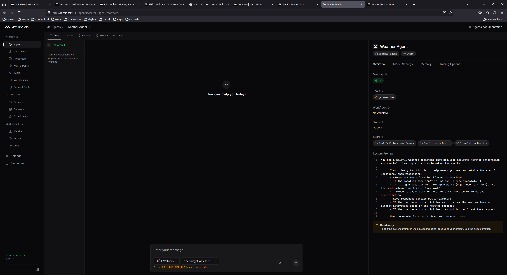
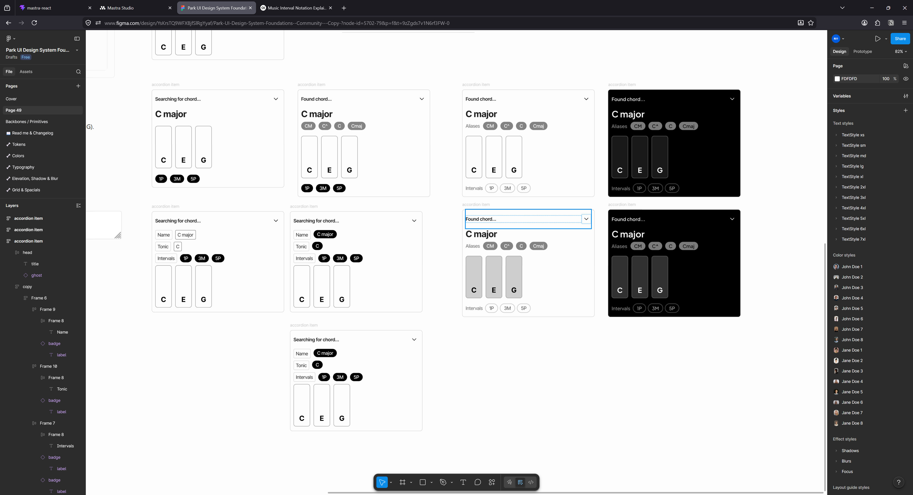
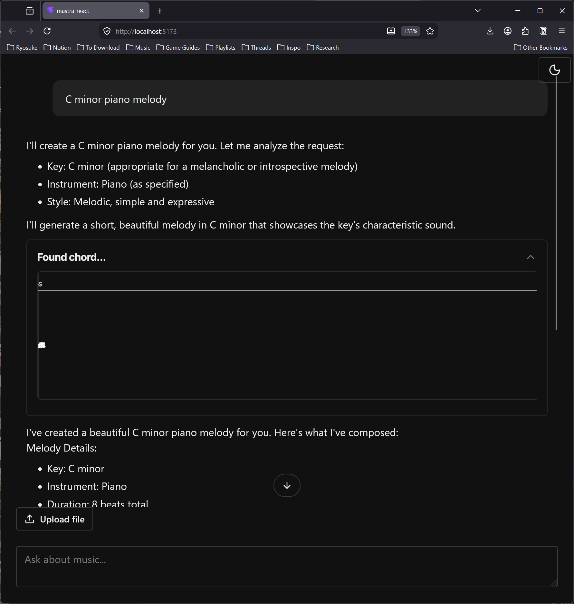

AI agents are taking over apps everywhere. And depending on their placement and design, they can become a nuisance or essential. I’ve been exploring integrating LLMs into different apps and researching how they can improve the user experience.

One of the areas I’ve been finding LLMs useful is music theory. It’s a topic that lends well to the LLM paradigm of rigid rules, relationships, and structure. Not to mention most models are trained with general music theory knowledge, similar to programming languages. This makes them immensely useful “out of the box” per say, and even more useful when you craft the appropriate experience around it.

Recently I noticed Mastra released the 1.0 version of their open source agentic framework. I thought, why not check it out and see how it can improve my workflow with LLMs. As you’ve seen with [previous](https://whoisryosuke.com/blog/2025/building-an-offline-llm-research-app/) [blogs](https://whoisryosuke.com/blog/2026/elevating-music-education-with-llms/) I’ve been doing work with LLM APIs for a bit. Though I tend to work directly with the model’s API and craft my own toolset around that (like RAG).

With Mastra, I can create quickly create a specialized AI agent with it’s own system prompt, memory, and even tools. And with it’s Studio dashboard, I get some nice observability over my API calls and token usage. Sorry, sounded like an ad right? lol. But it’s a pretty solid framework and I was pretty impressed.

In this blog I’ll go over how I created a music theory agent with Mastra, how I set it up to work locally with LM Studio, and share my experience with the framework and it’s observability tools.

# What is Mastra

I covered a bit in the intro, but [Mastra](https://mastra.ai/) is an open source JavaScript framework for creating AI agents.

You basically point it to an LLM API - like OpenAI or Claude - or in my case, my local LM Studio instance. You could also use the ollama CLI. You basically just want an OpenAI compatible API endpoint.

Mastra then uses this LLM API to chat with it, like you normally would in your own app. But Mastra also handles things like injecting a system prompt, or hosting the tools the LLM can run.

You can create as many agents as you need (like a “teacher” agent vs a “composer” agent), to specialize them to particular tasks. And obviously create tools for them, and share tools between them.

They have a “Studio” package you get out of the box that spins up an admin dashboard for your agents. You can browse all the agents you’ve created, chat with them as a quick test (if you don’t have a frontend setup yet), and review the logs of all LLM messages and tool calls.

And there’s plenty of features that simplify other processes, like utility functions for chunking text for vector embeddings.

# Why use Mastra

I’d recommend using Mastra if you want to add 1 or more agents to your app and require using things like tools. And if you just want an out of the box framework for creating agents instead of writing your own — at the cost of hosting an additional server app.

You can get observability from other libraries, like Langfuse, which are dedicated dashboards for tracking LLM usage - so it’s nice to have in Mastra, but if you’re doing a serious setup you’ll have better metrics. The observability is nice for development though, as you can inspect the logs of each API call (kinda like [Reactotron](https://github.com/infinitered/reactotron) for React Native if you’ve ever used that back in the day).

# What you need

I followed the getting started guide in the Mastra documentation, following the steps for a React project. You can follow along there too.

To simplify things, I did use an LLM to generate code for this project. It’s encouraged by the Mastra docs, and they offer [a Mastra skill](https://github.com/mastra-ai/skills) you can install that teaches your LLM how to use it.

```tsx
npx skills add mastra-ai/skills
```

I added this to my project and was able to use it with [OpenCode](https://opencode.ai/) (or any other standard agent, like Claude). It was pretty effective for scaffolding out chunks of the app.

# Getting started

I ran the mastra initialization script. For the initialization script I picked OpenAI, Skills, and Universal agent as my options. That generated a project with a default template for me, giving me access to an example “weather” agent.

Spun up server, gives you a nice UI called “Studio” where I can chat with the weather app. It worked well, and was able to pick up weather from my location (if you look at the “tool” it runs, it just uses a public weather API).



Next I added LM Studio as my model to each agent, [as per the docs suggested](https://mastra.ai/models#example-lmstudio).

```
  model: {
    id: "lmstudio/openai/gpt-oss-20b",
    url: "http://127.0.0.1:1234/v1",
  },
```

Awesome, now that we have an example agent and tools setup, let’s get a frontend working so we can chat with it (outside of the Studio dashboard).

I followed [the instructions](https://mastra.ai/guides/getting-started/vite-react) for installing the React app using Vite. This creates a basic React app with Vite, then installs a bunch of AI-centric dependencies, like Vercel’s AI SDK and it’s official UI compoents: AI Elements.

The process was a little clunky due to some kinks in shadcn, but I got it working with a bit of tinkering.

I had an issue AI Elements wouldn’t add components, giving me an error about my `tsconfig` file and the `baseUrl` property being missing. I’m actually running the latest version of TypeScript, which deprecates the `baseUrl` property, so I get an error if I include it. So I temporarily added it, then ran the AI Elements initialization, then removed it again.

Copied over the App from the Mastra docs — ran the app and… it failed, got an error:

```tsx
1:06:59 PM [vite] (client) Pre-transform error: Failed to resolve import "@/lib/utils" from "src/components/ui/separator.tsx". Does the file exist?
  Plugin: vite:import-analysis
  File: E:/Development/JavaScript/mastra-react/src/components/ui/separator.tsx:6:19
  2  |  import * as React from "react";
  3  |  import { Separator as SeparatorPrimitive } from "radix-ui";
  4  |  import { cn } from "@/lib/utils";
     |                      ^
  5  |  var _jsxFileName = "E:/Development/JavaScript/mastra-react/src/components/ui/separator.tsx";
  6  |  import { jsxDEV as _jsxDEV } from "react/jsx-dev-runtime"; (x2)
```

Seems the CLI didn’t install necessary utilities… Asked Claude — seems it was aware this was a shadcn thing and gave me the utility.

Open the app finally and….it looks like this:


Terrible DX - from the CLI clunking out a few times and requiring me to manually do stuff anyway — to this? Like what?

But it works! lol

It’s hard to see, but there’s an input box on the bottom of the screen. I can type in and it access the Mastra server and automatically connected with weather agent. Despite the text being cut off in the input box and the app not being styled correctly (should be dark mode on my system) - we can assume things (mostly) work.

# Music theory agent

I’ve talked about it in my previous blog where I created an LLM for my piano learning, but I’ll say it again because it bears repeating. While LLMs are baked with a lot of great knowledge, there’s also inaccuracies, and even chances for hallucination. To reduce this, we need to provide the LLM with as much information as possible. We do this in the form off “tools”, a function the LLM can call to run an action and optionally receive data in return.

For example, we can create a tool called `getNoteByMidi` where the LLM can send a MIDI note and get the appropriate piano note back. This lets the user mention MIDI notes in their message, and the LLM can convert them to piano notes if it needs to refer to them in that notation — or just convert it if the user needs it.

These tools are literally just a single function that runs on our server where we can literally do anything. We can grab data from an API or database, or run math calculations, or generate an image even and send that over.

> ℹ️ Tools are a great way to provide LLMs with more context and validate their logic. For example, if the LLM hallucinates and gets information wrong - like the MIDI index of a note, it can quickly use a tool to verify it’s knowledge before responding to the user with it. This reinforcement layer increases the stability and accuracy of the model’s replies.

In Mastra, tools are defined using strict schemas powered by Zod. They basically define the data the tool expects the LLM to provide (like in our case, a midi note) and the data it’ll return back to LLM (and user). And a `execute` property that contains our function that runs and returns data.

Here’s an example of the `midiToNoteTool`:

```tsx
export const midiToNoteTool = createTool({
  id: "midi-to-note",
  description: "Convert MIDI number to note name",
  inputSchema: z.object({
    midi: z
      .number()
      .describe("MIDI note number (0-127, e.g., 60 for Middle C)"),
    sharps: z
      .boolean()
      .optional()
      .describe("Use sharps instead of flats (default: false)"),
    pitchClass: z
      .boolean()
      .optional()
      .describe("Return pitch class only without octave (default: false)"),
  }),
  outputSchema: z.object({
    midi: z.number(),
    noteName: z.string(),
  }),
  execute: async ({ midi, sharps = false, pitchClass = false }) => {
    const noteName = Midi.midiToNoteName(midi, { sharps, pitchClass });
    return { midi, noteName };
  },
});
```

So now that we kind off understand tools, how they’re used, and what they look like in Mastra — let’s never think about it again.

Thanks to the Mastra skill and my local LLM, I’m able to generate these tools automatically by just chatting with my local LLM and asking for what I need.

But we can take it a step further. What if our LLM also knew how to use a JavaScript library for music theory? Then it could automatically generate most of our tools for us.

## Tonal skill

There’s a few libraries for music theory in the JavaScript community, and tonal is a pretty solid option with great documentation. I’ve used it a few of my previous apps and it’s great as a utility for simply converting piano notes to MIDI and vice versa — or handling more complex tasks like generating or detecting chords and scales.

If we had a skill for it, the LLM would be able to use it alongside Mastra to create more informed tools that actually use `tonal` and it’s APIs for music theory magic. The LLM needs to know about all the functions it can call, as well as the shape off the data structures (like what is a `Note` vs a `Chord`).

The goal is to create a Markdown “skill” file that describes how to use tonal to the LLM, and also provide links to more detailed documentation about each function and object type.

I created a new folder in my `.agents/skills/` folder called `tonal` and created a placeholder `SKILL.md` file.

> ℹ️ You can find the specification for skills at [AgentSkills](https://agentskills.io/home).

I went to the Tonal repo and grabbed their documentation since it’s pretty small (maybe like 20 Markdown files total), and copied it over into a `references` folder. These would be the more detailed documentation if the LLM needed API specs for example.

Then I prompted my local LLM to generate a NodeJS script to recursively walk through the references folder and generate a Markdown list of the files as relative links. This gave me something like this:

```tsx
- **Intervals**: [`references/basics/intervals.md`](references/basics/intervals.md)
- **Midi**: [`references/basics/midi.md`](references/basics/midi.md)
- **Notes**: [`references/basics/notes.md`](references/basics/notes.md)
```

Then I pumped this list into my local LLM and asked it to generate a skill file for tonal.

> ℹ️ In this case, I used Open WebUI to generate the response, and I was able to create a workspace where I can add the tonal documentation as a kind of RAG, allowing the LLM to have greater insight into the API.

It generated a skill file with examples for all the basic tonal functions, and even linked to the detailed docs when necessary:

`````tsx
---
name: tonal
description:
"Use this skill whenever you need to work with music theory in JavaScript using the Tonal library.
Triggers include: building music apps, generating chords or scales, working with MIDI, analyzing
harmonic progressions, transposing notes, computing intervals, working with keys or modes, voicing
chords, handling rhythm/time signatures, or any task involving music notation or theory in code.
Always use this skill when the user mentions Tonal, tonal.js, or asks you to write JavaScript that
involves notes, chords, scales, intervals, MIDI, or music theory — even if they don't use the word
'Tonal' explicitly."
license: Apache-2.0
metadata:
author: whoisryosuke
version: "1.0.0"
repository: https://github.com/whoisryosuke/skills
---

Tonal is a modular, functional JavaScript music theory library. It is tree-shakable and works in
both ESM and CommonJS environments (browser and Node.js).

**Reference files** are linked throughout this document. Read them when you need full API details,
type signatures, or exhaustive lists (chord/scale names, etc.).

---

## Installation

```bash
npm install tonal
````

```js
// Named imports — prefer this (tree-shakable)
import {
Note,
Chord,
Scale,
Key,
Interval,
Midi,
Mode,
ChordType,
ScaleType,
Progression,
RomanNumeral,
Collection,
Range,
Pattern,
Duration,
Rhythm,
} from "tonal";
```

You can also import from individual packages (e.g. `@tonaljs/note`) if bundle size is critical.

---

## Mental Model

Tonal is **functional and immutable**. Every function takes plain values (strings, numbers) and
returns plain values or plain objects — there are no mutable instances. Invalid inputs never throw;
they return `null`, `NaN`, or an object with an `empty: true` flag.

Key string conventions:

- **Notes**: `"C4"`, `"Db3"`, `"F#5"` — letter + optional accidental (`b`, `#`, `bb`, `##`) + optional octave
- **Intervals**: `"3M"` (major third), `"5P"` (perfect fifth), `"7m"` (minor seventh), `"-2M"` (descending major second)
- **Chord symbols**: `"Cmaj7"`, `"Dm7"`, `"G7"`, `"Abm"`, `"F#dim7"`
- **Scale names**: `"C major"`, `"D dorian"`, `"Bb pentatonic"`

> 📖 For full note/interval/MIDI conventions → [`references/basics/notes.md`](references/basics/notes.md), [`references/basics/intervals.md`](references/basics/intervals.md), [`references/basics/midi.md`](references/basics/midi.md)

`````

> 📁 You can find the full source code for this in [my skills repo](https://github.com/whoisryosuke/skills/tree/main/skills/tonal).

With this skill in my project, I launched OpenCode and started generating a few tools. Tested out my Tonal skill by asking it to make a `getChord` tool inside a new “music theory” agent.

Seemed to work well — generated a tool and even had the correct schema for a chord (presumably from the skill…)


You can see it using the new tool in the middle of the chat messages.

> 📁 I noticed that local models had the same context issues I have with most apps. If I try prompting again after using a tool, the LLM won’t use the tool again. This is due to the context oversaturating and the agent losing track of it’s initial instructions (with tool suggestions).

## More tools

I asked Big Pickle model (OpenCode’s temporarily free cloud-based model) to give me a suggested list of tools based on the Tonal API and it generated 3 “tiers” based on priority:

**Tier 1:**

- getKeyTool - `Key.majorKey()`, `Key.minorKey()`
- getIntervalTool - `Interval.semitones()`, `Interval.get()`
- transposeNoteTool - `Note.transpose()`
- noteDistanceTool - `Note.distance()`

**Tier 2:**

- midiToNoteTool – `Midi.midiToNoteName()`
- chordDetectionTool – `Chord.detect()`
- scaleDetectionTool – `Scale.detect()`
- chordTransposeTool – `Chord.transpose()`

**Tier 3:**

- getModeTool – `Mode.get()`, `Mode.notes()`
- getRomannumeralTool – `RomanNumeral.get()`
- progressionTool – `Progression.fromRomanNumerals()`
- **chromaticRangeTool** – `Range.chromatic()`

It basically took the API and reflected it as tools - which is exactly what I kinda wanted (at least as a start).

Suggestions were pretty good, told it to do most of them. You can see the new system prompt that it generated with the complete list of tools and what they do:

```tsx
You are a knowledgeable music theory assistant that helps users understand music theory concepts.

Your primary function is to answer questions about music theory. When responding:
- Explain concepts clearly and provide examples when helpful
- Use standard music theory terminology
- Cover topics like scales, chords, intervals, harmony, rhythm, and form
- If asked about a specific concept, provide accurate information

Available tools:
- getChordTool: Look up chord information by chord symbol
- getScaleTool: Look up scale information by scale name
- getKeyTool: Get key information including diatonic chords
- getIntervalTool: Get interval information by interval name
- transposeNoteTool: Transpose a note by an interval
- noteDistanceTool: Get interval between two notes
- midiToNoteTool: Convert MIDI number to note name
- chordDetectionTool: Detect chord from notes
- scaleDetectionTool: Detect scale from notes
- chordTransposeTool: Transpose a chord by an interval
```

Here’s example of note to distance:


And here’s one note to MIDI


After doing some testing with the tools, they worked fairly well, but I felt like some of the UX could be improved. For example, I’d ask the LLM to convert a `C5` note to MIDI, and since there’s no note to MIDI tool, it tried using the MIDI to note tool and it guessed the necessary MIDI note (and was wrong). This led to it using the note distance tool to verify that it was wrong (which was cool) but showed the need for better tooling.

## The Agent Frontend

Coming back to the frontend, it was looking kinda rough. I spent some time converting the shadcn and AI Elements components and Tailwind styles to use Park UI and Panda CSS instead. And by I spent some time, I used it as an opportunity to run some tests on local vs cloud based LLMs and their effectiveness converting code.

I’ll be sharing more details in another blog, but I basically used OpenCode and a local LLM (along with OpenCode’s Big Pickle cloud model) to convert over 50 components to use Park UI components and Panda CSS. Overall the process took about 6 hours, 4 hours of research and tinkering - and then 2 hours of letting the model’s run and convert code.

This honestly didn’t improve the look of the design immensely — since most of the library is fairly unstyled anyway. Thanks to the conversion though, it was much easier for me to go in and style the components to my liking.

Here’s an example of what the UI looks like after the conversion and some slight customization:


## UI for tools

Now that frontend is wrangled, let’s start working on the fun stuff. When we call the tools now we get a generic tool component that renders with the input and output as a JSON code snippet.

That’s handy for debugging, but as a user, it wouldn’t be that helpful to me. Most user’s aren’t going to want to parse JSON with their eyeballs. And the information is so 1 dimensional every time - it has no context of it’s meaning. It’s just raw data. We can do better than that.

Instead, let’s render a custom UI for each tool. If the user is getting information about a chord (or the LLM is retrieving some for whatever reason), let’s display the chord information to the user in a digestible way.

> ℹ️ In my previous blog where I added an LLM to my piano learning app, instead of displaying key information with tool calls, I asked the LLM to return “shortcodes” in the form of React components. These React components rendered to UI using an MDX renderer, which returned more rich elements embedded in chat messages, like rendering notes as sheet music. Each approach has it’s pros and cons (like the MDX version requiring a server parsing the MDX for security purposes).

I took at look at the schema for the `Chord` data and it looked like this:

```json
{
  "chords": [
    {
      "name": "C major",
      "tonic": "C",
      "type": "major",
      "notes": ["C", "E", "G"],
      "intervals": ["1P", "3M", "5P"],
      "aliases": ["M", "^", "", "maj"]
    }
  ]
}
```

A lot of the properties are pretty obvious. We’ll definitely want the `name` nice and clear for the user, and we have to show the `notes` array as actual piano keys - I mean come on. There’s other metadata in there like the `aliases` that we can display as a “sub-heading” to the `name`.

I popped over to Figma using the Park UI template and started tinkering away at a design:



In the `App.tsx` currently, we copied over the chat template from the Mastra docs. That has a section where they check for tools by looking at the message for any tool calls. There it uses a `<Tool>` component to display the accordion and generic code snippet.

We can tap into that and swap that component out with a `<ToolView>` component that’ll handle switching between out different tool UI “widgets”.

```tsx
if (part.type?.startsWith("tool-")) {
  return <ToolView content={part as ToolUIPart} id={message.id} index={i} />;
}
```

That `<ToolView>` component is pretty simple, when I said it’s switching between components, I literally mean `switch`:

```tsx
import React from "react";
import type { ToolItemProps, ToolTypes } from "./types";
import DefaultTool from "./DefaultTool";
import ChordTool from "./ChordTool";

type Props = ToolItemProps & {};

const ToolView = ({ content, ...props }: Props) => {
  const toolName = content.type.replace("tool-", "") as ToolTypes;

  if (content.state != "output-available") {
    return <></>;
  }

  switch (toolName) {
    case "getChordTool":
      return <ChordTool content={content} {...props} />;

    default:
      return <DefaultTool content={content} {...props} />;
  }
};

export default ToolView;
```

When we chat with the LLM and it uses tools, if we inspect the response from the API, the tool call has a `type` associated with it that shares the same name as our tool in Mastra. So for the chord tool, it’s `getChordTool` like we defined earlier.

Now we can create a custom widget for that tool specifically that renders the chord data. But first, let’s take a look at how we get the tool data.

```tsx
const ChordTool = ({ id, index, content, className }: Props) => {
  console.log("chord tool", content);
```

Our `content` prop is the one of the `message.parts` we got earlier. For a tool, that content contains a `input` and `output` property that contains the JSON data we normally see in the accordion. The `input` represents the data sent by the LLM to make the tool request, and the `output` is the data the tool server (Mastra in our case) sends back.

Looking back at our tool in Mastra, here’s the schema the LLM generated:

```tsx
export const getChordTool = createTool({
  id: 'get-chord',
  description: 'Get chord information by chord symbol (e.g., "Cmaj7", "Dm7", "G7")',
  inputSchema: z.object({
    chordSymbol: z.string().describe('Chord symbol to look up (e.g., "Cmaj7", "Dm7", "G7")'),
  }),
  outputSchema: z.object({
    chords: z.array(z.object({
      name: z.string(),
      tonic: z.string().nullable(),
      type: z.string().nullable(),
      notes: z.array(z.string()),
      intervals: z.array(z.string()),
      aliases: z.array(z.string()),
    })),
  }),
```

> ℹ️

The `output` property is the same data structure I showed earlier in Zod form. Just wanted to emphasize where it came from.

You can see our `output` will have a `chords` property with an array of possible `chord` objects. We can map over these and render a `<ChordBreakdown>` component.

```tsx
const chords = content.output.chords as Chord[];
const renderChords = chords.map((chord) => (
  <ChordBreakdown key={chord.name} chord={chord} />
));
```

The one thing I will note is that because our chat “streams”, there is a possibility we’ll have a tool, but we won’t have the data yet. Each message part has a `state` property that lets you know if it’s streaming, awaiting tool input from the LLM, or waiting for the server to respond with the tool. In this case, we should display either a loading state, or nothing at all. I handle this in the top level `<ToolView>` component.

```tsx
if (content.state != "output-available") {
  // Render nothing for now - but a loading state is better
  return <></>;
}
```

That breakdown component is just a bunch of Park UI components like `Badge` and `Heading` that replicate the Figma design — nothing too interesting to include here. I wrapped the breakdown component in an accordion component so that it matches the visual structure of the other tools.


The local chat app with the user asking “What are the notes in a CMaj chord?”. Below is a tool call accordion labeled “Found chord…” with the chord name, aliases and intervals underneath, and the notes as piano keys above the intervals. Below that is a response from assistant with details in written form.

Isn’t that so much nicer than the JSON results we got earlier? Now imagine what we could do for other tools - like the note to MIDI conversion tool.

We could even take this a step further and add an audio player to the component to allow the user to listen to the chord - or play the individual keys and hear them. The potential is endless once we’ve opened the door.


## Generating music

If we actually want to generate music for the user, there’s a few ways we can approach it.

The easiest way is to ask the LLM to return music notes in the form of MIDI as JSON code. Most LLMs have a general sense of music knowledge, so you can take advantage of that.

The other option is to use a dedicated music generation model, like [Meta’s MusicGen](https://audiocraft.metademolab.com/musicgen.html). Those models actually generate sound data, similar to generative AI models for images and video (kinda yucky right?).

Let’s go with the first option. It’s easier to implement, and it’s ultimately the flow I want. Most music producers just want assistance crafting melodies, they don’t need someone making the song for them. At that point you’re likely just looking for new samples and there’s better (more legitimate) places for that.

I asked the local LLM to scaffold out a new music generation agent and a tool for it. It was a nice start that I took and edited to my liking:

```tsx
import { Agent } from "@mastra/core/agent";
import { Memory } from "@mastra/memory";
import { musicGenerationTool } from "../tools/music-generation-tool";

export const musicGenerationAgent = new Agent({
  id: "music-generation-agent",
  name: "Music Generation Agent",
  instructions: `
      You are a creative music generation assistant that creates musical compositions based on natural language prompts.

      Your primary function is to interpret user requests for musical compositions and generate structured MIDI-compatible JSON output. When responding:
      - Analyze the user's prompt carefully to understand musical parameters like style, mood, key, tempo, etc.
      - Generate a musical composition using the musicGenerationTool
      - Return the composition in MIDI-compatible JSON format with notes, timing, and duration information
      - Unless explicitly requested, omit unnecessary MIDI properties like velocity to keep output concise. 
      - Always provide clear and helpful responses about the generated music

      Available tools:
      - musicGenerationTool: Accepts a musical composition based on MIDI-compatible JSON and generates a MIDI file for user to export.

      When a user provides a prompt like "E minor piano melody with syncopation", you should:
      1. Extract musical parameters from the prompt
      2. Use appropriate defaults for missing parameters
      3. Call the musicGenerationTool to generate and return the composition
      4. Return a response to user with details about composition
  `,
  model: {
    id: "lmstudio/qwen/qwen3-coder-30b",
    url: "http://127.0.0.1:1234/v1",
  },
  tools: { musicGenerationTool },
  memory: new Memory(),
});
```

For the tool, we would just ask the LLM to provide MIDI notes, then return the notes to the user. Nothing wild here, just the same Zod object representing our MIDI notes (the “pitch” aka C4, and other props like timing or velocity). When we display the tool in the UI, we’ll be able to use the data however we like — like rendering a piano roll.

```tsx
import { createTool } from "@mastra/core/tools";
import { z } from "zod";

const dataSchema = z.object({
  notes: z
    .array(
      z.object({
        pitch: z.string().describe("Note pitch (e.g., C4, E#5)"),
        duration: z.number().describe("Note duration in beats"),
        time: z
          .number()
          .describe("Start time in beats from composition beginning"),
        velocity: z
          .number()
          .min(0)
          .max(127)
          .optional()
          .describe("Note velocity (loudness) 0-127, optional"),
      }),
    )
    .describe("Array of MIDI-compatible note objects with optional velocity"),
});

export const musicGenerationTool = createTool({
  id: "music-generation",
  description:
    "Display MIDI-compatible notes to user based on input. Returns a structured musical representation.",
  inputSchema: dataSchema,
  outputSchema: dataSchema,
  execute: async ({ notes }) => {
    return {
      notes,
      // metadata: {
      //   createdAt: new Date().toISOString(),
      //   version: "1.0.0",
      // },
    };
  },
});
```

Cool. Now we can kinda repeat the same process as before and just add a new `switch` case to our `<ToolView>` component.

```tsx
case "musicGenerationTool":
  return <MusicGenerationTool content={content} {...props} />;
```

This will contain the `<Accordion>` setup from before, as well as a new `<PianoRoll>` component. I won’t go into too much detail on that, it’s just a standard piano roll. I will say though, I asked the LLM to generate one for kicks and let me know you the slop I got back:



Rough. And that’s after 30 minutes. A lot of the code was “mostly” there, so I’m sure it’d just take a bit more prompting to find the bugs — but after 30 minutes of waiting, I just knocked it out myself.


Nothing too fancy, but it renders our notes in a way the user will be quite familiar with. And we can even offer features like exporting the notes as a MIDI file to import into other applications.

> ℹ️ You can see how easily this is to integrate into apps like Ableton if you use their plugin architecture, that way you could import MIDI data directly into your project. You could also experiment with the Web MIDI API and export the MIDI data to a device and record that device playback in a DAW. It’s a bit of a roundabout process, but it’s nice if you’re limited to a web app entrypoint.

# Observability

Observability is…ok. I feel like there’s some data that I’m missing at each level that would make it more useful. I don’t see token counts anywhere? Just how long everything takes (which is still nice - particularly for tools).

In the Studio admin when you click on an agent to chat with it, you can also browse traces associated with the agent. These don’t have a lot info, it’s preferable to browse using the global Traces tab which provides more metadata for each trace.


### Traces tab

I can see all the prompts, what goes into them (like LLM vs “memory”) - and the tool calls. This is a nice view for debugging. Particularly when anything failed, like tool calls.


But it’s tough, like if I wanted to debug why my model wasn’t using tools or hallucinating — I can’t really see how much context is used up from previous chats — or stuff like that. that’d be helpful.

### Logs

This page shows the raw JSON of all responses if you need that, which is particularly useful when debugging. I normally sit with my DevTools console open to see this kind of stuff.


Overall observability was solid, but lacking in a lot of key areas. I ended up just logging out most API calls anyway in development instead of checking this dashboard. This would be better for production where I need to trace a particular bug report.

# You good? What’s the Mastra?

After using it for a bit in development, I’m impressed with Masta. It’s a nice framework wrapper around LLM models and really simplifies the creation of different agents. And when combined with a good skill, it’s easy to command an LLM to steamroll parts of the platform for you. And it’s nice how integrated it is with the current AI ecosystem where things like Vercel’s AI SDK just works out of the box with it.

There’s not much to it though if you think about it. If you check out my previous music LLM blog, you can see that all this stuff you can accomplish from scratch accessing the API directly. It just requires encoding some logic, like system prompts and tools. And if you don’t need multiple agents, it’s a bit of overkill. You’re spinning up a whole additional server as a middleware for your model. That’s just another thing to host, another failure point, etc. The observability would be particularly nice in production, but at that point, you might also be looking into more serious and dedicated observability dashboards.

Maybe if you needed something like their memory management…but even stuff like RAG is pretty manual with only a few helpful utilities, so you end up coding about as much as you would from scratch.

I’ll be curious to see the platform grow a bit and what they focus on implementing. Seeing that it’s from contributors of Gatsby and the fact it’s open source (without a weird paid caveat) is pretty nice. If they can keep that kind of spirit up it’ll be a great addition to the AI ecosystem.

Have you tried Mastra yet? Or have you built your own multi-agent framework? Let me know on [socials](https://bsky.app/profile/whoisryosuke.bsky.social). As always, if you enjoyed this blog, make sure to share it. And if you want to support more blogs like this, consider contributing to my [Patreon](https://www.patreon.com/c/whoisryosuke).

Stay curious,<br />
Ryo
