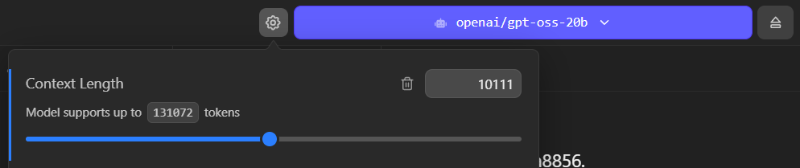

I’ve been exploring Penpot recently, the open source UI design platform competitor to Figma. One of the benefits of it being open source is being able to build custom workflows and integrations with it - like say - connecting an LLM model to it.

What if we could chat with a bot to manage design files, whether it be to create new designs or modify existing ones (like automating mass edits)? It’d be like having access to a developer that could code you a plugin for any specific task you needed. Penpot simplifies this with their MCP system - with an server-based MCP API to run commands - and a custom plugin to connect it to your design file.

But how practical is this workflow? Can it really generate designs from scratch? How hard is it to run locally? I’ll answer all these questions and a few more hopefully.

# What is “MCP”?

Model context protocol (or MCP) is an open source protocol that lets AI models interact with apps and tools. It’s basically an API for LLMs. The LLM can hit the API and get a list of “tools” available to it, and what each tool can do. Tools could be anything, from getting weather information from a remote API, to running local CLI commands on your PC or server. The LLM can then run tasks, usually before answering, to get the information it needs for the response.

The Penpot MCP is a server that runs and exposes an API for the LLM to access. It has a few tools, like a `api` tool that lets the LLM get API specs for specific elements - like what a `Rectangle` is. Then there’s a `execute_code` tool that essentially lets the LLM use Penpot’s JavaScript SDK to control the application. Using that you could do things like create new pages, update existing elements, all the ordinary operations you’d get in the app.

You can view a video of Penpot’s MCP [in action here](https://www.youtube.com/watch?v=CfvcgMQEmLk&list=PLgcCPfOv5v57SKMuw1NmS0-lkAXevpn10&index=1).

# Requirements

We’ll need to have 4 major things setup for this process:

- [Penpot](https://penpot.app/) (running locally ideally)
- [Penpot MCP server + plugin](https://github.com/penpot/penpot/tree/develop/mcp)
- An LLM (Preferably [local](https://lmstudio.ai/))
- [pnpm](https://pnpm.io/)

## Local vs Cloud LLM

In order to test this we’ll need access to an **LLM**. You can use cloud-based services if you prefer, but be warned, this process burns a lot of tokens (aka will cost you a lot of money). I’d recommend using a local model if possible in development.

To use a local model, there’s a few options out there. You want an app or CLI that can download models, lets you chat with them, and integrate MCP tools. Since I’m on Windows, I used [LM Studio](https://lmstudio.ai/) to handle this. But you could try things like [AnythingLLM](https://anythingllm.com/) - or combine Open Web UI with the [ollama CLI](https://ollama.com/).

I’ll be using the `gpt-oss-20b` model from OpenAI as my basis. And for reference, I’m running all this on a 4080 with about 32GB of RAM.

I recommend using a minimum of 10k tokens, if not more. If you don’t have a big enough context it will fill quickly with MCP tool requests and the LLM will “give up” saying it doesn’t know how or hallucinate.



## Penpot

You’ll need Penpot installed somewhere, ideally locally to simplify development. I used the Docker setup process, so I run it locally using `docker-compose` to expose it on `localhost`.

> ℹ️ Because Penpot plugins in development are served as an actual server — you’ll want your Penpot instance on the same network — or know how to expose your plugin server to your Penpot instance. You can try using the cloud version, but you’ll have to figure out how to expose your APIs properly.

## Penpot MCP + plugin

You’ll also need to clone the Penpot repo, and specifically the `mcp-prod` branch. Find [more documentation here](https://github.com/penpot/penpot/tree/develop/mcp).

```bash
git clone https://github.com/penpot/penpot.git --branch mcp-prod --depth 1
```

> ℹ️ You could also use the `develop` branch if you want cutting edge changes (at the cost of possible instability).

This gives you access to the **MCP server** and **Penpot plugin** we’ll need to use, located inside the `/mcp` folder.

# The setup

Once you have Penpot running, access to an LLM, and the Penpot repo cloned — we’re good to go.

The first part of the process is just following the instructions from the Penpot MCP [README](https://github.com/penpot/penpot/tree/develop/mcp#readme).

## Running MCP + Plugin server

We need to setup the environment, so run this script: `/scripts/setup`. I’m on Windows and Powershell, so I couldn’t run the bash script, but I just copied the contents and ran them myself — it’s basically a `pnpm install`.

Then we can run the server by running `pnpm run bootstrap`. This starts the MCP and plugin servers (2 different ports). You can see more information about it in the server logs:

```json
packages/plugin start: 11:15:28 AM [vite] preview server started
packages/plugin start:   ➜  Local:   http://localhost:4400/
packages/plugin start:   ➜  Network: http://192.168.1.5:4400/
packages/plugin start:   ➜  Network: http://172.26.0.1:4400/
packages/plugin start:   ➜  Network: http://172.30.0.1:4400/
packages/server start: INFO [2026-03-16 11:15:28.827] (main): Logging to file: E:\Development\Apps\penpot\mcp\packages\server\logs\penpot-mcp-20260316-111528.log
packages/server start: INFO [2026-03-16 11:15:28.840] (PluginBridge): WebSocket mcpServer started on port 4402
packages/server start: INFO [2026-03-16 11:15:28.841] (PenpotMcpServer): Registering tool: execute_code
packages/server start: INFO [2026-03-16 11:15:28.842] (PenpotMcpServer): Registering tool: high_level_overview
packages/server start: INFO [2026-03-16 11:15:28.842] (PenpotMcpServer): Registering tool: penpot_api_info
packages/server start: INFO [2026-03-16 11:15:28.842] (PenpotMcpServer): Registering tool: export_shape
packages/server start: INFO [2026-03-16 11:15:28.842] (PenpotMcpServer): Registering tool: import_image
packages/server start: INFO [2026-03-16 11:15:28.849] (PenpotMcpServer): Multi-user mode: false
packages/server start: INFO [2026-03-16 11:15:28.849] (PenpotMcpServer): Remote mode: false
packages/server start: INFO [2026-03-16 11:15:28.849] (PenpotMcpServer): Modern Streamable HTTP endpoint: http://0.0.0.0:4401/mcp
packages/server start: INFO [2026-03-16 11:15:28.849] (PenpotMcpServer): Legacy SSE endpoint: http://0.0.0.0:4401/sse
packages/server start: INFO [2026-03-16 11:15:28.849] (PenpotMcpServer): WebSocket server URL: ws://0.0.0.0:4402
packages/server start: INFO [2026-03-16 11:15:28.850] (ReplServer): REPL server started on port 4403
packages/server start: INFO [2026-03-16 11:15:28.850] (ReplServer): REPL interface URL: http://0.0.0.0:4403
```

The plugin runs on port `4400`, the MCP runs on port `4401` at the `/mcp` endpoint.

## Load plugin

Open up Penpot, go to a design file (ideally one you want to play with — blank or with test elements). Then open the plugins menu and install a new plugin using the path to the `manifest.json`:

```bash
http://localhost:4400/manifest.json
```

This should pop open a little plugin window with a “connect” button. If you click connect it should show a successful message underneath “Connected to MCP server”


Cool, now we can connect our LLM and start accessing our file.

## Integrating LLM

Now that we have our MCP server and the Penpot plugin setup, let’s connect our LLM to the MCP server so it can access our design file.

Since I’m using LM Studio, I went to [their docs on MCP](https://lmstudio.ai/docs/app/mcp) to figure it out. The process should be similar for most LLM apps/platforms though like [Claude Desktop](https://github.com/penpot/penpot/tree/develop/mcp#example-claude-desktop).

LM Studio has a `mcp.json` file we can edit to add our MCP servers. I had already edited this on my setup to experiment with Docker’s new MCP feature, where I added a DuckDuckGo search (run from a micro-VM) to my local LLM.


There was a bit of trial and error here trying to figure out the best way to connect to the MCP using LM Studio. Penpot’s MCP offers 2 endpoints: a modern HTTP endpoint (`/mcp`) and a legacy endpoint (`/sse`).

I tried the HTTP first

```tsx
"penpot": {
  "url": "http://localhost:4401/mcp"
}
```

And got an error from the MCP server logs:

```json
packages/server start: Error: Already connected to a transport. Call close() before connecting to a new transport, or use a separate Protocol instance per connection.
packages/server start:     at Server.connect (file:///E:/Development/Apps/penpot/mcp/node_modules/.pnpm/@modelcontextprotocol+sdk@1.27.1_zod@4.3.6/node_modules/@modelcontextprotocol/sdk/dist/esm/shared/protocol.js:217:19)
packages/server start:     at McpServer.connect (file:///E:/Development/Apps/penpot/mcp/node_modules/.pnpm/@modelcontextprotocol+sdk@1.27.1_zod@4.3.6/node_modules/@modelcontextprotocol/sdk/dist/esm/server/mcp.js:48:34)
```

Then I tried using the legacy endpoint, which required proxying the request through a Python library called `mcp-remote` that converts it to a “stdio” format request. And after all that…I basically got the same error.

So I dug into the error a bit and the MCP server’s source code a bit and uncovered the possible issue.

In the `/mcp` endpoint, the server is stored as a class property on `PenpotMcpServer`. Because of this, if we hit the endpoint more than once, the server doesn’t close the connection, and we get the error we see above. As a quick fix, we can just recreate the server on each request:

```tsx
this.app.all("/mcp", async (req: any, res: any) => {
  const userToken = req.query.userToken as string | undefined;
  await this.sessionContext.run({ userToken }, async () => {
    const { randomUUID } = await import("node:crypto");
    const sessionId = req.headers["mcp-session-id"] as string | undefined;

    // Reuse existing session transport — the original server is still connected to it
    if (sessionId && this.transports.streamable[sessionId]) {
      const transport = this.transports.streamable[sessionId];
      await transport.handleRequest(req, res, req.body);
      return;
    }

    // 🆕 New session: create fresh server + transport
    const server = new McpServer(
      { name: "penpot-mcp-server", version: "1.0.0" },
      { instructions: this.getInitialInstructions() },
    );

    // ⚠️ Register all tools/resources on `server` HERE, before connecting
    this.registerTools(server);

    const transport = new StreamableHTTPServerTransport({
      sessionIdGenerator: () => randomUUID(),
      onsessioninitialized: (id: string) => {
        this.transports.streamable[id] = transport;
      },
    });
    transport.onclose = () => {
      if (transport.sessionId) {
        delete this.transports.streamable[transport.sessionId];
      }
    };

    await server.connect(transport);
    await transport.handleRequest(req, res, req.body);
  });
});
```

We’ll also need to update the `registerTools()` method because it’s uses the internal class property:

```tsx
private registerTools(userServer?: McpServer): void {
  // Inside the function
  let localServer = userServer ?? this.server;
}
```

To make these changes, you’ll need to re-build the server code and restart the server:

```tsx
pnpm run build
pnpm run bootstrap
```

This resolves the error when LM Studio connects to the MCP server.

Now we should see a list of tools in the LM Studio sidebar if we enable the Penpot MCP:


Before you start chatting and trying to get the LLM to use these tools, consider setting a system prompt that tells the LLM how to use the MCP.

## System prompt

If you ask the LLM about the Penpot MCP now, it won’t have much knowledge. It can ask the tools for descriptions, but that’s it. How does the Penpot API actually work? How do you work with it? That’s what the `high_level_overview` tool is for.

If you check inside the Penpot `/mcp` folder we cloned from GitHub, you’ll find a `/data` folder with a Markdown file inside called `initial_instructions.md`. If you check out this file it basically describes to the LLM what the Penpot MCP is and what it can do with it:

```
You have access to Penpot tools in order to interact with a Penpot design project directly.
As a precondition, the user must connect the Penpot design project to the MCP server using the Penpot MCP Plugin.
```

You could copy this into your “system prompt” in your LLM app - but that’d take up **thousands** of tokens and context. Instead, try creating a system prompt that tells the LLM to use the tool initially and learn — then continue with your request:

```tsx
Before doing anything, run `high_level_overview` tool once to learn about Penpot MCP.

Then use the Penpot MCP tools available to fulfill the user's request.
```

This system prompt was the key to getting the LLM to use the tools and use them correctly. Without it, it was hit or miss, or it’d ask for information that was available through tools.

You can also experiment with other system prompts, as well as editing the instructions file to cater it to your own design system.

For example, here’s [a Copilot skill file](https://github.com/github/awesome-copilot/blob/main/skills/penpot-uiux-design/SKILL.md) that teaches the LLM how to design using Penpot using best design standards. You might want to replace the instructions markdown file with this instead of a system prompt, cause it’s ginormous.

### JSON5 Fix

I noticed that a few of my `execute_code` tool requests were failing with an error:

```
Failed to parse tool call: Failed to parse JSON5 arguments: JSON5: invalid character '`' at 2:11
```

When I checked the data the LLM was sending to the MCP server, I could see the issue — it was using backticks (`) to wrap the code - but JSON only supports wrapping in quotes.

```
Failed to parse arguments for tool "execute_code": params requires property "code"

<|start|>assistant<|channel|>commentary to=functions.execute_code<|constrain|>json<|message|>{ "code": ` const sel = penpot.selection; if (!sel || sel.length===0){ return 'No selection'; } const comp = sel[0]; const texts = penpotUtils.findShapes(s=>s.type==='text', comp); texts.forEach(t=>{ t.fills=[{fillColor:'#0B49AF',fillOpacity:1}]; }); const ellipses = penpotUtils.findShapes(s=>s.type==='text' && s.characters.includes('...'), comp); ellipses.forEach(e=>{ e.fills=[{fillColor:'#0B49AF',fillOpacity:1}]; }); return 'Updated colors'; ` }
```

I updated the system prompt to ensure it used valid JSON instead.

```
When calling execute_code, ensure the code argument is a valid JSON string. Do not use backticks to wrap the code; use double quotes and escape newlines as \n.
```

This resolved about 30% of the failures up to that point.

# Using the MCP

Now that we’ve everything finally setup — let’s start chatting with our LLM and have it interact with our Penpot design file.

There’s a few things we can do with access to our design file. We could generate designs from scratch - or using existing components. We could automate the [prototyping process.](https://www.youtube.com/watch?v=raha7nvY_j4&list=PLgcCPfOv5v57SKMuw1NmS0-lkAXevpn10&index=3) Or we could analyze a document to automate [creating a design system](https://www.youtube.com/watch?v=kNc6kUZvB6k&list=PLgcCPfOv5v57SKMuw1NmS0-lkAXevpn10&index=4) (or [generating code](https://www.youtube.com/watch?v=yoOOOPPXfc4&list=PLgcCPfOv5v57SKMuw1NmS0-lkAXevpn10&index=2)). You can find more inspiration in [the Penpot MCP playlist](https://www.youtube.com/playlist?list=PLgcCPfOv5v57SKMuw1NmS0-lkAXevpn10) on YouTube.

## Simple test

This is a nice sanity check if the MCP is connected correctly, and the system prompt is working right.

1. Open up a new file.
2. Start the Penpot plugin inside and connect to MCP server
3. Make an object (shape, text, component, anything) in Penpot. Make sure it’s selected.
4. Open up your LLM chat

and here’s the prompt I used:

```
Can you see what item I have selected?
```

And for me, it was able too see the component I had selected.


This is a great starting point. If you wanted to work on something specific, rather than describing it, just select it and let the LLM find it faster.

## Generating designs

Let’s start with something basic. Let’s have the LLM generate a design from scratch.

and here’s the prompt I used:

```
Can you make a teal 800px by 420px rectangle at 0,0 inside file e393a899-0314-805b-8007-b94ee0af8715?
```

> ℹ️ Initially I just prompted “can you make a rectangle” with no other details, and I got a follow up request asking for a size and position on page - so I altered my prompt to include it in follow up requests.

And here’s what it looked like in LM Studio - it took a few tool requests and then it sucessfully generated the rectangle.


- The first `execute_code` call tried to one-shot all the code. It found the page then tried to insert a rectangle into it.
- It seems this code failed, leading to another `execute_code` call that was a debug test checking if certain APIs existed (`penpot.shape`).
- When these didn’t exist, it finally did the right thing and asked for the docs using `penpot_api_info`. This gave it info about the Rectangle and Shape APIs.
- Then it finally created the correct code and ran it using `execute_code`.

Here’s the code it generated for reference, you can see it’s just using the Penpot JS SDK to programmatically control the page:

```tsx
const targetPage = penpotUtils.getPageById(
  "e393a899-0314-805b-8007-b94ee0af8715",
);
if (!targetPage) {
  return "Error: Page not found.";
}
// Create rectangle
const rect = penpot.createRectangle();
rect.resize(800, 420);
rect.x = 0;
rect.y = 0;
rect.fills = [{ fillColor: "#00695C", fillOpacity: 1 }];
// Insert into page root (top-level)
targetPage.root.insertChild(targetPage.root.children.length, rect);
return `Rectangle created with id ${rect.id} in page ${targetPage.id}`;
```

And with that, I had a rectangle on my page with all the correct details.


I will say, this prompt isn’t fool-proof. I tried it a few times and got mixed results each time. Sometimes the LLM would ignore all MCP tools and ask me for API info, or get lost using wrong APIs from it’s baked dataset. The system prompt helped mitigate this quite a bit, but still had a 10-20% failure rate.

> ℹ️ You’ll also notice that I asked it to work in a specific file ID. It’s not required, but it’s handy if you want to work across several files at once - since the Penpot API gives the LLM access to any file.

## Using components

A rectangle is cool, but what if we could use existing components? For this experiment you should open the MCP plugin inside a file with some example components. I picked the [Penpot’s design system](https://penpot.app/penpothub/libraries-templates/penpot-design-system), “**Pencil**”, that you can find for free in their community resources.

I looked through the file and pickled a random button I wanted to use. I picked a “Icon + Text” component.


Technically this component is organized under:

```tsx
Dark > Button > Primary > Icon + Text > Default;
```

This is very important to note.

I tried prompting the LLM to add the button to the page:

```tsx
I'd like to work inside file e393a899-0314-805b-8007-b95ef09a8856.

Can you create a new Page and name it "MCP Test".
Then add a Button component inside at 0,0. Use the Icon + Text button.
```

> ℹ️ Again, this wasn’t a “one prompt works every time” method. I tried this prompt and asked it to also edit the text inside, and it exploded - so I had to simplify the request down to this prompt. It also had issues renaming the page - so usually I’d get a new page, but with a default “Page 5” enumerated style name.

This worked….kind of. Penpot created the MCP Test page and added a “Icon +Text” component to it…but it wasn’t the component I was looking for.


It gave me a tab component with the same name. But why does this happen?

If we check the instructions we pass the LLM in `high_level_overview` tool, we’ll notice this is how we tell the LLM to find components/assets:

```markdown
## Components

Using library components:

- find a component in the library by name:
  `const component: LibraryComponent = library.components.find(comp => comp.name.includes('Button'));`
```

We tell the LLM to use a `find()` method on the component array. Cool that makes sense. But wait - it just checks the `name` property if it matches the name we passed.

If we go back to how our components are organized and named:

```tsx
Dark > Button > Primary > Icon + Text > Default;
```

You’ll noticed that our component is not even named “Icon + Text” or “Button”. It’s named “Default”. So to find it, we’d need to tell our LLM to find “Default”. Which you can imagine, is also a bad idea, since there’s probably plenty others.

I tried this a few more times with other components and had the same result. It’d always pick the wrong one.

So what’s the solution here?

I created a quick Penpot plugin to check out their SDK and see what the LLM was working with. Checking the `penpot.library.components` property I was able to see we had access to a `path` property. This returns the whole component path including it’s name - which is exactly what we want.

Instead of using the `name` property to get the component, we should be using the `path` property. This allows us to reference any part of the name. We can update the instructions to do this instead:

```markdown
Using library components:

- find a component in the library by name:
  `const component: LibraryComponent = library.components.find(comp => comp.path.toLocaleLowerCase().includes('Button'.toLocaleLowerCase()));`
```

> ℹ️ We also “sanitize” the component name and user query with a `toLocaleLowerCase()` method to ensure the user gets a `Button` even when they request a `button`.

Rebuilding and restarting the MCP server one more time and…

Same result. Despite altering the instructions, it still chose to use the same `find()` using the `name` property:

```tsx
const comp = penpot.library.local.components.find(
  (c) => c.name === "Icon + Text",
);
if (!comp) return "not found";
const instance = comp.instance();
instance.setParentXY(0, 0);
return "Button added";
```


> ℹ️ This was also after 4 attempts, all of which just failed with LLM telling me it wasn’t capable of doing it. And the final attempt it executed code 10 times before it figured out the right solution…

It’d probably be good to mention that at this point, just with 1 prompt - maybe 1 follow up in some cases, I’m reaching or exceeding 100% context — which is what’s leading to some of the errors. I tried probably like 3-4 more times and had it fail with weird `JSON5` encoding errors. Then I increased my context by 3x to 60000 and tried a few more times. Same errors.

I changed the prompt a bit and it after a few tries, it randomly just worked.

```
I'd like to work in the "MCP Test" page.
Then add a Button component inside at 0,0. The component path should contain "Icon + Text". Use the button named "Default".
```


And when I inspect the code it sorted the components correctly using the path name:

```tsx
const lib = penpot.library.local;
// find component
let comp = null;
for (const c of lib.components) {
  if (c.name === "Default" && c.path.includes("Icon + Text")) {
    comp = c;
    break;
  }
}
if (!comp) return "Component not found";
const instance = comp.instance();
instance.x = 0;
instance.y = 0;
return "Button instantiated at (0,0)";
```

This gave me the correct button.


Wow. How long did that take to just make a single button from an existing one? The answer is too long.

And for reference, I tried the same prompt again the next day, and it worked to create a button — but it added it to the page I was working on, not the MCP Test page I specified. Really enjoying these results where I get 70% of the way there every time…but in different unique ways!

## Automating changes

What if I wanted to update an existing file. Lets say I have a design system file and I’ve changed the color scale. Normally I’d either have to: update a bunch of layers manually or create a plugin to automate re-creating the elements.

But what if I could ask the LLM to make these updates? Ah yes, what if indeed.

I opened up the Pencil design system file and navigated to the “Workspace Assets Tab” page. There I selected one of the “color style” components.


Then I asked the LLM:

```
I have a component selected. It has a Text layer nested inside with a color hex code, can you change it to 0B49AF. Can you also find an ellipsis and change it's fill to that color?
```

And this is what I got:


It didn’t change the hex code, and it changed all the fill colors despite me even taking the time to look at the component structure - finding the circle layer called “ellipsis” and using that in my prompt.

My goal was to take the gray scale components above, give the LLM a new array of colors, and have it update all of them but after this? I'm losing a bit of confidence. It could do it, but it seems like I'd have to spend a bit of time refining my prompt (like targeting the correct elements, or telling it explicitly replace text inside).

# Fine tuning the model

Here’s a few things you can do to improve results:

- Decrease the temperature. I started on a default `0.8` and moved down to `0.1`.
- Increase the context size. I used `4096` at first (too small), then `10000` (1-2 requests per chat), then ended up on `30000` (good for 3-4 requests).
- Set “Context Overflow” to **Rolling Window**. This ensure when the context is filled with tool requests and the 2-3 messages you send, it’ll start dropping the oldest messages to make space.
- Use a chat app that supports resetting context. In LM Studio, your best bet is either the “Rolling WIndow” setting (see above) or just making a new chat each time.
- Fine tune the system prompt.

The best tip I can give is to ask the LLM for advice about LLMs. Go figure, they have an immense amount of insight into that topic and can provide feedback on your own configuration.

Ultimately though it’s important to remember it’s always going to be inconsistent, so be prepared to re-run functions and burn extra tokens/GPU use.

# The issues

Where do we start? Really the issue is less with the Penpot MCP itself, which is a solid enough setup. The issue lies more in LLMs themselves really. The inherent limitations of LLMs make work like this counterintuitive.

## Context bucket

You’re working with a software that basically has a limited bucket that’s constantly getting filled with basic command and thinking, and it requires you either be constantly emptying the bucket or relying on platforms that do that for you (ala OpenAI or Claude’s cloud-based models that are optimized for endless talk). And even the paid cloud services have their own limitations (beyond monetary expense) - despite the “endless context” you’ll find yourself constantly reminding the model of details or requirements.

When I was integrating an LLM into my music app, context wasn’t an issue. I had a fairly short system prompt that taught the LLM about the app and the user’s needs, and then the context just filled up as large the conversation continued. The LLM would make tool requests for data, like music chords, but it wouldn’t fill up that fast. The only time I hit context windows was when I had to give the LLM access to longer form music, like a song in MIDI format.

With this process though? You’re constantly hitting your threshold. And hitting the limit for basic stuff, I’m not even doing anything complex yet. Which would be fine if you could throw away your context constantly - but then you end up constantly repeating yourself or encoding and re-encoding logic for the LLM to learn. You end up working in very small increments which feels limiting.

> One of the most common optimization techniques in modern LLM chat apps (like Opencode) is measuring the context length, and once it exceeds a certain amount, remove tool requests from context to alleviate. Or in some cases, taking old messages and summarizing them using the LLM. They also leverage systems like "memories" to save data persistently across sessions. With all these systems however, you still run the risk of the LLM losing context over time.

## Irreproducible

I give you all my prompts and system prompts in full, even the model I’m using, no secrets hiding - because it’s important to know that there is no magic here. The magic is in the gambling of LLMs. Most of the prompts will fail most of the time. This is not only wasting your own time, but burning your GPU and electricity bills to do absolutely nothing.

You could replicate what the LLM does yourself and save the time and money. The only reason I’d consider this option is if I needed to automate at scale, and this experiment clearly proved this process doesn’t scale well - so I wouldn’t use it there either.

And it’s wild, because if you research how to improve the accuracy of an LLM, we’re doing everything we can here. Making an MCP that teaches LLM the API, giving it examples (like we do instructions), keep context small, or defining a clear syntax (like JSON/YAML). We do it all!

You know how we can improve this? Spending hours refining prompts to be exacting - yet minimal. Buying obscenely expensive GPUs. Waiting for them to release better models. Build systems to circumvent and bandage these unavoidable issues.

## Component nomenclature

There’s a disconnect between design applications and naming conventions. We’re seeing it more and more with the rise of variants and how they’ve butchered our layer names to be amalgations of the variant properties themselves. I want a “primary button”, I don’t want “4, bold, primary, no-icon, standard”.

We’ve got things like organization figured out with nesting of components - that works. The APIs need to reflect that better though. Rather than me having to implement a search engine around a component finding feature — the backend should just understand my needs and provide a better interface. This would simplify the LLM process a bit, instead of requiring additional instructions added to the context (which is bloated enough).

Maybe variants should have some sort of master name or ID, since that’s what we ultimately do (like a “Button” variant with all the buttons nested inside), and the LLM could tap into that pool first (instead of a giant mixed pool of all components with 30 duplicate names like “Default”).

> I could see this easily improved by creating a MCP endpoint that has access to the documents components and allows the LLM to "search" them -- rather than having the LLM have to generate the JS code to do it appropriately every time. This would help minimize the context too.

# What would I use this for?

I’ve been working with design systems a lot lately and having to build highly custom and niche plugins to run specific operations on the file (like walking through tokens and altering them, or analyzing elements to apply them to).

If this actually worked well, I’d love to use it instead of writing the code myself or assisted by the LLM. It’d save me a lot of time to define some requirements and let it run. Sadly it seems pretty far from that reality.

However when it comes to doing things at scale, it becomes harder to trust an LLM for the task. You end up building validation systems to check the work - when you ultimately could have just built a better programmatic system.

I love LLMs for things that are obscenely difficult with code - like natural language processing or image processing. The Penpot MCP example they give where they [convert a sketch to a design](https://www.youtube.com/watch?v=V140Mgk9v7Y&list=PLgcCPfOv5v57SKMuw1NmS0-lkAXevpn10&index=14) using real components is pretty cool. It reminds me of the [early Airbnb Design experiments](https://www.youtube.com/watch?v=3MPc3PZ6dc4). For me to code an app that analyzes an image and relates it to components — it’d take forever. Leveraging the LLM to quickly do it “mostly correct” is plenty. However I’d be curious how practical this process would be, and how much I’d actually use it. I’m sure it’s dependent on the accuracy and scale of the design system — more components - more places to get mixed up. And as we've seen, the context balloons quickly, so it's hard for the LLM to work across bigger sequences of frames/artboards (limiting the output a bit).

# Is Design MCP for me?

As you can probably tell, I’m not full convinced by this process. It’s still faster for me to do things using custom plugins I write myself - maybe even assisted with LLMs. If I had to dedicate myself to one design system, I could probably tailor this system a bit more by customizing the instructions more. I tend to work in different design systems with small to large projects, often changing their structure though, so it’d be difficult to adapt this between them all.

Or if I had to build an application that takes sketches and converts them to designs, this would be an avenue I’d explore. But if I needed natural language processing, I might build my own custom MCP instead of exposing the entire Penpot SDK - to limit the user to an existing design system and make it easier to tap into.

Are you using the Penpot or Figma MCPs? Or maybe integrating into another custom design app? Let me know what kind of successes you’ve had — and failures! I want to hear the good and the bad.

As always if you enjoyed this blog you can help out by using your social currency and [liking](https://www.threads.com/@whoisryosuke) or [sharing](https://bsky.app/profile/whoisryosuke.bsky.social) the blog on [socials](https://mastodon.gamedev.place/@whoisryosuke). And if you’d like to support more content like this, [check out my Patreon](https://www.patreon.com/whoisryosuke).

Stay curious,
Ryo
