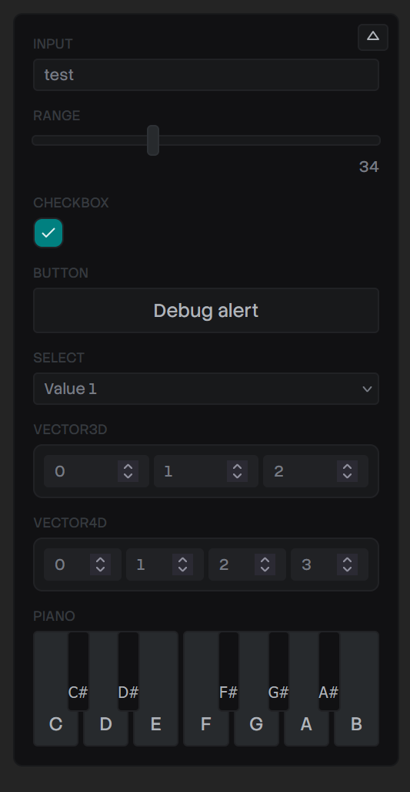
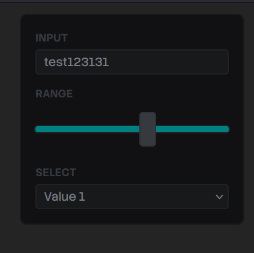
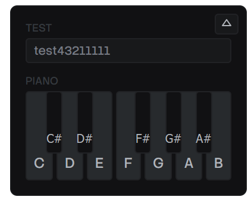

You’ve probably seen the videos on social media - there’s a cool looking prototype, but wait, the person expands a menu with a bunch of input sliders and knobs. Then they start to tinker with them - and as they do - the prototype responds and updates immediately to reflect the changes. Mind immediately blown 🤯

Needless to say, I needed my own. There’s out-of-the-box solutions out there like [leva](https://github.com/pmndrs/leva), but I wanted to make my own to have a bit of fun with it. Why not add components I need for my own workflows like say - a mini piano, or a line graph (for waveforms or data viz).

Introducing `debug-panel` - a Typescript library quickly creating debug elements that control values you can use in your prototype (like a number input that powers the `x` position of an object). It’s not just input elements though, like a button that runs any function you pass it.



In this blog I’ll go over the process of making this library: from the data architecture of the input, to the `useDebug` hook, to complex Typescript types. There’s a few gems in here for everyone.

# Why a debug panel?

In prototyping, that’s often referred to as a “debug panel”. It allows the developer to have control over the prototype without having to edit the code, and in some cases, rebuild and redeploy it. As you can imagine, this is useful for a lot of reasons.

At PlayStation it was actually one of projects I created internally as a side project to improve team productivity. Our work at the time involved creating prototypes for the PS5, and there wasn’t an easy way for people to edit prototypes on the fly. And with the PS5 process, the building a project was a bit more complex than other platforms. So it was incredibly valuable to be able to hand off an app to a UX tester and allow them to control elements of the prototype. They could enable or disable elements, switch to different “variations” on the fly, or even change data on the page (like swapping games).

In my personal projects it’s useful on a few different levels. The first and foremost is rapid prototyping and having something that lets me “slide” and toggle elements quickly without editing code, saving, and waiting for a reload. Imagine having to position a 3D object in a space without the helpers you have in 3D apps like Blender. The debug panel lets me quickly control the scene’s camera and move it as a I need, then also move or even rotate the object.

The second use is simple debug uses. There’s a lot of cases where I work with complex state machines and I need to create buttons that control it — like “resetting” the state back to it’s original value (imagine resetting a game and making the score 0, health max, etc).

I’m also working between lots of different projects, so you might end up building a nice system to “control” this stuff in one project — then move on to another and not be able to reuse much because it’s all tightly coupled to the other project (e.g. it uses the design system).

This allows me to quickly go between all projects and pop up a quick “reset” button and not have to think about:

- Creating a nice floating container that hides away
- Styling all the input elements (if I don’t have a design system in place)
- Engineering the shared state system (usually some global store, hooks — all boilerplate and setup that takes time)

# Designing the API

With libraries I like to start backwards. How do I envision the user actually using it? What’s the easiest, frictionless flow I can imagine? That’s where we start and see if we can accomplish that - and then make concessions as we go for sake of technical constraints.

For me, I was thinking of a React hook I could use in any component to make a debug input:

```tsx
// First param is the input "type"
// Second is ther input value
const debugValue = useDebug("input", "test");

return <div>{debugValue}</div>;
```

This is basically what I’m envisioning, we’ll see where we end up. It’s going to inevitably get a little more complex.

I wanted input types to be explicit. This allows for “easier” type checking, and less work on the backend trying to introspect types from random objects:

```tsx
const debugString = useDebug("test");
const debugBool = useDebug(false);
const debugVector = useDebug({
  x: 0,
  y: 0,
  z: 0,
});
```

This works, but like I mentioned, requires a lot of type sniffing in the backend that leads to code smells with how clunky that code tends to be.

# Defining types

The next step I’ll usually take in a library is to structure the data out with Typescript types.

I knew I needed a input “type” and something to represent it’s value. The value would be closely tied to the type — for example, a range slider might need a min and max number, along with a default “starter” value.

## Input

Here’s what a standard input looks like:

```tsx
// Input (generic)
export type DebugInputData = {
  value: number | string;
};
export type DebugInput = DebugItemBase & {
  type: "input";
  data: DebugInputData;
};
```

It’s an `input` ”type”, and the data type is just a simple `value`. If we think of an `<input>` element, that’s all we kinda need:

```tsx
<input type="text" value={debugInput.value} />
```

You’ll also notice we have a `DebugItemBase` type. This represents data we want shared between all our debug input data. In my case, I just need to store an `id` to keep track of which element is which (since you could have multiple of the same type, we need a way to make each unique).

```tsx
export type DebugItemBase = {
  id: string;
};
```

## Range

With that kind of thinking, if we wanted to create a range slider:

```tsx
<input
  type="range"
  min={data.min}
  max={data.max}
  step={data.step}
  value={data.value}
/>
```

We’d need a `min`, `max` `step`, and `value` properties. That’d look like:

```tsx
// Range
export type DebugRangeData = {
  min: number;
  max: number;
  step: number;
  value: number;
};
export type DebugRange = DebugItemBase & {
  type: "range";
  data: DebugRangeData;
};
```

## Select

Cool, now we have a `DebugInput` and a `DebugRange`. You can imagine how other input might look, like say, a `<select>`:

```tsx
// Select
export type DebugSelectItem = {
  title: string;
  value: string;
};
export type DebugSelect = DebugItemBase & {
  type: "select";
  data: {
    value: string;
    items: DebugSelectItem[];
  };
};
```

## Discriminated Unions

But what do we do with all these types?

With Typescript we can combine all these types into a single type using a process called [“discriminated union”](https://www.typescriptlang.org/docs/handbook/typescript-in-5-minutes-func.html#discriminated-unions).

```tsx
export type DebugItem =
  | DebugSelect
  | DebugRange
  | DebugInput
  | DebugCheckbox
  | DebugButton
  | DebugVector3D
  | DebugVector4D
  | DebugPiano;
```

It takes all the types and makes a big “switch” statement basically using one of the properties that gets shared between all the types. In our case, it’s the `type` that we change between each input.

That way, when we access a debug item, we can do a `switch` statement and Typescript will inform our IDE what the specific type is:

```tsx
const debugItems: DebugItem[] = [];
debugItems.forEach((item) => {
  switch (item.type) {
    case "input":
      // If we inspect this in our IDE, we'd see DebugInput
      console.log(item.data);
  }
});
```

This is a great way to make an extensible system that supports more input types later.

# Data store

Now that we have know how our data is structured, let’s figure out how to store it.

I’ll be using `jotai` for my state management library. It lets me create a global store where I can keep data and then use hooks to like `useAtom()` to get access to the data inside React component (or in our case - a React hook).

The store is rather simple. It’s just an array of the `DebugItem`, and a `visible` property to keep track if we’re hiding the panel or not.

```tsx
type DebugStore = {
  visible: boolean;
  items: DebugItem[];
};

export const debugStore = atom<DebugStore>({
  visible: false,
  items: [],
});
```

> ℹ️ In the past I’ve used a hash map for this kind of storage instead of an array. So rather than it being `DebugItem[]` it’d be `Record<DebugId, DebugItem>`. This makes it a lot easier to work with immutable state stores instead of the messy `.map()` and spread syntax nonsense we’ll get ourselves into later. The only tradeoff for the hash map is the cost of converting it to an array using `Object.entries()` each time - since you can loop over objects, but not easily filter them.

# The hook

Lets go back to the API we defined earlier:

```tsx
// First param is the input "type"
// Second is ther input value
const debugValue = useDebug("input", "test");

return <div>{debugValue}</div>;
```

We could have a hook like this:

```tsx
import { DebugItem, debugStore } from "@/store/DebugStore";
import { useSetAtom } from "jotai/react";
import { selectAtom } from "jotai/utils";
import { useEffect, useMemo } from "react";

// const data = useDebug("input", { value: 4 })
export function useDebug(
  type: DebugItem["type"],
  defaultData: DebugItem["data"],
) {
  const id = useMemo(() => crypto.randomUUID(), []);
  const data = selectAtom(debugStore, (store) =>
    store.items.find((item) => item.id == id),
  );
  const updateStore = useSetAtom(debugStore);

  useEffect(() => {
    updateStore((prev) => {
      const newItem = {
        data: defaultData,
        type,
        id,
      } as DebugItem;
      const newItems = [...prev.items, newItem];

      return {
        ...prev,
        items: newItems,
      };
    });

    return () => {
      updateStore((prev) => ({
        ...prev,
        items: prev.items.filter((item) => item.id != id),
      }));
    };
  }, []);

  return data;
}
```

It works by:

1. User adds `useDebug` hook to component.
2. `useDebug` runs
3. It generates a unique UUID.
4. Saves the user’s debug input into the store by the UUID.
5. We grab debug inputs from store and filter them by the UUID, and return that data to the user.

This kinda works (I think `selectAtom` gets swapped later with `useAtomValue`) but ultimately I wasn’t happy with the API.

Instead of doing 1 debug value at a time, I thought it’d be more efficient to pass multiple. It felt strange having multiple of the same hook inside a component, especially when they access the same data store. This also solved the issue of generating a unique `id` for storing the debug items in the store.

```tsx
const { input, range } = useDebug({
  // String input
  input: {
    type: "input",
    value: "test",
  },
  // Range input
  range: {
    type: "range",
    min: 0,
    max: 100,
    step: 0.1,
    value: 4.2,
  },
});
```

Now with this setup, let’s start modeling the hook.

```tsx
import { DebugItem, debugStore } from "@/store/DebugStore";
import { useAtomValue, useSetAtom } from "jotai/react";
import { useEffect } from "react";

export type UseDebugItem = {
  type: DebugItem["type"];
} & DebugItem["data"];

// const data = useDebug({ exampleProp: { type: "input", value: 4 } })
export function useDebug<T extends string>(items: Record<T, UseDebugItem>) {
  const store = useAtomValue(debugStore);
  const ids = Object.keys(items);
  const data = store.items
    .filter((item) => ids.includes(item.id))
    .reduce(
      (merge, prev) => ({
        ...merge,
        [prev.id]: prev.data.value,
      }),
      {} as Record<T, DebugItem["data"]["value"]>,
    );
  const updateStore = useSetAtom(debugStore);

  useEffect(() => {
    updateStore((prev) => {
      const newItems = Object.entries(items).map(([id, item]) => {
        const { type, ...data } = item as UseDebugItem;
        return {
          type,
          data,
          id,
        } as DebugItem;
      });
      const updatedItems = [...prev.items, ...newItems];

      return {
        ...prev,
        items: updatedItems,
      };
    });

    return () => {
      const ids = Object.keys(items);
      updateStore((prev) => ({
        ...prev,
        items: prev.items.filter((item) => !ids.includes(item.id)),
      }));
    };
  }, []);

  return data;
}
```

This is very similar to the last hook, but we traverse over an object an it’s keys and values (rather than handle 1 item at time).

This worked - but the types didn’t. This solves the problem of the hook returning the same “keys” the user provides in the config. However, when you inspect the value the hook returns in your IDE, it’ll show it as a the `DebugItem['value']` type — not the specific debug input type (like `DebugSelectData`).

Currently our function signature looks like this:

```tsx

export type UseDebugItem = {
  type: DebugItem["type"];
} & DebugItem["data"];

// const data = useDebug({ exampleProp: { type: "input", value: 4 } })
export function useDebug<T extends string>(items: Record<T, UseDebugItem>) {
```

And when we return the data to the user, we use the generic we created to reference the “key” the user passes.

```tsx
{} as Record<T, DebugItem["data"]["value"]>
```

This lets us do this:

```tsx
// Input + range are expected and typed (albeit wrong)
const { input, range } = useDebug({});
```

So what’s the missing sauce?

## Getting the types right

At this point, I turned to an LLM to come in with the assist. I haven’t delved too deep into complex Typescript types, and I wasn’t honestly interested in it (because as we’ll see, the solution isn’t pretty).

I presented my code and API to the LLM and asked for it to give me the correct types. After a bit of back and forth trying it’s code, finding some errors, and reporting them back — I got a solution that worked:

```tsx
export type UseDebugItem = {
  [K in DebugItem["type"]]: { type: K } & Partial<
    Extract<DebugItem, { type: K }>["data"]
  >;
}[DebugItem["type"]];

type UseDebugReturn<T> = {
  [K in keyof T]: T[K] extends { type: infer U }
    ? U extends keyof DebugValueMap
      ? DebugValueMap[U]
      : never
    : never;
};

// const data = useDebug({ exampleProp: { type: "input", value: 4 } })
export function useDebug<T extends Record<string, UseDebugItem>>(
  items: T & {
    [K in keyof T]: { type: T[K] extends { type: infer U } ? U : never };
  },
): UseDebugReturn<T> {
  // Get the store and filter it by the user's keys (aka `T`)
  // and massage data into a nice object for user
  const store = useAtomValue(debugStore);
  const ids = Object.keys(items);
  const data = store.items
    .filter((item) => ids.includes(item.id))
    .reduce(
      (merge, prev) => ({
        ...merge,
        [prev.id]: prev.data.value,
      }),
      {} as UseDebugReturn<T>,
    );
```

Let’s break it down a bit.

```jsx
useDebug<T extends Record<string, UseDebugItem>>
```

This is similar to what we had before, but instead off just grabbing the key the user passes, we grab the whole config object. This allows us use the object later with another generic type we’ll create.

Now we need to type the “config” the user passes with multiple debug inputs (aka `items` here).

```jsx
  items: T & {
    [K in keyof T]: { type: T[K] extends { type: infer U } ? U : never };
  },
```

Here we define `items` as `T` — which lets it know it’s the `Record<string, UseDebugItem>` type we defined earlier. Then we also create a new generic `K` that’s a `keyof T` (aka the config ID), and use that to type the `type` property. This is where it gets a bit confusing because it’s a lot of high-level Typescript “magic”.

We get the `type` property by accessing the object property using `T[K]` (same way we would using an object + key), then we `extends` that and `infer` a new generic `U`. This tells Typescript to figure out the type (aka `infer`) from the object value we pass (aka `T[K]`).

> 💡 The `never` comes in because some values were nullish in the `DebugItem` types, so it required adding that as an option or things would break. Specifically the `DebugPiano` doesn’t require any values from the user, so this covered this edge case (and future iterations like this).

If you asked me to write that code myself, I probably could, and I wouldn’t enjoy it. I’d rather wrestle with some Rust types. So it’s nice to have an alternative via the LLM preloaded with my code and work with it to get to the resolution.

And now we can use the hook and the IDE helps us finish it, and it knows what data is returned (e.g. input vs piano).


# The panel

The panel itself isn’t anything too wild (for now). It’s a container that you can hide or show by pressing a button:

```tsx
type Props = {
  bottom?: boolean;
  left?: boolean;
};

const DebugPanel = ({ bottom, left }: Props) => {
  const { visible } = useAtomValue(debugStore);
  return (
    <div
      className={[styles.Container, styles.Theme].join(" ")}
      data-visible={visible}
      data-position-x={left ? "left" : "right"}
      data-position-y={bottom ? "bottom" : "top"}
    >
      <PanelExpandButton visible={visible} />
      <Content />
    </div>
  );
};

export default DebugPanel;
```

It has a `<Content />` component that accesses the debug item store, loops over the array of items, and maps them to a `<DebugInputComponent />`.

```tsx
const Content = () => {
  const { items } = useAtomValue(debugStore);
  const renderItems = items.map((item) => (
    <DebugInputComponent key={item.id} {...item} />
  ));
  return <div className={styles.Content}>{renderItems}</div>;
};
```

That component is a giant `switch` statement using the `type` property and renders the matching input component.

```tsx
type Props = DebugItem;

const DebugInputComponent = ({ type, ...props }: Props) => {
  switch (type) {
    case "input":
      return (
        <DebugStringInput
          type={type}
          {...(props as Omit<DebugSelect, "type">)}
        />
      );
    case "select":
      return (
        <DebugSelectInput
          type={type}
          {...(props as Omit<DebugSelect, "type">)}
        />
      );
    default:
      return <div></div>;
  }
};
```

The user can import the debug panel from the library and place it anywhere in the app:

```tsx
import DebugPanel from "./components/DebugPanel/DebugPanel";
import { useDebug } from "./hooks/useDebug";

function App() {
  return (
    <div>
      <DebugPanel />
    </div>
  );
}
```

Let’s quickly go over the individual input components and how they work.

# Input elements

Not too much to cover here. A lot of different `<input>` elements with the appropriate `onChange` handlers that update the debug store.

Beyond inputs though, I also include some interesting little techniques, like a `<button>` the user can assign a function to, or even a playable piano.

## Basic inputs

Here’s an example of the most simple input, the `input` (used for strings or numbers):

```tsx
import { DebugInput, debugStore } from "@/store/DebugStore";
import { useSetAtom } from "jotai/react";
import { ChangeEventHandler } from "react";
import sharedStyles from "../DebugInputShared.module.css";

type Props = DebugInput;

const DebugStringInput = ({ id, type, data }: Props) => {
  const updateStore = useSetAtom(debugStore);

  const handleChange: ChangeEventHandler<HTMLInputElement> = (e) => {
    updateStore((prev) => ({
      ...prev,
      // Update the specific input inside store by ID
      // Immutable state + arrays + nested objects, it's a doozy every time
      items: prev.items.map((item) =>
        item.id == id && item.type == type
          ? {
              ...item,
              data: {
                ...item.data,
                value: e.currentTarget.value,
              },
            }
          : item,
      ),
    }));
  };

  return (
    <div className={sharedStyles.FormField}>
      <label htmlFor={id}>{id}</label>
      <input
        name={id}
        className={sharedStyles.InputBox}
        type="text"
        value={data.value}
        onChange={handleChange}
      />
    </div>
  );
};

export default DebugStringInput;
```

We use `useSetAtom` to get access to a function to update the store. Then we basically render a `<input>` component with a `onChange` handler that updates the store with the input’s value.

Here’s what that looks like - along with a few other simple components:



## Button

This one is one of my favorite and most used debug items. It creates a button that the user can assign any function to.

Here’s an example of how the user would use it:

```tsx
// We don't need a return value here - since there's no value to return.
useDebug({
  button: {
    type: "button",
    text: "Debug alert",
    value: () => alert("what's up"),
  },
});
```

And here’s how the component looks:

```tsx
import { DebugButton } from "@/store/DebugStore";
import sharedStyles from "../DebugInputShared.module.css";
import styles from "./DebugButtonInput.module.css";

type Props = DebugButton;

const DebugButtonInput = ({ id, data }: Props) => {
  return (
    <div className={sharedStyles.FormField}>
      <label htmlFor={id}>{id}</label>
      <button name={id} className={styles.Button} onClick={data.value}>
        {data.text}
      </button>
    </div>
  );
};

export default DebugButtonInput;
```

## Piano

For the piano, it’s very similar to other inputs. The user accesses it via the `type` prop:

```tsx
const { piano } = useDebug({
  piano: {
    type: "piano",
  },
});
```

Then when we render it, we render each piano keys as `<DebugPianoInputKey />` components. These handle showing the white and black key (if needed). To make things simpler, we create a single `handleChange` method that’s a function that returns the `onChange` callback we need. This allows us to reuse the same `onChange` between all components - while providing the specific piano key we’re pressing.

```tsx

type Props = DebugPiano;

const DebugPianoInput = ({ id, type, data }: Props) => {
  const updateStore = useSetAtom(debugStore);

  const handleChange = (inputKey: keyof PianoInput, pressed: boolean) => () => {
    updateStore((prev) => ({
      ...prev,
      // Update the specific input inside store by ID
      // Immutable state + arrays + nested objects, it's a doozy every time
      items: prev.items.map((item) =>
        item.id == id && item.type == type
          ? {
              ...item,
              data: {
                ...item.data,
                value: {
                  ...item.data.value,
                  [inputKey]: pressed,
                },
              },
            }
          : item,
      ),
    }));
  };

  return (
    <div className={sharedStyles.FormField}>
      <label htmlFor={id}>{id}</label>
      <Stack horizontal gap="var(--space-1)">
        <DebugPianoInputKey
          note="c"
          state={data.value}
          handleChange={handleChange}
        />
        {/* More piano keys */}

```

And here’s what that looks like:



When the user presses the piano keys, the user can access each key like `piano.c` for the C key.

# Releasing to NPM

This is always a step where you could have a great template and process ironed out - and something will inevitably go wrong. I dusted off my Vite library boilerplate, cloned it, and used it as the basis for this project. That has a lot of presets, like configuring the `package.json` or `vite.config.ts` correctly.

> 💡 If you’re interested in this process more, check out my previous blog where I break down my Vite library template.

## Local Testing

Before release, it’s great to do some local tests of your package. I spun up a new Vite project, then used `yarn link` inside my package to create a symlink of it. This let me use `yarn link @whoisryosuke/debug-panel` in the new Vite project to install it.

This revealed a few issues I had to fix before release.

### React Doppelganger

Then I copied over the example code from my app using the hook and rendering the `<DebugPanel />` and…I get an error about React version mismatches. Classic.

Inside my `package.json`, React was listed as a “peer dependency” — which is the correct — but it was also listed under `dependencies`. This was the problem. Vite was bundling my library code - along with anything in the `dependencies` list — even if I had it as a “peer” one as well.

```tsx
"dependencies": {
  "jotai": "^2.18.0",
  "react": "^18.2.0",
  "react-dom": "^18.2.0"
},
"peerDependencies": {
  "jotai": "^2.18.0",
  "react": "^18.2.0",
  "react-dom": "^18.2.0"
},
```

In order to fix this, I had to remove React (and anything else) from the dependencies list and add them to the “dev” dependencies. At first I tried to just remove it and keep it as “peer” only, but I got build issues from Vite when I tried to bundle my project (likely because “peer” dependencies don’t actually get installed - they’re suggestions).

```tsx
"dependencies": {},
"devDependencies": {
  "jotai": "^2.18.0",
  "react": "^18.2.0",
  "react-dom": "^18.2.0"
},
"peerDependencies": {
  "jotai": "^2.18.0",
  "react": "^18.2.0",
  "react-dom": "^18.2.0"
},
```

### Sub-sub dependencies

One of the ways we also define that dependencies shouldn’t be bundled is inside the Vite config. We can tap into the underlying Rollup configuration and tell it that certain package names are “external” and shouldn’t be included in the build.

Initially, I had a list like this:

```tsx
rollupOptions: {
  external: [
    "react",
    "react-dom",
    "react/jsx-runtime",
    "jotai",
  ],
```

But I was having an issue where my bundle size was a bit bloated, and I was still seeing some dependency inside it. I noticed it was Jotai code, so that led me down the rabbit hole of discovering it was the `jotai/react` package being bundled in. To handle that I had to add it explicitly to the list:

```tsx
rollupOptions: {
  external: [
    "react",
    "react-dom",
    "react/jsx-runtime",
    "jotai",
    "jotai/react"
  ],
```

If you have a package with a lot of different sub-packages (like a design system), you can also use regex here:

```tsx
rollupOptions: {
  external: [
    "react",
    "react-dom",
    /^react\/.*/, // Catches things like react/jsx-dev-runtime
    "jotai",
    /^jotai\/.*/,
  ],
```

### Missing CSS Modules

This was actually this first time I was shipping a library using CSS modules, so I had no idea how it’d work. When I bundled my library initially, I noticed my components all worked — but none of the styles carried over. So it became clear that despite me importing CSS modules inside each component, it wasn’t automatically importing them from each file.

Seems Vite bundles the styles in a single `style.css` file at the root `/dist/` folder I had one (I could see in node_modules folder…), but when I imported I got error it was missing.

Seems I had to include it explicitly in the bundle by adding it to the `exports` section of the `package.json`:

```tsx
  "exports": {
    ".": {
      "types": "./dist/index.d.ts",
      "import": "./dist/@whoisryosuke/debug-panel.es.js",
      "require": "./dist/@whoisryosuke/debug-panel.umd.js"
    },
    "./dist/style.css": "./dist/style.css",
    "./dist/index.css": "./dist/index.css"
  },
```

> 💡 I also explored using a Vite plugin to bundle styles alongside each component — but that didn’t work well. Might need to experiment another time.

### Symlink Woes

The final bug I had to hurdle wasn’t really a bug related to the library itself - but more the local `link` process. When I used the debug library in my fresh Vite app, I got a React version mismatch error (even after fixing the dependency leaking in). Why was this?

It seems that because I my package is symlinked, when the Vite app accesses it, it also needs to grab it’s dependencies (like the “dev” version of React). When it does this, it uses the dependencies inside my library’s `node_modules` — not my the fresh Vite app. Meaning it uses a different React, which in my case, was a different version than the newer Vite app.

To resolve this, I could just release the package and use it from `npm` instead of locally. But if I need to debug things before release, I’d like a solution. Apparently Vite offers a `dedupe` prop in their config that handles this use case, and removes any duplicate dependencies it detects:

```tsx
// In the Vite app where you import the library
import { defineConfig } from "vite";
import react from "@vitejs/plugin-react";

export default defineConfig({
  plugins: [react()],
  resolve: {
    dedupe: ["react", "react-dom", "jotai"], // Force a single copy!
  },
});
```

# Check it out

Feel free to use it if you want in your projects:

```tsx
npm i @whoisryosuke/debug-panel
```

Add the debug panel somewhere (doesn’t really matter where it’s nested):

```tsx
import { DebugPanel } from "@whoisryosuke/debug-panel";

function App() {
  return (
    <div>
      <DebugPanel />
    </div>
  );
}

export default App;
```

Then make as many debug input’s as you need, wherever you need:

```tsx
import { useDebug } from "@whoisryosuke/debug-panel";

const YourComponent = () => {
  const { yourInput } = useDebug({
    // String input
    yourInput: {
      type: "input",
      value: "test",
    },
  });

  return (
    <div>
      <p>{yourInput}</p>
    </div>
  );
};
```

> 💡It’s unlicensed for now (I’m not a huge fan of them), but I might throw up a more “official” `UNLICENSE` doc for people that need it.

# Enjoy

As always, [let me know](https://bsky.app/profile/whoisryosuke.bsky.social) if you enjoyed this blog, and especially if you decide to use the library. If you’re interested in supporting me and creating more educational content and open source code like this, consider subscribing to my [Patreon](https://www.patreon.com/whoisryosuke).

Stay creative,
Ryo
