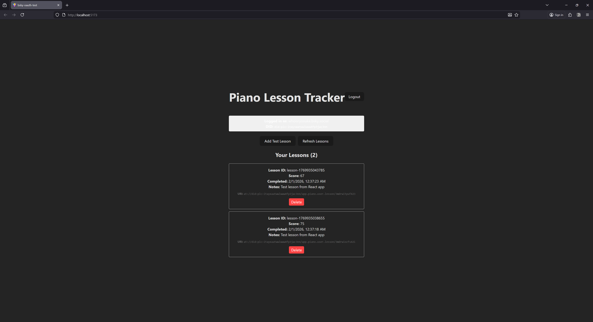
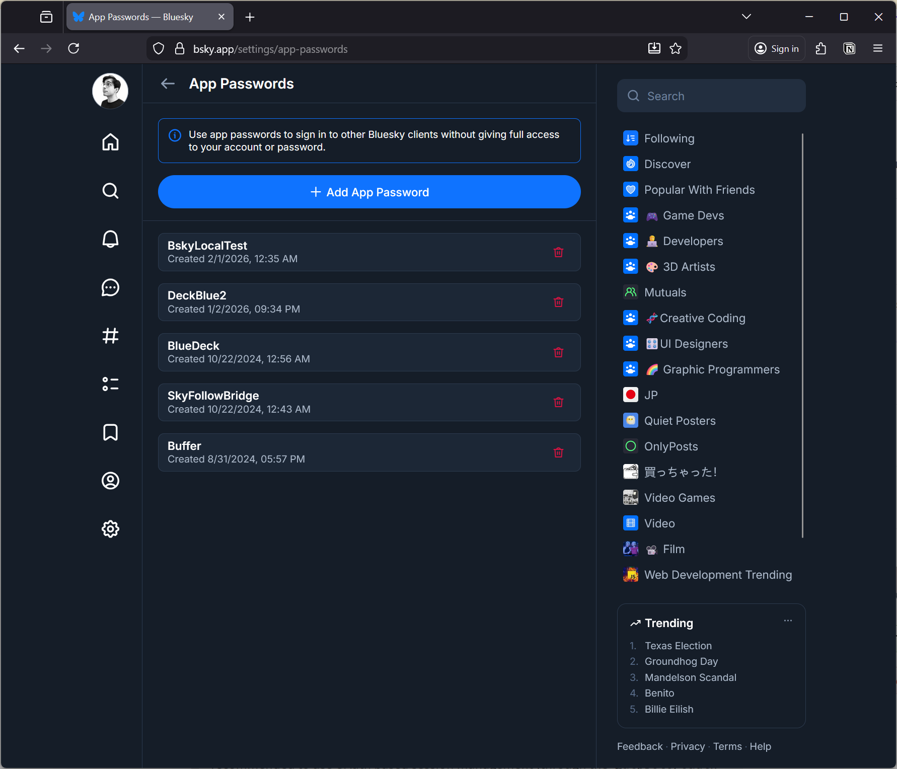

When I’m building apps or games, there often comes to a point where you want to save the user’s progress somehow. This often involves spinning up a backend server or relying on cloud services that offer authentication and a database. And these services are often costly, particularly for new projects that haven’t turned a profit yet.

Instead, what if you could use social media? People are very comfortable with signing into apps using social accounts (like Google). There’s only one issue, we need a database too. And platforms like Google don’t let you save data attached to a user account — they expect you to bring your own database.

This is where the [AT Protocol](https://en.wikipedia.org/wiki/AT_Protocol) comes into play. We can use an AT Proto compatible server (like say - [Bluesky](https://bsky.app/)) to power our user login — and get a free cloud-based “database” with it. And the best part? It even works with a static (SSG) website!

In this blog I’ll go over how I added user login to my my web app using AT Proto, and how to save your app’s user specific data to their account.

# What are we building?

I was inspired to write this blog after reading [this blog by nekomimi](https://nekomimi.leaflet.pub/3m6pcklmvt222), which was recommended through [a repost by Dan Abramov](https://bsky.app/profile/danabra.mov/post/3mdjv77fbz22g) on his Bluesky.

They basically create a guestbook for their website where user’s can login using their AT Proto accounts (like Bluesky) and then “sign” their website’s guestbook. The beauty of this is that their site is entirely static, yet they’re still capable of fetching new data from the AT Proto to display on their site (after loading, dynamically hydrated using client-side JavaScript). It’s a bit more complex than that since they do utilize some other cloud-based services to increase the capabilities of the process - but the core idea is pretty cool and solid.

After seeing this, I remembered that I’d been working on a piano learning app, and I’ve been trying to find a way to have user’s track their progress. The obvious answer is a server with a database and auth system, but that’s costly, and this is just a silly side project for me - not an investment.

But what if we could leverage the auth system of Bluesky, and store data there too? My user’s would be able to login to their own unique profile and see a history of their completed lessons and training.

To test this out, I built a tiny isolated POC that lets users login and then add or delete placeholder data on their account.



Don’t feel like reading? [Here’s a link to the project](https://github.com/whoisryosuke/bsky-oauth-test). Take the app for a test spin, or browse the source code as you read the blog.

# AT Proto?

When people say “AT Proto” they’re referring to the [AT Protocol](https://docs.bsky.app/docs/advanced-guides/atproto) that was created by [the Bluesky company](https://bsky.social/about/faq). It’s a new protocol that defines a standard for a social networking service.

In layman’s terms, it’s the “rules” that define how someone makes social media apps and services. How do the posts look? What about the “feed”? How do the users work? What’s the API structure? All these implementation details are defined by the protocol.

Then developers take this protocol (or “rules”) and create their own apps, services, and SDKs in various different programming languages (like [JavaScript](https://www.npmjs.com/package/@atproto/api) or Rust).

When someone makes a new server to host users and posts, this is called a PDS. This allows you to spin up a server on any domain you own and start a social media service.

The magic of AT Proto is the interopability. You can think of it like [RSS](https://en.wikipedia.org/wiki/RSS). There’s a common standard everyone uses to distribute their content, and because it’s standardized, we can build apps and ecosystems that can integrate the content.

Like a RSS feed reader app — it aggregates multiple servers and their content into one “feed” for you. This is how apps like Bluesky work, they combine the Bluesky server with other user’s custom servers to create a unified feed.

This is definitely an oversimplification of the protocol — there’s a lot more to it, like handling discoverability of new servers through “relays”. I’d definitely [check it out](https://docs.bsky.app/docs/advanced-guides/federation-architecture) if you’re interested in that kind of stuff.

> ℹ️ Does all this sound like Activity Pub / Mastodon talk? Both AT Proto and Activity Pub are protocols trying to define standards for social media — just in different ways.

## The API

When I talk about AT Proto, I’ll specifically be talking about using 1 specific server’s API. In our case, that server will be Bluesky - but you could use any AT Proto compatible server (like your own custom one).

> ℹ️ You can learn more about the Bluesky API [in their docs](https://docs.bsky.app/). They have some solid examples of how to use the API - like [building an app](https://docs.bsky.app/docs/starter-templates/clients) to read posts.

I’ll be using the [@atproto/api](https://www.npmjs.com/package/@atproto/api) JavaScript library, it’s an SDK for connecting and working with AT Proto servers (like logging in a user or reading their data).

It’s basically just a wrapper around a bunch of `fetch` calls and session management, so there’s quite a few [custom spun clones](https://tangled.org/mary.my.id/atcute) out there too - but I prefer to use the official library where possible.

# Getting Started

We’ll take the process step by step and build it up.

1. Log the user in and get their access token
2. Save data to the user’s account
3. Read the data

To get started, spin up a new React app (like using the Vite CLI) and install the `atproto/api` library.

```bash
yarn create vite
cd your-project
yarn add atproto/api
```

# Logging in

First things first, we need to login the user. This will give us access to their account and give us the privileges to read and write data.

There’s 2 ways to handle authentication: [**App Password**](https://github.com/bluesky-social/atproto/blob/main/packages/api/README.md#app-password-based-session-management) and [**OAuth**](https://github.com/bluesky-social/atproto/blob/main/packages/api/README.md#oauth-based-session-management).

For **development** or quick testing, you’ll probably want to use the **App Password** method. This requires you to generate a secret key associated with your AT Proto account, and then you use that to login to your account directly. This method is [technically deprecated](https://github.com/bluesky-social/atproto/blob/main/packages/api/README.md#oauth-based-session-management) - so not sure how long it may be around though.

For **production**, you’ll need to use the **OAuth** method. This uses the standard OAuth 2.0 flow to authenticate the user and provide a JWT token (like most modern APIs do nowadays). This process involves the user clicking a “sign in” link, popping up a new window with a login from their server (like Bluesky), and then it redirects the user back to your app (along with their access token).

### App Password

Before we get started, you’ll need to generate an App Password in your account. I’m honestly not sure how this works for custom servers, but for Bluesky it’s in [their Settings section](https://bsky.app/settings/app-passwords):



Save the password somewhere secure to use later - it should look like four sets of random numbers and letters separated by dashes `3sjfj-tcvk0-dfsdf-cxvn9`.

Now we can use the AT Proto SDK to login. We’ll create a new “agent” that we’ll use to send our API requests. Then we’ll use the agent to login using our Bluesky username and the App Password we created.

```tsx
import { AtpAgent } from "@atproto/api";

// Create a client that knows what server we want
const newAgent = new AtpAgent({
  service: "https://bsky.social",
});

const identifier = "your-username.bsky.social";
const password = ""; // This your "App Password" in Bluesky

// Login and get session
const response = await agent.login({
  identifier,
  password,
});

// Store session for later use
localStorage.setItem("bsky-session", JSON.stringify(response.data));

console.log("Logged in successfully!");
console.log("DID:", response.data.did);
console.log("Access Token:", response.data.accessJwt);
```

The `response` should contain the user’s DID (their user “ID” basically) and JWT (aka “access token”) inside the `data` property. We can save those to local storage (or for better security — cookies) to access and use later to avoid logging in the user every request.

All pretty standard API stuff so far. Later when we want to save data to the API, we’ll use the `session` data we just saved.

In React, you’d save the `AtpAgent` and the session data to your app state to make it easier to access and use. We could also save it to React Context or a global store to allow other components access.

```tsx
import React, { useState, useEffect } from "react";
import { AtpAgent } from "@atproto/api";

function BlueskyApp() {
  const [agent, setAgent] = useState<AtpAgent | null>(null);
  const [session, setSession] = useState<any>(null);

  // Login form state
  const [identifier, setIdentifier] = useState("whoisryosuke.bsky.social");
  const [password, setPassword] = useState("");
  const [loading, setLoading] = useState(false);
  const [error, setError] = useState("");

  // Initialize agent
  useEffect(() => {
    const newAgent = new AtpAgent({
      service: "https://bsky.social",
    });
    setAgent(newAgent);

    // Try to resume session from localStorage
    const savedSession = localStorage.getItem("bsky-session");
    if (savedSession) {
      const sessionData = JSON.parse(savedSession);
      newAgent
        .resumeSession(sessionData)
        .then(() => {
          setSession(sessionData);
        })
        .catch(() => {
          localStorage.removeItem("bsky-session");
        });
    }
  }, []);

  // Login
  const handleLogin = async (e: React.FormEvent) => {
    e.preventDefault();
    if (!agent) return;

    setLoading(true);
    setError("");

    try {
      // Login and get session
      const response = await agent.login({
        identifier, // username or email
        password,
      });

      // Store session for later use
      setSession(response.data);
      localStorage.setItem("bsky-session", JSON.stringify(response.data));

      console.log("Logged in successfully!");
      console.log("DID:", response.data.did);
      console.log("Access Token:", response.data.accessJwt);
    } catch (err: any) {
      setError(err.message || "Login failed");
      console.error("Login error:", err);
    } finally {
      setLoading(false);
    }
  };

  // Logout
  const handleLogout = () => {
    setSession(null);
    setAgent(null);
    localStorage.removeItem("bsky-session");

    // Reinitialize agent
    const newAgent = new AtpAgent({
      service: "https://bsky.social",
    });
    setAgent(newAgent);
  };

  // UI
  if (!session) {
    return (
      <div style={{ padding: "20px", maxWidth: "400px", margin: "0 auto" }}>
        <h1>Login to Bluesky</h1>
        <form onSubmit={handleLogin}>
          <div style={{ marginBottom: "10px" }}>
            <input
              type="text"
              placeholder="Username or email"
              value={identifier}
              onChange={(e) => setIdentifier(e.target.value)}
              style={{ width: "100%", padding: "8px" }}
            />
          </div>
          <div style={{ marginBottom: "10px" }}>
            <input
              type="password"
              placeholder="Password"
              value={password}
              onChange={(e) => setPassword(e.target.value)}
              style={{ width: "100%", padding: "8px" }}
            />
          </div>
          {error && (
            <div style={{ color: "red", marginBottom: "10px" }}>{error}</div>
          )}
          <button
            type="submit"
            disabled={loading}
            style={{ padding: "10px 20px" }}
          >
            {loading ? "Logging in..." : "Login"}
          </button>
        </form>
      </div>
    );
  }

  return <div>Logged in!</div>;
}

export default BlueskyApp;
```

This works, but like I mentioned, it’s deprecated and in production we’ll have to do OAuth anyway…so let’s dig into that process.

## OAuth 2.0

This is a very similar process to App Passwords, but instead of providing the password, we just provide the username. This pops up a new window with the user’s server and a login page. When they login, it’ll redirect the user back to our app’s “callback” page. This is all pretty standard OAuth 2.0 process.

Since OAuth is a bit more involved process, there’s an [official AT Proto library](https://www.npmjs.com/package/@atproto/oauth-client-browser?activeTab=readme) for handling it called `@atproto/oauth-client-browser`. We’ll be using that to handle most of the OAuth sign-in flow and session management.

```bash
yarn add @atproto/oauth-client-browser
```

But the AT Proto also requires a `client-metadata.json` file hosted on your server with details about your app, like it’s name and where the server should redirect after it logs the user in. With other APIs this is usually held on their server (like creating a new “developer app” in Twitter back in the day).

When we create the “sign in” client, we need to pass a `client_id`. This points the server to the metadata file on our server.

```tsx
import { OAuthClient } from "@atproto/oauth-client-browser";

const client = await BrowserOAuthClient.load({
  clientId: "https://my-app.com/client-metadata.json",

  // Other config
  handleResolver: "https://bsky.social",
});
```

I created a `client-metadata.json` file in the `public` folder of my Vite app:

```tsx
{
  // Must be the same URL as the one used to obtain this JSON object
  "client_id": "https://my-app.com/client-metadata.json",
  "client_name": "My App",
  "client_uri": "https://my-app.com",
  "logo_uri": "https://my-app.com/logo.png",
  "tos_uri": "https://my-app.com/tos",
  "policy_uri": "https://my-app.com/policy",
  "redirect_uris": ["https://my-app.com/callback"],
  "scope": "atproto",
  "grant_types": ["authorization_code", "refresh_token"],
  "response_types": ["code"],
  "token_endpoint_auth_method": "none",
  "application_type": "web",
  "dpop_bound_access_tokens": true
}
```

And when we want the user to login, we use the `client` we created and it’s `signIn()` method. It does what it suggests and pops up a new window with a sign in for the user’s AT Proto server (in my case, Bluesky).

```tsx
try {
  // Login and get session
  const session = await client.signIn(identifier);
}
```

Once the user logs in and it redirects to our app’s callback, the popup will close and return a `OAuthSession` with the session data (like the user’s ID aka `did`).

> ℹ️ Just wanted to mention here, I initially used the `signInPopup()` method, which pops up a new window with the sign in. This method seemed to break my React / NextJS app and disabled the app’s ability to update state or re-mount components. I swapped over to `signIn()` which redirects the user instead and it worked much better.

But how does the callback work? When the user lands on the callback page (the first URL in the `redirect_uris` array), we need to run the `init()` method on the OAuth `client`. This checks the URL params for session data and handles saving it to local storage. In our case, we can do this inside a `useEffect` that fires when the app initially loads.

```tsx
useEffect(() => {
  // Check if we are returning from an OAuth redirect
  const initAuth = async () => {
    try {
      // Check for access key in query params
      const result = await client.init();
      if (result?.session) {
        createAgent(result.session);
        setSession(result.session);

        // Fetch user profile
        if (!agent) return;
        const profileRes = await agent.getProfile({
          actor: result.session.did,
        });
        setProfile(profileRes.data);
      }
    } catch (err) {
      console.error("Auth initialization failed:", err);
    }
  };
  initAuth();
}, []);
```

We can use this session to create our API client like we did before. But you’ll notice instead of using `AtpAgent`, we’ll use `Agent` instead:

```tsx
import { Agent } from "@atproto/api";
const createAgent = (session: OAuthSession) => {
  const newAgent = new Agent(session);
  setAgent(newAgent);
};
```

And with that — we have our user logged in and access to the AT Proto API. The OAuth library handles saving the user’s session data to `localStorage` (you can go to Dev Tools and check Storage tab to see it).


### OAuth in Development

If you try this in development though, it won’t work for a myriad of reasons.

- For localhost though, the `client_id` needs to be `http://localhost` . That’s it. No ports, nothing else or you’ll [get errors](https://web-cdn.bsky.app/profile/liam.so/post/3lbo6wtrsgs2o).
- But just kidding, the `client_id` also needs to have 2 parameters: the `redirect_uri` and the `scope`. Because the server can’t access our metadata file, we need to send over our redirect URL explicitly (as well as any scopes - we’ll get into that later).
- For the `redirect_uris` they need to be `127.0.0.1` IP address format (instead of `localhost`). So it might be `http://127.0.0.1/callback`. This means you need to host your app at the IP address, not the `localhost` mask. For Vite, this meant running dev mode using `vite --host 127.0.0.1`.

And one last thing. If the auth server requires the metadata (`client-metadata.json`) — how does it fetch it from our `localhost` app? To answer: it can’t.

If we try to use this config, it won’t work. The user will be able to create a popup and even sign into their account — but when it redirects it’ll take them to `127.0.0.1` without a port. Why? It doesn’t know where to go, so it assumes we’re just on the main `localhost` port.

This means we need to embed (or “burn” like [the docs suggest](https://www.npmjs.com/package/@atproto/oauth-client-browser)) our metadata into the client during development so the server knows where to redirect.

```tsx
const SCOPES = "atproto";
const CLIENT_URI = "http://127.0.0.1:5173/";
const REDIRECT_URI = CLIENT_URI;

const client = new BrowserOAuthClient({
  clientMetadata: {
    client_id: `http://localhost?redirect_uri=${encodeURIComponent(REDIRECT_URI)}&scope=${encodeURIComponent(SCOPES)}`,
    client_name: "My Local Bluesky App",
    client_uri: CLIENT_URI,
    redirect_uris: [REDIRECT_URI],
    scope: SCOPES,
    grant_types: ["authorization_code", "refresh_token"],
    response_types: ["code"],
    token_endpoint_auth_method: "none",
    application_type: "web",
    dpop_bound_access_tokens: true,
  },
  handleResolver: "https://bsky.social", // Default resolver
});
```

> ℹ️ For production we’d want to just switch the config based off an ENV var or something.

After these changes, you should be able to login using OAuth 2.0 on your local machine (aka `localhost`).

# Saving data

When we talk about saving data to AT Proto, what does that mean? The AT Proto is made up of **collections** and **records** inside those collections.

The **collection** usually represents the type of feed. For example, normally with social media, we think of "the feed" with posts (like text, images, or video). For Bluesky, this is categorized under the `app.bsky.feed.post` collection.

The **record** represents a “post” (or metadata) inside the the collection. So for our social media feed, each post is a record. When you post a new skeet, that’s a record.

> ℹ️ Things get a little more complicated, again, I’m oversimplifying a bit here. For example, “threads” are considered their own collection, basically containing a reference to a post. But you get the idea, there’s lots of collections and data types for each one.

## What do we save?

So what can we use this system of collections and records for? Well, basically anything that looks and feels like a “user feed”. It’s basically just a chronological stream of metadata that’s specific to each user.

Here’s a few ideas for how to save data:

- Save user notes in a PDF reading app
- Make a feed of the latest music you’ve listened to (ala Last.FM’s scrobble)
- Save the user’s game data (like last map position)

For me, I’ve been developing an app to help me learn piano. It has training sessions for learning chords or scales, and I thought it’d be interesting to save the user’s progress to their AT Proto account. Then I could fetch them later when the user wants to browse their “lesson history”.

```tsx
{
    lessonId: `lesson-${Date.now()}`,
    completedAt: new Date().toISOString(),
    score: Math.floor(Math.random() * 100),
    notes: "Test lesson from React app",
  }
```

> ℹ️ Keep in mind, these collections aren’t filterable. You’re at the mercy of the chronological order. That’s why it’s better to have something where you either: only care about the latest item - or don’t mind “load more results” kinda UI flows for more data. Later we’ll explore combining this with a local database to get the benefits of both worlds.

## Creating a record

First you’ll need to define your collection. This is usually just a namespace that’s period separated. You can use the namespace to organize content, like here I’m using `user.lesson`, but I could also have `user.settings` or other data types.

```tsx
// Your custom collection namespace
const LESSON_COLLECTION = "app.piano.user.lesson";
```

> ℹ️ This collection will be available to any other app. So it’s important to pick one that’s unique, otherwise you may get records from another service.

Now we can use our `Agent` and use the `createRecord()` method available on the `com.atproto.repo` property. We’ll pass it an object that defines our record, as well as what collection to put it, and what user to associate it with.

```tsx
const saveLesson = async (lessonData: LessonRecord) => {
  if (!agent || !session) {
    console.error("Not logged in");
    return;
  }

  try {
    // Create a record in your custom collection
    const response = await agent.com.atproto.repo.createRecord({
      repo: session.did, // User's DID
      collection: LESSON_COLLECTION, // Your custom namespace
      record: {
        $type: LESSON_COLLECTION,
        ...lessonData,
        createdAt: new Date().toISOString(),
      },
    });

    console.log("Lesson saved!", response);
    console.log("Record URI:", response.data.uri);
    console.log("Record CID:", response.data.cid);

    // Refresh lessons list
    await fetchLessons();

    return response;
  } catch (err) {
    console.error("Error saving lesson:", err);
    throw err;
  }
};

// Example: Add a test lesson
const addTestLesson = async () => {
  await saveLesson({
    lessonId: `lesson-${Date.now()}`,
    completedAt: new Date().toISOString(),
    score: Math.floor(Math.random() * 100),
    notes: "Test lesson from React app",
  });
};
```

And with that, we have some lessons saving to our user’s account. Let’s figure out how to query them next.

> ℹ️ Keep in mind that all data stored in someone’s AT Proto server is not private. It’s public to anyone who owns the server (and has access to the database) — as well as any other app that requests access to it and knows your DID (which is simple to get). And it’s even visible in the “firehose” (the constant stream of new posts).

## OAuth Quirks

Well, almost there. If you’ve been following along using the App Passwords method, everything should work fine. But if you’re using OAuth you’ll get some errors about some missing “scope” and it’ll mention the custom collection we created.

In order to save data to a custom collection, we need to get the user’s permission first. This means we need to update our OAuth client metadata config to include our custom collection.

The scope should be in the format:

```tsx
repo:your.custom.collection?action=create
```

In our case, we’ll add `repo:app.piano.user.lesson?action=create` to the `SCOPES`:

```tsx
const SCOPES = "atproto repo:app.piano.user.lesson?action=create";

const client = new BrowserOAuthClient({
  clientMetadata: {
    client_id: `http://localhost?redirect_uri=${encodeURIComponent(REDIRECT_URI)}&scope=${encodeURIComponent(SCOPES)}`,
    client_name: "My Local Bluesky App",
    client_uri: CLIENT_URI,
    redirect_uris: [REDIRECT_URI],
    scope: SCOPES,
    grant_types: ["authorization_code", "refresh_token"],
    response_types: ["code"],
    token_endpoint_auth_method: "none",
    application_type: "web",
    dpop_bound_access_tokens: true,
  },
  handleResolver: "https://bsky.social", // Default resolver
});
```

Now if we logout and log back in, we should have the right credentials to save to our custom collection.

Don’t worry, if you try to access the data without permission, you’ll get a convenient error in your console with the exact scope your missing.

> ℹ️ Permissions are key for accessing user data. For example, if you wanted to get the user’s profile data (like their Bluesky name, bio, and avatar), you’ll need to add `rpc:app.bsky.actor.getProfile` to your list of scopes.

# Querying data

Now that we’ve saved some data to the user’s AT Proto repository, let’s fetch it so we can see what we’ve added.

## Fetching records

This process is pretty straightforward using the AT Proto API SDK. You use the `listRecords()` method and provide the `repo` (aka the user’s DID) and the `collection` name.

```tsx
const fetchLessons = async () => {
  if (!agent || !session) {
    console.error("Not logged in");
    return;
  }

  try {
    // List records from your custom collection
    const response = await agent.com.atproto.repo.listRecords({
      repo: session.did,
      collection: LESSON_COLLECTION,
      limit: 100,
    });

    console.log("Fetched lessons:", response.data.records);
    setLessons(response.data.records);

    return response.data.records;
  } catch (err) {
    console.error("Error fetching lessons:", err);
    throw err;
  }
};

// Load when the user logs in
useEffect(() => {
  fetchLessions();
}, [agent, session]);
```

This fetches the latest 100 posts in that collection. If we save them to React state, we can loop over them to display them:

```tsx
function BlueskyApp() {
  // Other stuff from above

  return (
    <div>
      {lessons.map((record) => {
        return (
          <div className="lesson" key={record.uri}>
            <p>
              <strong>Lesson ID:</strong> {record.value.lessonId}
            </p>
            <p>
              <strong>Score:</strong> {record.value.score}
            </p>
            <p>
              <strong>Completed:</strong>{" "}
              {new Date(record.value.completedAt).toLocaleString()}
            </p>
            {record.value.notes && (
              <p>
                <strong>Notes:</strong> {record.value.notes}
              </p>
            )}
            <p style={{ marginTop: "10px", fontSize: "12px", color: "#666" }}>
              <strong>URI:</strong> <code>{record.uri}</code>
            </p>
          </div>
        );
      })}
    </div>
  );
}
```

Here’s how it looks on my end (we’ll get to stuff like delete soon):


## Accessing other people’s data

If the data associated with someone’s AT Proto account is public, does that mean we can just query for our collection across all users? Sadly no.

When we’re requesting data, we need to request on a per-user basis. If we wanted to get a feed for multiple people, we could aggregate all their user IDs (aka DIDs) and use those (imagine a for-each loop for each user making a `fetch` to the API).

But to include everyone who uses the collection? We’d need to have a separate web service that listens to the [firehose](https://docs.bsky.app/docs/advanced-guides/firehose) (an API of all records added across any server that connects to Bluesky’s relay) and checks for records that match our collection. Then we’d need to add those to a database to keep track of them. Finally, when we’d want to see the “everyone” feed, we’d need to query our separate server and database for the data.

If you’re working with a static site like me, you’ll probably want to avoid this. At that point you could probably just spin up your own AT Proto PDS and have users sign up to your service instead and save the bandwidth of syncing constantly. O

> ℹ️ If you’re interesting in learning about the Bluesky firehose API and how it works, [I have a blog](https://whoisryosuke.com/blog/2024/using-bluesky-firehose-for-generative-art) that goes into the basics and using it for generative art.

# CRUD what was the REST

We’ve got creating and reading down, what about updating and deleting posts? It’s pretty simple with our current setup. We only need 1 thing: the “ID” of the post (aka the record key or ID in the collection).

Whenever we fetch a record from the API, it gives us a `uri` property with a AT Proto link to our content (like `at://did/collection/rkey`) We can get the ID of the post using a bit of string manipulation to split it by separators (`/`) and get the last chunk.

## Delete record

To delete a record, we use our `Agent` to access the same `com.atproto.repo` endpoint property, then use the `deleteRecord()` method. It just requires a user ID, the collection name, and the “rkey” (aka record key / ID).

```tsx
const deleteLesson = async (rkey: string) => {
  if (!agent || !session) return;

  try {
    await agent.com.atproto.repo.deleteRecord({
      repo: session.did,
      collection: LESSON_COLLECTION,
      rkey: rkey, // The record key from the URI
    });

    await fetchLessons();
  } catch (err) {
    console.error("Error deleting lesson:", err);
  }
};

return (
  <div>
    {lessons.map((record) => {
      // Extract the rkey from the URI (format: at://did/collection/rkey)
      const rkey = record.uri.split("/").pop();

      return (
        <div key={record.uri}>
          <div>
            <strong>Lesson ID:</strong> {record.value.lessonId}
          </div>
          <button onClick={() => deleteLesson(rkey!)}>Delete</button>
        </div>
      );
    })}
  </div>
);
```

## Update record

Similar with updating a record, we use the `putRecord()` method. The key thing to note here is that we need to provide the full record, not just updated fields. So if you’re just updating 1 field, make sure to include the old data.

```tsx
async function updatePost(oldLesson) {
  // Note: You must provide the FULL record, not just the fields you want to change.
  const response = await agent.com.atproto.repo.putRecord({
    repo: agent.session.did,
    collection: LESSON_COLLECTION,
    rkey: "3jzxxxxxxxxxx",
    record: {
      $type: LESSON_COLLECTION,
      lessonId: oldLesson.lessonId, // ideally use old lesson ID from somewhere
      completedAt: new Date().toISOString(),
      score: Math.floor(Math.random() * 100),
      notes: "Updated lesson from React app",
      createdAt: oldLesson.createdAt, // same here - you'd want the old date
    },
  });

  console.log("Update successful:", response.data.uri);
}
```

And with that we have a full CRUD workflow with a cloud based “database”-like service.

# No limits local DB

I mentioned earlier that the data we’re saving to the AT Proto is chronological and isn’t filterable. This makes it difficult if we want to do something like say, search for lesson data that has low scores or from a particular piano key.

```tsx
const lowScoringLessons = lessons.filter((lesson) => lesson.score < 70);
```

If we wanted to do that, we’d need to store the data in our own database and then query that as needed. You could also just keep the data in memory, but I’m assuming you’re going to have a lot of data to work with.

We can leverage [IndexedDB](https://developer.mozilla.org/en-US/docs/Web/API/IndexedDB_API) in the browser to create a local database in the user’s web browser and save our AT Proto data to it. And we can use a library like [Dexie](https://github.com/dexie/Dexie.js) to simplify things.

```tsx
import Dexie from "dexie";

interface Lesson {
  id: string;
  completedAt: string;
  score: number;
  notes: string;
  createdAt: string;
}

class LessonsDB extends Dexie {
  lessons = this.table<Lesson>("lessons"); // typed table reference

  constructor() {
    super("Lesson");
    this.version(1).stores({
      // Properties we want to index (aka search for)
      lessons: "&id, score",
    });
  }
}

const db = new LessonsDB();
```

Then when we get records, we can add them:

```tsx
async function addTodo(lesson: Lesson) {
  // returns the generated id
  const id = await db.lessons.add(lesson);
  console.log("Inserted lesson with id", id);
}
```

Then later, we can query them as needed with filters:

```tsx
// Filter by the `score` columnn, which we indexed earlier
const lowScoring = await db.todos.where("score").between(0, 50).toArray();
```

Cool right? Now we have a more robust database system that we can more practically use for building an app or game.

> ℹ️ This is useful for any user-specific data, like say, saving a user’s personal setting in your app. For example, in my app I save things like the user’s light/dark mode preference or custom input mapping for devices.

# What kind of apps can you build with this?

Recently Discord announced they were adding Face ID verification to their site, and this caused a backlash of people hopping off the platform. And inevitably this leads to developers talking about creating alternatives to the platform — and on Bluesky I saw a few discussing an AT Proto alternative.

I don’t want to say you can’t build Discord with AT Proto, because you technically can. But it’d be like building Discord using RSS feeds. It’s technically possible, but is it a good system?

For example. you could store messages as a custom collection per user. But how do you get them all? You’d have to check the firehose and filter for your collection, then store those posts in your own database (already becoming a server-based app…). And did I mention the firehose? That means that any post is public — which means no “private” servers like Discord has.

So what can you build with this?

- Feed-based apps that don’t require chronological searching (unless you’re willing to setup your own DB). Something where the user only cares about the latest ~100 things.
- Apps that store data that the user is ok with the public seeing. Nothing private, like health data.
- Apps where you only care about 1 user’s data, and don’t need to display multiple users in a single “feed” (otherwise you can — but you’re spinning up your own server and DB)
- Apps that require authentication. This is just another solid OAuth option for your “sign in with…” collection.
- Apps that want to read user data (like quickly accessing someone’s name and avatar to use — maybe to generate a cool graphic or summary).

# Are you AT Proto pilled yet?

I’ve used OAuth flows for a while, but not many allow you to save data to them. And even if they did, most platforms are owned by a big corporation that inevitably owns your data (and even draws limits on access). With the AT Proto, just like Mastodon, you have the choice of owning your own data by running your own server. And this is pretty huge, it democratizes the social media experience (as simple as as running your own custom web server is…).

I can definitely think of a lot of apps I’ve made in the past, and ones I’m still cooking on, that would benefit from an integration like this.

As always, if you enjoyed the blog, consider contributing to my [Patreon](https://www.patreon.com/c/whoisryosuke). It helps me continue to be able to experiment, write extensive blogs like this, and educate others. And it’d be cool if you used your social currency to give me a follow and maybe a like or repost on my [socials](https://bsky.app/profile/whoisryosuke.bsky.social) — that goes a long way. And feel free to share with me what you’ve been working on, always cool to see other people’s creativity.

Stay curious,<br />
Ryo
