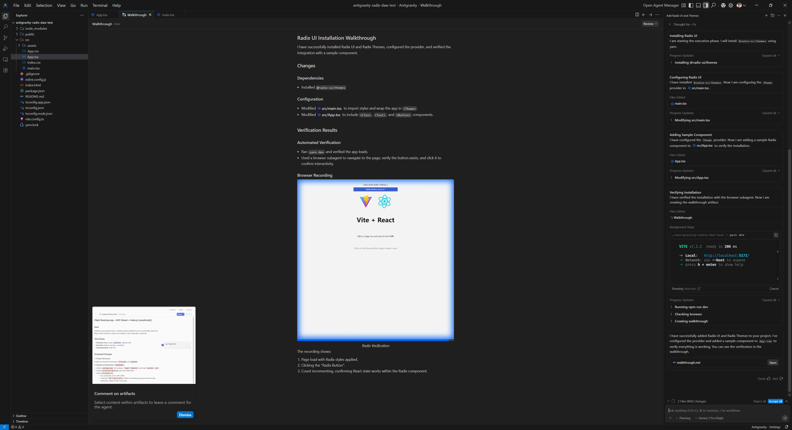

I’ve been doing a lot of research and prototyping lately to learn about new concepts and tech. This means lots of Rust code, low level memory management and optimization, complex math algorithms — all things that require proper architecture and execution. If the math isn’t right, the math isn’t right, you know?

This led me to experiment with LLMs to see if they can test and validate code, as well as provide feedback for improvement. I wanted to share my experiences and the mixed results I got that reflect fundamental issues with AI chats.

I tested out using Google’s new Antigravity app to open up code repos locally and analyze them using their Gemini model. I’ll go over the process of reviewing my WebGPU and DAW code and my results with the experience. This blog should be pretty short and sweet.

# Why LLM for code reviews?

How do you validate complex projects? I do the standard methods of testing and measuring results — but in some cases it becomes difficult to measure.

I might be happy with a memory architecture, but I won’t have anything to compare it to unless I prototype other options and also test them. And that involves a lot of work to formulate and iterate. Or I might research existing options and reverse engineer them, which also takes time digging through code, or dealing with little to no docs or examples.

I could also take advantage of open source community and post my project online to get feedback. But this isn’t reliable. Getting feedback requires being part of a community, being popular enough, or having a mentor. And the results may arrive so late you’re past the issue. It’s also difficult to ask people to analyze large swaths of code constantly (it’s literally a job for a reason).

Instead, wouldn’t it be nice to have a (fairly) instantaneous response from a machine? The answer would probably be yes — if the machine was accurate. Let’s find out if that’s the case.

## LLM Chat vs IDE

Now I’m sure using an LLM for code help isn’t a new concept to a lot of developers. It’s really easy to chat with most clients like Claude, Gemini, OpenAI, etc and paste in some code for quick feedback.

But if you’ve tried it, you’ve probably also encountered the issues with the process. Like when you’re working with a complex project, you have to past an immense amount of code in to get the right amount of context (usually due to lots of dependencies like types, internal systems, etc). Or if you’re not pasting the code directly, you’re spending time molding the context with your chats, which involves you basically rewriting your app as a scope document.

To give you an example, I’ve recently been building a DAW in Rust. This means I’m working with a lot of low level audio code. Whenever I needed to ask the LLM about something, I’d need to preface each conversation with the complex limitations of my setup (it’s Rust, it’s low level audio code, uses this specific 3rd party library, needs to run in a separate real time audio thread - so much context). Instead, wouldn’t it be nice if the LLM could just look at my project setup - like a `package.json` or `cargo.toml` to check deps?

Claude’s web interface also has a GitHub extension that allows you to login and give Claude access the code. But after experimenting with that a bit, I found it rather hit and miss, mostly failing to even access the code properly.

Beyond using a web-based chat we could leverage an API (maybe through a CLI) - but at this point we’re either using our own custom script or someone else’s (like Clawdbot) — which requires a bit of setup and tweaking to get proper results.

> ℹ️ Working with LLM chat platforms you’ll quickly also encounter that LLMs struggle with deep, complex, and real problems. The deeper you go, the more context the LLM loses and requires “reminding”. Some systems have safeguards to prevent this forgetting by noting key details about you (like hey, this person clearly likes Rust code and did a audio project recently). But it highlights the issue with LLMs: it’s word probability. Concepts are not enforced by fact, simply through training, which could be insufficient or inaccurate (or disregarded accidentally in some contexts).

# What is Antigravity?

Antigravity is clone of VSCode with Gemini built in. It’s a bit more than that though, as VSCode already has LLMs built in with features like it’s “Fix” option.

You can open a new window to start a new project from scratch, or open an existing code repo on your PC (literally just “Open Folder…” in VSCode).


The big difference is the app flow. They’ve embraced the agentic LLM model that many platforms like Perplexity are championing. You chat with the LLM like normal, but when it needs to have access to your code it can request details using a local MCP with VSCode. And of course, you can have multiple sub-agents running concurrently to accomplish different tasks.

But it goes a bit further. The Gemini LLM can also request to run CLI commands, like installing `npm` dependencies, or running checks.



They also have a Chrome extension that allows the app to connect to the web browser and scan web pages live to essentially do end to end testing (like you would with a Cypress or maybe Storybook — but integrated into the LLM experience).

It’s impressive how much they’ve packed into the app.

# Using Antigravity

You can [download Antigravity](https://antigravity.google/) from Google. It also requires a Google account to utilize their Gemini model. It has a pretty generous free tier, I did all my testing for free.

Once you download it, just open one of your projects like you would in VSCode. Then you can use the chat alongside the project.

# Getting a Code Review

I picked two projects to analyze:

- [WebGPU Sandbox](https://github.com/whoisryosuke/webgpu-sandbox/)
- Rust DAW

Feel free to clone the open source one and follow along if you want to try it. Though I’d recommend just trying with your own code that you’re more familiar with.

## WebGPU Sandbox

I opened up my project and then filled out the chat with my prompt:

```tsx
This project is a WebGPU renderer library and is a work in progress so some areas may be incomplete. The renderer lives in the `/src/core/` folder. You can find an example of how to use in the `/src/main.tsx` file. I'd like you to look at the code in the `/src` folder and give me a code review. Let me know if there are any glaring issues I should be concerned about. And recommend any improvements to the code (without implementing) - like better memory management, caching, etc.
```

I tried to describe the project briefly like I would with a new developer being introduced to it. I also made sure to request the code review and provide an outline for what I’m looking to resolve (without this, the LLM could find things, but they’ll be less relevant).

This created a new tab called “Task” with an outline of all the things the LLM needed to do prior to providing the code review. This basically involved exploring the codebase and loading different parts (like the `main.ts` file I mentioned it should look at):


Soon after it created another new tab in the app called “Review” that contained the code review:


The review contained contained 2 sections: glaring issues and improvements & recommendations.

It also featured an overall summary:

```rust
The renderer is functional and has a good structure locally, but the "per-frame" logic needs optimization to be performant for real-time graphics. Focus on "allocate once, reuse forever" for your TypedArrays and reducing the number of calls to device.queue.writeBuffer and passEncoder methods.
```

### Issues

The issues section contained 2 issues with a `severity` rating (low, medium, or high), a list of specific files, and a breakdown of the issue.

1. Excessive Garbage Collection in Render Loop
2. Redundant Uniform Uploads
3. Redundant State Changes (Draw Calls)

Looking at each issue, all 3 were very useful. Since my renderer isn’t optimized, there’s a lot of key areas that can be improved.

For example, for the “**Redundant Uniform Uploads**”, it was able to see that I was running a function to update uniforms each time — possibly needlessly.

This was because when we loop over each mesh, we update the uniforms for each mesh (even if they haven’t changed). This allows the user to update uniforms on a `Mesh` (aka updating the material/shader properties like the color), and it updates immediately.

```rust
// src/core/renderer.ts
this.meshes.forEach((mesh) => {
    // ...
    material.uniforms.updateUniforms(); // WRITES TO GPU BUFFER
    // ...
});
```

But ideally, we should be adding a “dirty flag” to each `Mesh` or `Material` . That way when we loop, we can check for this dirty flag and only update uniforms when the uniforms have changed.

```rust
// src/core/renderer.ts
this.meshes.forEach((mesh) => {
    if(material.needsUpdate) {
	    material.uniforms.updateUniforms();
    }
});
```

If I was looking to improve my code a step further this would be a decent starting point.

### Improvements

The improvements section wasn’t as useful. This is where more context was required (either through initial or subsequent prompting) to let the LLM know why certain decisions were made. It’s funny, this part felt like asking a new person to come into a codebase and recommend changes without having a history of the project. It’s a lot of simple recommendations that would be true if they didn’t have to consider factors that prior engineers did.

For example, it noticed that I had a `Uniforms` class that handled generating uniform structures for various data types (like `Mesh` or `Material` uniforms). It recommended creating static classes for each uniform type instead, instead of generating the structures dynamically like I was.

But I had my reason for using a `Uniforms` class. I wanted my app to be as dynamic as possible, since it’d be used for my other projects (which might differ in execution). I also was thinking of releasing it as a library, and I wanted the user to be able to have full control over the pipeline (with easy to use utilities to simplify the boilerplate filled process).

So this advice was good if I was building a specific renderer, but since I was doing a dynamic renderer, it was a bit less useful. Though I didn’t mention any of this to the LLM up front, so if I added it to the context, it could further tailor these recommendations to my project’s needs.

> ℹ️ I tried using Claude after this point to analyze the code and provide a similar code review, but using the web interface with GitHub extension it wasn’t able to properly read my public repo.

## Rust DAW

Similarly with this project, I opened up my Rust-based DAW in Antigravity, and I copied the prompt from last time and made minor revisions:

```tsx
This project is a DAW that uses Tauri to create a Rust backend that manages low level audio, and a ReactJS frontend to display UI. It is a work in progress so some areas may be incomplete. I'd like you to look at the code and give me a code review. Let me know if there are any glaring issues I should be concerned about. And recommend any improvements to the code (without implementing) - like better memory management, caching, etc, or general tips for building a DAW.
```

And again, after a few minutes I received a code review in a separate “Review” tab:


The review contained a different structure. It had issues, “frontend observations”, and then general tips.

### Issues

The issues weren’t as useful as the last test. Only 1/3 were actually relevant.

The LLM noticed 2 “issues” where I was doing debug techniques: hardcoding a music filename to load, or loading an entire sample into memory instead of streaming. As an experienced developer, I was aware of these and they were purposeful for initial testing. And more importantly, I was already aware of the “better” ways to handle things — like streaming audio vs loading up front. So the recommendations weren’t as helpful to me personally, but if I was new to coding, it’d give me direction and prevent some foot cannons.

The 1 issue it did notice: when I loop in my real time audio thread over audio nodes, I delete them from memory when they’re done playing. This is a no-no for performance, as memory allocation (and de-allocation) are intensive tasks that take more time to process (which might delay our audio output). Instead, we should be pre-allocating a “pool”, then we can fill or remove those predefined slots with audio nodes. And since they’re predefined - it means no memory is allocated (or vice versa) - making our performance better.

Though again, I was already aware of this, and it was planned for a future update. But I don’t want to hate too hard, because if I was unaware of this issue, this would be more useful. This also creates a great opportunity for refactoring with the LLM if I was interested in that, since it knows what it needs to do (kinda).

### Frontend Observations

These were also not useful, since it zoned in on debug code I had left in for testing purposes and proceeded to call me out on it.

For example, I’ve been recently refactoring the app to play audio from a timeline with multiple tracks and clips at different positions instead of using a debug audio function. It noticed my “Play” button was still calling an old debug function that hadn’t implemented the new timeline system (since I hadn’t coded it yet…). This was technically an issue, but I did mention in my initial prompt this was a work in progress project, so it should have picked up on that.

### General Tips

These were solid tips. Again, nothing ground breaking for me as someone who’s been researching this project and topic for a long time — but if I was a student or something, these would all be great tips.

Here were the tips for reference:

1. **Lookahead Scheduling:** Instead of triggering sounds *exactly* when they happen, schedule them slightly in the future (e.g. 100ms) on the Rust side, and let the real-time thread pick them up. This decouples logic from audio processing.
2. **Plugin Architecture:** If you plan to support VSTs or effects, design your `AudioNode` system to be a graph (DAG) where output of one node flows into the next. Your current **Mixer** is a flat list, which is fine for simple playback but hard for effects chains.
3. **Cross-Platform Paths:** You are using `BaseDirectory::Resource`. Be careful with path separators on Windows (`\`) vs Mac/Linux (`/`). Always use `Path` or `PathBuf` in Rust to join paths safely.

All things I’m aware of and planning for in my personal project notes, but it’s good to see the LLM pick up on it.

For example, my current audio system just plays audio nodes in a flat queue. So you can click the play button multiple times and it’ll play a sound each time. This works great for debug, but in a normal audio app it’s usually a bit more complex.

When you play a sound it usually has effects applied to it, like changing the volume or maybe adding an “echo” or something. This requires an “audio graph” that chains `AudioNode` together. That way I could have a sample node that connects to a “gain” node that controls it’s volume — and my audio system needs to run them in the correct order to play the sound with effects applied.

# Getting more out of Antigravity

With these tests I just did a one-off prompt and was fairly happy with the results. What if you want more info, or a code example of a specific recommendations, or maybe you want it to just implement some changes?

It’s pretty easy, just keep chatting. You can refine the code review by offering more context. Or you can ask Gemini to show you what a change would look like. This generates a coding plan and ultimately the real code.

# Would I use it again?

Personally with my research, I don’t find it useful to work within an LLM IDE. A lot of learning and discovery requires exploration. And I’ve found that as good as LLMs are for some initial discovery — they do not replace proper exploration. It’s like working with a slot machine and thinking probability is creativity, while being oblivious to the rough edges on every result.

This is because the LLM is a bubble. Everything inside is truth until someone, either you or the LLM says it isn’t (or maybe some source it finds in a MCP search).

This leads to a lot of headache for me as a developer. I often find myself having to correct the LLM and guide it, almost like I’d find myself mentoring another engineer. Which would be fine, if the engineer didn’t have amnesia every 30 minutes.

To give you an example, as I’ve been researching my DAW and how to implement particular features, I’ll prompt the LLM to see what it produces and compare it to my own results. And every time I prompt it, it requires an immense amount of guidance to get to a mildly reasonable point.

I’ll often start with a certain question along with a fair bit of context about the project (e.g. Rust-based, real time audio requirements, etc). But when I ask follow up questions, I’ll get recommendations that break these initial requirements, and I’ll have to re-assert basic things.

Sometimes it’s not even messing up requirements, and it’s misunderstanding basic coding or framework concepts (like hallucinating a function exists or that a syntax is correct). At this point it feels like I’m working with a lower level developer who I’m having to mentor - not someone who’s senior and giving me guidance.

All this said generally about LLMs — if you wrap all this in a fancy IDE it doesn’t make it any better. The time it takes for me to “tame” the LLM’s context and direct it is time I could have spent just exploring the issue myself and maybe getting minor feedback from the LLM.

## What is it good for?

After that thorough LLM vibe killer, what would I use this kind of app for?

1. **Code reviews**. After this test, despite me knowing most of it’s recommendations, I’d say it’s a solid tool for new developers looking to get quick feedback (with a grain of salt).
2. **Quick validation.** I mentioned before, a lot of my work is prototyping iterations to test minor differences in results. This is a solid tool for comparing different techniques quickly, especially if it’s a greenfield project. Though the code has a frequency of being lower quality, so it’s not good for immediate production in most cases. While I’m researching I can toss a thought into Antigravity and keep working on something else, then come back and see the results.
3. **Learning.** As long as it’s a piece off a bigger research powered puzzle, this is a good tool for analyzing existing code bases. Opening up something like the Blender project and asking it to direct you around can be pretty helpful. Being able to look at any chunk of code and quickly get it explained is really useful (especially without the extra step of copy/paste into another LLM client — and likely providing more context).
4. **Solved problems using the biggest frameworks possible.** LLMs succeed best with what they’re trained with. So if you use the most popular 3rd party libraries in your project, you’ll have the most success. If you use a bunch of smaller, newer, or internal/private libraries it’ll struggle.

A lot of these results tend to vary in mileage however, that’s why it’s important to remember that LLM is just 1 tool in your belt and too heavy a reliance on it is never good.

As always, if you found this article interesting or enlightening, feel free to reach out on socials and let me know.

Stay curious,<br />
Ryo
