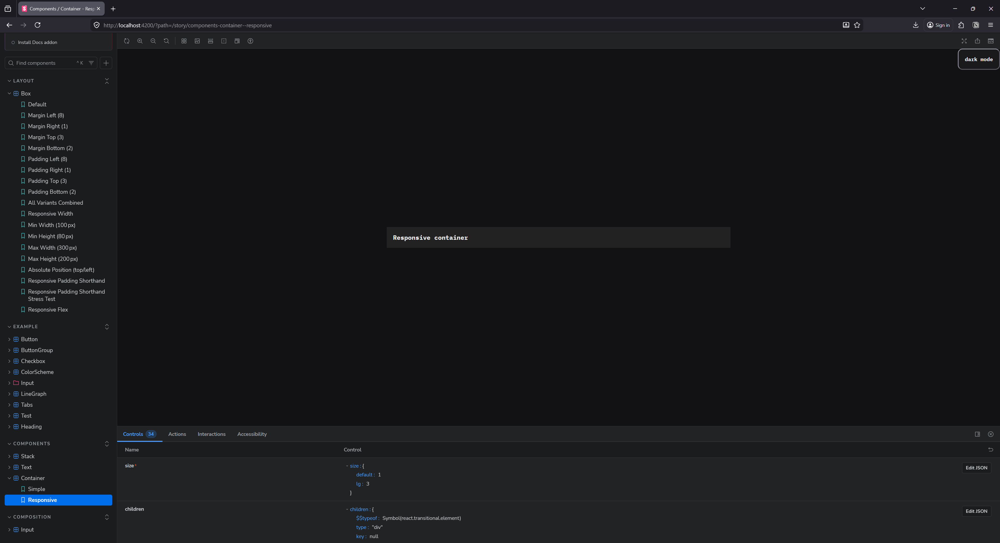

As someone who rapidly prototypes apps, one of my favorite features in a design system is utility style props. Being able quickly set a `width` on a `<Box>` element is a game changer, it’s so much faster than having to spin up a new style (CSS, Style Components, etc) and attach it to the element. And responsive utility props? Even better. Being able to set a `width={{ default: "100px", lg: "420px" }}` is so much easier than making a new style _and_ adding media queries to it.

If you’ve used UI libraries like Radix UI and Tamagui, or Chakra UI back in the day, you might be familiar with this pattern. It’s become a common paradigm to for component libraries to add to their systems.

Recently I’ve been digging back into my Oat Milk design system that I created last year and seeing how I can modernize it - like using newer web APIs. One of the explorations is migrating my UI library from Styled Components to using Meta’s new StyleX library. As I’ve been going through the process of converting systems over, I thought I’d go over how I handled responsive style props in StyleX.

In this blog I’ll go over the process of adding responsive style props to a UI library using StyleX, and how I used newer CSS APIs to accomplish it. I’ll also cover tips like creating scripts to automate style generation, and how I optimized LLM for research and code generation (and how hit or miss it was).

> 📂 TLDR? Go check out [the responsive style prop branch](https://github.com/whoisryosuke/oat-milk-design/tree/stylex-responsive-style-props) in the Oat Milk repo to see all the source code in full context.

# What are responsive style props?

It’s a mouthful. Let’s break it down in pieces.

## Style Props

The first part is **utility style props**, or sometimes just referred to as **style props.** This refers to component “props” that we can set to quickly change the styling of the component.

```tsx
<Button width="100%" px={3} py={2}>
  Buy now
</Button>
```

This gives is a `<Button>` component that’s 100% width, and padded on the sides (`px` or “padding horizontal”) and top (`py` or “padding vertical”).

This might translate to CSS like this:

```css
width: 100%;
padding-left: var(--space-3);
padding-right: var(--space-3);
padding-top: var(--space-2);
padding-bottom: var(--space-2);
```

So much easier than actually writing the CSS right? And if notice, we use CSS variables for the padding. That’s because utility style props usually let you leverage design tokens first — or insert any value you need (like the `100%` width).

import StylePropExample from "./StylePropExample/StylePropExample";

<StylePropExample client:load />

## Responsive Style Props

Style props are great, but like I mentioned earlier, sometimes you want a style that specific to a certain breakpoint. You might need to adapt your layout to the smaller mobile viewport, or expand it for the larger desktop spaces.

That’s where responsive style props come in. These let you set styles as props - while also defining styles per breakpoint. It’d look like this:

```tsx
<Box
  width={{
    default: "200px",
    sm: "420px",
    md: "640px",
    lg: "860px",
    xl: "1080px",
  }}
/>
```

This creates a `<div>` (aka `<Box>`) that is 200px on mobile, and 1080px on a desktop.

import ResponsiveStylePropExample from "./StylePropExample/ResponsiveStylePropExample";

<ResponsiveStylePropExample client:load />

This becomes incredibly useful when you combine it with other props like `display`, allowing you to hide elements on smaller viewports.

> ℹ️ For incredibly custom styles ultimately it’s better to just go into your styling system — like CSS modules or Styled Components. Once you start to style the component with properties that aren’t covered by the style props — you might as well eject. It can become a bit confusing to jump between style props and style definitions.

# How it works

What’s happening when we set a style prop? When I say `<Button width="100%">` — that ultimately becomes CSS (like I showed earlier). We could achieve this in the most rudimentary way by just throwing the props into the inline styles:

```tsx
import React, { CSSProperties, PropsWithChildren } from "react";

type Props = {
  width: CSSProperties["width"];
};

const Box = ({ width, children }: PropsWithChildren<Props>) => {
  return <div style={{ width }}>{children}</div>;
};

export default Box;
```

That simply, we have given our user the ability to quickly set styles on a component level.

It’s not the most efficient way because we leverage inline styles - meaning the browser has to crunch on each element to parse it’s styles — instead of having a shared CSS class it can parse once. We’re also not applying a design token (although that’s totally possible with this setup).

And more importantly, we’re also missing responsiveness. Without defining some CSS styles, it’s impossible to create different styles for specific viewports. We need [CSS media queries](https://developer.mozilla.org/en-US/docs/Web/CSS/Guides/Media_queries/Using) to be able to create breakpoint-based styles.

```css
.Button {
  width: 100px;
}

@media (max-width: 420px) {
  .Button {
    width: 420px;
  }
}
```

Let’s keep going to see how we can leverage media queries to create _responsive_ utility style props.

## In Styled Components

I already had responsive style props setup in Oat Milk using Styled Components. You could use the `styled-system` library to do it out of the box, but I decided write my own version as Styled System seems to be abandoned.

This is what it looks like in Styled Components:

```tsx
const Box = styled.div<BoxProps>`
  ${({ theme, ...props }) =>
    mrup(
      [
        "m",
        "mx",
        "my",
        "ml",
        "mr",
        "mt",
        "mb",
        "p",
        "px",
        "py",
        "pl",
        "pr",
        "pt",
        "pb",
      ],
      theme,
      props as Record<string, ThemeTokenKey | object>,
    )}
`;
```

If you’re not familiar with Styled Components, you basically have a `styled.div` function where you pass your CSS styles inside backticks (```). It's kinda like CSS modules, if you've ever used that. The big difference though is being able to run JavaScript inside the styles - so you can have a function like `mrup()` running and ultimately returning CSS back.

The `mrup()` function is a shorthand for “generate multiple utility media queries”…function:

```tsx
// <Box width={["200px", "400px", "600px"]} />
export const generateMultiUtilityMediaQueries = (
  utilityPropNames: string[],
  themeProp: Theme,
  componentProps: Record<string, ThemeTokenKey | object>,
  // componentProps: unknown
) => {
  const styles = [
    [] as string[], // default
    [] as string[], // mobile
    [] as string[], // tablet
    [] as string[], // computer
    [] as string[], // desktop
    [] as string[], // widescreen
  ];
  const mediaQueries = Object.values(MEDIA_QUERIES);
  const propsToThemeMap = Object.entries(PROPS_TO_THEME);

  // Loop over each utility prop
  utilityPropNames.forEach((utilityPropName) => {
    const themeKey = propsToThemeMap.find(([_, propNames]) =>
      propNames.includes(
        utilityPropName as PropsToTheme[PropsToThemeKeys][number],
      ),
    );
    if (!themeKey) return;
    const themeRef = themeProp[themeKey[0] as keyof Theme];
    const componentProp = componentProps[utilityPropName];
    // Get the actual CSS property we'll target
    const cssPropName = PROP_TO_CSS[utilityPropName as PropToCSSKeys];

    // If it's not an array, just make it one so we can handle it like one
    const keys = !Array.isArray(componentProp)
      ? [componentProp]
      : componentProp;

    // Handle each responsive prop value
    // We basically use the `up()` here to access the theme prop quickly
    keys.map((key, index) => {
      if (!key) return;
      styles[index].push(
        `${cssPropName}: ${up([key], themeRef as ThemeObject, 0)};`,
      );
    });
  });

  // Combine all the styles together into media queries.
  return styles.map((breakpointStyles, index) => {
    const mediaQuery = mediaQueries[index];
    const style = `
      ${mediaQuery} {
        ${breakpointStyles.join("\n")}
      }
    `;

    return style;
  });
};
```

This function loops over each of the props we provide and generates the CSS (including media queries) for each one. Nothing too wild in terms of logic - it has to convert CSS shorthand (like `mr`) to real CSS properties (like `marginRight`).

And then when we need to determine if we want to give the user a design token or their raw value, I have a `generateUtilityProps()` function (seen above as `up()`). This just checks the Styled Components theme object for the design token.

```tsx
// We accept multiple options for utility props (like paddingLeft and paddingHorizontal)
// This gives priority to whichever comes first in array (e.g. `[pl,px,p]` will do `pl` first)
export const generateUtilityProps = (
  keys: (string | number | undefined)[],
  themeProp: ThemeObject,
  fallback: string | number,
) => {
  const actualKey = keys.find((key) => key && key !== "");

  return actualKey
    ? actualKey in themeProp
      ? themeProp[actualKey]
      : actualKey
    : fallback;
};
```

> 📁 Here’s a link to [the full source code](https://github.com/whoisryosuke/oat-milk-design/blob/30b71af6176968dd80df148fb849a50c1f453cb0/src/utils/theme.ts) for reference.

## In Radix UI

Now that we understand how utility style props are generally made, and seen the complexity of generating responsive media queries in Styled Components — let’s take a look at how Radix UI handles this process.

Radix UI (or more specifically, Radix Themes) is built using CSS. They also use PostCSS to handle generating styles as needed (similar to how we used Styled Components — but statically during build which makes it optimized).

Let’s take a trip. We’ll start on the user-side creating a `<Heading>` component with responsive style props:

```jsx
<Heading
  size={{
    initial: "3",
    md: "5",
    xl: "7",
  }}
/>
```

This renders HTML that looks like this:

```tsx
<h1 class="rt-Heading rt-r-size-3 md:rt-r-size-5 xl:rt-r-size-7" />
```

Or if it has props that don’t use design tokens (like letting user pass any CSS value) — then they do inline styles with vars:

```tsx
<div
  style="--width: 100%; --width-sm: 300px; --width-md: 500px"
  class="rt-Flex rt-r-w sm:rt-r-w md:rt-r-w"
/>
```

This all works under the hood using [a PostCSS script](https://github.com/radix-ui/themes/blob/3d286ce0966870a01a491874b9fd77f25027d309/packages/radix-ui-themes/postcss-breakpoints.cjs) (`postcss-breakpoints.cjs`). It basically pre-generates all possible breakpoint styles up front for each design token (which they represent as a atomic CSS class):

```css
.rt-r-size-3 {
  font-size: var(--font-size-3);
}
.rt-r-size-5 {
  font-size: var(--font-size-5);
}
.rt-r-size-7 {
  font-size: var(--font-size-7);
}
```

That gets transformed into this by the PostCSS script:

```css
/* base — no media query */
.rt-r-size-3 { font-size: var(--font-size-3); }

/* sm breakpoint */
@media (min-width: 520px) {
  .sm\:rt-r-size-3 { font-size: var(--font-size-3); }
  .sm\:rt-r-size-5 { font-size: var(--font-size-5); }
  /* ...every value at every breakpoint */
}

/* md breakpoint */
@media (min-width: 768px) {
  .md\:rt-r-size-5 { font-size: var(--font-size-5); }
  ...
}

/* xl breakpoint */
@media (min-width: 1280px) {
  .xl\:rt-r-size-7 { font-size: var(--font-size-7); }
  ...
}
```

Which gives us pre-generated styles for each breakpoint, for each design token.

To connect this to the component, they define prop files for [each component](https://github.com/radix-ui/themes/blob/3d286ce0966870a01a491874b9fd77f25027d309/packages/radix-ui-themes/src/components/heading.props.tsx#L15):

```tsx
// heading.props.ts
export const headingPropDefs = {
  size: {
    type: "enum",
    className: "rt-r-size",
    values: ["1", "2", "3", "4", "5", "6", "7", "8", "9"],
    default: "6",
    responsive: true,
  },
  // ...
};
```

And then in the component it runs `extractProps()` which runs `getResponsiveClassNames` which handles getting the statically generated breakpoint class from earlier:

```tsx
// Simplified pseudocode of what getResponsiveClassNames does:
function getResponsiveClassNames({ value, className, propValues }) {
  if (typeof value === "string") {
    // Non-responsive, single value
    return `${className}-${value}`;
  }

  // Responsive object: { initial: "3", md: "5", xl: "7" }
  return Object.entries(value)
    .map(([breakpoint, val]) => {
      const prefix = breakpoint === "initial" ? "" : `${breakpoint}:`;
      return `${prefix}${className}-${val}`;
    })
    .join(" ");
}
// → "rt-r-size-3 md:rt-r-size-5 xl:rt-r-size-7"
```

> 📁 Here’s a link to [the full unedited source code](https://github.com/radix-ui/themes/blob/3d286ce0966870a01a491874b9fd77f25027d309/packages/radix-ui-themes/src/helpers/get-responsive-styles.ts#L34).

The most interesting takeaway from this system was their method of handling responsive props: use of CSS variables for each breakpoint, then define pre-generated styles that use those CSS vars.

```tsx
rt-r-size-w { width: var(--width); }
.sm\:rt-r-size-w { width: var(--width-sm); }
.md\:rt-r-size-w { width: var(--width-md); }
```

This was an interesting workaround to not having the dynamic style generating you get with CSS in JS (aka Styled Components).

So cool, now that we’ve seen how responsive style props work - and even a few different implementations, let’s check out StyleX.

# What is StyleX?

StyleX is a new styling library from Meta. You write styles in JavaScript, often alongside your React components, and the library generates static and optimized CSS from your styles. It leverages the build system of your app, like Babel or Vite, to check for styles during the build and generate any CSS necessary.

I highly recommend checking out [the docs](https://stylexjs.com/docs/learn/) and reading through the intro and “thinking in StyleX” sections.

Styles are defined using a `create()` function.

```tsx
import * as stylex from "@stylexjs/stylex";

const styles = stylex.create({
  container: {
    width: "100%",
    maxWidth: 800,
    minHeight: 40,
  },
  text: {
    fontSize: "1rem",
  },
});
```

This allows you to essentially create CSS classes that you can use in your code.

```tsx
function YourComponent() {
  return (
    <div {...stylex.props(styles.container)}>
      <p {...stylex.props(styles.text)}>Stay creative</p>
    </div>
  );
}
```

The beauty of StyleX is that if you use the style `styles` variable across multiple files, they share the CSS class - minimizing the amount of code you ship. This works great for creating things like “variants”:

```tsx
export const textStyles = create({
  billboard: {
    fontSize: fontSizes["8"],
    fontWeight: fontWeights.bold,
  },
  title: {
    fontSize: fontSizes["7"],
    fontWeight: fontWeights.bold,
  },
  h1: {
    fontSize: fontSizes["6"],
    fontWeight: fontWeights.bold,
  },
  // etc
});
```

## “The StyleX Way”

There’s a few features I could breakdown for StyleX, but for the purposes of this blog, we only need to concern ourselves with 3 APIs:

- Variables (`defineVars`)
- Media Queries (`[DARK]`)
- Constants (`defineConsts`)

### Variables

Variables are basically CSS variables. You can define an object with keys that represent your design token (like `colors` would be the variable object and `red` would be the property name).

```tsx
import { defineVars } from '@stylexjs/stylex';

export const colors = stylex.defineVars({
  primary: 'teal',
  background: 'white',
}
```

We can access these in our styles:

```tsx
export const styles = create({
  button: {
    color: colors.primary,
  },
});
```

And when we look at it in the browser, we’ll see:

```css
.klgh884k {
  color: var(--jgirtr943);
}

:root {
  --jgirtr943: teal;
}
```

Nice. It’s a convenient way to create theming in JavaScript while seamlessly translating into CSS as needed.

One thing to note here. You’ll notice that the variables get obfuscated during the build process. That’s nice if you don’t want variables exposed to the user (or dealing with naming them uniquely). But since I’m creating a design system, I want these variables to be exposed to the user. Just in case they want to make some changes themselves, or use them in another external system (like styling 3rd party components).

To support this, you can just name each variable property using a CSS variable name. StyleX detects these and passes them directly to user:

```tsx
export const space = defineVars({
  "--oat-space-0": "0px",
  "--oat-space-1": "2px",
  "--oat-space-2": "4px",
  "--oat-space-3": "8px",
  "--oat-space-4": "16px",
  "--oat-space-5": "24px",
  "--oat-space-6": "32px",
  "--oat-space-7": "48px",
  "--oat-space-8": "64px",
  "--oat-space-9": "96px",
  "--oat-space-10": "128px",
  "--oat-space-11": "192px",
  "--oat-space-12": "256px",
  "--oat-space-13": "512px",
});
```

### Media Queries

You define media queries while creating your styles, kinda similar to Styled Components. Here are [the official docs](https://stylexjs.com/docs/learn/styling-ui/defining-styles#media-queries-and-other--rules) on this feature.

```tsx
import * as stylex from "@stylexjs/stylex";

const styles = stylex.create({
  container: {
    width: {
      default: "100%",
      "@media (max-width: 800px)": "420px",
      "@media (min-width: 1600px)": "1200px",
    },
  },
});
```

Rather than simply setting a `width` value, you create an object that has properties where each one is a media query. If this seems verbose, you can define a variable for the media query too:

```tsx
import * as stylex from "@stylexjs/stylex";

const BP = {
  sm: "@media (max-width: 800px)",
  md: "@media (min-width: 1600px)",
};

const styles = stylex.create({
  container: {
    width: {
      default: "100%",
      [BP.sm]: "420px",
      [BP.md]: "1200px",
    },
  },
});
```

### Constants

This one I’ll highlight early on because the documentation doesn’t really cover it, and the only way you’d know about it reading the API specification, or stumbling onto it naturally like me through mysterious error messages.

One of the key things about StyleX is that it’s a library for generating static styles. That means all the code that goes into it also has to be in turn, static. You can see it in [the list of “constraints”](https://stylexjs.com/docs/learn/styling-ui/defining-styles#constraints) in the docs, you can’t do things like call functions inside StyleX function calls (like we do in Styled Components).

This isn’t really an issue most of the time, but I noticed it when I tried doing some seemingly simple stuff that immediately [broke](https://dev.to/sal_lancaster/debugging-stylex-vite-the-mystery-of-invalid-empty-selector-158k).

```tsx
stylex Internal server error: Invalid empty selector │ at processCollectedRulesToCSS
```

Just like above I tried defining some preset “breakpoints” to use in StyleX styles, but when I tried to use them in my files, I got a strange error from StyleX. Instead, I had to wrap my breakpoints in a `defineConsts` method. This let me access them without any issue:

```tsx
export const BREAKPOINT_MEDIA_QUERIES_MAP = defineConsts({
  // Smallest breakpoint = default (StyleX terminology + styling paradigm)
  default: "@media (min-width: 520px)",
  sm: "@media (min-width: 768px)",
  md: "@media (min-width: 1024px)",
  lg: "@media (min-width: 1280px)",
  xl: "@media (min-width: 1640px)",
});
```

Then later I can use them as a media query in a StyleX style:

```tsx
import * as stylex from "@stylexjs/stylex";
import { BREAKPOINT_MEDIA_QUERIES_MAP as MQ } from "../variables/breakpoints.stylex";

export const responsive = stylex.create({
  layout: {
    width: {
      default: "var(--width, auto)",
      [MQ.sm]: "var(--width-sm, var(--width))",
    },
  },
});
```

> ℹ️ StyleX tries to keep everything static. This includes avoiding imported data. In order to circumvent this, anything we want to import and use inside a variable needs to be inside it’s own `.stylex.ts` file and wrapped in a `defineConsts` function. This ensures your data is static (since you can’t do function calls without a TS error), and makes it accessible to StyleX.

# Style Props in StyleX

Now that we understand StyleX a bit, let’s try to add style props to it.

So ultimately, we’re trying to get this:

```tsx
<Button width="100%" />
```

Compiling to this:

```css
.Button {
  width: 100%;
}
```

…using StyleX. No responsive hijinks for now, we only need to care about 1 value to apply as a style.

Knowing everything we know now, I decided to try a quick test. What if I created a StyleX style inside the component, and and passed in a property powered by React state? What do you think will happen here?

```tsx
const Test = ({ variant, ...props }: Props) => {
  const [padding, setPadding] = useState(0);

  const indoorStyle = stylex.create({
    test: {
      padding: padding,
    },
  });

  return (
    <div {...props} {...stylex.props(styles[variant], indoorStyle.test)}>
      Test
    </div>
  );
};
```

If you guessed “break” or “not work” — you’d be correct! StyleX detects that we’re trying to do something dynamic and gives us the following error:

```css
■  Vite Internal server error: .\src\components\Test\Test.tsx: Unsupported
│  expression: VariableDeclarator
```

Cool, that’s expected. So how do we do this the right way?

[Looking at the docs](https://stylexjs.com/docs/learn/styling-ui/defining-styles) it seems my option is basically: [“dynamic styles”](https://stylexjs.com/docs/learn/styling-ui/defining-styles#dynamic-styles) which is kinda what Radix did - it makes a CSS var and sets that CSS var as an inline style. Or instead, I can just predefine styles and swap between them (also similar to Radix) — but that’s gonna be a lot of pre-generated style definitions (basically what I do for utility props \* the number of breakpoints).

So let’s do it “wrong” one more time to show you what’s happening under the StyleX hood when we use their “dynamic styles” API in a minute:

```tsx
import { useState, CSSProperties } from "react";
import * as stylex from "@stylexjs/stylex";

const styles = stylex.create({
  container: {
    height: "var(--height)",
  },
});

function MyComponent() {
  // The value of `height` cannot be known at compile time.
  const [height, setHeight] = useState(10);

  return (
    <div
      {...stylex.props(styles.container)}
      style={{ "--height": height } as CSSProperties}
    />
  );
}
```

We define a StyleX style that has a placeholder for our variable, then we set the variable using inline styles.

Instead, we could just leverage the dynamic styles API:

```tsx
import { useState } from "react";
import * as stylex from "@stylexjs/stylex";

const styles = stylex.create({
  // Function arguments must be simple identifiers
  // -- No destructuring or default values
  bar: (height) => ({
    height,
    // The function body must be an object literal
    // -- { return {} } is not allowed
  }),
});

function MyComponent() {
  const [height, setHeight] = useState(10);

  return <div {...stylex.props(styles.bar(height))} />;
}
```

And it basically does the same thing. But…it doesn’t support responsive styles. Which leads us to…

> 📁 You might be asking yourself — but wait, we didn’t add design tokens yet! We’ll get to that. It’s a little more complex in the StyleX paradigm.

# Responsive Props

So now we want to take this component:

```tsx
<Box
  width={{
    default: "200px",
    sm: "420px",
  }}
/>
```

And get the correct CSS with proper media queries defining breakpoint specific styles:

```css
.Button {
  width: 200px;
}

@media (max-width: 800px) {
  .Button {
    width: 420px;
  }
}
```

So how do we do this with StyleX?

Well with StyleX’s media queries, we need to define them inside a StyleX `create()` function (aka creating a CSS class). And if we go back to how Radix UI handles their breakpoints, we could leverage CSS variables for each specific breakpoint (like `--width-sm` for the `sm` breakpoint).

With that in mind, this is how that would look:

```tsx
const BREAKPOINT_MEDIA_QUERIES_MAP = defineConsts({
  xs: "@media (max-width: 520px)",
  sm: "@media (max-width: 768px)",
});

// Alias for easier use.
const MP = BREAKPOINT_MEDIA_QUERIES_MAP;

const styles = stylex.create({
  box: {
    margin: 0,
    padding: 0,
    width: {
      default: "var(--width)",
      [MP.xs]: "var(--width-xs)",
      [MP.sm]: "var(--width-sm)",
    },
  },
});

const Test = ({ variant, width, ...props }: Props) => {
  const sx = stylex.props(styles.box);
  const inlineStyles = {
    "--width": width.default,
    "--width-xs": width.xs,
    "--width-sm": width.sm,
  };
  return (
    <div
      {...props}
      className={sx.className}
      style={{
        ...sx.styles,
        ...inlineStyles,
      }}
    >
      Test
    </div>
  );
};
```

This works, great. Kind of. We have one DX issue.

> ℹ️ The StyleX docs encourage a code style where you spread the `stylex.props()` method directly into your component. That basically just adds a `className` props, and a `style` prop (when necessary - usually dynamic styles). To properly append to this system, we need to create a new inline style object and append both styles. But like I said, in most cases, you can probably omit the StyleX inline styles (and avoid allocating a new object each component render).

### Graceful fallbacks

What if the user doesn’t pass all the properties?

```tsx
<Box
  width={{
    default: "200px",
    sm: "310px",
    // missing md
    // missing lg
    xl: "420px",
  }}
/>
```

Currently the layout would break in some breakpoints. If we tried to view the website at the `md` breakpoint the width it would try to apply the `--width-md` variable, which doesn’t exist and has no fallback, so it’d revert to an initial state (`auto` likely — not the behavior you’d probably expect).

Since we’re using CSS variables, we could provide a fallback when we use them:

```tsx
const styles = stylex.create({
  box: {
    width: {
      default: "var(--width)",
      [MP.xs]: "var(--width-xs, var(--width))",
      [MP.sm]: "var(--width-sm, var(--width-xs))",
    },
  },
});
```

This works a bit better, providing a fallback to the previous value. But again, we have the same issue. What if we fallback to the default value as a final fallback?

```tsx
const styles = stylex.create({
  box: {
    width: {
      default: "var(--width)",
      [MP.xs]: "var(--width-xs, var(--width, var(--width)))",
      [MP.sm]: "var(--width-sm, var(--width-xs, var(--width)))",
    },
  },
});
```

This causes it to do some weird stuff. For example if I have a `default` breakpoint — then a `sm` then a `xl` (like the example above)— the `lg` breakpoint that isn’t defined would fallback to `md` - which isn’t defined, so it’d try `default`.

So the property would jump from the breakpoints in this order: `default` → `sm` → `default` → `default` → `xl`.

That wouldn’t be a very fluid or responsive design. What can we do instead? What if we fallback to each previous value, and cascade to each previous value?

```tsx
export const responsive = stylex.create({
  layout: {
    width: {
      default: "var(--width, auto)",
      [MQ.sm]: "var(--width-sm, var(--width))",
      [MQ.md]: "var(--width-md, var(--width-sm, var(--width)))",
      [MQ.lg]:
        "var(--width-lg, var(--width-md, var(--width-sm, var(--width))))",
      [MQ.xl]:
        "var(--width-xl, var(--width-lg, var(--width-md, var(--width-sm, var(--width)))))",
    },
  },
});
```

Now this — this works. If the user doesn’t provide a value for a breakpoint, it falls back to the previous and if that doesn’t exist, it keeps going down all the way to the “default” (aka mobile) viewport.

Here’s an example of a `<Box>` component with a responsive width. I only define a `default` and `sm` breakpoints, and on the biggest breakpoint you can see it fallback to the `sm` CSS variable/breakpoint:


The Firefox DevTools on the Inspector tab with a div element selected. The sidebar has a list of CSS variables applied as an inline style including a width and “sm” width breakpoint value. Below is a CSS class applying the media queries for the largest breakpoint.

Now we have a system that’s working well, but it’s still pretty manual and verbose. Let’s create some functions to encapsulate reusable logic and create some scripts to generate styles for us.

### Making it reusable

Let’s make a type that’ll help quickly define the responsive style props:

```tsx
export type ResponsiveStyleProp<T> = Record<
  keyof typeof BREAKPOINT_MEDIA_QUERIES_MAP,
  T
>;

type Props = {
  // Responsive props
  width: ResponsiveStyleProp<CSSProperties["width"]>;
};
```

I could also make a function to simplify generating the inline styles. It takes the props provided and dynamically maps them to inline styles with CSS vars like above.

```tsx
function handleResponsiveProps(
  props: Record<string, ResponsiveStyleProp<any>>,
) {
  const inlineStyles = {} as Record<string, any>;

  // Loop over all props (width, height, etc)
  for (const prop in props) {
    // Loop over each responsive breakpoint item
    for (const breakpoint in props[prop]) {
      // We generate a CSS class name for each breakpoint(e.g. `--width-md`)
      // Default breakpoint has no suffix (e.g. `--width`)
      const breakpointKey =
        breakpoint as keyof typeof BREAKPOINT_MEDIA_QUERIES_MAP;
      const breakpointVar = breakpoint == "default" ? "" : `-${breakpoint}`;
      const cssVarName = `--${prop}${breakpointVar}`;

      inlineStyles[cssVarName] = props[prop][breakpointKey];
    }
  }
  // Assert CSS props type because we use CSS vars (which aren't included by default)
  return inlineStyles as CSSProperties;
}
```

Now we can pass a bunch of props and quickly create our styles:

```tsx
const Box = ({
  width,
  height,
  minWidth,
  minHeight,
  maxWidth,
  maxHeight,
  position,
  top,
  left,
  right,
  bottom,
  ml,
  mr,
  mt,
  mb,
  pl,
  pr,
  pt,
  pb,
  children,
  style,
  ...props
}: PropsWithChildren<Props>) => {
  const sx = stylex.props(styles.box, responsive.layout, style);
  const inlineStyles = handleResponsiveProps({
    width,
    height,
    minWidth,
    minHeight,
    maxWidth,
    maxHeight,
    position,
    top,
    left,
    right,
    bottom,
    ml,
    mr,
    mt,
    mb,
    pl,
    pr,
    pt,
    pb,
  });
  return (
    <div
      className={sx.className}
      style={{
        ...sx.styles,
        ...inlineStyles,
      }}
      {...props}
    >
      {children}
    </div>
  );
};
```

But wait, if we wanted to support this many props, we’d need a StyleX style definition with each one as an option (with all breakpoints):

```tsx
import * as stylex from "@stylexjs/stylex";
import { BREAKPOINT_MEDIA_QUERIES_MAP as MQ } from "../variables/breakpoints.stylex";

export const responsive = stylex.create({
  layout: {
    width: {
      default: "var(--width, auto)",
      [MQ.sm]: "var(--width-sm, var(--width))",
      [MQ.md]: "var(--width-md, var(--width-sm, var(--width)))",
      [MQ.lg]:
        "var(--width-lg, var(--width-md, var(--width-sm, var(--width))))",
      [MQ.xl]:
        "var(--width-xl, var(--width-lg, var(--width-md, var(--width-sm, var(--width)))))",
    },
    height: {
      default: "var(--height, auto)",
      [MQ.sm]: "var(--height-sm, var(--height))",
      [MQ.md]: "var(--height-md, var(--height-sm, var(--height)))",
      [MQ.lg]:
        "var(--height-lg, var(--height-md, var(--height-sm, var(--height))))",
      [MQ.xl]:
        "var(--height-xl, var(--height-lg, var(--height-md, var(--height-sm, var(--height)))))",
    },

    // And like...10+ more...
  },
});
```

That’s a lot of boilerplate code….let’s create a script to generate it for us.

### Scripting time

I developed this script as I was going and testing various methods (like the different fallback techniques), so it went through a few iterations. I’ll only share the latest version for brevity.

So we need a script to generate a StyleX style definition with all of our properties and more importantly — all of our breakpoints and their complex cascading CSS var fallbacks.

Let’s make a list of all possible props (at least, layout — we’ll organize them by category):

```tsx
// Responsive layout
const layoutProps = [
  // Size
  "width",
  "height",
  "minWidth",
  "minHeight",
  "maxWidth",
  "maxHeight",
  // Position
  "position",
  "top",
  "left",
  "right",
  "bottom",
  // Visibility
  "display",
  // Margin
  "margin",
  "ml",
  "mr",
  "mt",
  "mb",
  "mx",
  "my",
  // Padding
  "padding",
  "pl",
  "pr",
  "pt",
  "pb",
  "px",
  "py",
];
```

I define an object that encapsulates all the styles we need (the “categories” I mentioned above):

```tsx
// The final style object for StyleX.create()
const styleObj: Record<string, Record<string, any>> = {
  layout: {},
  typography: {},
};
```

Then I run a `generateStyleDefs` function to take the list of props we provide and generate the necessary styles:

```tsx
generateStyleDefs("layout", layoutProps);
```

That’s where the magic happens. Let’s take a peek at it:

```tsx
function generateStyleDefs(styleName: string, props: string[]) {
  // Loop over all the props provided
  for (const prop of props) {
    if (CSS_SHORTHAND_IGNORE.includes(prop)) continue;

    const nested = {} as Record<string, any>;

    // Default – always present
    nested.default = `var(--${prop}, auto)`;

    // Loop over each possible breakpoint
    let bpIndex = -1;
    for (const bpKey of breakpointKeys) {
      bpIndex += 1;
      if (bpKey === "default") continue; // already handled
      const prevKey = bpIndex > 1 ? `-${breakpointKeys[bpIndex - 1]}` : "";

      const fallbackVars = generateFallbackVars(
        prop,
        breakpointKeys.slice(0, bpIndex),
      );

      // Handle combined shorthand cases
      // Because props like `mx` target 2 props the user can already use as props,
      // we check for the direct prop (e.g. `marginLeft`) first, then fallback to combined prop.
      // e.g. [MQ.sm] => var(--ml-sm, var(--mx-sm, var(--ml)))
      if (prop == "pl" || prop == "pr") {
        nested[`[MQ.${bpKey}]`] =
          `var(--${prop}-${bpKey}, var(--px-${bpKey}, ${fallbackVars}))`;
        continue;
      }
      // ...other shorthand props...

      // Non-shorthand keys? Handle normally.
      // We fallback to the last breakpoint variable (using the `prevKey`)
      // e.g. [MQ.sm] => var(--width-sm, var(--width))
      nested[`[MQ.${bpKey}]`] = `var(--${prop}-${bpKey}, ${fallbackVars})`;
    }

    // Handle the CSS shorthand magic
    const styleProps =
      // @ts-ignore - Really Typescript? We literally do a `in` check.
      prop in CSS_SHORTHAND_MAP ? CSS_SHORTHAND_MAP[prop] : [prop];

    styleProps.forEach((styleProp: string) => {
      styleObj[styleName][styleProp] = nested;
    });
  }
}
```

Nothing wild here. We do a `for loop` over the props and store the breakpoint styles inside a `nested` object. The breakpoint styles are just CSS variables (like `--width-sm`) — so we generate those using the prop name and the breakpoint key.

Where it gets interesting are the shorthand properties. I wanted to support props like `px` and `my` which do horizontal padding (both `paddingLeft` and `paddingRight`) and vertical margin respectively. That means they target multiple properties at once.

This means when we loop over properties, I skip the shorthand properties (via the `CSS_SHORTHAND_IGNORE` check on top). Then when we loop through the properties, we conditionally check for the properties they represent (like `pr` and `pl` for `px`). There we include 1 more fallback before the breakpoints — the breakpoint specific shorthand variable (`--px-sm` for example).

```tsx
if (prop == "pl" || prop == "pr") {
  nested[`[MQ.${bpKey}]`] =
    `var(--${prop}-${bpKey}, var(--px-${bpKey}, ${fallbackVars}))`;
  continue;
}
```

This allows the user to pass a `pr` property and have it override the `px` property if needed, thanks to it’s higher presence in the variable fallback sequence.

Then after generating the files we just save the file to disk, in my case I put it alongside my variants in the `src/themes/variants/` folder.

```tsx
// Generate the `stylex.ts` file
const header = `/**
 * This file was generated by "generate-responsive-stylex.ts"
 */
import * as stylex from "@stylexjs/stylex";
import {
  BREAKPOINT_MEDIA_QUERIES_MAP as MQ,
} from "../variables/breakpoints.stylex";

export const responsive = stylex.create(`;

const footer = ");\n";

function serialize(obj: any, indent = 2) {
  return JSON.stringify(obj, null, indent)
    .replace(/"([^"]+)":/g, "$1:") // remove quotes around keys
    .replace(/"/g, "'"); // use single quotes for values
}

const output = `${header}
${serialize(styleObj, 2)}
${footer}`;

// Save file to disk (located in `src/themes/variants/responsive.stylex.ts`)
const __filename = fileURLToPath(import.meta.url);
const __dirname = dirname(__filename);
const STYLEX_PATH = join(
  __dirname,
  "../src/themes/variants/responsive.stylex.ts",
);
fs.writeFile(STYLEX_PATH, output, "utf-8");
```

With that, we have a “responsive” variant set of styles we can include across all of our components to enable responsive style props.

And thanks to the script, if we change our breakpoints at any time (like changing a name or adding an extra one) - we can easily generate all the styles needed quickly.

# Using design tokens

We’ve got style props, they’re responsive — but they don’t access our “theme”.

In our design system, we have sets of tokens dedicated for various purposes — like `space` tokens that provide a consistent incremental spacing scale across the app. This ensures the UI’s spacing keeps a certain rhythm and flow, and doesn’t get disrupted by elements sticking a little out from being “a few pixels off”.

The benefit of using style props is being able to access these design tokens, and particularly, contextually (e.g. if we use `fontSize` prop, the system knows we want font size tokens).

```tsx
<Button fontSize={3} />

// Equates to

<style>
.Button {
	font-size: var(--space-3);
}
</style>
```

How do we do this with our current setup? Well we’re using the user’s props, so we’ll be inside the component - in the same place as our `handleResponsiveProps()` method we created earlier.

Let’s update that function to check if the user’s value is a design token and return the CSS class associated with it.

First things first, we need a way to map our CSS properties (like `width` or `margin`) to design token “categories” (like the `fontSizes` tokens). We’ll make one big assumption — by default we’ll provide the `space` token if we don’t recognize the property. Why? If we look at CSS properties we need to support, 90% of them or more are units of measurement. Instead off having a huge dictionary here filled with all those properties, we just handle the edge cases (like font size in this case).

```
/**
 * Maps prop names to their design tokens.
 * Any `space` token is considered default (to save on space)
 */
const PROP_TO_TOKEN_MAP = {
  fontSize: { name: "fontSize", vars: fontSizes },
  default: { name: "space", vars: space },
};
```

Now inside our `handleResponsiveProps` function, when we loop over the props, we can do a few things:

1. Grab the token space we’re working in `propToToken` so we know what tokens we’re working with.
2. Generate the CSS class name for the component
3. See if the user’s prop matches any design tokens (using the CSS var, because we store them by that) and either return the correct token name, or the original prop (which handles “custom” values being passed like “100%” width).

```tsx
export function handleResponsiveProps(
  props: Record<string, ResponsiveStyleProp<any> | any | undefined>,
) {
  const inlineStyles = {} as Record<string, any>;

  // Loop over all props (width, height, etc)
  for (const prop in props) {
    // Prop is undefined? Skip.
    if (props[prop] == undefined) continue;

    // Check if prop value exists as design token
    // e.g. `width={3}` translates to `width: var(--oat-space-3)`
    const propToToken =
      prop in PROP_TO_TOKEN_MAP
        ? //@ts-ignore - we literally check right above
          PROP_TO_TOKEN_MAP[prop]
        : PROP_TO_TOKEN_MAP.default;

    // We create the CSS variable for the token here
    const tokenName = `--oat-${propToToken.name}-${props[prop]}`;

    // Design token or custom value?
    const propValue =
      tokenName in propToToken.vars ? `var(${tokenName})` : props[prop];

    // Handle as either single prop or multiple breakpoints...
  }
}
```

And with that, we can access design tokens for every property.


The CSS vars visible up top and the `width` applied

Almost. We have 1 big issue here called CSS specificity, always lurking in an invisible cloak causing cascading chaos.

If we try using this system now and the user tries to pass in custom styles using the `style` prop, the styles wouldn’t get applied. They’d constantly be overridden by out responsive styles, since they have media queries that make them more specific.

```tsx
const styles = stylex.create({
  toggle: {
    position: "absolute",
    right: 0,
    top: 0,
    zIndex: 710,
  },
});

// Later using the component
// None of these styles would get applied...
<Box {...stylex.props(styles.toggle)}>
```

How can we resolve this?

# Optimizing (and bug fixing)

## CSS on demand

I touched on it earlier, but these are a lot of styles to pass to the user. For each style prop we want to support, StyleX generates 4-5 classes (one for each media query). This is a lot of CSS to pass down to the user and have the browser parse - when we aren’t even using most of the props.

What if instead of passing a giant style object with all our style props inside, we broke each style prop into it’s own style (kinda like a variant). Then when we generate the CSS variables, we can just grab the CSS class/style for the specific prop.

With a few small changes to the script we used to generate the responsive styles, we can alter it to make this kind of style object:

```tsx
export const responsive = stylex.create({
  width: {
    width: {
      default: "var(--width, auto)",
      [MQ.sm]: "var(--width-sm, var(--width))",
      [MQ.md]: "var(--width-md, var(--width-sm, var(--width)))",
      [MQ.lg]:
        "var(--width-lg, var(--width-md, var(--width-sm, var(--width))))",
      [MQ.xl]:
        "var(--width-xl, var(--width-lg, var(--width-md, var(--width-sm, var(--width)))))",
    },
  },
  // And all the other props
  height: { height: {} },
});
```

Rather than using `responsive` as the name for our styles, we break them up by property and name them by each one.

Now we can go back to the `handleResponsiveProps()` function and return the specific styles to the user.

```tsx
const CSS_SHORTHAND_MAP = {
  ml: [responsive.marginLeft],
  mr: [responsive.marginRight],
  mt: [responsive.marginTop],
  mb: [responsive.marginBottom],
  mx: [responsive.marginLeft, responsive.marginRight],
  my: [responsive.marginTop, responsive.marginBottom],
  pl: [responsive.paddingLeft],
  pr: [responsive.paddingRight],
  pt: [responsive.paddingTop],
  pb: [responsive.paddingBottom],
  px: [responsive.paddingLeft, responsive.paddingRight],
  py: [responsive.paddingTop, responsive.paddingBottom],
};

export function handleResponsiveProps(
  props: Record<string, ResponsiveStyleProp<any> | any | undefined>,
) {
  const classNames: StyleXStyles[] = [];

  // Loop over all props (width, height, etc)
  for (const prop in props) {
    // Prop is undefined? Skip.
    if (props[prop] == undefined) continue;

    // Find appropriate CSS class name
    const responsiveClassName =
      prop in responsive ? [responsive[prop]] : undefined;
    const className =
      prop in CSS_SHORTHAND_MAP ? CSS_SHORTHAND_MAP[prop] : responsiveClassName;
    // No className? That means we don't support this prop - skip it.
    if (className == undefined) continue;
    classNames.push(...className);

    // ...inline style logic from before...
  }

  return {
    className: classNames,
    // Assert CSS props type because we use CSS vars (which aren't included by default)
    style: inlineStyles as CSSProperties,
  };
}
```

This is very similar to what StyleX does with it’s `props()` method, returning a `className` and `style` prop to the user.

```tsx
const Box = ({
  width,
  height,
  // ...more props...
  children,
  className,
  style,
  ...props
}: PropsWithChildren<Props>) => {
  const { className: inlineClass, style: inlineStyles } = handleResponsiveProps(
    {
      width,
      height,
    },
  );
  const sx = stylex.props(styles.box, ...inlineClass, style);
  return (
    <div
      {...props}
      className={cx(sx.className, inlineClass, className)}
      style={{
        ...sx.style,
        ...inlineStyles,
      }}
    >
      {children}
    </div>
  );
};
```

## The shorthand cascade

I mentioned it earlier, we handle shorthand like `px` (aka `paddingLeft` and `paddingRight` combined) with a special case. Because the `px` targets a prop another variable is already using (like `pl` for `paddingLeft`) — we just added a fallback on each level. We check for the main prop first (`pl`) and if we don’t find that, we go for the shorthand version (`px`).

```tsx
export const responsive = stylex.create({
  paddingLeft: {
    paddingLeft: {
      default: "var(--pl, auto)",
      [MQ.sm]: "var(--pl-sm, var(--px-sm, var(--pl)))",
      [MQ.md]: "var(--pl-md, var(--px-md, var(--pl-sm, var(--pl))))",
      [MQ.lg]:
        "var(--pl-lg, var(--px-lg, var(--pl-md, var(--pl-sm, var(--pl)))))",
      [MQ.xl]:
        "var(--pl-xl, var(--px-xl, var(--pl-lg, var(--pl-md, var(--pl-sm, var(--pl))))))",
    },
  },
});
```

This kinda works, but also breaks in the same way our system broke before. If we have a component and provide responsive `px` props - and skip a breakpoint - the system won’t know what to fall back to and break.

```tsx
<Box
  px={{
    default: 1,
    lg: 3,
  }}
/>
```

You can see here, we’re on the `xl` breakpoint and no styles are applied - despite there being a `lg` breakpoint to fallback to:


Firefox DevTools on the Inspector tab with a Box component div selected. In the CSS sidebar, CSS variables are applied to the element for the px and px-lg breakpoint. But below, the breakpoint style that targets the padding-right property shows a variable cascade where no variable is selected - leading to a null value.

Instead, we need to do a proper cascade like we did before, swapping between the main prop and the shorthand combination prop:

```tsx
export const responsive = stylex.create({
  paddingLeft: {
    paddingLeft: {
      default: "var(--pl, auto)",
      [MQ.sm]: "var(--pl-sm, var(--px-sm, var(--pl, var(--px))))",
      [MQ.md]:
        "var(--pl-md, var(--px-md, var(--pl-sm, var(--px-sm, var(--pl, var(--px))))))",
      [MQ.lg]:
        "var(--pl-lg, var(--px-lg, var(--pl-md, var(--px-md, var(--pl-sm, var(--px-sm, var(--pl, var(--px))))))))",
      [MQ.xl]:
        "var(--pl-xl, var(--px-xl, var(--pl-lg, var(--px-lg, var(--pl-md, var(--px-md, var(--pl-sm, var(--px-sm, var(--pl, var(--px))))))))))",
    },
  },
});
```

I updated the style generator script to use a “backup” variable when passed in, and this allowed for this kind of setup:

```tsx
function generateFallbackVars(
  prop: string,
  breakpoints: string[],
  backup?: string,
) {
  return breakpoints.reduce((merge, item) => {
    // Handle first case
    if (merge == "")
      return backup ? `var(--${prop}, var(--${backup}))` : `var(--${prop})`;
    // Nest merged items as CSS var fallback
    return backup
      ? `var(--${prop}-${item}, var(--${backup}-${item}, ${merge}))`
      : `var(--${prop}-${item}, ${merge})`;
  }, "");
}
```

# Responsive style props for all

There’s one problem with our current setup. It’s very tied to our list of props (width, height, fontSize, etc) - the ones I defined in `PROPS_TO_TOKEN_MAP`.

If you look at Radix Themes, they have components like the `<Container>` that also have responsive props - but they aren’t tied directly to CSS properties. For the `<Container>` , they have a `size` prop that accepts a number range (`1`, `2`, etc), which translates to a few preset container width.

```tsx
<Container size={{ default: 1, lg: 3 }} />
```

With our current system, we wouldn’t be able to support this. The user would have to pass in these values themselves as the `width` prop. But what if we wanted to allow for these quick - and responsive - presets? It’d only take a bit of changes to our existing system.

We need 2 things:

- Add a parameter to `handleResponsiveProps()` with a “token map” that lets us dynamically pass in our `PROPS_TO_TOKEN_MAP` (but of course, a different shaped one for each use case).
- Add another parameter to `handleResponsiveProps()` with “styles” aka our compiled StyleX styles. Up until now it’s been the auto-generated responsive styles in `responsive.stylex.ts` - but now we can pass in component-specific props if we want.

Let’s handle the token map first. We can take `PROPS_TO_TOKEN_MAP` and split it up into two new objects, `LAYOUT_PROP_TO_TOKEN` and `TEXT_PROP_TO_TOKEN`. And we’ll make a new type `PropToTokenMapItem` to enforce the structure of the mapping.

```tsx
export type PropToTokenMapItem = {
  name: string;
  vars: any;
};
export const LAYOUT_PROP_TO_TOKEN = {
  default: { name: "space", vars: space },
  // Since we auto grab tokens - and default to space tokens,
  // edge case for flex prop which get confused for tokens.
  // e.g. `flex={1}` is valid flex - but might become `--oat-space-1`
  flex: { name: "", vars: {} },
} satisfies Record<string, PropToTokenMapItem>;

export const TEXT_PROP_TO_TOKEN = {
  fontSize: { name: "fontSize", vars: fontSizes },
} satisfies Record<string, PropToTokenMapItem>;
```

> ℹ️ You’ll notice I use `satisfies` here to enforce the type on each object. This is because I tried a few variations of typing StyleX variables and they all failed in the compiler (some variations of `VarGroup<any>`, `VarGroup<Readonly<any>>`, `Record<string, StyleXVars>` ) — all gave me type issues. By using the `any` type here and `satisfies`, Typescript will pick up the types from the underlying variables. Not ideal, but not terrible.

We can update the function signature of `handleResponsiveProps()` - and swap out any static references (like our `responsive` style object) with the parameter version:

```tsx
export function handleResponsiveProps(
  props: Partial<Record<string, ResponsiveStyleProp<any> | any | undefined>>,
  tokenMap: PropToTokenMap,
  styles: Record<string, any>,
) {
```

Now this allows us to have custom props for any component, so we could replicate that Radix `<Container>` now.

The StyleX styles:

```tsx
import { create, defineConsts, defineVars } from "@stylexjs/stylex";
import { BREAKPOINT_MEDIA_QUERIES_MAP as MQ } from "../../themes/variables/breakpoints.stylex";

export const containerSizes = defineConsts({
  1: "448px",
  2: "688px",
  3: "880px",
  4: "1136px",
});

export const containerSizeVars = defineVars({
  "--oat-container-1": containerSizes[1],
  "--oat-container-2": containerSizes[2],
  "--oat-container-3": containerSizes[3],
  "--oat-container-4": containerSizes[4],
});

export const containerStyles = create({
  size: {
    width: {
      default: "var(--size, auto)",
      [MQ.sm]: "var(--size-sm, var(--size))",
      [MQ.md]: "var(--size-md, var(--size-sm, var(--size)))",
      [MQ.lg]: "var(--size-lg, var(--size-md, var(--size-sm, var(--size))))",
      [MQ.xl]:
        "var(--size-xl, var(--size-lg, var(--size-md, var(--size-sm, var(--size)))))",
    },
  },
});
```

Notice how we do a similar setup to our auto-generated file. We have to define “consts” with our raw values so we can access the keys (`1`, `2`, etc here). Then we define CSS variables with that const data — and the naming follows our convention of `--[prefix]-[styleprop]-[key]`. And finally we define the actual breakpoint powered styles - same as before using our “const” media queries and cascading variables.

And the component:

```tsx
import * as stylex from "@stylexjs/stylex";
import React, { PropsWithChildren } from "react";
import Box, { BoxProps } from "../Box/Box";
import {
  containerSizes,
  containerSizeVars,
  containerStyles,
} from "./container.stylex";
import cx from "classnames";
import {
  handleResponsiveProps,
  PropToTokenMapItem,
} from "@/utils/theming/responsive";
import { ResponsiveStyleProp } from "../../themes/variables/breakpoints.stylex";

export const CONTAINER_PROP_TO_TOKEN = {
  size: { name: "container", vars: containerSizeVars },
} satisfies Record<string, PropToTokenMapItem>;

type Props = BoxProps & {
  size: ResponsiveStyleProp<keyof typeof containerSizes>;
};

const Container = ({
  size,
  className,
  style,
  children,
  ...props
}: PropsWithChildren<Props>) => {
  const { className: inlineClass, style: inlineStyles } = handleResponsiveProps(
    {
      size,
    },
    CONTAINER_PROP_TO_TOKEN,
    containerStyles,
  );
  const sx = stylex.props(inlineClass, style);
  return (
    <Box
      {...props}
      className={cx(sx.className, inlineClass, className)}
      style={{
        ...sx.style,
        ...inlineStyles,
      }}
    >
      {children}
    </Box>
  );
};

export default Container;
```

The big one to note here is the `CONTAINER_PROP_TO_TOKEN` mapping we created. This lets the responsive style prop system know that when we pass in the `size` prop, we expect it to map to the container specific variables we created (`containerSizeVars`).



Storybook rendering our Container component

And if check the DevTools once more, we can see that we have a `--size` variable defined that maps to our variables we created (`--oat-container-1`):


# Non-responsive style props?

The last little edge case — non-responsive props. What if the user just wants a simple prop - like a `color` on a `<Text>` component. It doesn’t need to be responsive, but it should access our design tokens (aka CSS variables).

```tsx
<Text color="gray-4">
```

This is actually really easy to setup with our current system, no changes needed. We can leverage the `getTokenForProp` function to get a token value for a specific prop.

```tsx
const Text = ({
  as: UserComponent,
  children,
  fontSize,
  fontWeight,
  textAlign,
  textWrap,
  color: colorProp,
  variant,
  className,
  style,
  ...props
}: PropsWithChildren<TextProps>) => {
  const color =
    colorProp && getTokenForProp("color", colorProp, COLOR_PROP_TO_TOKEN);

  return (
    <Component
      {...props}
      style={{
        color,
      }}
    >
      {children}
    </Component>
  );
};
```

We just need to provide the correct “prop to token mapping” - so I created a `COLOR_PROP_TO_TOKEN` mapping.

```tsx
import { colors } from "../../themes/variables/colors.stylex";

export const COLOR_PROP_TO_TOKEN = {
  default: { name: "", vars: colors },
} satisfies Record<string, PropToTokenMapItem>;
```

> ℹ️ Because my color variables are structured differently (they don’t have a `colors` prefix, so it’s just `--oat-gray-1` instead of `oat-color-gray-1`) - I leave the `name` property blank here. This forces the function to check for a more “top level” token.

Cool, now we have style props on demand.


Storybook with a Text component’s story. A paragraph element is rendered with blue text.

# Done (for now)

And now - we finally have a nice system that supports responsive (and not-responsive) style props.

And I’ll be honest, it kinda works better than most others I’ve dealt with. Because it prioritizes the responsive style props, there’s less of a conflict between custom CSS and style props. Before in a Styled Component based system, I’d define some responsive style props on the component - then add some custom CSS later (forgetting about the style props) - then I’d get confused later which had priority when debugging. With this system, I can always trust that responsive props take precedence (unless I’m doing some wild stuff custom obviously `!important`s aside).

# Style props supremacy

For prototyping, and even for the convenience of it, you’d have to pry responsive style props out of my dead hands. It’s been such a solid system for quickly customizing components and achieving responsive layouts with less code.

But what do you think? Are you a fan of responsive style props, or are you tired of seeing them in UI libraries? [Let me](https://mastodon.gamedev.place/@whoisryosuke) [know](https://www.threads.com/@whoisryosuke) on [socials](https://bsky.app/profile/whoisryosuke.bsky.social). And if you enjoyed this blog, make sure to share it with any other design system sickos.

Stay creative,
Ryo
