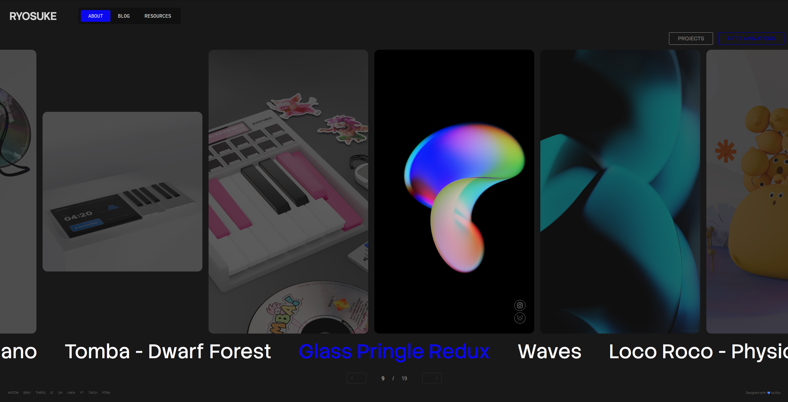
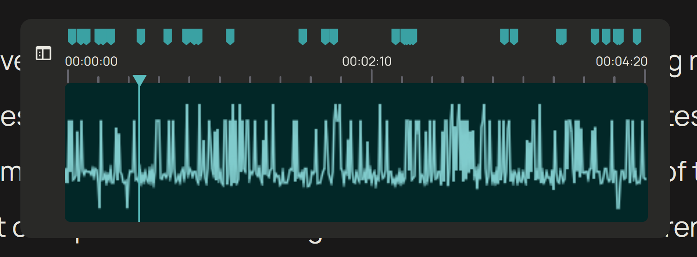
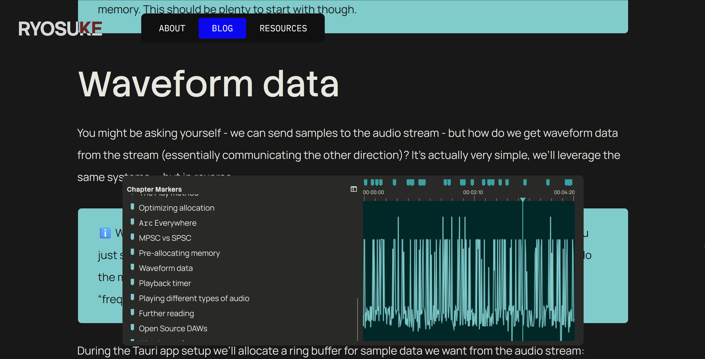
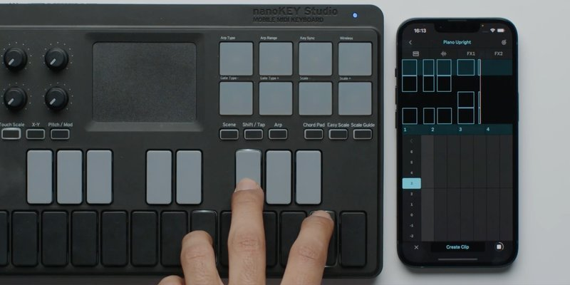
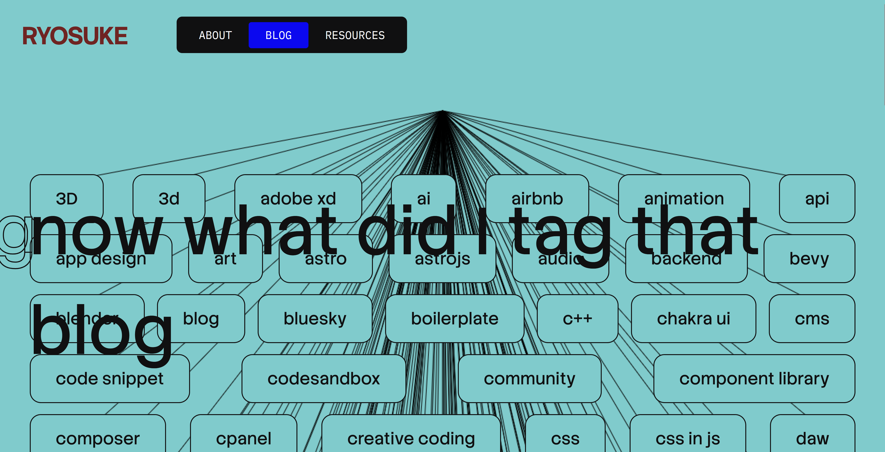

As a designer I fight the urge to redesign every other month, or whenever I’m browsing for inspiration on the feeds. The time has finally arrived. I’ve put the VisionOS inspired, 3D PocketStation chapter behind me and entered the next era.



This time my focus with the redesign was infusing more audio inspired elements into the site. From a unique waveform generated for each blog post that’s used as a mini-map, to a drumpad sampler with a smart piano roll — I had some fun making these components.


In this blog I’ll go over my thinking behind the redesign, the design process from mood boarding to wireframes (along with unreleased variants), and some code snippets for the more interesting elements.

# Why Redesign?

Besides the aesthetics feeling a little tired, I was looking to make some changes to the underlying site code.

## No Next time

The first big change was **ditching NextJS**. After their CEO decided to hop on a fascist boat and [supporting](https://x.com/rauchg/status/1972669025525158031?lang=en) [people](https://x.com/rauchg/status/2022454075699154989) who have been instrumental in destroying countless lives, I couldn’t with a clean conscience support their product any further. All new projects I’m working on have shifted to other frameworks.

This site is now powered by [**AstroJS**](https://astro.build/), which isn’t new to this site actually. [In a previous iteration](https://whoisryosuke.com/blog/2022/blog-refresh-2022/) I used Astro and got frustrated with their island architecture which made development much more difficult (and still does lol).

But I did an audit of a few frameworks, even considering doing things like using the new React Server Components to handle [SSR of the blog](https://overreacted.io/static-as-a-server/) — but I kept coming back to Astro for the simplicity of the platform (MDX out off box, SSR, most frameworks supported). I kept imagining building some [custom framework](https://github.com/nicobrinkkemper/vite-plugin-react-server) myself, then hating it 1 year later when I’m still maintaining it instead of just making cool blog posts.

Even considered Web Components, but the state of SSR there is still pretty sad, and I work so much in React anyway it didn’t make sense to limit myself like that.

## Blog Components

One of the coolest parts of having your own site is being able to have bespoke, often one-off components. [I’ve promised it in the past](https://whoisryosuke.com/blog/2024/adding-p5js-to-a-nextjs-blog/), but this time I’m actually going to follow through with it — custom React components in blog posts. A visualization of some math or architecture? Got you. An excessive interactive UI element in the middle of the blog post? Fuck yeah.

I haven’t landed on what 3D library I want to use yet, but I’ll probably end up using either vanilla JS or p5 (if I’m pushed to it) for 2D.

# Goals

Beyond switching platforms (and doing some more MDX components), I set out with a few goals:

- **Blog blog blog** — Whatever I do, the blog is the real priority. People need a comfortable place to read. And I have an archive of content to support, so I can’t do anything too wild (like suddenly start making all my content grid-based).
- **Portfolio** — It felt like the portfolio was a second thought in the previous iteration. I had a nice VisionOS Photos app inspired setup, but I never updated it with new work, so it sat stale. And if you looked at it, you’d think all I did was 3D with the eerie lack of my design and prototyping work.
- **Have fun** — As always, I should be having fun. This is a reflection of me and a place to express myself.
- **Keep it simple** — As much as I’m capable of designing overly complex interfaces, in this case I want the site to be super simple. The content should be king, interactions should come second. Nothing should impede the user, like long loading screens or a bespoke rendered UI (like some wild 3D stuff).

Nothing wild. But it’s always important to define these early, cause as you search for inspiration and mood board it’s easy to stray from the original direction and the final product gets a more muddled.

# Design Process

## Mood Board

I set off on my journey to search for inspiration. From portfolio websites to understand what people “get away with”, to other forms of design - like vintage electronic packaging.


I really gravitated towards large typography, simple colors, and a couple key elements of chaos (whether it’s text turned, brush strokes, or algorithmic inspired patterns).


## Wireframing / Low-fi

I spent a lot of time in testing out various layouts and styling. I couldn’t really find anything I was really satisfied with. I think one of the biggest blockers was the lack of a good hero component for the frontpage. I kept leaving it blank and working around it, and that kept leaving styling decisions up in the air.

You can see that despite all that, there are a few key elements that’ll make their way through each iteration (like the navbar here).


Once I started getting firm with some of the design choices, it became easier to find a layout that made a bit more sense. Here’s one of the latest iterations before the version you see today. I even had a lot off these components coded if you go back in the git history far enough.


I just wasn’t happy with the site. I felt like it didn’t have any of my character - beyond some of the styling choices. It felt very…vanilla. I reapproached the design process with a different perspective: how can I infuse music into it?

My first experiments were with my projects. Each project has multiple images I can show to the user, so I had piano notes that represented each image. And when the user presses the project, they transition to the next page in a piano roll that’s playable. Each project would have it’s own unique “tone” (like the PS startup notes for PS - cute right?).


I prototyped this a bit and I wasn’t a huge fan of the transition, and it felt weird having to make a good tune for each project.

But what if every blog post was a song? Like something you pulled off of Soundcloud. Hear me out. Instead of manually defining notes, the sound is created using the letters in the blog post. Each blog post could have it’s own unique waveform and give it’s own identity. And how cool would it be to have a way to share the blog post and have it pull the waveform?


Then I sat down one afternoon and absolutely smashed it. Had an idea for a layout that’d work well to present my work.


The harder part was settling on the about page. How do I represent myself there? I drew a vector illustration of my avatar to use and setup some simple interactions (like making elements outlined on hover). Wasn’t a huge fan of this one, but I might come back to it another time.

But I kept envisioning sound here, you can see it with the piano and waveform bars on the left side. I wanted the page to be interactive with the user playing sound and it effecting the page somehow. Initially I was thinking of having it playing a sound clip of me saying the quote - that way it gives it a more personal touch. That’s only a one-off interaction though, I wanted the user to be able to have a little fun on the page.


That’s when a drum pad materialized on the canvas and it started to pull in the rest of the design elements with it’s gravitation. What if the user could play the quote, but sampled (like one word at a time, or randomly chopped up like music producers tend to do). And what if the user could visualize their notes - and ideally play them back? Now we’re getting somewhere.


# Features

## Blog Waveform

This was probably one of the cooler parts of the blog I was able to cook up: the **Blog Waveform Table of Contents**.



It’s a component made to resemble the timeline in an audio or video editing application. Inside is a waveform created from the blog post data (more on that later), and on top are “markers” that represent the headers on the page. You can click and drag inside the waveform area to scroll the page from top to bottom.

By clicking the sidebar button on the left side the component enlarges and expands to display a more accessible and standard table of contents.



There’s a few interesting things in the making of this component:

- Making the waveform
- Scroll interaction
- Getting headers

### Making the waveform

In order to make the faux sound waveform, we need data. For waveforms, the data we’re looking for is basically a range of numbers from -1 to 1. So where do we get that from the blog post? The actual text.

On the blog post page we have access to the blog post as raw text before we render it. If we take that text and sample it (like if we only need 100 points of data, we only need 100 characters). Then we take each character and convert it to a number (kinda like the alphabet, a would be 1, b = 2, etc). We can get the number by converting the text to it’s “char code”, which is a UTF-16 representation of the character.

Then we can take that number that represents the character and map it to the -1 to 1 range based on the total amount of characters we have (a-z capital and lowercase, numbers, symbols like `@`).

```tsx
// Process blog content into pseudo waveform
// A waveform is just an array of numbers, the bigger the array the higher the resolution.
// We take the raw MDX text and sample it at set intervals to get enough waveform data.
const WAVEFORM_SIZE = 1024;
const waveform = body
  ? []
  : new Array(WAVEFORM_SIZE).fill(0).map(() => Math.random());
const textLength = body ? body.length : 1;
const segmentSize = Math.round(textLength / WAVEFORM_SIZE);
for (let index = 0; index < WAVEFORM_SIZE; index++) {
  if (!body) break;

  const textIndex = Math.round(segmentSize * index);
  if (textIndex >= body.length) break;

  const text = body[textIndex].toLocaleLowerCase();
  let score = 0;
  if (typeof text == "number") {
    score = text / 9;
  } else {
    // Get the UTF-16 code for the string (number from 0 and 65535)
    // `a` begins at 97 -- so it'll mostly be above that range
    // We cap at 150 to keep it simple, since the range would be immense usually.
    // score = (Math.min(text.charCodeAt(0), 150) / 150) -1;
    score = map(Math.min(text.charCodeAt(0), 150), 0, 150, -1, 1);
  }

  waveform.push(score);
}
```

Then it’s as simple as rendering the waveform like any other — as a horizontal line graph. I opted to just use the HTML Canvas API vanilla style, most of this code is copied from previous projects like the Web Audio Node Graph.

```tsx
import {
  type ComponentProps,
  type HTMLProps,
  type MouseEventHandler,
  useCallback,
  useEffect,
  useLayoutEffect,
  useRef,
  useState,
} from "react";
import map from "../../../../utils/map";
import { useStore } from "@nanostores/react";
import { themeStore } from "../../../../store/theme";
import throttle from "lodash/throttle";

type Props = Omit<HTMLProps<HTMLCanvasElement>, "data"> & {
  animated?: boolean;
  fps?: number;
  data: number[];
};

const BlogWaveformCanvas = ({
  animated,
  fps,
  data,
  width,
  height,
  ...props
}: Props) => {
  const [pressed, setPressed] = useState(false);

  const draw = useCallback(
    (now: number) => {
      // Draw to a specific FPS if needed
      if (fps && animated) {
        const fpsInterval = 1000 / fps;
        const elapsed = now - prevTime.current;
        // If we haven't elapsed enough time, keep looping
        if (elapsed < fpsInterval) {
          return (animationRef.current = requestAnimationFrame(draw));
        } else {
          prevTime.current = now - (elapsed % fpsInterval);
        }
      }

      if (!canvasRef.current) return;
      const canvas = canvasRef.current;

      const ctx = canvas.getContext("2d");
      if (!ctx) return;

      const canvasWidth = canvas.width;
      const canvasHeight = canvas.height;

      // Get audio data
      // if (!data.current) return;

      // Clear drawing
      ctx.clearRect(0, 0, canvasWidth, canvasHeight);
      ctx.fillStyle = bgColor;
      ctx.fillRect(0, 0, canvasWidth, canvasHeight);

      ctx.beginPath();
      ctx.lineWidth = 1.5;
      ctx.strokeStyle = lineColor;
      const VERTICAL_PAD = 10;
      for (let i = 0; i < canvasWidth; i++) {
        // Since our canvas may be wider or smaller than data set
        // we map the currrent loop index to the length of the total data set
        const index = Math.floor(map(i, 0, canvasWidth, 0, data.length));
        const x = i;

        // Get the "amplitude" of the wave (aka the waveform data)
        const amplitude = data[index];

        // Map from -1 to 1 to the top and bottom of canvas (padded of course)
        const y = map(
          amplitude,
          -1,
          1,
          0 + VERTICAL_PAD,
          canvasHeight - VERTICAL_PAD,
        );

        // Draw the line
        if (i === 0) {
          ctx.moveTo(x, y);
        } else {
          ctx.lineTo(x, y);
        }
      }

      ctx.stroke();

      if (animated) animationRef.current = requestAnimationFrame(draw);
    },
    [data, lineColor, bgColor, animated, fps],
  );

  useEffect(() => {
    animationRef.current = requestAnimationFrame(draw);

    return () => {
      if (animationRef.current) cancelAnimationFrame(animationRef.current);
    };
  }, [draw, width, height, lineColor, bgColor, fps]);

  return <canvas ref={canvasRef} {...props} width={width} height={height} />;
};

export default BlogWaveformCanvas;
```

### Scrolling interaction

This one was fairly simple. It’s just a matter of measuring where the user is clicking and mapping that to the page height.

```tsx
const BlogWaveformCanvas = () => {
  // Handles scrolling
  const scrollTo = (pagePosition: number) => {
    window.scrollTo({
      top: pagePosition,
    });
  };

  // Throttle scrolling to max every 200ms
  const throttledScrollTo = useCallback(throttle(scrollTo, 200), []);

  // Calculate's scroll position based on horizontal placement clicked on canvas
  const calcRelativePosition = (e: React.MouseEvent<HTMLCanvasElement>) => {
    if (!containerCache.current) return;
    const relativePos = e.clientX - containerCache.current.left;
    const percent = relativePos / containerCache.current.width;

    const pagePosition =
      (document.documentElement.scrollHeight - window.innerHeight) * percent;

    throttledScrollTo(pagePosition);
  };

  // When user clicks scroll
  const handleClick = (e: React.MouseEvent<HTMLCanvasElement>) => {
    if (!canvasRef.current) return;

    calcRelativePosition(e);
  };

  // When user clicks and drags - scroll
  const handleMouseDown: MouseEventHandler<HTMLCanvasElement> = (e) => {
    setPressed(true);
    calcRelativePosition(e);
  };

  const handleMouseUp = () => {
    setPressed(false);
  };

  const handleMouseMove: MouseEventHandler<HTMLCanvasElement> = (e) => {
    if (!pressed) return;
    calcRelativePosition(e);
  };
};
```

I tried implementing this using a `<input>` range slider to simplify the logic a bit, but it was tricky to get it hiding appropriately on certain browsers, so I opted to just use this method.

### Getting headers

In order to render the headers inside the table of contents, we need to get them from the MDX content. That’s pretty simple using Astro — they give you a `headings` variable with an array of the headers and their `depth` and whatnot.

But I need a little extra bit of data Astro doesn’t offer — `y` position. I need to know where the header is on the page in order to render it appropriately on the timeline. Is it halfway down the page or exactly 69%?

So when the table of contents component loads, it grabs all the headers from the page (using the `ref` on the container to traverse the inner elements) and then measures their position using the `getBoundingClientRect()` API. I store all the header in the state along with their position, and then I can use that later to determine their timeline offset:

```tsx
const BlogWaveformMarker = ({
  width,
  heading,
  pageSize,
  handle,
  setSelectedHeading,
}: Props) => {
  // The position is a proportional calc based on page size vs this waveform size
  // but we also subtract half the width of the icon to center it (e.g. `8`)
  const x = map(heading.y, 0, pageSize, 0, width) - 12;
```

## About Page Drumpad + Piano Roll

This element was the most fun to put together. It’s a drum pad that plays samples of my voice saying various phrases like “vibe” or “code”, slightly pitched up or down. The user can play on the drum pad and all the notes are recorded and displayed in an animated canvas. It keeps recording as long as it receives continuous input, and you can also stop playing, then record again to overlay more notes.

As each note is pressed, the waveform transitions to display each one. And different words on the right also light up depending on the key that is pressed.


It’s inspired by the Ableton Note iOS app which has a similar UI for handling piano playback and recording notes.



A lot of the code and components here are borrowed from my other React-based audio projects, like the input management system (with some minor tweaks to simplify).

At first I experimented with using a single sample source and randomly chopping that - but the results were too mixed. I didn’t like how some samples sounded vs others.

I ended up recording dedicated samples for each piano note. So for each piano key / drumpad button (like C, D, etc) I had a voice clip I’d play. I figured short simple words or phrases would work — basically the kind of voice clips you hear in EDM music (like “3, 2, 1, go”). I recorded all the sounds at once, threw it into Audacity, and chopped it up into separate labeled clips.


```tsx
export const AUDIO_CLIP_NAMES = [
  "compile",
  "decode",
  "design",
  "engineer",
  "midi",
  "Ryo",
  "stay-creative",
  "vibe",
  "build",
  "code",
  "three",
  "two",
  "one",
] as const;

export type AudioClipNames = (typeof AUDIO_CLIP_NAMES)[number];
export type AudioClipCache = Record<AudioClipNames, AudioBuffer>;
```

The most interesting part is probably the way audio and input state has to be managed. Because we have so many components that rely on feedback (like the piano roll requiring the current playback time - or the waveform on the side that uses the `AnalyserNode`). Because of this, most state (like notes pressed) is stored in a top level component (`<SamplerPad />`) and then distributed down to the other components from there.

## Tag Cloud Viz

The was probably one of the first interesting components I put together for the site and it kinda stuck throughout. At first I was only using it on the blog page as a visualization for the blog tags at the bottom of the page, but then I realized I could use it for the entire page if I just gave the canvas a dynamic height.



It’s a fairly simple canvas drawing where I measure the position of each tag (which is a HTML element) and send that to the canvas to draw a line to it.

## Blog Header Viz

This was another set of component that was made pretty early on and just kinda stuck. First I made the scrolling title component and then I needed something interesting underneath, so I put together a quick canvas visualization.


The canvas draws a grid of dots that animate their scale up and down randomly. And when the user hovers, the dots interact and turn blue and scale in a pattern. I also threw in the blog thumbnail in there because I felt like they never get seen on the blog, but I don’t want to just display it in a conventional way that looks boring.

# What’s next?

Honestly I was just trying to push this out so I don’t accidentally redesign it from the ground up for a 3rd time before anyone even sees any iteration of it. Or before I get another round of job interviews that take up 2 weeks of time. That means there’s probably plenty of smalls kinks to work out of the machine. If you spot any weird bugs, feel free to point them out to me on socials.

Blog components are definitely on the priority list. I was working on some in the previous iteration of my site, but they were too hard to incorporate properly, so it’ll be nice to throw them in soon. 3D is also up on the list, I’m hoping to integrate my WebGPU renderer onto the site somehow 👀

As always, the code for this site is [open source](https://github.com/whoisryosuke/ryosuke-astro-blog-2025), so if you’re interested in seeing how it works — or even copying the structure to make your own blog (sans my content and styles of course), download the source code and go wild.

Stay creative,
Ryo
