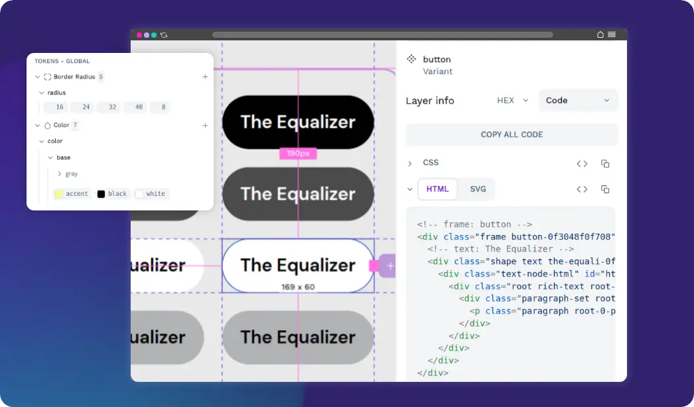
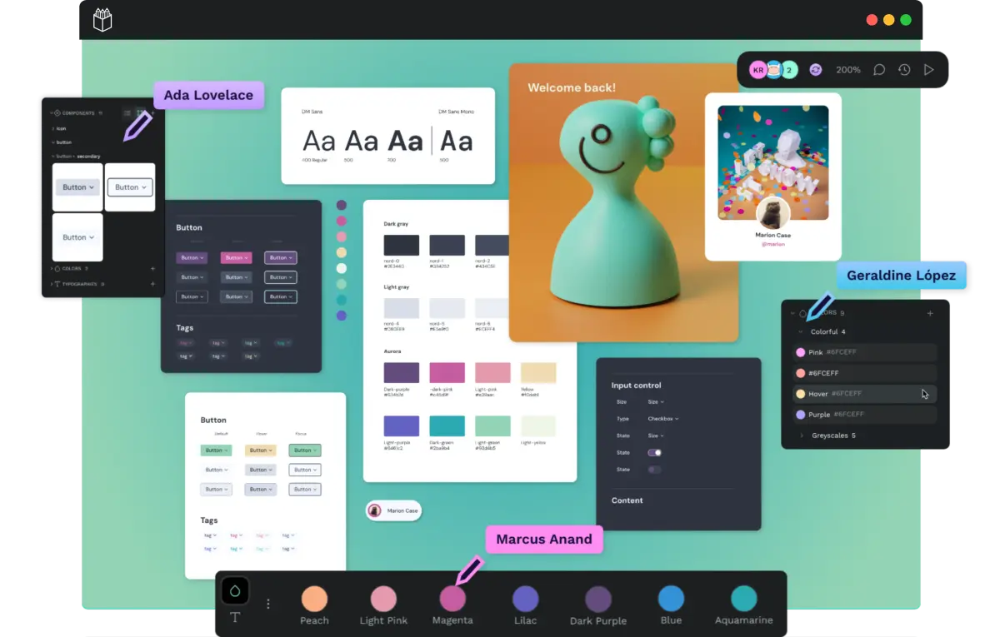
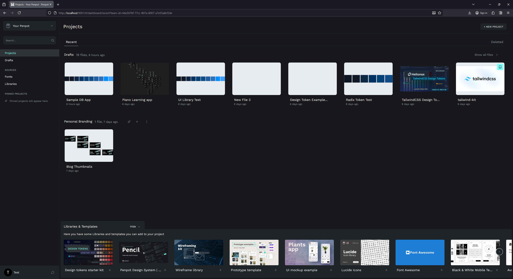
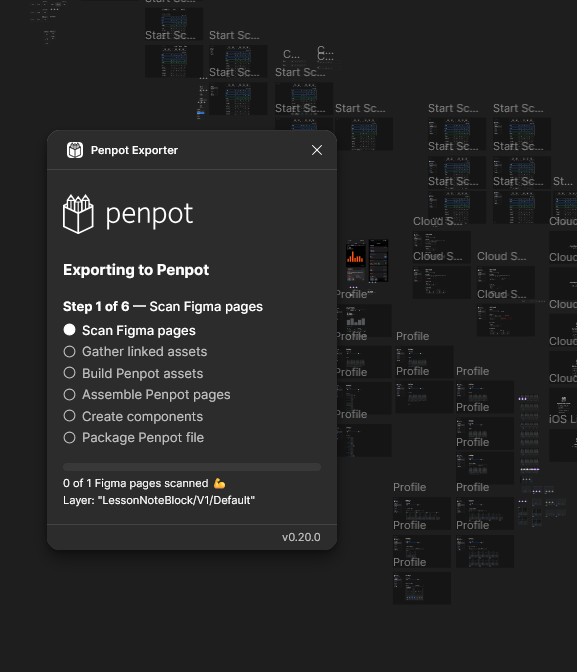

Recently I decided to dig back into [**Penpot**](https://penpot.app/), a collaborative UI design application. It’s basically Figma, if Figma was open source and written in Clojure. I’d seen it before, but I’d never taken the time to really dig into it. I spun up a local instance and took it for a test drive and was genuinely impressed by it. They have a fair amount of feature parity with Figma, so besides the slight UI and hotkey differences, you’ll have an easy time switching over.

In this blog I’ll go over my experiences with migrating from Figma to Penpot, creating a design system with it, and what bugs I encountered along the way. And ultimately I’ll let you know if I’d switch from Figma to Penpot or not.

# What’s Penpot?

It’s a web-based design app made for mostly designing UI applications. Think Figma, Adobe XD, Sketch — basically those apps. It has all the tools you’d expect - such as classic shapes like the rectangle, text, or even images and vector-based elements.



And just like Figma and Sketch, it’s tailored for designing UI, so it’s packed with features that help that process. Need flex layout (aka “auto layout” in Figma)? They have you covered. How about grids? Even have those. And you wouldn’t have UI without a design system, so they let you create “styles” to reuse preset properties like colors, and “typography” to create text presets (like font family, size, etc).



Like I mentioned in the intro, it’s open source, meaning it’s technically free…if you can figure out how to [host it yourself](https://penpot.app/self-host) (devs like to call this “free as in beer”, I call it “free for tech savvy devops”). You can pay the Penpot company to handle the hosting for you, but you’re basically back in the same spot as Figma (but with an option to self-host later in case the Penpot servers or development implodes).

It’s an impressive piece of software, I highly recommend signing up on their site and just taking it for a spin in your browser. But how would we run this ourselves? Let’s find out.

# Running locally

The normal way you’d “run” this software is installing it on a shared server (like DigitalOcean). But I’m cheap, and I don’t plan on collaborating with anyone with my design files, so I opted to install it locally on my own PC instead. In the future though, if I had to share designs across to my laptop, I’d consider a server-based instance.

To host locally, you basically have the same options they use on the server. One of the easiest ways to get up and running is Docker, so I picked that. I followed [their Docker guide](https://help.penpot.app/technical-guide/getting-started/docker/) and it worked great. You basically just download their `docker-compose.yml` and run it. Gotta love the simplicity of a good Docker setup.

I cloned the whole repo cause why not:

```tsx
git clone https://github.com/penpot/penpot.git
cd penpot
docker compose -p penpot -f docker-compose.yaml up -d
```

Opened at [http://localhost:9001](http://localhost:9001/) by default. I opened it too fast at first and got a warning message that things weren’t ready yet or in “maintenance”. Refreshing after a few seconds resolved this. I also had to create an account with username and password. No email confirmation though - just login and go.

I was greeted by the dashboard, very similar to Figma’s:



So whenever I want to use the app I just need to open Docker first, which isn’t a huge deal. It takes a minute max for Docker and then Penpot to spin up, probably same time as the Figma desktop app.

## Custom fonts

Another aspect of the setup process is installing custom fonts. Since this is a web-based app that anyone can use, you need to upload and provide the fonts so it can be shared. But it’s not sharing the font file, it’s likely decoding it and rendering it on their canvas (like you would with any graphics programming font renderer).

Regardless, you’ll need to upload your font files in a settings section.


It did a decent job of combining a few fonts together by “family” (grouping regular, bold, etc of the same font family), and struggled with a few (which happens with most apps - likely due to font author misconfiguration).

# Testing out prototyping

I hopped right in and started exploring the interface and the toolset. Like I mentioned before, it has most (if not all?) of the features I expect from a design app. Just having flex-based layout is always nice.

After the initial test run, I looked for some resources to level up my knowledge of the platform.

## Templates

One of the best ways to learn a new app is to download templates and example files to understand how other people use the app’s systems, as well as proper methods to organize.

Penpot has a great [community resource page](https://penpot.app/penpothub/libraries-templates) with templates you can download and import into your app.


I downloaded the Penpot design system, the variant examples, and a few others to see how more complex projects are handled. Surprisingly, it was hard to find anything that worked with the newer design tokens feature. All UI kits I found were created using “styles” instead of tokens.

## Creating a design system

One of the first things I like to do is setup a design system. This speeds up the design process immensely by providing me a toolbox of primitives to use.

Penpot has 2 ways of handling your design system: **styles** and **design tokens**. Similar to Figma, they have a legacy “styles” system that is very simple and limited to basically colors and typography.


And design tokens are the newer system that handles a wider array of properties, like dimensional or spacing, as well things like colors and typography we had in “styles”. It also supports the concept of “theming” or applying multiple sets of tokens together (like “dark mode” colors and “mobile” spacing).


I opted to use **design tokens** for my system, because it’s more robust, and it’s based on [the new W3C DTCG spec](https://www.w3.org/community/design-tokens/) for tokens. That means I can import and export the tokens as JSON (without any plugins!) and use it inside my applications if I wanted (or massage it into a specific styling paradigm like CSS using a library like [Style Dictionary](https://styledictionary.com/)).

> ℹ️ Figma paywalls key features for it’s design tokens - like theming. And it doesn’t have an option to import or export them easily without a 3rd party plugin (which are often paid options - on top of the cost of the Figma plan). Penpot lets you do everything for free and built-in.

### Radix design tokens

I spent some time taking the Radix UI design system and converting it from CSS to the DTCG spec - just coding it in VSCode - then imported that into Penpot.

> ℹ️ Here is the [source code for the design tokens](https://github.com/whoisryosuke/dctg-design-tokens/tree/main/tokens/radix). If you want to import them into Penpot, download all the JSON files into the same folder, and “import by folder” in Penpot.

Initially I tried approaching from the source code, but it was actually easier just going to the Radix website and pulling the pre-compiled production CSS. This ensured I got all the pieces of the puzzle, since the source code splits up into different pieces (like `radix-colors` for the base colors). With the CSS variables in hand, I copied them into my project and created [a simple NodeJS script](https://github.com/whoisryosuke/dctg-design-tokens/blob/main/scripts/extract-tokens-to-dtcg.js) (with the assistance of an local LLM to speed it up) to convert the CSS properties into a DTCG spec tokens.

It failed the first few times I imported because my syntax was a little off for shadow tokens. When the import fails you’ll sometimes get an error in the console (from Style Dictionary no less) and it might say something like:

```tsx
Uncaught (in promise) TypeError: can't access property "x", h is null
```

This let me know my syntax was off, as the parser was trying to access something it couldn’t find. There were also a few cases where the import failed and no error was given, so it can be a bit off a toss up. You’d be better off finding a separate validator/parser for the DTCG spec and linting with that first — then importing.

I also had an issue where my token types were too generic. For example, I imported my font sizes as “spacing”. I figured I’d be able to just use it - but this wasn’t case. If you try and apply a token to a font size — it looks only for font size type tokens.

To make my life easier, I created a token in each category using the Penpot UI, then exported that JSON to have a baseline for all the available types.

```tsx
{
  "Global": {
    "font-size-1": {
      "$value": "16",
      "$type": "fontSizes",
      "$description": ""
    },
    "body": {
      "$value": [
        "Source Sans Text"
      ],
      "$type": "fontFamilies",
      "$description": ""
    },
    "radius-1": {
      "$value": "1",
      "$type": "borderRadius",
      "$description": ""
    },
    "sizing-1": {
      "$value": "1",
      "$type": "sizing",
      "$description": ""
    },
    "blue-1": {
      "$value": "blue",
      "$type": "color",
      "$description": ""
    },
    "heading-1": {
      "$value": {
        "fontFamilies": [
          "{body}"
        ],
        "fontSizes": "{font-size-1}",
        "fontWeights": "{bold}",
        "lineHeights": "1.5",
        "letterSpacing": "0",
        "textCase": "none",
        "textDecoration": "none"
      },
      "$type": "typography",
      "$description": ""
    },
    "shadow": {
      "$value": [
        {
          "offsetX": "4",
          "offsetY": "4",
          "blur": "4",
          "spread": "0",
          "color": "blue"
        }
      ],
      "$type": "shadow",
      "$description": ""
    },
    "spacing-1": {
      "$value": "1",
      "$type": "spacing",
      "$description": ""
    },
    "space-1": {
      "$value": "1",
      "$type": "dimension",
      "$description": ""
    },
    "number-1": {
      "$value": "1",
      "$type": "number",
      "$description": ""
    },
    "opacity-1": {
      "$value": "1",
      "$type": "opacity",
      "$description": ""
    },
    "letter-spacing-1": {
      "$value": "1",
      "$type": "letterSpacing",
      "$description": ""
    },
    "bold": {
      "$value": "bold",
      "$type": "fontWeights",
      "$description": ""
    },
    "rotation-1": {
      "$value": "1",
      "$type": "rotation",
      "$description": ""
    }
  },
  "$themes": [],
  "$metadata": {
    "tokenSetOrder": [
      "Global"
    ],
    "activeThemes": [],
    "activeSets": [
      "Global"
    ]
  }
}
```

With this, I was able to go back to my tokens and get the types right:

```tsx
{
  "fontSize": {
    "1": {
      "$value": "12*{density}",
      "$type": "fontSizes",
      "$description": ""
    },
    "2": {
      "$value": "14*{density}",
      "$type": "fontSizes",
      "$description": ""
    }
  }
}
```


### Theming

For the scale-based tokens, like font size, you’ll notice they have a `density` variable. The DCTG spec allows you to reference tokens in other tokens — letting you do things like multiplying one token by another, or just using it as an alias for semantically named tokens.

Radix uses this `density` value to scale the UI up and down as needed, like a 110% or 90% zoom.

```tsx
.radix-themes:where([data-scaling="90%"]) {
  --scaling: 0.9;
}
.radix-themes:where([data-scaling="95%"]) {
  --scaling: 0.95;
}
.radix-themes:where([data-scaling="100%"]) {
  --scaling: 1;
}
.radix-themes:where([data-scaling="105%"]) {
  --scaling: 1.05;
}
.radix-themes:where([data-scaling="110%"]) {
  --scaling: 1.1;
}
```

I opted to use this as a way to handle platform breakpoints, like mobile vs desktop. I created 3 density themes: compact, comfortable, and default. Mobile gets compact, desktop gets comfortable — but it could also just be user preference.

```tsx
// Density - Default.json
{
  "density": {
    "$value": "1",
    "$type": "dimension",
    "$description": ""
  }
}

// Density - Comfortable.json
{
  "density": {
    "$value": "1.1",
    "$type": "dimension",
    "$description": ""
  }
}
```

And of course, I also copied the light vs dark mode colors into their own themes.

```tsx
// Colors - Light.json
{
  "gray": {
    "1": {
      "$value": "#fcfcfc",
      "$type": "color",
      "$description": ""
    }
  }
}

// Colors - Dark.json
{
  "gray": {
    "1": {
      "$value": "#111",
      "$type": "color",
      "$description": ""
    }
  }
}
```


## Components and Variants

These work just like you’d expect from Figma. You can make one or more components, and then combine them into variants based on properties.

Here you can see an example of making a Radix Text component with `size` and `weight` properties. Both use their respective tokens, so size goes through the scale from 1 to 9, and weight ranges from regular to bold.


This worked well inside other files when I needed to quickly switch to other components (with…some bugs…read on….).

# Migrating from Figma

I’ve been designing a few of my side projects recently in Figma, and rather than start over from scratch, I wondered if I could migrate some files to Penpot somehow.

Apparently it was effortless thanks to the Figma to Penpot plugin. You just install it and run it on a single page - or your entire file.

I picked a recent page of one of my projects that had a decent number of frames and elements on it.



I ran the plugin…


And 37 minutes later, I had a Penpot file. That’s right, nearly 40 minutes converting a single page.

It’s hard to complain completely though, because when I import it into Penpot it looks basically 1:1. There’s a few minor details I have to fix across some frames, but I’m amazed how much gets picked up — from components to auto layout, it catches it all.

Here’s an example of one of the minor issues. The color of a vector element (the sideways S shape) gets changed from Figma to Penpot.

Figma version:


Penpot:


But there weren’t many of these instances luckily.

Handled a lot of deeply nested auto layout things, I was pretty impressed.


I looked into the plugin’s source code a bit to figure out why the process would take 40 minutes. There’s a lot going on.

- They pull in any linked libraries and scan those (slowing it down if they’re bigger or many libraries)
- It loops over all the images on a page and caches their data up front (this is a big slow down since images can get big — like my tendency to paste 4k reference images)
- Traversing the Figma tree is also very costly. It can be huge and requires you to get recursive (meaning each node has nodes inside, and those nodes might have nodes, and now we have 100 nested for each loops that need to finish). You can skip hidden nodes, but you probably want to copy those in a migration. And you can use Figma’s `findAll()` to optimize this process, but only for filtering nodes — not alleviating the burden of the traversal distance.

There’s small performance gains that could be made, like using web workers to offset tree traversal or image loading. But inevitably a lot of this would be better relegated to Figma - who has native control over the data (meaning they can build faster integration). Imagine being able to do a raw lookup on the DB table that holds the file data, instead of having to traverse the nodes with one of the slowest programming languages and paint the picture yourself each time? But that’ll never happen, so we’re probably stuck with this method for now.

> ℹ️ I’d also say parsing the Figma file itself might be fast if you’re able to do it on a native level. However, the Figma file format (`.fig`) is proprietary and secret…even though it’s likely a `.zip` file encasing a [“kiwi” encoded binary](https://github.com/evanw/kiwi) that unfolds into a JSON…

Overall this plugin’s great for a pinch, but if you’re a serious person who needs to migrate, I don’t know if this would work (maybe if you kept your PC online for 4 hours or something). I would definitely recommend just starting from scratch in most cases.

# MCP for LLMs

One of the cool aspects of Penpot being open source is the ability to run an LLM alongside it and leverage their MCP API. In Figma you’d need to be on a paid plan to get access to their MCP — but here it’s available for anyone (that can figure out the setup).

This allows you to prompt your LLM in natural language for design decisions and it can reflect them in the app. It works by running a local server that creates the MCP API for LLMs to connect to (all “standard” LLM processes), then you use a plugin that connects to the MCP to a specific file. Then the LLM can use the MCP’s tools to run JavaScript code that manipulates the file content — like adding a rectangle or copying and pasting elements.

I tested this feature out and it’s a bit involved so I’ll have a whole separate blog dedicated to it. Keep your eyes peeled for this one soon!

If I had to summarize my thoughts though: the results were underwhelming. It works - _sometimes_. The results were very mixed and not easily reproduceable. I was maxing out my context with basic tasks, and the LLM would be easily overwhelmed by complex or larger requests.

Running on my fairly top of the line 4080 GPU wasn’t enough using OpenAI’s gpt-oss-20b model with a fairly large context window. If you were using this with a service like Claude you might get some better results, but for the amount of tokens it had to use, you’d be racking up huge bills that might be comparable to just hiring a designer.

# The issues

Here are the biggest issues I found using the software after a couple weeks:

**It’s just kinda buggy…**

- Applied a design token that I didn’t have a font for so it loaded an invisible layer
  - Had to load the font - but still didn’t fix problem…
  - Tried changing font to something I had, didn’t fix
  - Had to make a new layer and just go with that and delete old one
- Design tokens wouldn’t apply. Clicking them wouldn’t work. Created new item and tried applying to that — no effect. Had to just hard-refresh browser to fix.
  - Happened multiple times. Not sure what causes this - maybe new tokens?

**Hotkeys…**

- Rename — usually works in Figma but just refreshes browser here. `Alt + N` here. Gonna take getting used to.
- Copying items, I normally hold ALT + SHIFT so I can copy and keep it inline — but this de-selects stuff every time making me miss something. I have do ALT, move a little, then SHIFT to lock. This is tricky in a few apps tho, so I don’t blame them too much.
- Moving layers up and down - they use arrow keys???
- No way to change hotkeys…

**Can’t quickly edit text** like you do in Figma or Photoshop by clicking into text boxes with text tool selected

- Need to click it, then enter in each time.
- Can’t edit multiple text items at once
- I do this hundreds of times in a single session, so this slowed stuff down immensely

**Design tokens missing features**

- Can’t preview themes side by side - making it hard to check light vs dark mode
- Can’t quickly add tokens from existing colors / styles. Requires me to go, copy the hex code, make the token, paste it in (instead of having a nice flow from the color picker)
- Can’t have multiple text colors in same sentence using tokens (simple thing — I like to just highlight a word in a sentence — now I have to do some crazy auto layout for that one word + rest of the sentence…or just not use tokens….)
- Can’t select tokens from most properties. For example, in order to set the font size on an element using a token, you need to find the token in the token panel and use it there. In contrast, with colors they have a tiny button on the top right to switch to a search window for tokens. Makes it really cumbersome to scale something up or down cause you need to find the correct theme that contains the token and then expand the accordion, then you have the token — so it’s a few steps if it’s not already pulled up.
- Can’t change tokens easily for stroke. When you click a color token in the Tokens sidebar, it always applies it to the fill. I tried browsing for the same token in the popup and it showed as no tokens available (despite having a whole set I can see and use in Tokens tab).

**Blurry?**


- Some elements are blurry.
- Seems like whatever I’ve selected recently is not blurry - but everything else will blur.
- I think it’s associated with text - and maybe my custom font. When I use text anywhere it looks blurry except the last text element I interacted with. makes things hard to look at

**Doesn’t save fast enough…**

- Sometimes I randomly CTRL+R (cause it’s a reflex from other apps to rename layers) and it refreshes page instead here.
- I’ll usually lose the last thing I did cause it takes time for it to save
- Feels weird? like I’m running this locally, should be fairly instant (or fired off to a server and even if I refresh the server is saving…)

**Changing components breaks tokens**


- I have a Text component
- Changed the color of underlying text to a certain token (e.g. `gray.12`)
- Change the component to another `size` using a variant property
- The color stayed the same token technically — but it render incorrectly (looking black).
- Changing token to another token - then original token fixes it
- Refreshing page doesn’t resolve issue
- This happens every time I change a component’s variant property - so as you can imagine, a lot.

**Missing vector features**

- No way to outline SVG elements. Not a huge deal breaker, Figma isn’t the best at vector itself that I end up using Illustrator or Inkscape for more serious work. In this case I was working with icons that were stroke based and I wanted to make them solid so when I export I could use them as a fill (not stroke).

And that’s after only a few days of use honestly. Each time I’d hit these repeatable bugs, it’d ruin my design flow and I’d end up closing the app to do something else. I didn’t even dive into all the features - like prototyping.

# Would I switch?

If Figma didn’t exist or didn’t allow me to make unlimited files on their free plan — I would switch immediately. This has everything I need from Figma and all the nice “pro” stuff I don’t normally get. And Figma has a lot of rendering bugs now too - especially on Windows, with lots of weird artifacts - so it’s far from perfect itself.

With how buggy Penpot still is though? I don’t know if I could use it as my daily driver. I could do simple things like make blog thumbnails, but not complex UIs. I need features like design tokens to be more reliable - I need my design looking crispy all time.

I took a look at the codebase and the fact that it’s written in Clojure (and a wild [custom React-like system](https://github.com/funcool/rumext)) means I’ll probably never contribute to it. It’s funny to see [old posts](https://blog.kaleidos.net/penpot-chose-clojure-as-its-language-and-here-is-why/) from one of the creators talking about the decision and even mentioning it’d probably limit engagement — well it did lol. Definitely got me looking at other design platform projects like [grida](https://github.com/gridaco/grida) which are written in Rust and use Skia.

Are you using Penpot? Do you also work at Blender? 😆 Let me know how it works for you, always cool to hear other’s experiences.

And as always, if you enjoyed this article, consider using a bit of your social currency and sharing this post on your feed. Or if you’d like to support me, [check out my Patreon](https://www.patreon.com/whoisryosuke).

Stay creative,
Ryo
