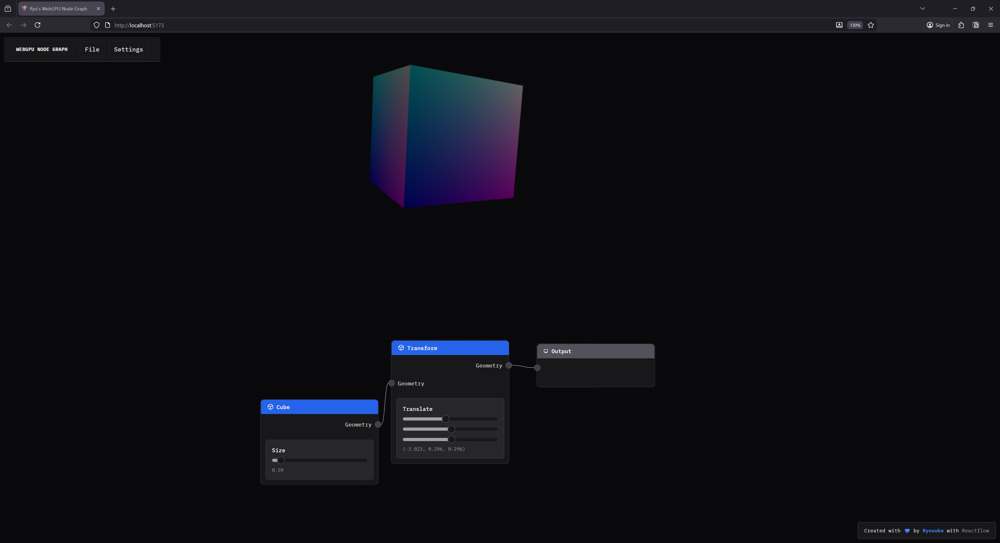
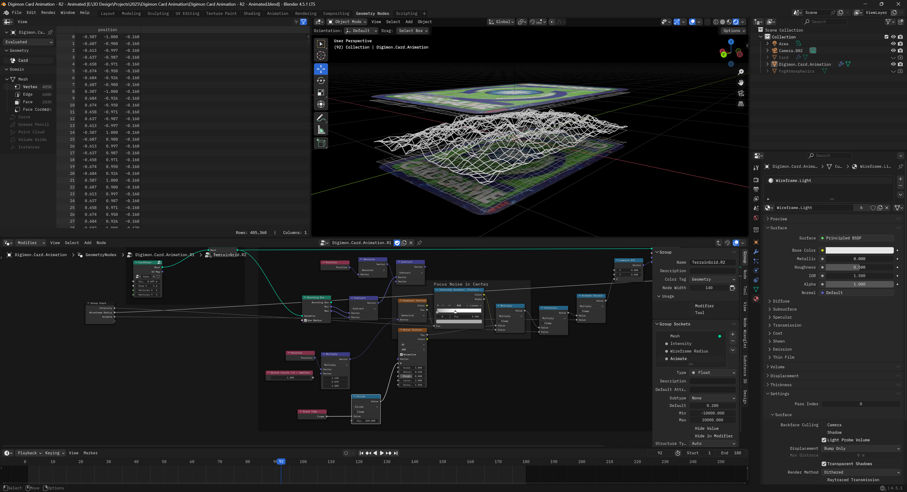
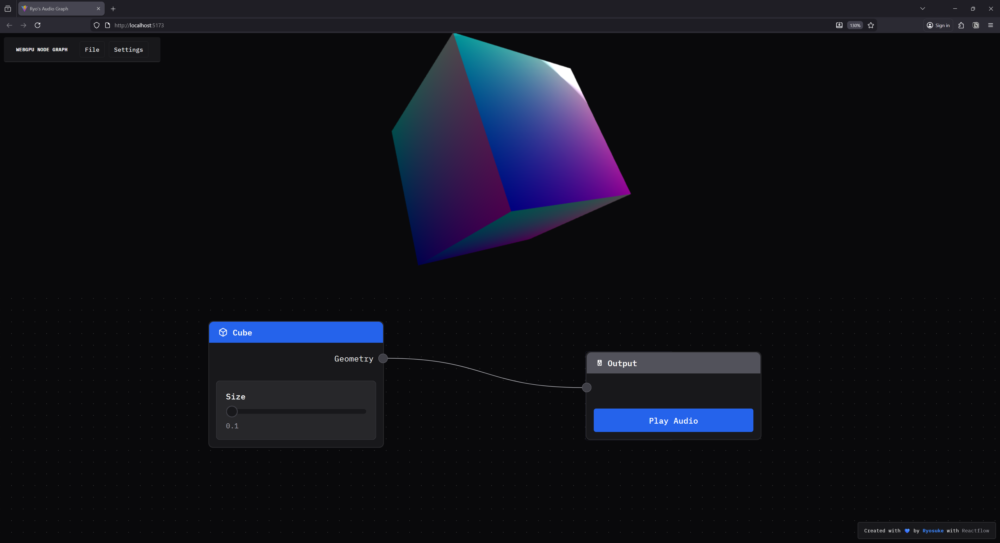

Last year I put together [a WebGPU renderer](https://github.com/whoisryosuke/webgpu-sandbox) written in TypeScript. It was a refreshing change from the Rust one I’d previously made. If you’re interested in that project, I have [a blog breaking down](https://whoisryosuke.com/blog/2025/structure-of-a-webgpu-renderer) the process from start to finish.

And a couple years ago, I wrote [a Blender plugin](https://github.com/whoisryosuke/geometry-node-graph) for exporting geometry nodes as JSON and I rendered them on the web. Of course, there’s [a blog for that one](https://whoisryosuke.com/blog/2023/exporting-geometry-nodes-from-blender) too. But when I wrote it, I immediately knew I wanted to get geometry nodes working on the web.

Replicating geometry nodes functionality is a huge feat though, and it starts with figuring out the initial architecture — 3D + node graph. I spent a day taking my Web Audio node graph and combining it with my WebGPU renderer and created a quick POC.



In this blog I’ll break down the process of writing a node based renderer for WebGPU, what the architecture looks like, and how it practically works.

> ℹ️ This article will assume you have some knowledge of 3D graphics and WebGPU. If you’re interested in learning some fundamentals, check out my previous WebGPU blogs.

# Bring some glue, let’s get started

Like I mentioned, I used 2 of my previous projects and combined them together. If you’d like to follow along, you can check out the codebases:

- [Web Audio Node Graph](https://github.com/whoisryosuke/web-audio-node-graph/tree/main)
- [WebGPU Renderer](github.com/whoisryosuke/webgpu-sandbox/)

The **Web Audio Node Graph** is built using ReactJS for the UI, [Reactflow](https://reactflow.dev/) for the node graph, and Zustand for the data store.

And the **WebGPU renderer** is just a bunch of custom low level graphics code, maybe a couple WebGPU specific dependencies.

> ℹ️ If you’re looking for a basic Reactflow starter, I have a [template branch](https://github.com/whoisryosuke/web-audio-node-graph/commits/template/) with my initial commit with a “hello world” node graph setup. But I will say, it’s nicer using the later commits cause I put some elbow grease in to style stuff and make it look cooler.

# What are “geometry nodes”?

Geometry nodes is a visual programming system that uses a node graph to power 3D rendering. The term [“geometry nodes”](https://docs.blender.org/manual/en/latest/modeling/geometry_nodes/index.html) comes from Blender, which is an open source 3D software that allows you to create new node graphs with nodes like a “UV Sphere” and use those to procedurally create 3D images and even animations.



Other applications have similar node based workflows, like the [Bifrost graph in Maya](https://www.autodesk.com/products/maya/bifrost), or [Houdini](https://www.sidefx.com/products/houdini/).


> ℹ️ This is not to be confused with applications like [Adobe Substance Designer](https://www.adobe.com/products/substance3d/apps/designer.html), which uses a node graph to procedurally create 3D materials. This is similar to the [Shader Graph in Blender](https://docs.blender.org/manual/en/latest/editors/shader_editor.html) (and similar to most material workflows in 3D apps). This process uses a node graph to generate a 3D material, which often uses a shader as a basis (like a “PBR” node) and controls it’s properties (like how “metallic” an object is - or passing it a texture to display on it’s surface).

# The Node Graph

I mentioned before, we’ll be using Reactflow to power the node graph. That means we can leverage their initial node architecture: nodes and edges.

Nodes are exactly what you think of, it’s the actual boxes in the node graph. These are often defined by a `type` that lets us have different nodes like a “Cube” or a “Transform” node. They also contain any specific data associated with that node. For example, for the Cube node we’d store the cube’s properties, like it’s size.

Edges are the connections between the nodes. Whenever we connect one node to another, we create an “edge”. This edge contains the ID of the “target” node we’re connecting to, and the “source” node we’re connecting from.

Using these two data structures, we’re able to represent a node graph (or nodes connected together in a sequence).

> ℹ️ If you want to learn more about the the Reactflow architecture [check out their docs](https://reactflow.dev/learn/concepts/terms-and-definitions) to see various visualizations of the node graph and the terminology they use (like “edges”).

## Web Audio version

For the Web Audio node graph, we have a node graph where the user can create “nodes” that represent existing (and custom) Web Audio audio nodes (aka `AudioNode`). The Web Audio API uses it’s own node graph under the hood to handle connections between audio nodes, so the Reactflow node graph we create is basically a visual representation of what we’re technically doing on the backend.

In the Web Audio node graph we manage the actual audio graph (aka the Web Audio `AudioNode` — not our node graph node — confusing I know lol) using **_side effects_**.

Whenever a user adds a node to the graph, when we add the node to Reactflow store, we also create the Web Audio `AudioNode` in a separate “store” or manager. The Reactflow store manages any data we want reflected in the UI (like input sliders or dropdowns). For example, for an oscillator node we’d keep track of the oscillator frequency (which is just a `number`) and store that as node data.

```tsx
addNode: async (
  type: CustomNodeTypesNames,
  position?: Vector2D,
  data?: Partial<Node>,
  id?: string
) => {
  const newNode = createNode(type, position, data, id) as Node;

  // Create the audio node
  await createAudioNode(type, newNode.id);

  set((state) => ({
    nodes: [...state.nodes, newNode],
  }));

  return newNode.id;
},
```

Then the audio manager handles updating the cached audio nodes with updated props or running methods. This allows us to play music using simple methods on the manager like `playNode()`. The Web Audio nodes are associated to the Reactflow nodes using the unique ID of the Reactflow node (it’s basically just a `Map<string, AudioNode>`).

```tsx
type AudioSetup<T> = {
  node: AudioNode;
  instance?: T;
};

// The "store" for the actual Web Audio nodes
// the `string` is the node ID from Reactflow
const audioNodes = new Map<string, AudioSetup<CustomNodes>>();

// An example of creating a Web Audio node and storing it
const createOscillatorAudioNode = (id: string) => {
  const osc = context.createOscillator();
  osc.frequency.value = 220;
  osc.type = "sine";
  osc.start();

  audioNodes.set(id, { node: osc });
};
```

Then when we connect nodes, we handle that similarly using a `addEdge`. In that function, we add the edge to the Reactflow data store, and then connect any associated Web Audio nodes using the separate manager.

```tsx
addEdge: (data: EdgeData) => {
  const id = nanoid(6);
  const edge = { id, type: "default", ...data } as Edge;

  connectAudioNodes(
    edge.source,
    edge.target,
    edge.sourceHandle,
    edge.targetHandle
  );

  set((state) => ({ edges: [edge, ...state.edges] }));
},

// Then in our audio manager...
export function connectAudioNodes(
  source: string,
  target: string,
  sourceHandle: string | null,
  targetHandle: string | null | undefined
) {
  const sourceNode = audioNodes.get(source)?.node;
  const targetNode = audioNodes.get(target)?.node;

  // Connect them...
}
```

> ℹ️

This architecture works ok, but it doesn’t handle error or failure states well. Because things are a side effect of actions, if they fail, we have no way of retrying without bailing the action and forcing the user to retry (ideally serving some sort of error message). That’s ok for one off actions, but we also use this architecture to power imports via JSON, which means if one node breaks — the whole file fails to import. In the next section we’ll cover a different kind of architecture that would handle the “retry” if something failed, and cache results similarly for efficiency.

## WebGPU Node Graph

Now that we understand the Reactflow node graph (made up of nodes and edges), and we’ve seen how we can tap into that lifecycle (creating/connecting nodes) — how would we handle 3D data?

### Mesh to Mesh

The first thing to understand is where we start and end with a geometry based node graph. We’re often starting and ending with a `Mesh` — which is a representation of a 3D object. This is a often a combination of `Geometry` (the vertex, normals, etc of a 3D shape) and a `Material` (the shader used to render the 3D shape, any textures, etc).

This might look different depending on the 3D backend you’re using, but in my custom renderer’s case, this is how those classes are shaped:

```tsx
/**
 * 3D object data stored in WebGPU buffers.
 * Used in `Mesh` class to represent the 3D structure.
 */
export default class Geometry {
  name: string;

  /**
   * Represents the vertex data for vertex buffer
   * It contains all the mesh data, like position, normals, etc
   * Each vertex has: position (3), normal (3), UV (2) = 8 floats per vertex
   */
  vertices: Float32Array;
  indices: Uint16Array;

  // Buffers
  vertexBuffer!: GPUBuffer;
  indexBuffer!: GPUBuffer;
}

/**
 * Handles position, scale, rotation of geometry.
 * Creates a localized uniform buffer to contain properties.
 */
export class Mesh {
  geometry: Geometry;
  /**
   * A key that maps to a global cache with all loaded mats
   */
  material: string;
  uniforms: Uniforms<MeshUniforms>;
}
```

This means that whatever happens on the node graph, the user has to connect their nodes to an “output” node that requires a `Mesh` to render. This requires the user to create some “geometry” based nodes (like a “Cube”) and manipulate those using other nodes (like a Transformation node that could move, rotate, or scale the object in 3D space).

### Computation

With the Web Audio node graph, we had the luxury of relying on the Web Audio API to handle a lot of the heavy lifting. For example, when we connect an oscillator to a gain node, the Web Audio API handles connecting them and passing data between them. All we do is call a `connect()` method and sit back.

But with our 3D version, it’s a different kind of node graph. We need to “compute” each step to basically “add” everything up together ourselves. For example, in Blender I might make a Cube node and change it’s vertex data using a Set Position node — making it a different shape at the end. Then if I add another Set Position node before the “end” of the node graph (usually some sort of “output” node), that second Set Position node would change the position that’s already changed by the previous Set Position node.

When the nodes connect, the data travels from one node to the next, and the next node can even “operate” on the data to change it.

> ℹ️ You can find a great example in [the Reactflow “Computing Flows” docs page](https://reactflow.dev/learn/advanced-use/computing-flows), where they take RGB values and run checks based on the data passed along the graph.

For us, this means that when we create a node with geometry data, that data should pass along to the next node so it can change it if it wants.

But in the Reactflow example, they compute the data per-node. This is nice if you wanted to display the result on each node (like if we were doing math or something and wanted to see each step). In this case though, we’re not concerned with each step. We want the final result — the final `Mesh`. So we don’t actually need to compute per-node, instead, we’ll compute all the nodes all at once.

Wherever we want to render our 3D, we can get access to the `nodes` and `edges` in our Reactflow data store, traverse them, and add all the results together there. This way, the nodes add together, and we handle all that math and memory allocation in 1 place. This will still be a “computation” flow, but way simpler (and cheaper).

# Adding Geometry

Let’s start with a Cube node. What would that look like?

In our UI, we want the user to be able to create a “Cube node”. This node will contain input elements to control the data.


The actual node UI code isn’t too complex. It handles displaying a slider to control the cube’s size. And it creates and output handle so we can connect this to other nodes.

```tsx
import { useNodeStore } from "../store/nodes";
import Slider from "../components/ui/Slider";
import NodeInputField from "../components/nodes/NodeInputField";
import type { NodeIO } from "./types";
import NodeTemplate from "../components/nodes/NodeTemplate";
import type { RawGeometry } from "../renderer/core/geometry";
import { generateCubeGeometry } from "../renderer/primitives/cube";

type CubeNodeData = {
  geometry: RawGeometry;
};

type Props = {
  id: string;
  data: CubeNodeData;
};

const Cube = ({ id, data }: Props) => {
  return (
    <NodeTemplate
      title="Cube"
      icon="cube"
      output={{
        id: "geometry",
        name: "Geometry",
      }}
    ></NodeTemplate>
  );
};

export const CubeIO: NodeIO = {
  inputs: [],
  outputs: ["geometry"],
};

export default Cube;
```

What does the Cube’s data structure look like though? When we add this `node` to the Reactflow store, what data do we attach to it? We basically just need a `size` property (which we control with our UI) and a `geometry` property with the actual `Geometry` class from our 3D renderer.

```tsx
function createCubeNode() {
  return {
    label: "Cube",
    size: 0.1,
    geometry: generateCubeGeometry(0.1),
  };
}
```

And with that, we have a “geometry node”. It’s a node that contains a 3D object as geometry data (aka vertices, normals, all that 3D math goodness).

# Rendering nodes

We have a “geometry node”, now let’s render it in 3D.

## Rendering in WebGPU

Before we try rendering our “geometry nodes”, let’s take a quick step back to understand how my custom WebGPU renderer works.

My renderer is a single class, `WebGPURenderer`, that handles the initializing WebGPU. We store our meshes and materials as class properties. It also has a `render()` method that loops over all the meshes inside.

Using it is pretty simple:

```tsx
async function main() {
  const renderer = new WebGPURenderer();
  // Initialize the renderer
  await renderer.init();

  // Add meshes to renderer
  const newMesh = new Mesh(); // Shortened for simplicity
  renderer.meshes.push(newMesh);

  // Start the infinite render loop
  renderer.render(renderCallback);
}
```

The renderer provides a `Mesh` class that represents the 3D object we want to render. It contains a `Geometry` and `Material` class, which handle the structure and appearance of the 3D object. Each of these classes are provided by the renderer to the user if they want to create their own. But it also has some convenient functions to generate primitive meshes like a cube.

```tsx
export function generateCube(
  device: GPUDevice,
  renderPipeline: GPURenderPipeline,
  size: number = 1,
) {
  const { positions, normals, uvs, indices } = generateCubeData(size);

  console.log(`Generated cube with:
    - Vertices: ${positions.length}
    - Indices: ${indices.length}
    - Max index: ${Math.max(...indices)}`);

  const geometry = new Geometry(device, {
    name: "Cube",
    vertices: generateVertexBufferData(positions, normals, uvs),
    indices: indices,
    // material: obj.material,
  });

  const mesh = new Mesh(device, renderPipeline, geometry);

  return mesh;
}
```

This provides a `Mesh` that contains a “cube” shape.

## Render component

Our app currently has 1 component basically — the `<Reactflow />` graph. This renders the node graph UI for us. But if we want to render 3D, we’ll need to create a new one: `<Renderer />`. We’ll display this alongside the Reactflow graph in the main app:

```tsx
function App() {
  return (
    <>
      <Stack height="100vh">
        <Renderer />
        <Box width="100%" height="50%">
          <ReactFlow
            nodes={nodes}
            edges={edges}
            onNodesChange={onNodesChange}
            onEdgesChange={onEdgesChange}
            onConnect={addEdge}
            onConnectEnd={onConnectEnd}
            nodeTypes={ALL_NODE_TYPES}
            // edgeTypes={ALL_EDGE_TYPES}
            onEdgeClick={onEdgesClick}
            onEdgesDelete={onEdgesDelete}
            onViewportChange={onViewportChange}
            style={{
              width: "100%",
              height: "100%",
            }}
          >
            <Background color="#555" />
          </ReactFlow>
        </Box>
      </Stack>
    </>
  );
}

export default App;
```

The `<Renderer />` component itself will store a reference to our WebGPU renderer class using the `useRef` hook. Then it initializes it in a `useEffect()`. We connect to the Reactflow store and grab the `nodes` and `edges` and use those to power a `useEffect` that fires each time they change (like when we add a node or connect some). Inside that we’ll handle updating the `Mesh` data inside the WebGPU renderer — which we get by evaluating the entire node graph.

```tsx
import React, { useEffect, useRef } from "react";
import WebGPURenderer, { type RenderProps } from "../../renderer/core/renderer";
import { Box } from "@chakra-ui/react";
import { useEdges, useNodes } from "@xyflow/react";
import { GraphEvaluator } from "../../services/node-graph/graph-evaluator";
import Geometry, {
  generateVertexBufferData,
  RawGeometry,
} from "../../renderer/core/geometry";
import { Mesh } from "../../renderer/core/mesh";

type Props = {};

const Renderer = (props: Props) => {
  const rendererRef = useRef<WebGPURenderer | null>(null);
  const nodes = useNodes();
  const edges = useEdges();
  const evalRef = useRef<GraphEvaluator>(new GraphEvaluator());

  const renderCallback = (props: RenderProps) => {};

  const initRenderer = async () => {
    rendererRef.current = new WebGPURenderer();
    await rendererRef.current.init();
    rendererRef.current.render(renderCallback);
  };

  useEffect(() => {
    initRenderer();
  }, []);

  useEffect(() => {
    const result = evalRef.current.evaluate(nodes, edges);
    console.log("result", result);
    let rawGeometry: RawGeometry | undefined;
    if (result) {
      result.forEach((outputNode) => {
        if ("geometry" in outputNode) {
          console.log("final geometry", outputNode.geometry);
          rawGeometry = outputNode.geometry;
        }
      });
    }

    // Add to renderer
    if (!rendererRef.current || !rawGeometry) return;
    const { positions, normals, uvs, indices } = rawGeometry;
    const renderer = rendererRef.current;

    const outputGeometry = new Geometry(renderer.device, {
      name: "Cube",
      vertices: generateVertexBufferData(positions, normals, uvs),
      indices: indices,
      // material: obj.material,
    });

    const mesh = new Mesh(renderer.device, renderer.pipeline, outputGeometry);

    rendererRef.current.meshes = [mesh];
  }, [nodes, edges]);

  return (
    <Box ref={ref} width="100%" height="50%">
      <canvas id="gpu-canvas" width={width} height={height}></canvas>
    </Box>
  );
};

export default Renderer;
```

You can see we use the `Geometry` class to make geometry and then create a `Mesh` with it. But how do we get the geometry information? There’s a `GraphEvaluator` we run that handles that, so let’s dig into that.

# Running the nodes

I mentioned before that with this node graph we’ll need to be actually “computing” each node to “add up” the results. How does that actually work?

We’ll need to look at all the nodes and connections to figure out the the correct order. Then once we know what order the nodes are in, we can “run” them — whatever that may entail. For our cube nodes, they’ll just passing along data they generated when we created them.

When we run these nodes, we ultimately want to generate a `Mesh`, which requires data like `Geometry`. So whatever we return from our node graph, it needs to contain a `geometry` property with a `Geometry` class.

## Node graph execution order

How do we know the correct order to run our nodes? Let’s look at it conceptually for a moment.

When we create nodes and connect them to other nodes, we usually do it from left to right. This means we connect a left node to a right node. And when we want to add a new node to the end of the chain, we’d add it to the right side.

This means that when we want to “start”, we should be looking at the left-most nodes in the graph. And ideally, nodes that don’t have anything connected to them — only connecting to others. These will be our “starter nodes” that we start our loop from. This ensures we traverse the entire graph (or at least, as far as the connections go).

We can use [**Kahn’s algorithm**](https://en.wikipedia.org/wiki/Topological_sorting#Kahn's_algorithm) for “[topological sorting](https://en.wikipedia.org/wiki/Topological_sorting)” to take our nodes and sort them into the correct order (also referred to as a “queue”). This algorithm does exactly what I described, checks for “starter” nodes with no input connections and starts looping there.

```tsx
import type { Edge, Node } from "@xyflow/react";
import type { AllNodeTypes } from "../../nodes";

/**
 * Uses Kahn's algorithm for topological sort of the graph.
 * Basically finds nodes with no inputs and starts there to loop and create connections.
 * Returns an array of the nodes in correct order.
 * @param nodes
 * @param edges
 */
function getEvaluationOrder(nodes: Node[], edges: Edge[]) {
  const graph = new Map<string, string[]>();
  // Refers to "in degrees" in the algorithm
  const incomingConnections = new Map<string, number>();

  // Build list of nodes and count their inputs
  nodes.forEach((node) => {
    graph.set(node.id, []);
    incomingConnections.set(node.id, 0);
  });

  edges.forEach((edge) => {
    //@ts-ignore - We could check for array then create, but safe to assume for now
    graph.get(edge.source).push(edge.target);
    // Increment the number of inputs for the node
    incomingConnections.set(
      edge.target,
      incomingConnections.get(edge.target) + 1,
    );
  });

  // Determine the order using Kahn's algorithm
  // Start with nodes that have no input
  const queue = nodes.filter((node) => incomingConnections.get(node.id) === 0);
  const order: Node[] = [];

  while (queue.length > 0) {
    // Grab the node and push it into the queue
    const node = queue.shift();
    if (!node) return;
    order.push(node);

    // Check what nodes are connected to this and add them to order.
    const nodeConnections = graph.get(node.id);
    if (!nodeConnections) return;

    // We check each node connected to this one
    // and if it has no inputs it gets added to the queue for evaluating
    // then we `while` loop again and check all nodes connected to it...
    nodeConnections.forEach((neighborId) => {
      // Reduce the connection count
      incomingConnections.set(
        neighborId,
        incomingConnections.get(neighborId) - 1,
      );
      if (incomingConnections.get(neighborId) === 0) {
        const neighborNode = nodes.find((node) => node.id === neighborId);
        if (!neighborNode) return;
        queue.push(neighborNode);
      }
    });
  }

  return order;
}
```

The magic happens when we initially check all the connections between the nodes. We keep a `Map` that associates each node with how many connections it has. And we also keep a `Map` with node IDs associated with an array of node IDs their connected to. Then when we loop over the “starter” nodes, we check for these connections and add them to the queue if we know the node has no other incoming connections (that way it’s evaluated after anything before it).

This returns our node graph as an array of `Node` (the Reactflow type) that we can loop over and then “run” as we need.

## Node Graph to Mesh

Now that we have the correct order to run the nodes, let’s actually do that!

We’ll create an `evaluate()` function that’ll handle getting the nodes in order and running them. Once we get the nodes in order, we loop over each node and do two things: get any input data for the node, then run the node using that input data.

```tsx
evaluate(nodes: Node[], edges: Edge[]) {
    console.log("evaluating nodes...");
    this.cache.clear();

    const order = getEvaluationOrder(nodes, edges);
    if (!order || order.length == 0) return;

    for (const node of order) {
      const inputs = this.getNodeInputs(node, edges);
      const result = this.evaluateNode(node, inputs);

      console.log("result", result);

			// We save the result of the node in a local cache
			// to use when we get node inputs.
			// Later can be adapted to actually cache results based on props.
      this.cache.set(node.id, result);
    }

    // Returns any output nodes and the results of the graph up to that point
    return this.getFinalOutputs(nodes);
  }
```

Basically for every node we want to check what nodes lead to it, grab the computed result from those, and then use it inside the node. For example, if I had 2 “number” nodes leading to a “multiplication” node, the multiplication node would need the data from the 2 numbers connected to it (the “inputs” in this case).

That function isn’t too wild. We pass it our single `Node` and all the `edges` from our store to check what’s connected to it.

```tsx
type NodeInputs = Record<string, any>;

/**
 * Loop through edges and find all incoming "handles" (node input/output property)
 * and returns the handles related to the incoming nodes evaluated result
 * @param node
 * @param edges
 * @returns
 */
getNodeInputs(node: Node, edges: Edge[]) {
  const inputs: NodeInputs = {};
  const incomingEdges = edges.filter((edge) => edge.target == node.id);

  incomingEdges.forEach((edge) => {
    const sourceResult = this.cache.get(edge.source);
    const targetHandle = edge.targetHandle || "default";
    inputs[targetHandle] = sourceResult;
  });

  console.log("got inputs", inputs);

  return inputs;
}
```

Then we can evaluate the node using the input data we just received. When we “evaluate” a node, we’re basically asking “what does this node need to do with it’s input data” — and we also need to return back a “result”.

```tsx
  evaluateNode(node: Node, inputs: NodeInputs) {
    switch (node.type as AllNodeTypes) {
      case "cube":
        return this.evaluateGeometry(node);

      default:
        return null;
    }
  }
  evaluateGeometry(node: Node) {
    return {
      geometry: node.data.geometry,
    };
  }
```

For our Cube node, it needs to return `Geometry` so we can render it later. And since we attached our geometry data to our Reactflow `Node`, we can just grab it from there.

Going back to our `<Renderer />` code, when we evaluate our nodes we get a “result” back of an array of nodes (just in case we have multiple outputs somehow…but in our case we only check for first) — we take that geometry data we passed through the node graph and save it to use in an actual `Mesh`.

```tsx
const result = evalRef.current.evaluate(nodes, edges);
console.log("result", result);
let rawGeometry: RawGeometry | undefined;
if (result) {
  result.forEach((outputNode) => {
    if ("geometry" in outputNode) {
      console.log("final geometry", outputNode.geometry);
      rawGeometry = outputNode.geometry;
    }
  });
}
```

> ℹ️

You’ll notice I created a `RawGeometry` class here. This is because the `Geometry` class actually creates WebGPU buffers and puts the data inside — which isn’t useful if we want to do any transformations on it. So I created a “raw” version of it that contains the data as pure arrays (no WebGPU memory allocation) so we can loop and mutate as needed without involving the renderer class.

## Output node

One last piece of the puzzle. We have a “Cube” node, but what does it connect to? Ideally in a node graph you have a “output” node that you can connect all other nodes to and merge their results. In my Web Audio graph this took all the different audio signals and combined them into one sound.

For this app it’ll work a little differently. In Blender, they only allow for 1 connection to be the output (kinda) and it’s required to be geometry. If you want to combine multiple meshes, they have a separate node for that that has a special handle that accepts multiple connections (and on the backend handles merging the actual geometry together).

So in our case, it makes things quite simple. We need a new node that has 1 input handle that requires geometry data.

```tsx
import type { BaseNode } from "./types";
import { useColorModeValue } from "../components/ui/color-mode";
import NodeContainer from "../components/nodes/NodeContainer";
import NodeContent from "../components/nodes/NodeContent";
import NodeHeading from "../components/nodes/NodeHeading";
import NodeInput from "../components/nodes/NodeInput";
import { playAudio } from "../services/audio/audio-graph";
import { MdMonitor } from "react-icons/md";

type Props = BaseNode;

const Output = ({ id, data }: Props) => {
  const bg = useColorModeValue("gray.100", "gray.700");

  const handlePlayAudio = () => {
    playAudio();
  };
  return (
    <NodeContainer>
      <NodeHeading color="gray" icon={MdMonitor}>
        Output
      </NodeHeading>
      <NodeInput id="geometry" name="" />
      <NodeContent></NodeContent>
    </NodeContainer>
  );
};

export default Output;
```

> ℹ️ As you can see I have a lot of wrapper components for handling basic Reactflow logic and styling. If you get confused, no worries, just check out the source code.

Now when we’re evaluating our nodes, we need to add a `switch` case for the output node. And like I mentioned, since we’re accepting only geometry data, we can just take any input data and just return it as a result — no “evaluating” necessary.

```tsx
evaluateNode(node: Node, inputs: NodeInputs) {
  switch (node.type as AllNodeTypes) {
    case "cube":
      return this.evaluateGeometry(node);

    case "output":
      return this.evaluateOutput(node, inputs);
    default:
      return null;
  }
}
evaluateOutput(node: Node, inputs: NodeInputs) {
  return {
    ...inputs,
  };
}
```

And with that, if we connect the cube node to output node, we’ll see a cube popup in the `<Renderer />` component’s `<canvas>`.



# Input properties

It’s cool to have a cube render with a node - but it’d be much cooler to have more control over it. In Blender when you make a cube, you’re given input sliders to change the size of it (as well as subdivisions but we’ll get to that another time).


How would we do this in our app? It’s actually deceptively simple.

When we created our Cube node earlier, we generated our cube geometry when the node is created and stored it in the `Node` data type (which is what we use to render nodes).

We’ll do the same when the user toggles the `size` slider. We’ll update the `Node` data with the new `size` — as well as generate new `Geometry` to store too.

```tsx
type CubeNodeData = {
  size: number;
  geometry: RawGeometry;
};

type Props = {
  id: string;
  data: CubeNodeData;
};

const Cube = ({ id, data }: Props) => {
  const { updateNode } = useNodeStore();

  const setSize = (e: { value: number[] }) => {
    // Most modern sliders return an array representing a range, but we only want first num
    // so this `+` combines the two (and since right side is always 0, it works)
    // Could just access the first index to simplify.
    const size = +e.value;
    updateNode(id, { size, geometry: generateCubeGeometry(size) });
  };

  return (
    <NodeTemplate
      title="Cube"
      icon="cube"
      output={{
        id: "geometry",
        name: "Geometry",
      }}
    >
      <NodeInputField label="Size" helper={`${data.size}`}>
        <Slider
          className="nodrag"
          min={0.01}
          max={10}
          step={0.01}
          value={[data.size]}
          onValueChange={setSize}
        />
      </NodeInputField>
    </NodeTemplate>
  );
};
```

> ℹ️ You could also update the geometry and operate on it by determining the difference in scale and whatnot — but this is much cleaner and simpler.

Now our Cube node has a slider that can change it’s size.


And if you slide it around, it should change the size of the cube. This happens because we’re generating new geometry every time the slider value changes — and then the graph is also evaluated every “frame per second”, so any updates to the node graph are immediately reflected in the render.

# Handling transformations

Let’s add one more node to the mix: the **Transform node**. This will handle moving, rotating, and scaling any mesh we attach to it.

In Blender’s geometry nodes it’s called the Transform Geometry node.


> ℹ️ You might even notice that the node handles specify `Mesh` versus `Geometry` here. Because `Geometry` is a subset of a `Mesh`, we’re able to connect it to a `Geometry` node, since it contains the data we need. A similar structure to our app.

## Under the hood

But how does this actually work?

We have a couple of options:

1. Mutate the `Geometry` data to translate, rotate, and scale the mesh as needed.
2. Mutate local uniforms on the `Mesh` and let the shader handle the translate, rotate, and scale.

The first option is simple, but depending on the complexity of the geometry, can be incredibly taxing on the performance of the app (especially on the web without benefits of things like SIMD). The second option is harder to implement since it requires support from the render pipeline, but it’s incredibly more performant.

With my renderer, I already had local uniforms setup on the `Mesh` class with these transformation properties, and the default shader I use applies them in the vertex stage. So I picked option 2.

In the `Mesh` I create the uniforms:

```tsx
interface MeshUniforms extends UniformsDataStructure {
  position: Vector3D;
  rotation: Vector3D;
  scale: Vector3D;
}

const createMeshUniforms = (): MeshUniforms => ({
  position: {
    x: 0,
    y: 0,
    z: 0,
  },
  rotation: {
    x: 0,
    y: 0,
    z: 0,
  },
  scale: {
    x: 1,
    y: 1,
    z: 1,
  },
});

export class Mesh {
  uniforms: Uniforms<MeshUniforms>;
}
```

And then handle them in the `.wgsl` shader:

```cpp
struct LocalUniforms {
  position: vec3f,
  rotation: vec3f,
  scale: vec3f,
}

@group(1) @binding(0) var<uniform> locals: LocalUniforms;

@vertex
fn vertex_main(
  @builtin(vertex_index) vertexIndex: u32,
  @builtin(instance_index) instanceIndex: u32,
  @location(0) position: vec3f,
  @location(1) normal: vec3f,
  @location(2) uv: vec2f
) -> VertexOut
{
  var output : VertexOut;

  let scaled_position = position * locals.scale + locals.position;
  let local_position = vec4<f32>(scaled_position, 1.0);

  // Lots of other stuff...
}
```

> ℹ️ If I were implementing the Set Position node from Blender I would do option 1 instead. The Transform Geometry node can be additive and mixed with other nodes, but the Set Position node is destructive and alters the geometry data on the spot — so any subsequent nodes would need `Geometry` with updated data (not uniforms).

## The node

This one isn’t too different from the Cube, the only big difference is the data we’re storing (`TransformNodeData` in this case with our `translate` and whatnot), and the input sliders we need to control that data.

```tsx
import { useNodeStore } from "../store/nodes";
import Slider from "../components/ui/Slider";
import NodeInputField from "../components/nodes/NodeInputField";
import type { NodeIO } from "./types";
import NodeTemplate from "../components/nodes/NodeTemplate";
import type { RawGeometry } from "../renderer/core/geometry";
import { useState } from "react";
import type { Vector3D } from "../renderer/core/vertex";

export type TransformNodeData = {
  translate: Vector3D;
  scale: Vector3D;
  rotate: Vector3D;
};

type Props = {
  id: string;
  data: TransformNodeData;
};

function generateDefaultTransformData(): TransformNodeData {
  return {
    translate: {
      x: 0,
      y: 0,
      z: 0,
    },
    scale: {
      x: 1.0,
      y: 1.0,
      z: 1.0,
    },
    rotate: {
      x: 0,
      y: 0,
      z: 0,
    },
  };
}

const Transform = ({ id, data }: Props) => {
  const [localData, setLocalData] = useState<TransformNodeData>(
    generateDefaultTransformData(),
  );
  const { updateNode } = useNodeStore();

  const handleInput =
    (key: keyof TransformNodeData, vectorProp: keyof Vector3D) =>
    (e: { value: number[] }) => {
      const size = e.value[0];
      // Save locally
      setLocalData((prevData) => ({
        ...prevData,
        [key]: {
          ...prevData[key],
          [vectorProp]: size,
        },
      }));

      // Save to store
      const newData = { ...localData };
      newData[key][vectorProp] = size;

      updateNode(id, { ...newData });
    };

  return (
    <NodeTemplate
      title="Transform"
      icon="cube"
      output={{
        id: "geometry",
        name: "Geometry",
      }}
      input={{
        id: "geometry",
        name: "Geometry",
      }}
    >
      <NodeInputField
        label="Translate"
        helper={`(${localData.translate.x}, ${localData.translate.y}, ${localData.translate.z})`}
      >
        <Slider
          className="nodrag"
          min={-10}
          max={10}
          step={0.001}
          value={[localData.translate.x]}
          onValueChange={handleInput("translate", "x")}
        />
        <Slider
          className="nodrag"
          min={-10}
          max={10}
          step={0.001}
          value={[localData.translate.y]}
          onValueChange={handleInput("translate", "y")}
        />
        <Slider
          className="nodrag"
          min={-10}
          max={10}
          step={0.001}
          value={[localData.translate.z]}
          onValueChange={handleInput("translate", "z")}
        />
      </NodeInputField>
    </NodeTemplate>
  );
};

export const TransformIO: NodeIO = {
  inputs: ["geometry"],
  outputs: ["geometry"],
};

export function createTransformNode() {
  return {
    label: "Transform",
    ...generateDefaultTransformData(),
  } as TransformNodeData & { label: string };
}

export default Transform;
```

And we have another nice looking node, this time with a input and output handle, and our transform data represented as input sliders.


Cool, now how do we use this node data in our renderer?

## Combining transformations

When we add this node to the app, we also need to code in another `switch` case in the node graph evaluator. This ensures that when we loop through the node graph to run it, we do something with the transformation data.

For our node graph, we only cared about returning an object with a single `geometry` property with our `Geometry` class attached. But now, we need to add a new property called `transform`. This allows us to store transformation data alongside the `Geometry` , so when we render it, we can can assign them to the mesh’s local uniforms (so it actually moves/rotates/scales).\

When we “evaluate” our transform node, we want to take the node data and add it to any existing transform data we might have passed along from the node inputs.

```tsx
evaluateNode(node: Node, inputs: NodeInputs) {
  switch (node.type as AllNodeTypes) {
    case "transform":
      return this.evaluateTransform(node, inputs);

    default:
      return null;
  }
}

evaluateTransform(node: Node, inputs: NodeInputs) {
  console.log("evaluating transform", node, inputs);
  const data = node.data as TransformNodeData;

  const transform = {
    translate: data.translate,
    scale: data.scale,
    rotate: data.rotate,
  };

  // If we have any previous transforms, combine with current
  if ("transform" in inputs) {
    transform.translate.x += inputs.transform.translate.x;
    transform.translate.y += inputs.transform.translate.y;
    transform.translate.z += inputs.transform.translate.z;
  }

  return {
    ...inputs,
    transform,
  };
}
```

Then we take that data and use it to update the uniforms, which is pretty simple in my renderer:

```tsx
// Set uniforms
if (transform) {
  console.log("transforming mesh...", transform);
  const { translate, rotate, scale } = transform;
  mesh.uniforms.uniforms.position.x = translate.x;
  mesh.uniforms.uniforms.position.y = translate.y;
  mesh.uniforms.uniforms.position.z = translate.z;
  mesh.uniforms.uniforms.scale.x = scale.x;
  mesh.uniforms.uniforms.scale.y = scale.y;
  mesh.uniforms.uniforms.scale.z = scale.z;
  // mesh.uniforms.uniforms.rotate.x = rotate.x;
  // mesh.uniforms.uniforms.rotate.y = rotate.y;
  // mesh.uniforms.uniforms.rotate.z = rotate.z;
  mesh.uniforms.setUniforms();
}
```

And with that, we have a cube that can dance if we want it to, it can leave it’s friends behind.


# What’s next

There’s so much you could do with this. I’m personally trying to replicate Blender’s Geometry Nodes features so I can ideally import the node graph from there and render it on the web. Wouldn’t it be cool to have a website you could browse node graph, see previews, then download and use them in Blender?

And once the nodes are serialized as data, it becomes easy to perform translations, like converting the web node graph to a Houdini style graph for importing there.

Like I said, lots of fun to be had! Let me know if this inspires you to create anything. And if you’d like to support educational blogs like these, consider subscribing to my [Patreon](https://www.patreon.com/c/whoisryosuke). Or use your social currency and give me a follow or like on any network like [Bluesky](https://bsky.app/profile/whoisryosuke.bsky.social) or [YouTube](https://www.youtube.com/@whoisryosuke).

Stay curious,
Ryo
